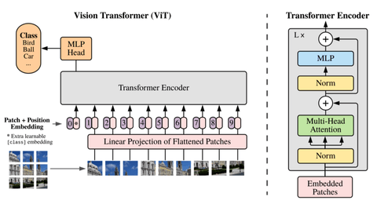
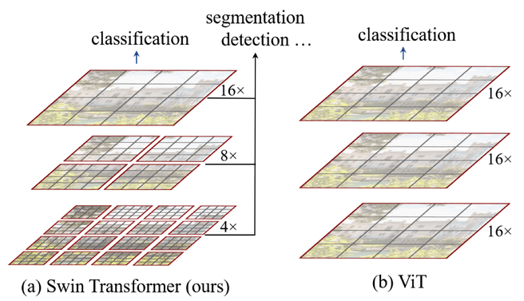
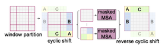
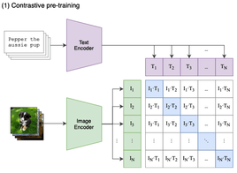
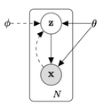
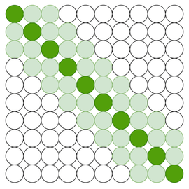
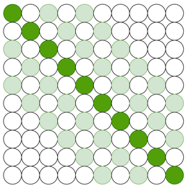
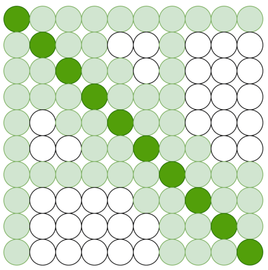
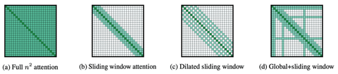

## Vision视觉

### ViT（Google 图像分类模型）
* ViT是一种没有 CNN（卷积神经网络）的图像分类模型（Vision Transformer），从图像分类任务中消除了 CNN
* ViT 将图像拆分为一系列图像补丁嵌入与位置编码混合，并将它们馈送到 Transformer 编码器中。ViT 有一个分类头 （MLP - 多层感知），它产生最终的预测
  
* 注意力可视化
    * ViT 可以捕捉图像中的主要对象，忽略图像中的噪声
* 计算复杂度与输入图像大小呈**二次方关系**

### Swin Transformer（Microsoft 图像分类、对象检测、语义分割等视觉任务模型）
* Shifted windows，它为 Transformer 提供了分层视野
* Swin Transformer 从小尺寸的补丁开始，逐渐将相邻的补丁合并到更深的 Transformer 层中，从而构建分层特征图
  
* 计算复杂度与输入图像大小呈**线性关系**。每个窗口中的补丁数量在任何级别都是相同的。最终，一个本地窗口用 16 个功能补丁覆盖整个映像。
* Swin Transformer 的补丁合并通过连接 4 个 （= 2 x 2） 相邻补丁的特征并应用线性层来减少特征维度，从而减少补丁的数量
* MSA 代表多头自我注意：
  
  使用图像色块向左上角的循环移动，然后应用遮罩机制来限制相邻色块内的自我注意。此外，它使用反向循环换档来覆盖其他区域

### CLIP（OpenAI 对比语言图像预训练模型）
* CLIP 即对比语言图像预训练（Contrastive Language Image Pre-training）。
* 通过对比学习，理解事物之间的差异，将特定的视觉特征与相应的描述性语言相关联，实现从文本生成图像。是从自然语言领域到视觉领域的桥梁，弥合语言和视觉之间差距方面的灵活性和潜力。
* OpenAI 的 CLIP 模型同时训练图像编码器和文本编码器，以准确预测共享嵌入空间内（图像、文本）的正确配对，从而弥合视觉理解和自然语言理解之间的差距
  

## 数据压缩和生成：
### VAE（变分自动编码器）
* VAE 通过识别和学习训练数据集中的隐藏特征并将其用作生成新数据，可以生成新的输出
* 有向概率模型，即贝叶斯网络。利用有向无环图 （DAG） 来说明各种随机变量之间的关系和依赖关系。
  
  
* 说明：
  编码器负责对条件概率分布 P（z|x） 进行建模，因为它采用输入图像 x 并产生潜在表示 z。解码器负责对条件概率分布 P（x|z） 进行建模，因为它采用潜在变量 z 并重建靠近输入图像 x 的图像 x'

## 长文本：
### Longformer
* 引入新的注意力机制：
    * 背景：计算复杂度随序列长度呈二次方增加，这使得处理长序列的成本非常高。我们可以将一个长序列划分为更小的块，但这样我们将失去序列的全局上下文，从而降低语言任务的质量
    * Longformer 与序列长度呈线性关系，并且可以处理数千个令牌，这要归功于它的注意力模式。
    * Longfomer 不是完全的全局注意力，而是使用不同注意力模式的组合
        * Sliding Window Attention 推拉窗注意事项
          
        * Dilated Sliding Window 扩张推拉窗
          

        * Global + Sliding Window 全局+ 滑动窗口
          
        

### 参考：
[ViT](https://arxiv.org/pdf/2010.11929)
[Swin](https://arxiv.org/pdf/2103.14030)
[VAE](https://arxiv.org/pdf/1312.6114)
[Longformer](https://arxiv.org/pdf/2004.05150)
