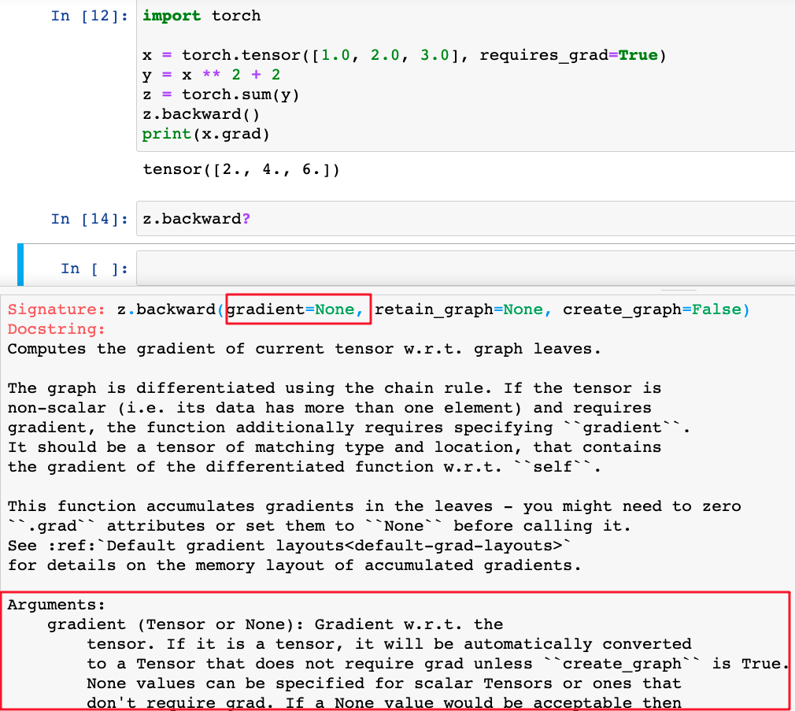

# PyTorch中backward()函数的gradient参数作用

这篇文章讲得比较清晰，特地备份一下： [pytorch中backward函数的gradient参数作用](https://www.cnblogs.com/zhouyang209117/p/11023160.html)

## 问题引入

在深度学习中，经常需要对函数求梯度（`gradient`）。`PyTorch`提供的`autograd`包能够根据输入和前向传播过程自动构建计算图，并执行反向传播。

`PyTorch`中，`torch.Tensor`是存储和变换数据的主要工具。如果你之前用过`NumPy`，你会发现`Tensor`和`NumPy`的多维数组非常类似。

然而，`Tensor`提供`GPU`计算和自动求梯度等更多功能，这些使`Tensor`更加适合深度学习。

> `PyTorch`中`tensor`这个单词一般可译作`张量`，张量可以看作是一个多维数组。标量可以看作是零维张量，向量可以看作一维张量，矩阵可以看作是二维张量。

如果将`PyTorch`中的`tensor`属性`requires_grad`设置为`True`，它将开始追踪(`track`)在其上的所有操作（这样就可以利用链式法则进行梯度传播了）。  

完成计算后，可以调用`backward()`来完成所有梯度计算。此`tensor`的梯度将累积到`grad`属性中。 如下：
```python
import torch

x = torch.tensor([1.0, 2.0, 3.0], requires_grad=True)
y = x ** 2 + 2
z = torch.sum(y)
z.backward()
print(x.grad)
```
输出:
```bash
tensor([2., 4., 6.])
```
下面先解释下这个`grad`怎么算的。

## 导数、偏导数的简单计算

从数学定义上讲,求导或者求偏导大多是函数对自变量而言。但是在很多机器学习的资料和开源库都会看到说标量对向量求导。 

先简单解释下上面的例子：

设 $x=[x_1,x_2,x_3]$ ，则

$$
z=x_1^2+x_2^2+x_3^2+6
$$

由求偏导的数学知识，可知：
$$
\frac{\partial z}{\partial x_1}=2x_1
$$

$$
\frac{\partial z}{\partial x_2}=2x_2
$$

$$
\frac{\partial z}{\partial x_3}=2x_3
$$

然后把$x_1=1.0$,$x_2=2.0$,$x_3=3.0$代入得到：
$$
(\frac{\partial z}{\partial x_1},\frac{\partial z}{\partial x_2},\frac{\partial z}{\partial x_3})=(2x_1,2x_2,2x_3)=(2.0,4.0,6.0)
$$

可见结果与`PyTorch`的输出一致。这时再反过来想想，其实所谓的`标量对向量求导`，本质上是函数对各个自变量求导，这里只是把各个自变量看成一个向量，和数学上的定义并不冲突。

## backward的gradient参数作用

在上面调用`z.backward()`时，是可以传入一些参数的，如下所示：



不知道你是怎么理解这里的`gradient`参数的，有深入理解这个参数的朋友欢迎评论区分享你的高见！

同样，先看下面的例子。已知
$$
y_1=x_1x_2x_3
$$

$$
y_2=x_1+x_2+x_3
$$

$$
y_3=x_1+x_2x_3
$$

$$
A=f(y_1,y_2,y_3)
$$
其中函数$f(y_1,y_2,y_3)$的具体定义未知,现在求
$$
\frac{\partial A}{\partial x_1}=?
$$

$$
\frac{\partial A}{\partial x_2}=?
$$

$$
\frac{\partial A}{\partial x_3}=?
$$

根据多元复合函数的求导法则，有：
$$
\frac{\partial A}{\partial x_1}=\frac{\partial A}{\partial y_1}\frac{\partial y_1}{\partial x_1}+\frac{\partial A}{\partial y_2}\frac{\partial y_2}{\partial x_1}+\frac{\partial A}{\partial y_3}\frac{\partial y_3}{\partial x_1}
$$

$$
\frac{\partial A}{\partial x_2}=\frac{\partial A}{\partial y_1}\frac{\partial y_1}{\partial x_2}+\frac{\partial A}{\partial y_2}\frac{\partial y_2}{\partial x_2}+\frac{\partial A}{\partial y_3}\frac{\partial y_3}{\partial x_2}
$$

$$
\frac{\partial A}{\partial x_3}=\frac{\partial A}{\partial y_1}\frac{\partial y_1}{\partial x_3}+\frac{\partial A}{\partial y_2}\frac{\partial y_2}{\partial x_3}+\frac{\partial A}{\partial y_3}\frac{\partial y_3}{\partial x_3}
$$

上面3个等式可以写成矩阵相乘的形式，如下：
$$
[\frac{\partial A}{\partial x_1},\frac{\partial A}{\partial x_2},\frac{\partial A}{\partial x_3}]=
[\frac{\partial A}{\partial y_1},\frac{\partial A}{\partial y_2},\frac{\partial A}{\partial y_3}]
\left[
\begin{matrix}
\frac{\partial y_1}{\partial x_1} & \frac{\partial y_1}{\partial x_2} & \frac{\partial y_1}{\partial x_3}  \\
\frac{\partial y_2}{\partial x_1} & \frac{\partial y_2}{\partial x_2} & \frac{\partial y_2}{\partial x_3}  \\
\frac{\partial y_3}{\partial x_1} & \frac{\partial y_3}{\partial x_2} & \frac{\partial y_3}{\partial x_3}
\end{matrix}
\right]
$$

其中
$$
\left[
\begin{matrix}
\frac{\partial y_1}{\partial x_1} & \frac{\partial y_1}{\partial x_2} & \frac{\partial y_1}{\partial x_3}  \\
\frac{\partial y_2}{\partial x_1} & \frac{\partial y_2}{\partial x_2} & \frac{\partial y_2}{\partial x_3}  \\
\frac{\partial y_3}{\partial x_1} & \frac{\partial y_3}{\partial x_2} & \frac{\partial y_3}{\partial x_3}
\end{matrix}
\right]
$$
叫作雅可比(`Jacobian`)式。雅可比式可以根据已知条件求出。

现在只要知道$[\frac{\partial A}{\partial y_1},\frac{\partial A}{\partial y_2},\frac{\partial A}{\partial y_3}]$的值,哪怕不知道$f(y_1,y_2,y_3)$的具体形式也能求出来$[\frac{\partial A}{\partial x_1},\frac{\partial A}{\partial x_2},\frac{\partial A}{\partial x_3}]$。

那现在的问题是怎么样才能求出
$$
[\frac{\partial A}{\partial y_1},\frac{\partial A}{\partial y_2},\frac{\partial A}{\partial y_3}]
$$

答案是由`PyTorch`的`backward`函数的`gradient`参数提供。这就是`gradient`参数的作用。

比如，我们传入`gradient`参数为`torch.tensor([0.1, 0.2, 0.3], dtype=torch.float)`，并且假定$x_1=1$,$x_2=2$,$x_3=3$，按照上面的推导方法：


紧接着可以用代码验证一下：
```python
import torch

x1 = torch.tensor(1, requires_grad=True, dtype=torch.float)
x2 = torch.tensor(2, requires_grad=True, dtype=torch.float)
x3 = torch.tensor(3, requires_grad=True, dtype=torch.float)

x = torch.tensor([x1, x2, x3])
y = torch.randn(3)

y[0] = x1 * x2 * x3
y[1] = x1 + x2 + x3
y[2] = x1 + x2 * x3

y.backward(torch.tensor([0.1, 0.2, 0.3], dtype=torch.float))

print(x1.grad, x2.grad, x3.grad)
```
输出：
```bash
tensor(1.1000) tensor(1.4000) tensor(1.)
```
由此可见，推导和代码运行结果一致。

