# 人工智能的常用十种算法

## 1.决策树

根据一些 feature 进行分类，每个节点提一个问题，通过判断，将数据分为两类，再继续提问。这些问题是根据已有数据学习出来的，再投入新数据的时候，就可以根据这棵树上的问题，将数据划分到合适的叶子上。

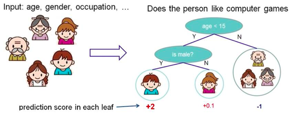

## 2.随机森林

[视频](https://www.youtube.com/watch?v=loNcrMjYh64)

在源数据中随机选取数据，组成几个子集

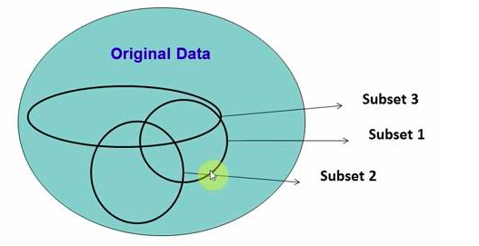

S 矩阵是源数据，有 1-N 条数据，A B C 是feature，最后一列 C 是类别

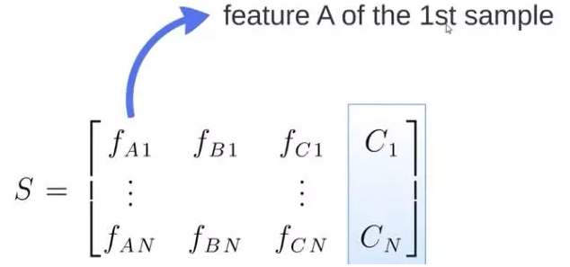

由 S 随机生成 M 个子矩阵

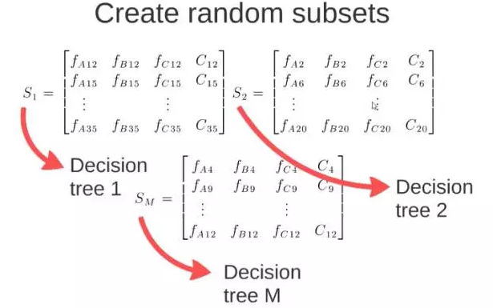

这 M 个子集得到 M 个决策树

将新数据投入到这 M 个树中，得到 M 个分类结果，计数看预测成哪一类的数目最多，就将此类别作为最后的预测结果

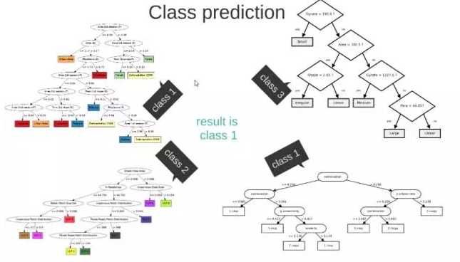

## 3. 逻辑回归

[视频](https://www.youtube.com/watch?v=gNhogKJ_q7U)

当预测目标是概率这样的，值域需要满足大于等于0，小于等于1的，这个时候单纯的线性模型是做不到的，因为在定义域不在某个范围之内时，值域也超出了规定区间。

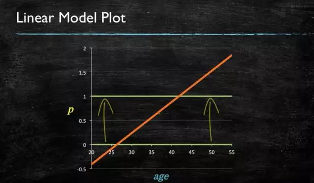

所以此时需要这样的形状的模型会比较好

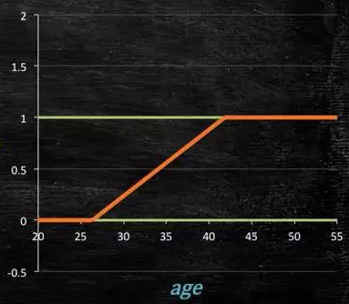

那么怎么得到这样的模型呢？

这个模型需要满足两个条件 大于等于0，小于等于1
大于等于0 的模型可以选择 绝对值，平方值，这里用 指数函数，一定大于0
小于等于1 用除法，分子是自己，分母是自身加上1，那一定是小于1的了

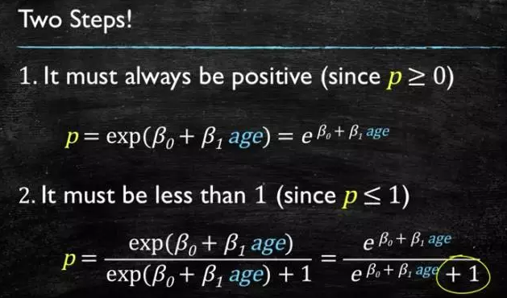

再做一下变形，就得到了 logistic regression 模型

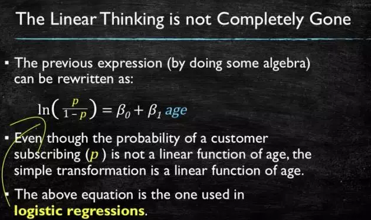

通过源数据计算可以得到相应的系数了

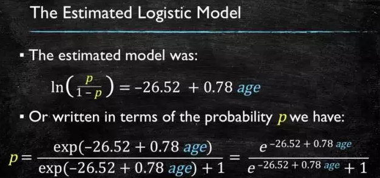

最后得到 logistic 的图形

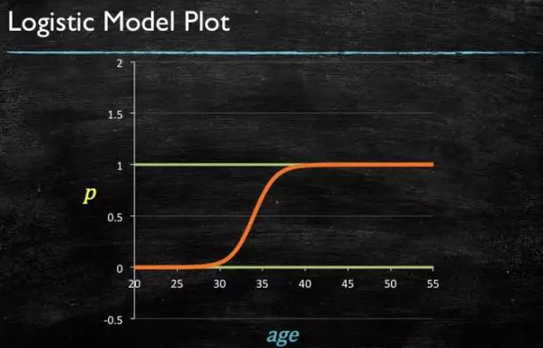

## 4. SVM

[视频](https://www.youtube.com/watch?v=1NxnPkZM9bc)

support vector machine

要将两类分开，想要得到一个超平面，最优的超平面是到两类的 margin 达到最大，margin就是超平面与离它最近一点的距离，如下图，Z2>Z1，所以绿色的超平面比较好

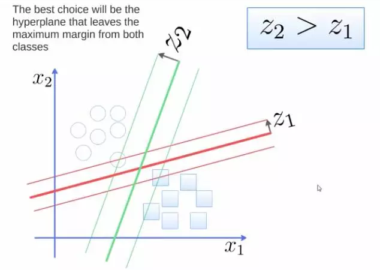

将这个超平面表示成一个线性方程，在线上方的一类，都大于等于1，另一类小于等于－1

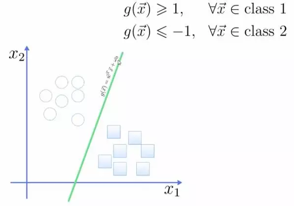

点到面的距离根据图中的公式计算

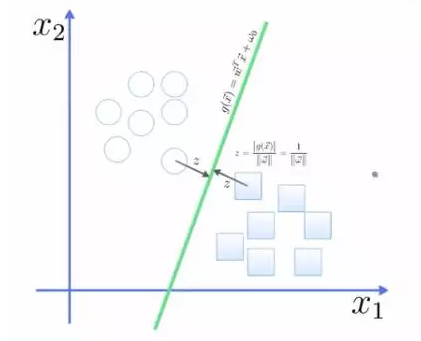

所以得到 total margin 的表达式如下，目标是最大化这个 margin，就需要最小化分母，于是变成了一个优化问题

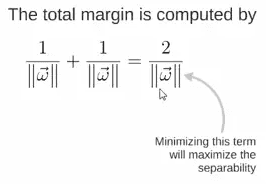

举个栗子，三个点，找到最优的超平面，定义了 weight vector＝（2，3）－（1，1）

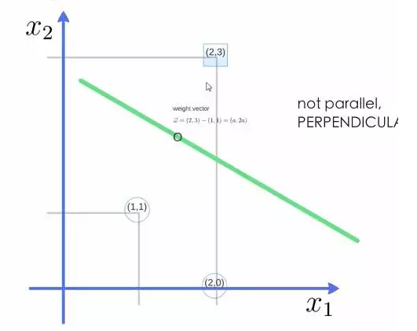

得到 weight vector 为（a，2a），将两个点代入方程，代入（2，3）另其值＝1，代入（1，1）另其值＝-1，求解出 a 和 截矩 w0 的值，进而得到超平面的表达式。

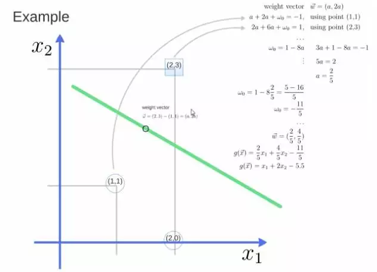

a 求出来后，代入（a，2a）得到的就是 support vector

a 和 w0 代入超平面的方程就是 support vector machine

## 5. 朴素贝叶斯

[视频](https://www.youtube.com/watch?v=TpjPzKODuXo)

举个在 NLP 的应用

给一段文字，返回情感分类，这段文字的态度是positive，还是negative

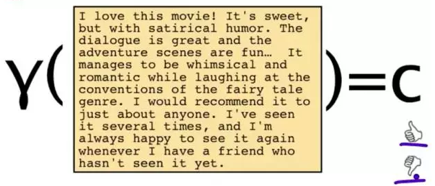

为了解决这个问题，可以只看其中的一些单词

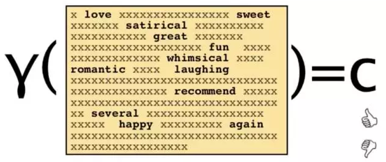

这段文字，将仅由一些单词和它们的计数代表

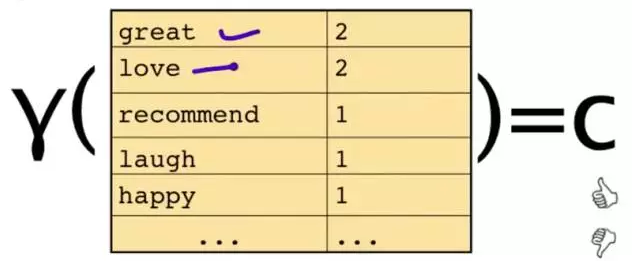

原始问题是：给你一句话，它属于哪一类

通过 bayes rules 变成一个比较简单容易求得的问题

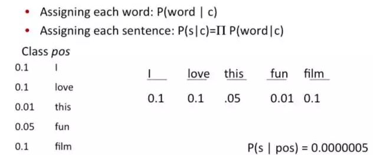

问题变成，这一类中这句话出现的概率是多少，当然，别忘了公式里的另外两个概率

栗子：单词 love 在 positive 的情况下出现的概率是 0.1，在 negative 的情况下出现的概率是 0.001

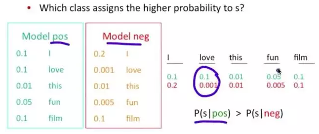

## 6. K最近邻

[视频](https://www.youtube.com/watch?v=zHbxbb2ye3E)

k nearest neighbours

给一个新的数据时，离它最近的 k 个点中，哪个类别多，这个数据就属于哪一类

栗子：要区分 猫 和 狗，通过 claws 和 sound 两个feature来判断的话，圆形和三角形是已知分类的了，那么这个 star 代表的是哪一类呢

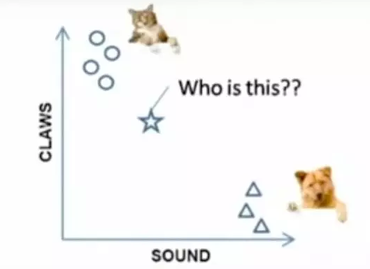

k＝3时，这三条线链接的点就是最近的三个点，那么圆形多一些，所以这个star就是属于猫

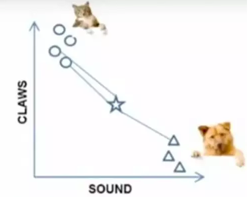

## 7. K均值

[视频](https://www.youtube.com/watch?v=zHbxbb2ye3E)

想要将一组数据，分为三类，粉色数值大，黄色数值小
最开心先初始化，这里面选了最简单的 3，2，1 作为各类的初始值
剩下的数据里，每个都与三个初始值计算距离，然后归类到离它最近的初始值所在类别

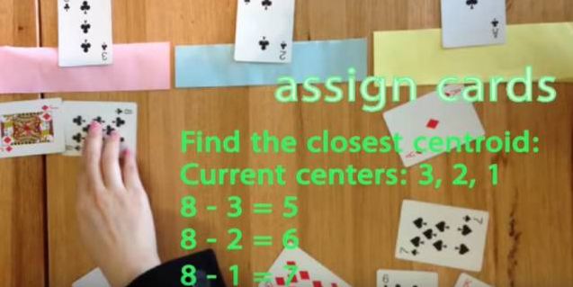

分好类后，计算每一类的平均值，作为新一轮的中心点

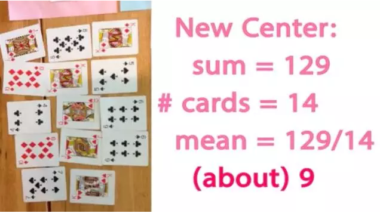

几轮之后，分组不再变化了，就可以停止了

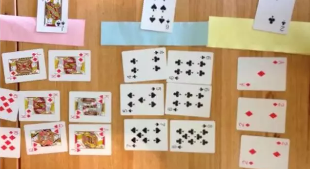

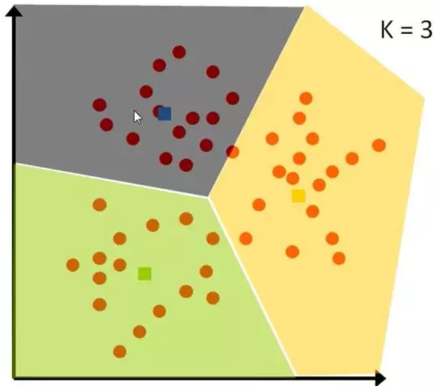

## 8. Adaboost

[视频](https://www.youtube.com/watch?v=rz9dnmHmZsY)

adaboost 是 bosting 的方法之一

bosting就是把若干个分类效果并不好的分类器综合起来考虑，会得到一个效果比较好的分类器。

下图，左右两个决策树，单个看是效果不怎么好的，但是把同样的数据投入进去，把两个结果加起来考虑，就会增加可信度

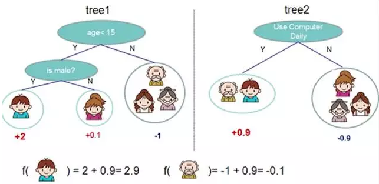

adaboost 的栗子，手写识别中，在画板上可以抓取到很多 features，例如 始点的方向，始点和终点的距离等等

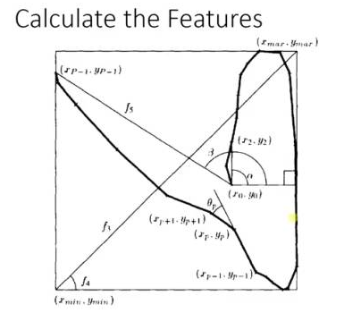

training 的时候，会得到每个 feature 的 weight，例如 2 和 3 的开头部分很像，这个 feature 对分类起到的作用很小，它的权重也就会较小

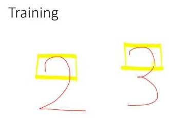

而这个 alpha 角 就具有很强的识别性，这个 feature 的权重就会较大，最后的预测结果是综合考虑这些 feature 的结果

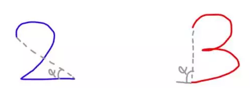

## 9. 神经网络

[视频](https://www.youtube.com/watch?v=P2HPcj8lRJE&index=2&list=PLjJh1vlSEYgvGod9wWiydumYl8hOXixNu)

Neural Networks 适合一个input可能落入至少两个类别里

NN 由若干层神经元，和它们之间的联系组成
第一层是 input 层，最后一层是 output 层

在 hidden 层 和 output 层都有自己的 classifier

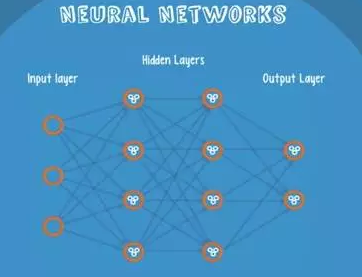

input 输入到网络中，被激活，计算的分数被传递到下一层，激活后面的神经层，最后output 层的节点上的分数代表属于各类的分数，下图例子得到分类结果为 class 1

同样的 input 被传输到不同的节点上，之所以会得到不同的结果是因为各自节点有不同的weights 和 bias

这也就是 forward propagation

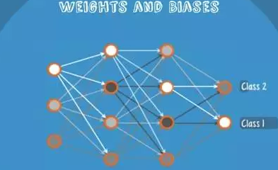

## 10. 马尔可夫

[视频](https://www.youtube.com/watch?v=56mGTszb_iM)

Markov Chains 由 state 和 transitions 组成

栗子，根据这一句话 ‘the quick brown fox jumps over the lazy dog’，要得到 markov chain

步骤，先给每一个单词设定成一个状态，然后计算状态间转换的概率

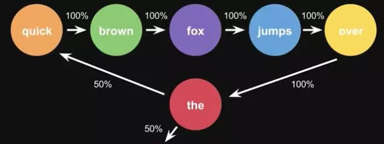

这是一句话计算出来的概率，当你用大量文本去做统计的时候，会得到更大的状态转移矩阵，例如 the 后面可以连接的单词，及相应的概率

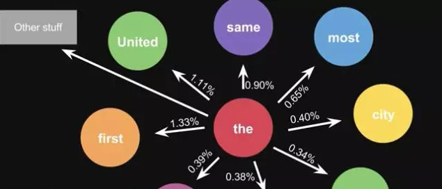

生活中，键盘输入法的备选结果也是一样的原理，模型会更高级

