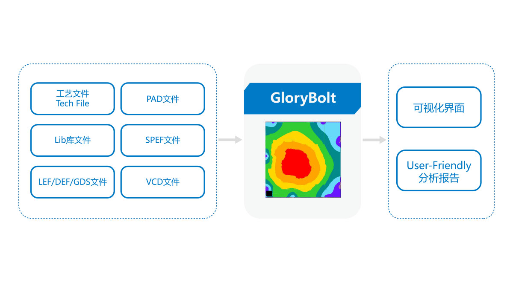
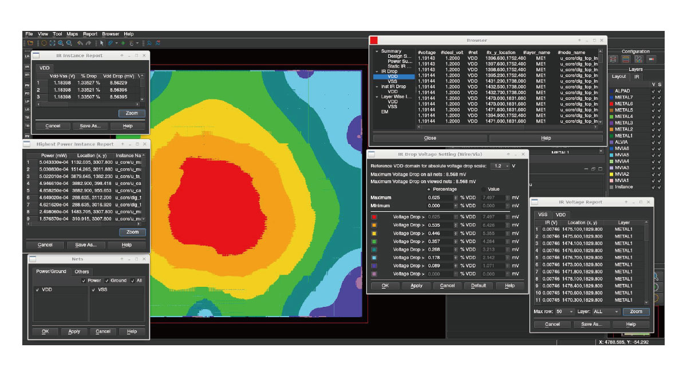
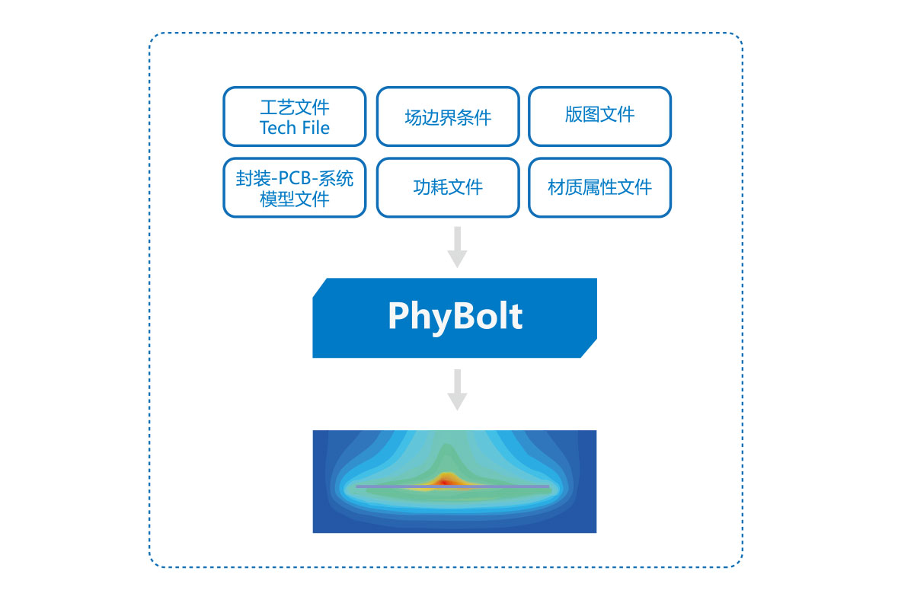
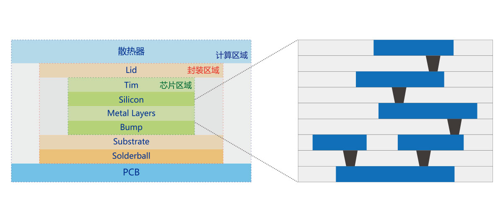

专注Signoff EDA解决方案及电磁场

杭州行芯科技有限公司是一家专注于集成电路设计（Electronics Design Automation EDA）软件与IP开发的高科技企业。我们在杭州上海和硅谷成立有研发中心。本公司核心团队是由一批具20多年美国硅谷经验著名科学家和工程师组成。行芯科技在EDA方面的经验涵盖了后端设计的主要软件； 在IC设计方面的经验从高性能服务器CPU扩展到移动通信芯片。致力为客户提供人工智能时代算力与能耗、芯片性能与研发能力的解决方案。 行芯科技成立之初就受到杭州地方政府和顶级投资人的大力支持。现公司处于一个快速发展阶段，广纳贤才，非常期待对软硬件技术方面感兴趣并立志长远发展的小伙伴加入！

静态时序分析工程师/静态时序分析高级工程师

GloryBolt

GloryBolt强大的分析引擎支持上亿规模单元的大规模设计，同时能准确地提供芯片签核精度的功耗、电流密度、压降、电迁移、可靠性等分析结果。贴近用户使用习惯，能将多种分析数据快速归纳并展示，方便工程师综合评估芯片设计质量并准确优化，加速设计收敛和签核验证。 GloryBolt覆盖从RTL到门级、全芯片、封装和系统的电源完整性分析，能够进行静态和动态电压降分析；瞬态和平均电流、功耗分析；电源/地/信号的电迁移分析；为用户提供丰富的分析报告和可视化界面诊断结果，使设计人员能够优化设计从而满足电源完整性的签核要求，最终满足芯片设计目标。

优势

- 静态与动态功耗分析
- 电源/地网络电压降分析(Static/Dynamic IR)
- 电迁移分析(Static/Dynamic EM)
- 芯片功耗模型建模(Die Model)
- 数据完整性检查
- 弱点快速定位与修复
- 支持先进工艺与Self-Heating模型
- Rush Current/Power Up分析
- ESD静电保护检查
- 芯片-封装协同分析
- 分布式资源调度与快速计算

图示

来自 <[http://www.phlexing.com/pro_services_desc.html?id=20](http://www.phlexing.com/pro_services_desc.html?id=20)>

GloryEX为芯片设计提供Signoff精度的高性能RC寄生参数提取解决方案。支持先进工艺节点的物理效应建模，支持16/14/12/10/7nm及更先进工艺制程的FinFET结构及更为复杂的特殊结构。完美地集成到全芯片时序、信号完整性、功耗完整性、物理验证、电路仿真等流程中，对3D和2.5D工艺定义和提取进行了无缝融合，从而加快设计收敛及签核验证。 GloryEX内置的3D场求解器可作为最高精度的参考工具或提供给用户最准确的计算结果；具有自主先进的Tech File，并兼容现有常用Tech File；将Transistor-Level和Gate-Level提取融为一体，支持不同精的选择和不同设计用户的签核需求。

来自 <[http://www.phlexing.com/pro_services_desc.html?id=18](http://www.phlexing.com/pro_services_desc.html?id=18)>

PhyBolt

多物理场耦合分析平台

简介

PhyBolt提供完整的IC-PKG-BOARD系统功耗与热耦合解决方案，内置的求解器能够精确模拟传导行为。支持自定义网格设置参数，根据精度需求和算力选择最合适的参数方案。支持不同格式CAD文件与芯片版图GDS文件导入、自带多种热模型。

优势

- 独创的先进技术使其相较传统工具性能提升10~30X；
- 支持稳态与瞬态分析；
- 芯片-封装-PCB-系统数据无缝衔接；
- 支持3DIC与Chiplet设计；

图示

来自 <[http://www.phlexing.com/pro_services_desc.html?id=14](http://www.phlexing.com/pro_services_desc.html?id=14)>