EDA 或电子设计自动化是指使用计算机程序和软件工具来设计、模拟、布局和验证电子系统。这些是一套用于物理设计集成电路的强大工具。由于这些 ASIC 由数十亿个晶体管组成，因此如果没有自动化工具的帮助，任何人都无法设计这些电路。电子系统可能是集成电路 (IC)、印刷电路板 (PCB)、片上系统 (SoC) 等。

模拟和数字电子设计都是基于计算机程序的使用，从晶体管级到架构级。这些工具可帮助芯片设计师从 RTL 级到 GDS 级（这是ASIC 设计流程中的最后一步，之后再送去制造）。EDA 不仅限于软件解决方案；它还包括用于定义、规划、设计、模拟、实施、设计验证和设备制造的硬件和其他服务。随着集成电路技术的发展，芯片设计在效率、功耗、成本效益、尺寸等方面带来了新的挑战。每个步骤都有几种不同的工具可用。在过去的几十年里，有三家主要的 EDA 公司。由于这些工具的许可证价格昂贵，开源工具已成为行业的事实。

单个芯片上集成了数千个晶体管的集成电路几乎不可能进行手动设计。这些 EDA 工具对于应对超大规模集成电路 (VLSI) 的复杂性是必不可少的。另一方面，这些工具的成本是小团队永远无法设计芯片的绊脚石。出于这个原因，免费 EDA 资源在研究人员和学生中越来越受欢迎，他们用这些资源来了解 IC 并制造芯片。

每当我们听到“开源软件”这个词时，我们都不会相信我们免费获得了高质量的软件。但不要被愚弄。看看 ASIC 开源 EDA 的进展确实令人印象深刻。过去几年已经启动了多项计划和会议，创造了一种有趣的势头。该计划最重要的关键赞助商之一是 DARPA（美国国防高级研究计划局）。 

虽然有许多强大的工具可用，但它们并不免费提供给学生或小型团队。过去，有一些开源工具可用，但它们不符合行业标准。这些工具无法生产出符合行业要求的产品。闭源软件的最大问题是访问。每个人都必须注册并购买一小段时间。该领域在帮助人们自我教育方面发生了革命性的变化。

市场上有许多开源工具。这些工具可供所有人使用。人们可以自由分发软件副本。开发人员可以自由修改、改进并向公众发布改进内容。

# 《开源 EDA 工具列表》

下面列出的软件工具遵循设计流程。开发 IC 需要各种步骤。数字电路以 HDL 格式、综合、布局和布线以及布局后仿真进行描述。

## Spice 仿真工具 ：

CppSim：自 2002 年以来一直被广泛使用。它用于商业和学术目的。它执行混合信号电路的系统级仿真。它根据您制作的原理图设计自动生成、编译和执行 C++ 代码。

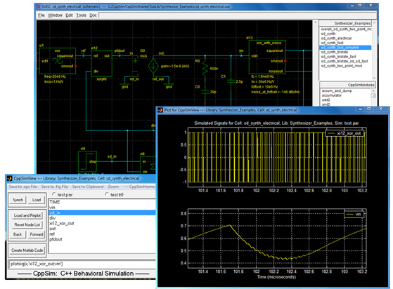

CppSim 原理图和波形查看器

Electric：功能强大的 CAD 系统之一，可以处理不同类型的电路设计任务，包括 MOS、双极、原理图、印刷电路、硬件描述语言等。它可以分析设计规则检查、模拟和网络比较。它还可以执行综合，例如布线、压缩、硅编译、PLA 生成和补偿。

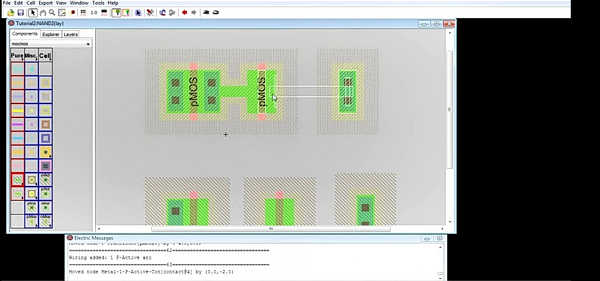

电气布局设计

eSim：由 KiCad、Ngspice、Verilator、Makerchip、GHDL、OpenModelica 等开源软件构建的集成工具，用于电路设计、仿真和分析的 EDA 工具。

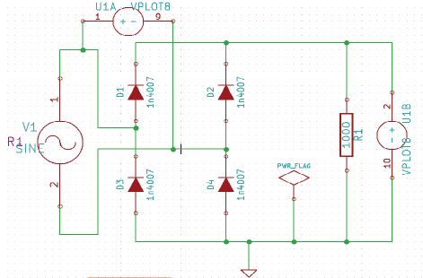

使用 eSim 捕获原理图

IRSIM：一种用于模拟数字电路的工具。它是一个开关级模拟器，其中晶体管被视为理想开关。在这个模拟器中，可以修改模拟的电路，然后逐步重新模拟。它保留了电路活动的历史记录，并且仅重新模拟偏离其历史记录的电路部分。

Electric 有一个内置模拟器，即斯坦福的 IRSIM。它使用 RC 仿真模型（默认）以及线性仿真模型来模拟门级数字电路。Electric 的内置 IRSIM 模拟器如下图所示。

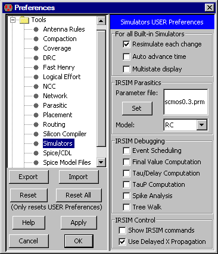

IRSIM 模拟器（Electric 中的对话框）

Mosaic：使用 Mosaic 工具可以创建和模拟模拟集成电路设计。它强调尖端、用户友好的界面、即时设计反馈、设计重用、验证和自动化。无论您的互联网连接如何，Mosaic 都将保持快速和可访问性，并在您重新连接时同步您的修改。

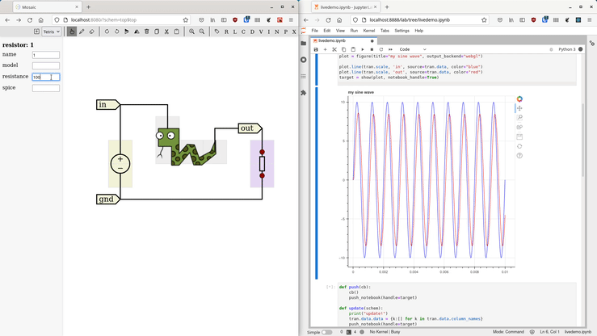

Mosaic 中的用户界面

Ngspice：一种开源混合信号 SPICE 模拟器。ngspice 具有命令行输入界面并绘制波形。此工具提供积极的开发和改进的稳定性。ngspice 基于三个开源免费软件包：Spice3f5、Xspice 和 Cider1b1：

- SPICE 是所有电路模拟器的起源。
    
-  XSPICE 提供了额外的 C 语言模型，有助于使用快速驱动算法模拟数字电路。
    
- Cider1b1 将电路级模拟器与设备模拟器耦合，以提供增强的模拟精度（但增加了模拟时间）。 
    

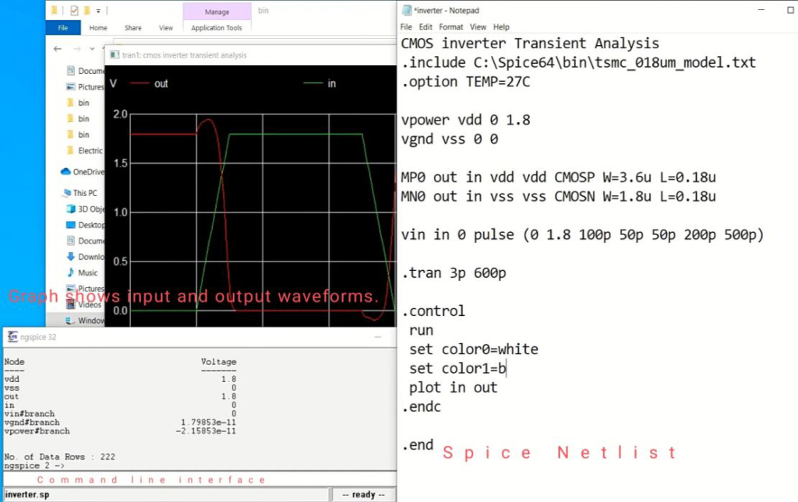

Ngspice 命令行界面、spice 网表和波形查看器

QUCS（相当通用的电路模拟器）：一种先进的电路模拟器，支持各种模拟，如直流、交流、s 参数、噪声、瞬态分析等。它还允许导入现有的 SPICE 模型。

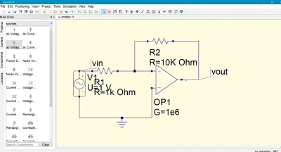

QUCS 中的示意图视图 

X 电路：从原理图捕获程序绘制的原理图不会产生适合发布的图像。工程师必须借助通用绘图工具来绘制原理图。它是一种专用于电路的绘图工具。它可以生成适合发布目的的高质量原理图和其他图形。

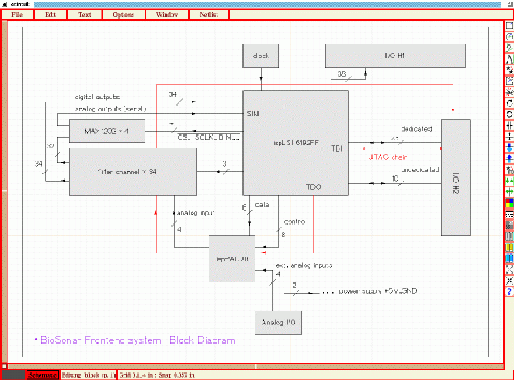

XCircuit 中的原理图 

Xschem：用于 VLSI 和 ASIC 设计的原理图捕获程序。

除了支持 SPICE、Verilog 和 VHDL 网表生成器外，XSCHEM 还为数字、模拟、混合模式和 VLSI/ASIC 设计提供原理图编辑器。它支持以下四种网表格式。

- SPICE 网表
- VHDL 网表
- VERILOG 网表
- tEDAx PCB 编辑软件网表

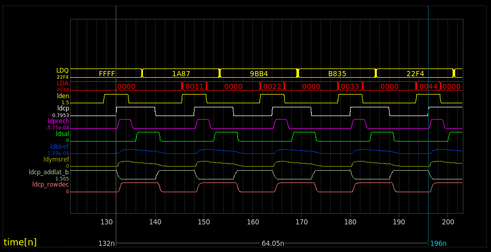

Xschem 上的模拟数据

XYCE：一款 SPICE 兼容软件，用 C++ 编写并使用 MPI（消息传递实现）。它还包括 Trilinos（Sandra 的开源库），其中包含 KLU 直接求解器和更多电路专用求解器。

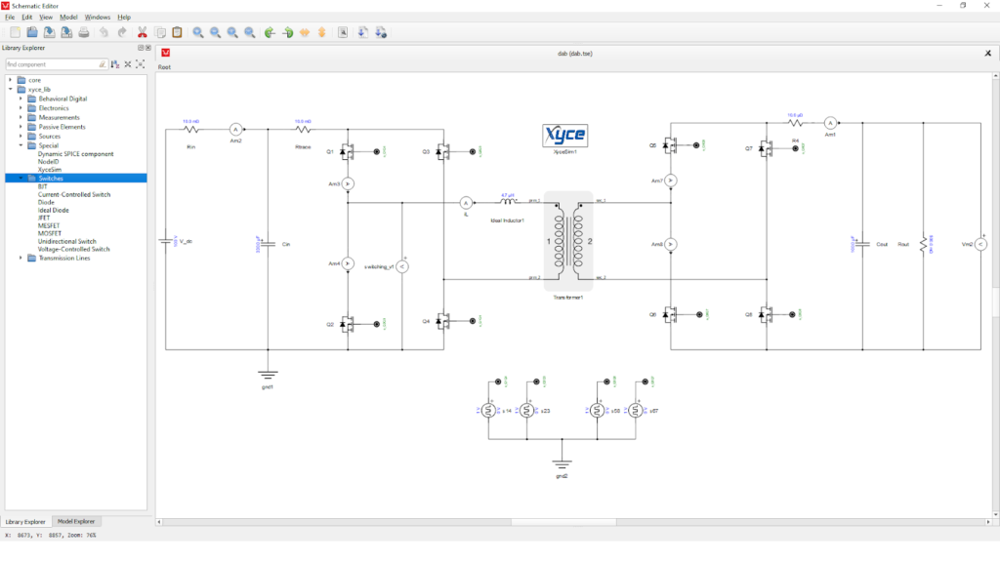

XYCE 用户界面

## HDL 仿真与综合： 

ChipVault：HDL 的组织工具。它允许分层文件导航、排序和编辑。

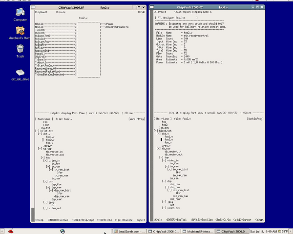

EDA Playground：一款免费的网络应用程序，用于 HDL（包括 Verilog、系统 Verilog、VHDL 和其他 HDL）仿真和综合。成功仿真后，它会生成基于浏览器的波形查看器。它易于使用，因为无需下载，并且代码共享也很容易。

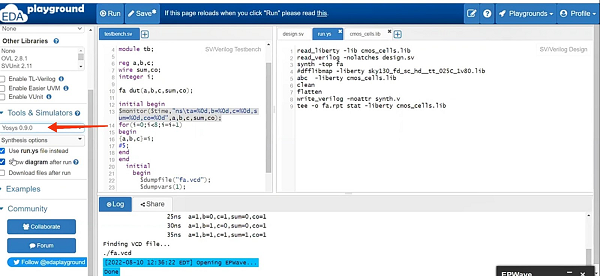

浏览器中的 EDA Playground 

GHDL：将 VHDL 文件直接转换为机器代码，因此比任何其他解释型模拟器更快地编译和分析代码。 

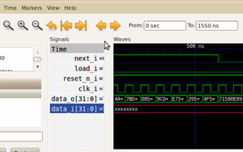

波形查看器

Icarus Verilog：IEEE-1364 标准中描述的 Verilog HDL 编译器。借助编写的 Verilog 代码，它将代码编译为某种目标格式。此工具支持名为 GTKWave 的波形查看器。

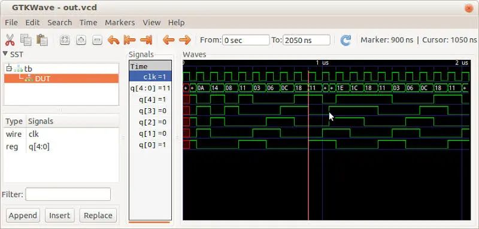

使用 Icarus Verilog 模拟示例代码 

Migen：一款基于 Python 的工具，在 VLSI 设计流程和构建复杂数字硬件的过程中应用 OOP 和元编程等高级软件概念。它是一种基于 FHDL 的全新编程语言

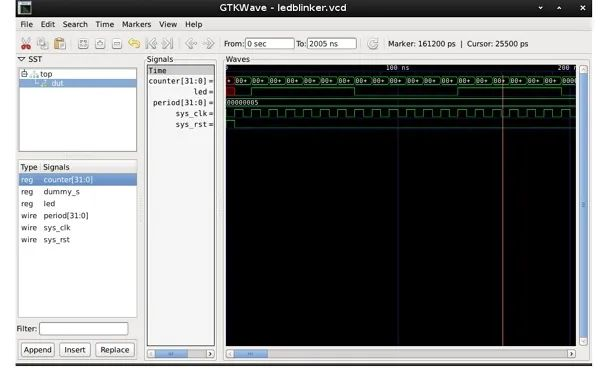

Yosys：一种可以处理 Verilog 代码并可以综合复杂项目的综合工具。

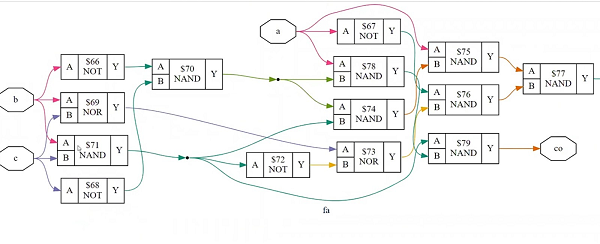

使用 Yosys 进行合成

## 布局工具 ：

Fairly Good Router：基于拉格朗日乘数的路由软件。它是一种学术工具，基于工业级使用的类似路由器。

KLayout：KLayout 是一款帮助布局的编辑器。它还有助于更改和创建 GDS 和 OASIS 文件。

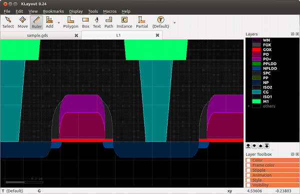

样品横截面

Magic：被认为是最简单的电路布局工具之一。该工具还支持 LVS 和 DRC。

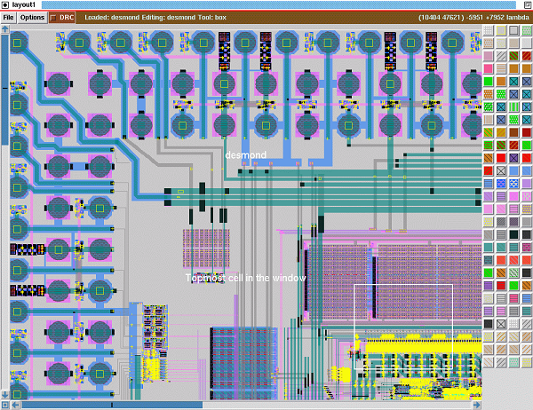

使用 Magic 进行布局 

QRouter：基于标准 Lee 迷宫路由算法的路由工具。它支持 LEF 和 DEF 格式作为输入和输出。

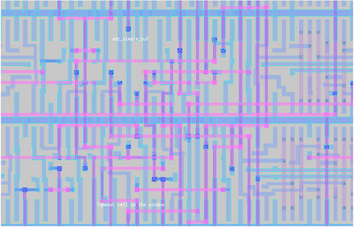

QRouter 生成的布局

## STA 工具（静态时序分析）：

OpenSTA：用于验证门级电路的时序。

OpenTimer：一款高性能、商业级时序分析工具。它通过交互式分析帮助 IC 设计人员验证电路时序。它支持基于路径和基于图形的时序分析。它是一款相对较新的工具，支持 .lib、.v、.spef 和 .sdc 等行业标准格式。 

HiTas：另一个静态时序分析工具。

## LVS 工具（布局与原理图）： 

Netgen：是一种用于将布局与网表进行比较的验证工具。为了确保进行物理验证和 LVS，Netgen 1.5 版被视为商业级工具。

## 标准单元放置：

Dragon：是针对可变和固定芯片 ASIC 设计进行标准单元放置的有效工具。

## GDSII 文件创建 

Gdsfactory：由于 gdsfactory 完全用 Python 编写，因此需要一些 Python 概念。它建立在 KLayout、gdspy（用于生成 GDSII 文件的 Python 库）和 Phidl（用于 GDS 布局和 cad 几何的 Python 模块）之上。

## 数字合成流程 ：

EDA 工具有很多，它们是帮助设计数字系统的独立应用程序。还有其他几种基于流程的工具可用。

这些工具集集成了多种工具，如原理图编辑器、电路模拟器、原理图驱动布局生成器、布局编辑器、布局验证和寄生参数提取。最好使用它们，因为有许多阶段，每个阶段后面都有子阶段。有些软件允许交换数据，而有些则不允许。

Alliance/Coriolis VLSI CAD 工具：Alliance/Coriolis 是用于 VLSI 设计的免费软件工具链。输入是 HDL（Verilog 或 VHDL），输出是 GDSII，全部为 ASIC 制造而设置。

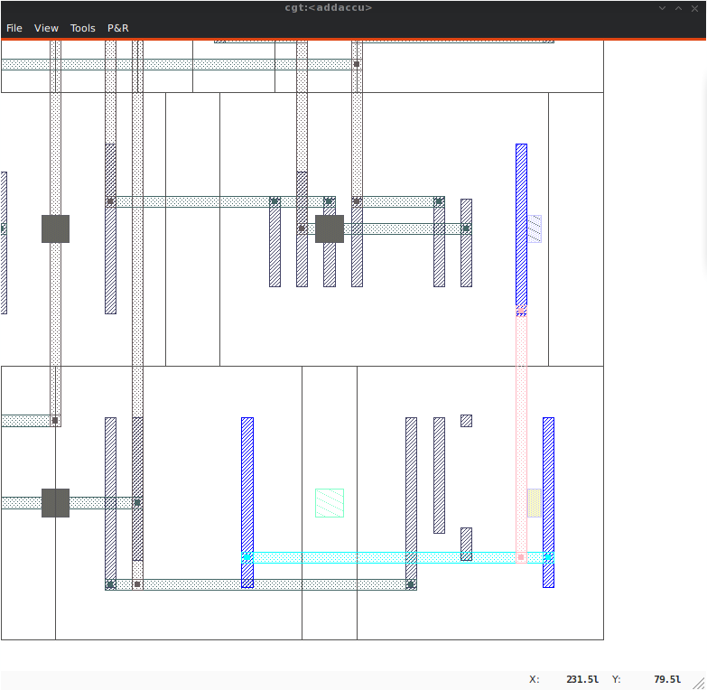

使用 Alliance 进行布局

Qflow：提供一套工具和方法，将 HDL 代码（以 Verilog 或 VHDL 编写）转换为物理电路。它能够处理主机到设备通信、信号处理、算术逻辑单元等子系统。

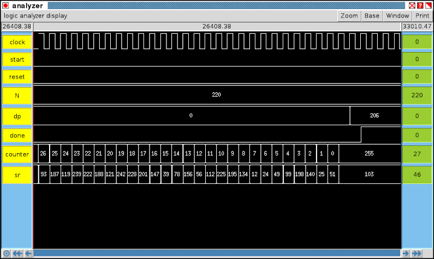

波形查看器 Qflow 1.3

OpenLane： 一种用于数字综合的自动化 VLSI 设计流程。它是一组开源工具。它借助一组预定义的设计解释和优化命令执行从 RTL 到 GDS-II 的所有任务。它有两种模式。

- **交互模式：**在这种模式下，用户使用命令行界面输入各个命令。
- **非交互模式：**在此模式下，完整的 ASIC 实施步骤将自动执行。无需人工交互。

OpenLane 流程由几个阶段组成，例如：

- 合成
- 布局规划和 PDN
- 放置
- CTS
- 路由
- GDSII代
- 检查 

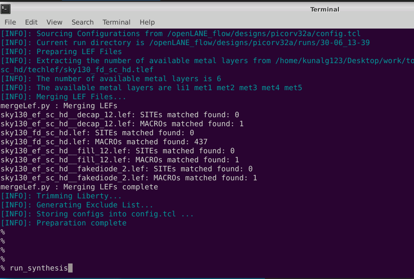

OpenLane 命令行界面

OpenROAD：是用于 ASIC 设计的开源工具流程。整个流程自动化，用于数字 SoC 布局生成，专注于片上系统设计的 RTL 到 GDSII 阶段。

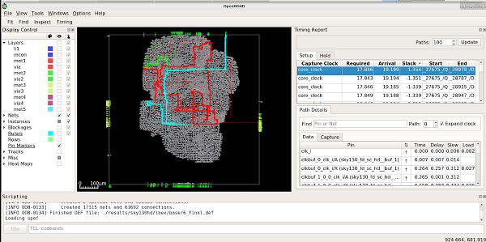

OpenROAD 图形用户界面

OSS CAD Suite：OSS CAD Suite 是 YosysHQ 的 Tabby CAD Suite 的一个组件。有用于综合、硬件验证、布局布线、编程和测试的工具。

Silicon Compiler：自动将源代码翻译成硬件设计。有三个步骤。

- 将 HDL 转换为逻辑，即网表的形式。
- 使用标准单元库将逻辑门放置在 IC 上。
- 布线，连接标准单元以形成所需的逻辑。

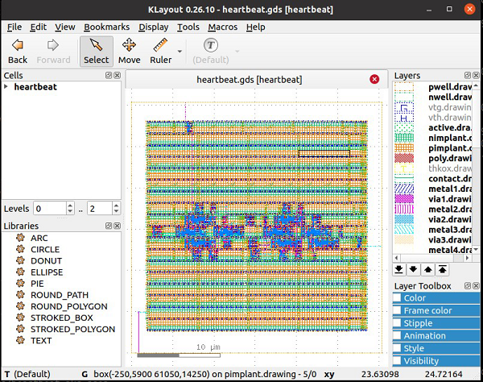

使用 SiliconCompiler 进行布局 

# 开源PDK

芯片设计领域成功地使用免费工具创建了物理设计。现在，影响者正在转向开源硬件。直到 2020 年 6 月，开源社区还没有针对 PDK 的任何解决方案。PDK 仅向代工厂请求。获得 PDK 后，我们就可以进行 ASIC 设计。谷歌推出了有史以来第一个开源 PDK。它是 Sky 130 PDK。现在，整个设计都是开源的，从工具、PDK、IP 库和标准单元库到模拟块。 

借助开源工具，Google 可让您免费进行制造。Google 与 Efabless 和 SkyWater Technology 共同创建了第一个开源 PDK，即 SKY 130，它基于 130nm CMOS 技术。Google 赞助的 MPW 航天飞机计划对开源设计免费（在某些条款和条件下）。根据该计划，开源设计将由 Google 全额资助。制造、评估、电路板和运输费用均由 Google 赞助。每个月，您都有机会提交您的设计。如果您的设计被航天飞机计划选中，那么您将免费获得芯片！

# 结论

开源的理念意味着要让众多用户参与进来（因此也包括开发人员，他们随时准备修复错误并提供改进）。因此，无论是以增强功能还是开发流程的形式，都有更大的社区支持。在这种情况下也是如此。非营利组织在开源 EDA 工具和服务的可持续发展中发挥着至关重要的作用。世界各地的工程师提出了新的想法和灵感。几年前，这个芯片设计行业只被大公司统治，他们的受众也仅限于企业。这种免费提供的软件可以帮助任何人，无论是学生、年轻工程师还是业余爱好者，对他们的概念行为进行建模，建模和分析设计的复杂性，EDA 同时有助于消除问题。所有这些步骤在制造过程之前都是必需的。因为先构建它然后再修复它是徒劳的。

**工业软件产业圈**

    
李兴权🌴

朋友广东2024年12月31日

赞

调研的还是不够全面，国内现在有iEDA，欧洲那边有LibreEDA。翻译的也不太准确，继续加油

- 