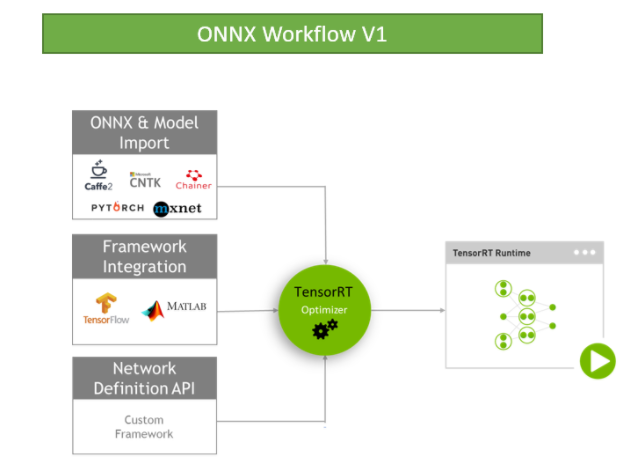
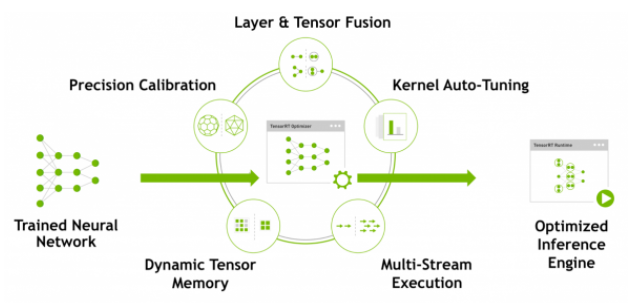

## [1. What Is TensorRT?](https://docs.nvidia.com/deeplearning/sdk/tensorrt-developer-guide/index.html#overview)

The core of TensorRT™ is a C++ library that facilitates high performance inference on NVIDIA graphics processing units (GPUs). It is designed to work in a complementary fashion with training frameworks such as TensorFlow, Caffe, PyTorch, MXNet, etc. It focuses specifically on running an already trained network quickly and efficiently on a GPU for the purpose of generating a result (a process that is referred to in various places as scoring, detecting, regression, or inference).

### Critical factors used to measure software for deep learning inference

For deep learning inference, there are 5 critical factors that are used to measure software:

- Throughput

  The volume of output within a given period. Often measured in inferences/second or samples/second, per-server throughput is critical to cost-effective scaling in data centers.

- Efficiency

  Amount of throughput delivered per unit-power, often expressed as performance/watt. Efficiency is another key factor to cost effective data center scaling, since servers, server racks and entire data centers must operate within fixed power budgets.

- Latency

  Time to execute an inference, usually measured in milliseconds. Low latency is critical to delivering rapidly growing, real-time inference-based services.

- Accuracy

  A trained neural network’s ability to deliver the correct answer. For image classification based usages, the critical metric is expressed as a top-5 or top-1 percentage.

- Memory usage

  The host and device memory that need to be reserved to do inference on a network depends on the algorithms used. This constrains what networks and what combinations of networks can run on a given inference platform. This is particularly important for systems where multiple networks are needed and memory resources are limited - such as cascading multi-class detection networks used in intelligent video analytics and multi-camera, multi-network autonomous driving systems.

## [2. Where Does TensorRT Fit?](https://docs.nvidia.com/deeplearning/sdk/tensorrt-developer-guide/index.html#fit)

Generally, the workflow for developing and deploying a deep learning model goes through three phases.

- Phase 1 is training
- Phase 2 is developing a deployment solution, and
- Phase 3 is the deployment of that solution

### Phase 1: Training

During the training phase, the data scientists and developers will start with a statement of the problem they want to solve and decide on the precise inputs, outputs and loss function they will use. They will also collect, curate, augment, and probably label the training, test and validation data sets. Then they will design the structure of the network and train the model. During training, they will monitor the learning process which may provide feedback which will cause them to revise the loss function, acquire or augment the training data. At the end of this process, they will validate the model performance and save the trained model. Training and validation is usually done using TensorRT is generally not used during any part of the training phase.

### Phase 2: Developing A Deployment Solution

During the second phase, the data scientists and developers will start with the trained model and create and validate a deployment solution using this trained model. Breaking this phase down into steps, you get:

1. Think about how the neural network functions within the larger system of which it is a part of and design and implement an appropriate solution. The range of systems that might incorporate neural networks are tremendously diverse. Examples include:

   - the autonomous driving system in a vehicle
   - a video security system on a public venue or corporate campus
   - the speech interface to a consumer device
   - an industrial production line automated quality assurance system
   - an online retail system providing product recommendations, or
   - a consumer web service offering entertaining filters users can apply to uploaded images.

   > Determine what your priorities are. Given the diversity of different systems that you could implement, there are a lot of things that may need to be considered for designing and implementing the deployment architecture.

   - Do you have a single network or many networks? For example, Are you developing a feature or system that is based on a single network (face detection), or will your system be comprised of a mixture or cascade of different models, or perhaps a more general facility that serves up a collection model that may be provided by the end user?
   - What device or compute element will you use to run the network? CPU, GPU, other, or a mixture? If the model is going to run on a GPU, is it a single type of GPU, or do you need to design an application that can run on a variety of GPUs?
   - How is data going to get to the models? What is the data pipeline? Is the data coming in from a camera or sensor, from a series of files, or being uploaded over a network connection?
   - What pre-processing will be done? What format will the data come in? If it is an image does it need to be cropped, rotated? If it is text what character set is it and are all characters allowed as inputs to the model? Are there any special tokens?
   - What latency and throughput requirements will you have?
   - Will you be able to batch together multiple requests?
   - Will you need multiple instances of a single network to achieve the required overall system throughput and latency?
   - What will you do with the output of the network?
   - What post processing steps are needed?

   TensorRT provides a fast, modular, compact, robust, reliable inference engine that can support the inference needs within the deployment architecture.

2. After the data scientists and developers define the architecture of their inference solution, by which they determine what their priorities are, they then build an inference engine from the saved network using  TensorRT. 

   > There are a number of ways to do this depending on the training framework used and the network architecture. Generally, this means you need to take the saved neural network and parse it from its saved format into TensorRT using the ONNX parser (see Figure 3), Caffe parser, or TensorFlow/UFF parser.

Figure 3. ONNX Workflow V1

3. After the network is being parsed, you’ll need to consider optimization options -- batch size, workspace size and mixed precision. These options are chosen and specified as part of the TensorRT build step where you actually build an optimized inference engine based on your network. Subsequent sections of this guide provide detailed instructions and numerous examples on this part of the workflow, parsing your model into TensorRT and choosing the optimization parameters (see Figure 4 ).

 

Figure 4. TensorRT optimizes trained neural network models to produce a deployment-ready runtime inference engine.

4. After you’ve created an inference engine using TensorRT, you’ll want to validate that it reproduces the results of the model as measured during the training process. If you have chosen FP32 or FP16 it should match the results quite closely. If you have chosen INT8 there may be a small gap between the accuracy achieved during training and the inference accuracy.

5. Write out the inference engine in a serialized format. This is also called a plan file.

### Phase 3: Deploying A Solution

The  TensorRT  library will be linked into the deployment application which will call into the library when it wants an inference result. To initialize the inference engine, the application will first deserialize the model from the plan file into an inference engine.

TensorRT is usually used asynchronously, therefore, when the input data arrives, the program calls an enqueue function with the input buffer and the buffer in which TensorRT should put the result.

## 3.The key interfaces in the TensorRT core library 

### [ What Capabilities Does TensorRT Provide?](https://docs.nvidia.com/deeplearning/sdk/tensorrt-developer-guide/index.html#api)

TensorRT enables developers to import, calibrate, generate, and deploy optimized networks. Networks can be imported directly from Caffe, or from other frameworks via the UFF or ONNX formats. They may also be created programmatically by instantiating individual layers and setting parameters and weights directly.

Users can also run custom layers through TensorRT using the Plugin interface. The graphsurgeon utility provides the ability to map TensorFlow nodes to custom layers in TensorRT, thus enabling inference for many TensorFlow networks with TensorRT.

TensorRT provides a C++ implementation on all supported platforms, and a Python implementation on x86.

### key interfaces

- Network Definition

  The Network Definition interface provides methods for the application to specify the definition of a network. Input and output tensors can be specified, layers can be added, and there is an interface for configuring each supported layer type. As well as layer types, such as convolutional and recurrent layers, and a Plugin layer type allows the application to implement functionality not natively supported by TensorRT. For more information about the Network Definition, see [Network Definition API](http://docs.nvidia.com/deeplearning/sdk/tensorrt-api/c_api/classnvinfer1_1_1_i_network_definition.html).

- Builder

  The Builder interface allows creation of an optimized engine from a network definition. It allows the application to specify the maximum batch and workspace size, the minimum acceptable level of precision, timing iteration counts for autotuning, and an interface for quantizing networks to run in 8-bit precision. For more information about the Builder, see [Builder API](http://docs.nvidia.com/deeplearning/sdk/tensorrt-api/c_api/classnvinfer1_1_1_i_builder.html).

- Engine

  The Engine interface provides allow the application to executing inference. It supports synchronous and asynchronous execution, profiling, and enumeration and querying of the bindings for the engine inputs and outputs. A single engine can have multiple execution contexts, allowing a single set of set of trained parameters to be used for the simultaneous execution of multiple batches. For more information about the Engine, see [Execution API](https://docs.nvidia.com/deeplearning/sdk/tensorrt-api/c_api/classnvinfer1_1_1_i_cuda_engine.html).

TensorRT provides parsers for importing trained networks to create network definitions:

- Caffe Parser

  This parser can be used to parse a Caffe network created in BVLC Caffe or NVCaffe 0.16. It also provides the ability to register a plugin factory for custom layers. For more details on the C++ Caffe Parser, see [NvCaffeParser](https://docs.nvidia.com/deeplearning/sdk/tensorrt-api/c_api/classnvcaffeparser1_1_1_i_caffe_parser.html) or the Python [Caffe Parser](https://docs.nvidia.com/deeplearning/sdk/tensorrt-api/python_api/parsers/Caffe/pyCaffe.html).

- UFF Parser

  This parser can be used to parse a network in UFF format. It also provides the ability to register a plugin factory and pass field attributes for custom layers. For more details on the C++ UFF Parser, see [NvUffParser](https://docs.nvidia.com/deeplearning/sdk/tensorrt-api/c_api/classnvuffparser_1_1_i_uff_parser.html) or the Python [UFF Parser](https://docs.nvidia.com/deeplearning/sdk/tensorrt-api/python_api/uff/uff.html).

- ONNX Parser

  This parser can be used to parse an ONNX model. For more details on the C++ ONNX Parser, see [NvONNXParser](https://docs.nvidia.com/deeplearning/sdk/tensorrt-api/c_api/classnvonnxparser_1_1_i_o_n_n_x_parser.html)or the Python [ONNX Parser](https://docs.nvidia.com/deeplearning/sdk/tensorrt-api/python_api/parsers/Onnx/pyOnnx.html).