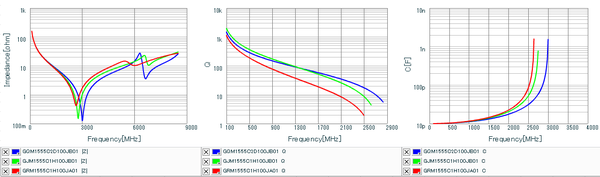
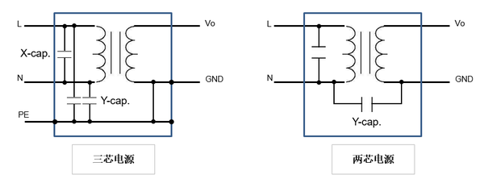

# 详解电容器

## 一、电容的基本原理

电容，和电感、电阻一起，是电子学三大基本无源器件；电容的功能就是以电场能的形式储存电能量。

以平行板电容器为例，简单介绍下电容的基本原理

如上图所示，在两块距离较近、相互平行的金属平板上(平板之间为电介质)加载一个直流电压；稳定后，与电压正极相连的金属平板将呈现一定量的正电荷，而与电压负极相连的金属平板将呈现相等量的负电荷；这样，两个金属平板之间就会形成一个静电场，所以电容是以电场能的形式储存电能量，储存的电荷量为**Q**。

电容储存的电荷量**Q**与电压**U**和自身属性(也就是电容值**C**)有关，也就是**Q=U\*C**。根据理论推导，平行板电容器的电容公式如下：

理想电容内部是介质(Dielectric)，没有自由电荷，不可能产生电荷移动也就是电流，那么理想电容是如何通交流的呢？

**通交流**

电压可以在电容内部形成一个电场，而交流电压就会产生交变电场。根据麦克斯韦方程组中的全电流定律：

即电流或变化的电场都可以产生磁场，麦克斯韦将**ε(∂E/∂t)**定义为位移电流，是一个等效电流，代表着电场的变化。(这里电流代表电流密度，即***J***)

设交流电压为正弦变化，即：

实际位移电流等于电流密度乘以面积：

所以电容的容抗为**1/ωC**，频率很高时，电容容抗会很小，也就是通高频。也就是说电容在通交流的时候，内部的电场和磁场在相互转换。

**隔直流**

直流电压不随时间变化，位移电流**ε(∂E/∂t)**为0，直流分量无法通过。

**实际电容等效模型**

实际电容的特性都是非理想的，有一些寄生效应；因此，需要用一个较为复杂的模型来表示实际电容，常用的等效模型如下：

·  由于介质都不是绝对绝缘的，都存在着一定的导电能力；因此，任何电容都存在着漏电流，以等效电阻**Rleak**表示；

·  电容器的导线、电极具有一定的电阻率，电介质存在一定的介电损耗；这些损耗统一以等效串联电阻**ESR**表示；

·  电容器的导线存在着一定的电感，在高频时影响较大，以等效串联电感**ESL**表示；

·  另外，任何介质都存在着一定电滞现象，就是电容在快速放电后，突然断开电压，电容会恢复部分电荷量，以一个串联RC电路表示。

·  大多数时候，主要关注电容的ESR和ESL。

**品质因数**   **(Quality Factor)**

和电感一样，可以定义电容的品质因数，也就是Q值，也就是电容的储存功率与损耗功率的比：

**Qc=(1/ωC)/ESR**

Q值对高频电容是比较重要的参数。

**自谐振频率(Self-Resonance Frequency)**

由于ESL的存在，与C一起构成了一个谐振电路，其谐振频率便是电容的自谐振频率。在自谐振频率前，电容的阻抗随着频率增加而变小；在自谐振频率后，电容的阻抗随着频率增加而变大，就呈现感性；如下图所示：

> *图出自Taiyo Yuden的EMK042BJ332MC-W规格书*

## 二、电容的工艺与结构

根据电容公式，电容量的大小除了与电容的尺寸有关，与电介质的介电常数(Permittivity)有关。电介质的性能影响着电容的性能，不同的介质适用于不同的制造工艺。

常用介质的性能对比，可以参考AVX的一篇技术文档。

> [AVX Dielectric Comparison Chart](http://link.zhihu.com/?target=http%3A//www.avx.com/docs/techinfo/General/dielectr.pdf)

电容的制造工艺主要可以分为三大类：

· 薄膜电容(Film Capacitor)

· 电解电容(Electrolytic Capacitor)

· 陶瓷电容(Ceramic Capacitor)

## 2.1 薄膜电容(Film Capacitor)

Film Capacitor在国内通常翻译为薄膜电容，但和Thin Film工艺是不一样的。为了区分，个人认为直接翻译为`膜电容`好点。

薄膜电容是通过将两片带有金属电极的塑料膜卷绕成一个圆柱形，最后封装成型；由于其介质通常是塑料材料，也称为塑料薄膜电容；其内部结构大致如下图所示：

 

> *原图来自于[维基百科]( https://en.wikipedia.org/wiki/Film_capacitor#/media/File:Folko-Aufbau-Metall-Metallisiert-engl.svg)*

薄膜电容根据其电极的制作工艺，可以分为两类：

**金属箔薄膜电容(Film/Foil)**

金属箔薄膜电容，直接在塑料膜上加一层薄金属箔，通常是铝箔，作为电极；这种工艺较为简单，电极方便引出，可以应用于大电流场合。

**金属化薄膜电容(Metallized Film)**

金属化薄膜电容，通过真空沉积(Vacuum Deposited)工艺直接在塑料膜的表面形成一个很薄的金属表面，作为电极；由于电极厚度很薄，可以绕制成更大容量的电容；但由于电极厚度薄，只适用于小电流场合。

金属化薄膜电容就是具有自我修复的功能，即假如电容内部有击穿损坏点，会在损坏处产生雪崩效应，气化金属在损坏处将形成一个气化集合面，短路消失，损坏点被修复；因此，`金属化薄膜电容可靠性非常高，不存在短路失效`；

薄膜电容有两种卷绕方法：有感绕法在卷绕前，引线就已经和内部电极连在一起；无感绕法在绕制后，会采用镀金等工艺，将两个端面的内部电极连成一个面，这样可以获得较小的ESL，应该高频性能较高；此外，还有一种叠层型的无感电容，结构与MLCC类似，性能较好，便于做成SMD封装。

最早的薄膜电容的介质材料是用纸浸注在油或石蜡中，英国人D'斐茨杰拉德于1876年发明的；工作电压很高。现在多用塑料材料，也就是高分子聚合物，根据其介质材料的不同，主要有以下几种：

应用最多的薄膜电容是聚酯薄膜电容，比较便宜，由于其介电常数较高，尺寸可以做的较小；其次就是聚丙烯薄膜电容。其他材料还有聚四氟乙烯、聚苯乙烯、聚碳酸酯等等。

薄膜电容的特点就是可以做到大容量，高耐压；但由于工艺原因，其尺寸很难做小，通常应用于强电电路，例如电力电子行业；基本上是长这个样子：

> *截图于[High Power Capacitors For Power Electronics - AVX](http://link.zhihu.com/?target=http%3A//catalogs.avx.com/HighPowerCapacitors.pdf)*

引申阅读：

· [Film capacitor](http://link.zhihu.com/?target=https%3A//en.wikipedia.org/wiki/Film_capacitor)

· [AVX PRODUCT GUIDE FOR MEDIUM & HIGH POWER FILM CAPACITORS](http://link.zhihu.com/?target=http%3A//www.avx.com/docs/techinfo/PowerFilmBrochure.pdf)

## 2.2 电解电容(Electrolytic Capacitor)

电解电容是用金属作为阳极(Anode)，并在表面形成一层金属氧化膜作为介质；然后湿式或固态的电解质和金属作为阴极(Cathode)。电解电容大都是有极性的，如果阴极侧的金属，也有一层氧化膜，就是无极性的电解电容。

根据使用的金属的不同，目前只要有三类电解电容：

**铝电解电容(Aluminum electrolytic capacitors)**

铝电解电容应该是使用最广泛的电解电容，最便宜，其基本结构如下图所示：

铝电解电容的制作工艺大致有如下几步：

· 首先，铝箔会通过电蚀刻(Etching)的方式，形成一个非常粗糙的表面，这样增大了电极的表面积，可以增大电容量；

· 再通过化学方法将阳极氧化，形成一个氧化层，作为介质；

· 然后，在阳极铝箔和阴极铝箔之间加一层电解纸作为隔离，压合绕制；

· 最后，加注电解液，电解纸会吸收电解液，封装成型。

使用电解液的`湿式铝电解电容`应用最广；优点就是电容量大、额定电压高、便宜；缺点也很明显，就是寿命较短、温度特性不好、ESR和ESL较大。对于硬件开发来说，需要避免过设计，在满足性能要求的情况下，便宜就是最大的优势。

**聚合物铝电解电容**: 铝电解电容也有使用二氧化锰、导电高分子聚合物等固态材料做电解质；`聚合物铝电解电容`的结构大致如下图所示：

> *原图出自[Polymer Aluminum Electrolytic Capacitors - Murata](https://www.murata.com/~/media/webrenewal/support/library/catalog/products/capacitor/polymer/c90e.ashx?la=en-us)*

聚合物铝电解电容的ESR较小，容值更稳定，瞬态响应好；由于是固态，抗冲击振动能力比湿式的要好；可以做出较小的SMD封装。

而聚合物铝电解电容的封装长这样：

> *图片来自[Murata网站](http://link.zhihu.com/?target=http%3A//www.murata.com/en-us/products/capacitor/polymer)*

当然，`湿式的铝电解电容`也可以做SMD封装，不过大都是长这样：

引申阅读：

· [Polymer Capacitor Basics (Part 1): What Is a Polymer Capacitor?](http://link.zhihu.com/?target=http%3A//www.murata.com/en-us/products/emiconfun/capacitor/2015/01/27_b/20150127-p1)

· [Polymer Capacitor Basics (Part 2): What Is a Polymer Capacitor?](http://link.zhihu.com/?target=http%3A//www.murata.com/en-us/products/emiconfun/capacitor/2015/02/24/20150224-p1)

**钽电解电容(Tantalum electrolytic capacitors)**

钽(拼音tǎn)电解电容应用最多的应该是利用二氧化锰做固态电解质，主要长这样：

> *图片出自[Solid Tantalum MnO2 Capacitors](http://link.zhihu.com/?target=http%3A//www.kemet.com/Tantalum-MnO2)*

固态钽电解电容内部结构大致如下图所示：

> *原图出自[Vishay技术文档](http://link.zhihu.com/?target=http%3A//www.vishay.com/docs/40031/apprippl.pdf)*

钽电容与铝电解电容比，在于钽氧化物(五氧化二钽)的介电常数比铝氧化物(三氧化二铝)的高不少，这样相同的体积，钽电容容量要比铝电解电容的要大。钽电容寿命较长，电性能更加稳定。

钽电容也有利用导电高分子聚合物(Conductive Polymer)做电解质，结构与上图二氧化锰钽电容类似，就是将二氧化锰换成导电聚合物；导电聚合物的电导率比二氧化锰高，这样ESR就会更低。

另外还有湿式的钽电容，特点就是超大容量、高耐压、低直流漏电流，主要用于军事和航天领域。湿式的钽电容主要长这样：

> *截图于*[Vishay技术文档](http://link.zhihu.com/?target=http%3A//www.vishay.com/docs/49155/49155_vmn-pt1110.pdf)

引申阅读：

· [Guide for Tantalum Solid Electrolyte Chip Capacitors with Polymer Cathode](https://www.vishay.com/docs/40076/polymerguide.pdf)

· [Wet Electrolyte Tantalum Capacitors](www.vishay.com/docs/40021/wtintro.pdf)

**铌电解电容(Niobium electrolytic capacitors)**

铌电解电容与钽电解电容类似，就是铌及其氧化物代替钽；铌氧化物(五氧化二铌)的介电常数比钽氧化物(五氧化二钽)更高；铌电容的性能更加稳定，可靠性更高。

AVX有[铌电容系列产品](http://link.zhihu.com/?target=http%3A//www.avx.com/products/niobium/smd-nbo-oxicap/)，二氧化锰钽电容外观是黄色，而铌电容外观是橙红色，大致长这样：

> *图片出自[AVX网站](http://link.zhihu.com/?target=http%3A//www.avx.com/products/niobium/smd-nbo-oxicap/oxicap-noj-series/)*

引申阅读：

· [Tantalum Polymer and Niobium OxideCapacitors](http://link.zhihu.com/?target=http%3A//www.avx.com/docs/techinfo/New_Tantalum_Technologies.pdf)

· [OxiCap® - niobium oxide capacitor](http://link.zhihu.com/?target=http%3A//www.avx.com/docs/techinfo/TechSumAppGuide.pdf)

电解电容对比表，数据来源于[维基百科](http://link.zhihu.com/?target=https%3A//en.wikipedia.org/wiki/Electrolytic_capacitor)，仅供参考。

引申阅读：

· [Electrolytic capacitor](http://link.zhihu.com/?target=https%3A//en.wikipedia.org/wiki/Electrolytic_capacitor)

## 2.3 陶瓷电容(Ceramic Capacitor)

陶瓷电容是以陶瓷材料作为介质材料，陶瓷材料有很多种，介电常数、稳定性都有不同，适用于不同的场合。

陶瓷电容，主要有以下几种：

**瓷片电容(Ceramic Disc Capacitor)**

瓷片电容的主要优点就是可以耐高压，通常用作安规电容，可以耐250V交流电压。其外观和结构如下图所示：

> *原图出自本小节两篇引申阅读*

引申阅读：

· [Ceramic Capacitor](http://link.zhihu.com/?target=http%3A//www.capacitorguide.com/ceramic-capacitor/)

**多层陶瓷电容(Multi-layer Ceramic Capacitor)**

多层陶瓷电容，也就是**MLCC**，片状(Chip)的多层陶瓷电容是目前世界上使用量最大的电容类型，其标准化封装，尺寸小，适用于自动化高密度贴片生产。

多层陶瓷电容的内部结构如下图所示：

> *原图出自[SMD MLCC for High Power Applications - KEMET](http://link.zhihu.com/?target=http%3A//www.kemet.com/Lists/ProductCatalog/Attachments/490/KEM_C1030_CBR_SMD.pdf)*

多层陶瓷电容生产流程如下图所示：

> *原图出自[Capacitors, Part 2 "Ceramic Capacitors [1\]"](http://link.zhihu.com/?target=http%3A//www.global.tdk.com/techmag/electronics_primer/vol2.htm)*

由于多层陶瓷需要烧结瓷化，形成一体化结构，所以引线(Lead)封装的多层陶瓷电容，也叫独石(Monolithic)电容。

Thin Film技术在性能或工艺控制方面都比较先进，可以精确的控制器件的电性能和物理性能。因此，Thin Film电容性能比较好，最小容值可以做到0.05pF，而容差可以做到0.01pF；比通常MLCC要好很多，像Murata的GJM系列，最小容值是0.1pF，容差通常都是0.05pF；因此，Thin Film电容可以用于要求比较高的RF领域。

**陶瓷介质的分类**

根据EIA-198-1F-2002，陶瓷介质主要分为四类：

**Class I：**具有温度补偿特性的陶瓷介质，其介电常数大都较低，不超过200。通常都是顺电性介质(Paraelectric)，温度、频率以及偏置电压下，介电常数比较稳定，变化较小。损耗也很低，耗散因数小于0.01。

**Class II，III**：其中，温度特性A-S属于Class II，介电常数几千左右。温度特性T-V属于Class III，介电常数最高可以到20000，可以看出Class III的性能更加不稳定。根据IEC的分类，Class II和III都属于第二类，高介电常数介质。像X5R和X7R都是Class II电容，在电源去耦中应用较多，而Y5V属于Class III电容，性能不太稳定，个人觉得现在应用不多了。

由于Class II和III电容的容值最高可以做到几百uF，但由于高介电常数介质，大都是铁电性介质(Ferroelectric)，温度稳定性差。此外，铁电性介质，在直流偏置电压下介电常数会下降。

在[谈谈电感](https://zhuanlan.zhihu.com/p/21835930?refer=hwroad)一文中，介绍了铁磁性介质存在磁滞现象，当内部磁场超过一定值时，会发生磁饱和现象，导致磁导率下降；同样的，对于铁电性介质存在电滞现象，当内部电场超过一定值时，会发生电饱和现象，导致介电常数下降。

因此，当Class II和III电容的直流偏置电压超过一定值时，电容会明显下降，如下图所示：

> *图片来源[GRM188R60J226MEA0 - Murata](http://link.zhihu.com/?target=http%3A//psearch.en.murata.com/capacitor/product/GRM188R60J226MEA0%23.html)*

**Class IV***：*制作工艺和通常的陶瓷材料不一样，内部陶瓷颗粒都是外面一层很薄的氧化层，而核心是导体。这种类型的电容容量很大，但击穿电压很小。由于此类电容的性能不稳定，损耗高，现在已经基本被淘汰了。

**电容类型总结表**

还有一类超级电容，就是容量特别大，可以替代电池作为供电设备，也可以和电池配合使用。超级电容充电速度快，可以完全地充放电，而且可以充到任何想要的电压，只要不超过额定电压。现在应用也比较多，国内很多城市都有超级电容电动公交车；还有些电子产品上也有应用，例如一些行车记录仪上，可以持续供电几天。

## 三、电容的应用与选型

器件选型，其实就是从器件的规格书上提取相关的信息，判断是否满足产品的设计和应用的要求。

## 3.1 概述

电容作为一个储能元件，可以储存能量。外部电源断开后，电容也可能带电。因此，安全提示十分必要。有些电子设备内部会贴个高压危险，小时候拆过家里的黑白电视机，拆开后看到显像管上贴了个高压危险，那时就有个疑问，没插电源也会有高压吗？工作后，拆过几个电源适配器，被电的回味无穷……

回归正题，电容储能可以做如下应用：

· 储存能量就可以当电源，例如超级电容；

· 存储数据，应用非常广。动态易失性存储器(DRAM)就是利用集成的电容阵列存储数据，电容充满电就是1，放完电就是0。各种手机、电脑、服务器中内存的使用量非常大，因此，内存行业都可以作为信息产业的风向标了。

此外，电容还可以用作：

· 定时：电容充放电需要时间，可以用做定时器；还可以做延时电路，最常见的就是上电延时复位；一些定时芯片如NE556，可以产生三角波。

· 谐振源：与电感一起组成LC谐振电路，产生固定频率的信号。

利用电容通高频、阻低频、隔直流的特性，电容还可以用作：

**电源去耦**

电源去耦应该是电容最广泛的应用，各种CPU、SOC、ASIC的周围、背面放置了大量的电容，目的就是保持供电电压的稳定。

首先，在DCDC电路中，需要选择合适的输入电容和输出电容来降低电压纹波。需要计算出相关参数。

此外，像IC工作时，不同时刻需要的工作电流是不一样的，因此，也需要大量的去耦电容，来保证工作电压得稳定。

**耦合隔直**

设计电路时，有些情况下，只希望传递交流信号，不希望传递直流信号，这时候可以使用串联电容来耦合信号。

例如多级放大器，为了防止直流偏置相互影响，静态工作点计算复杂，通常级间使用电容耦合，这样每一级静态工作点可以独立分析。

例如PCIE、SATA这样的高速串行信号，通常也使用电容进行交流耦合。

**旁路滤波**

旁路，顾名思义就是将不需要的交流信号导入大地。滤波其实也是一个意思。在微波射频电路中，各种滤波器的设计都需要使用电容。此外，像EMC设计，对于接口处的LED灯，都会在信号线上加一颗滤波电容，这样可以提高ESD测试时的可靠性。

## 3.2 铝电解电容

**3.2.1 铝电解电容(湿式)**

铝电解电容(湿式)无论是插件还是贴片封装，高度都比较高，而且ESR都较高，不适合于放置于IC附近做电源去耦，通常都是用于电源电路的输入和输出电容。

> *原图来自KEMET规格书*

**容值**

从规格书中获取电容值容差，通常铝电解电容的容差都是±20%。计算最大容值和最小容值时，各项参数要满足设计要求。

**额定电压**

铝电解电容通常只适用于直流场合，设计工作电压至少要低于额定电压的80%。对于有浪涌防护的电路，其额定浪涌电压要高于防护器件(通常是TVS)的残压。

例如，对于一些POE供电的设备，根据802.3at标准，工作电压最高可达57V，那么选择的TVS钳位电压有90多V，那么至少选择额定电压100V的铝电解电容。此时，也只有铝电解电容能同时满足大容量的要求。

> *原图来自Littelfuse的TVS规格书
> *

**耗散因数**

设计DCDC电路时，输出电容的ESR影响输出电压纹波，因此需要知道铝电解电容的ESR，但大多数铝电解电容的规格书只给出了耗散因数tanδ。可以根据以下公式来计算ESR：

**ESR = tanδ/(2πfC)**

例如，120Hz时，tanδ为16%，而C为220uF，则ESR约为965mΩ。可见铝电解电容的ESR非常大，这会导致输出电压纹波很大。因此，使用铝电解电容时，需要配合使用片状陶瓷电容，靠近DCDC芯片放置。

随着开关频率和温度的升高，ESR会下降。

**额定纹波电流**

电容的纹波电流，要满足DCDC设计的输入和输出电容的RMS电流的需求。铝电解电容的额定纹波电流需要根据开关频率来修正。

**寿命**

铝电解电容的寿命比较短，选型需要注意。而寿命是和工作温度直接相关的，规格书通常给出产品最高温度时的寿命，例如105℃时，寿命为2000小时。

根据经验规律，工作温度每下降10℃，寿命乘以2。如果产品的设计使用寿命为3年，也就是26280小时。则10*log2(26280/2000)=37.3℃，那么设计工作温度不能超过65℃。

**3.2.2 聚合物铝电解电容**

像Intel的CPU这样的大功耗器件，一颗芯片80多瓦的功耗，核电流几十到上百安，同时主频很高，高频成分多。这时对去耦电容的要求就很高：

· 电容值要大，满足大电流要求；

· 额定RMS电流要大，满足大电流要求；

· ESR要小，满足高频去耦要求；

· 容值稳定性要好；

· 表面帖装，高度不能太高，因为通常放置在CPU背面的BOTTOM层，以达到最好的去耦效果。

这时，选择聚合物铝电解电容最为合适。

此外，对于音频电路，通常需要用到耦合、去耦电容，由于音频的频率很低，所以需要用大电容，此时聚合物铝电解电容也很合适。

## 3.3 钽电容

根据前文相关资料的来源，可以发现，钽电容的主要厂商就是Kemet、AVX、Vishay。

钽属于比较稀有的金属，因此，钽电容会比其他类型的电容要贵一点。但是性能要比铝电解电容要好，ESR更小，损耗更小，去耦效果更好，漏电流小。下图是Kemet一款固态钽电容的参数表：

> *截图自[Kemet规格书](http://link.zhihu.com/?target=http%3A//www.kemet.com/Lists/ProductCatalog/Attachments/256/KEM_T2008_T494.pdf)*

**额定电压**

固态钽电容的工作电压需要降额设计。正常情况工作电压要低于额定电压的50%；高温环境或负载阻抗较低时，工作电压要低于额定电压的30%。具体降额要求应严格按照规格书要求。

此外，还需要注意钽电容的承受反向电压的情况，交流成分过大，可能会导致钽电容承受反向电压，导致钽电容失效。

固态钽电容的主要失效模式是短路失效，会直接导致电路无法工作，甚至起火等风险。因此，需要额外注意可靠性设计，降低失效率。

对于一旦失效，就会造成重大事故的产品，建议不要使用固态钽电容。

**额定纹波电流**

纹波电流流过钽电容，由于ESR存在会导致钽电容温升，加上环境温度，不要超过钽电容的额定温度以及相关降额设计。

## 3.4 片状多层陶瓷电容

片状多层陶瓷电容应该是出货量最大的电容，制造商也比较多，像三大日系TDK、muRata、Taiyo Yuden，美系像KEMET、AVX(已经被日本京瓷收购了)。

三大日系做的比较好的就是有相应的选型软件，有电感、电容等所有系列的产品及相关参数曲线，非常全，不得不再次推荐一下：

· [SEAT 2013 - TDK](http://link.zhihu.com/?target=https%3A//product.tdk.com/info/en/technicalsupport/seat/download.html)

· [Simsurfing - Murata](http://link.zhihu.com/?target=http%3A//ds.murata.co.jp/software/simsurfing/en-us/index.html%3Fintcid5%3Dcom_xxx_xxx_cmn_nv_xxx%23)

· [Taiyo Yuden Components Selection Guide & Data Library](http://link.zhihu.com/?target=http%3A//www.yuden.co.jp/ap/product/support/tool/)

**3.4.1 Class I电容**

Class I电容应用最多的是C0G电容，性能稳定，适用于谐振、匹配、滤波等高频电路。

C0G电容的容值十分稳定，基本不随外界条件(频率除外)变化，下图是Murata一款1000pF电容的直流、交流及温度特性。

> *图片来自[GRM1555C1H102JA01 - Murata](http://link.zhihu.com/?target=http%3A//psearch.en.murata.com/capacitor/product/GRM1555C1H102JA01%23.html)*

因此，通常只需要关注C0G电容的频率特性。下图是Murata的3款相同封装(0402inch)相同容差(5%)的10pF电容的频率特性对比。

> *图片来自[SimSurfing - Web - Murata](http://link.zhihu.com/?target=http%3A//ds.murata.co.jp/software/simsurfing/en-us/index.html%23app%3D71e3%26b598-selectedIndex%3D0%267803-selectedIndex%3D0)*

其中GRM是普通系列，GJM是高Q值系列、GQM是高频系列，可见GQM系列高频性能更好，自谐振频率和Q值更高，一些高频性能要求很高的场合，可以选用容差1%的产品。而GRM系列比较便宜，更加通用，例如EMC滤波。

**3.4.2 Class II和Class III电容**

Class II和Class III电容都是高介电常数介质，性能不稳定，容值变化范围大，通常用作电源去耦或者信号旁路。

以Murata一款22uF、6.3V、X5R电容为例，相关特性曲线：

> *图片来自[GRM188R60J226MEA0 - Murata](http://link.zhihu.com/?target=http%3A//psearch.en.murata.com/capacitor/product/GRM188R60J226MEA0%23.html)*

**容值**

Class II和Class III电容，容值随温度、DC偏置以及AC偏置变化范围较大。特别是用作电源去耦时，电容都有一定的直流偏置，电容量比标称值小很多，所以要注意实际容值是否满足设计要求。

**纹波电流**

作为DCDC的输入和输出电容，都会有一定的纹波电流，由于ESR的存在会导致一定的温升。加上环境温度，不能超过电容的额定温度，例如X5R电容最高额度温度是85℃。

通常由于多层陶瓷电容ESR较小，能承受的纹波电流较大。

**自谐振频率**

电容由于ESL的存在，都有一个自谐振频率。大容量的电容，自谐振频率较低，只有1-2MHz。所以，为了提高电源的高频效应，大量小容值的去耦电容是必须的。此外，对于开关频率很高的DCDC芯片，要注意输入输出电容的自谐振频率。

**ESR**

设计DCDC电路，需要知道输出电容的ESR，来计算输出电压纹波。多层陶瓷电容的ESR通常较低，大约几到几十毫欧。

## 3.5 安规电容

对于我们家用的电子设备，最终都是220V交流市电供电。电源适配器为了减少对电网的干扰，通过相关EMC测试，都会加各种滤波电容。下图为一个简易的电路示意图：

对于L和N之间的电容叫X电容，L、N与PE或GND之间的电容叫Y电容。由于220V交流电具有危险性，会威胁人的人身安全，电子产品都需要满足相关安规标准，例如GB4943和UL60950的相关测试要求。因此，X 电容和Y电容与这些测试直接相关，所以也叫安规电容。

以抗电强度测试为例，根据标准，L、N侧为一次电路，需要与PE或GND之间为基本绝缘。因此，需要在L或N对GND之间加交流1.5kV或者直流2.12kV的耐压测试，持续近1分钟，期间相关漏电流不能超过标准规定值。因此，安规电容，有相当高的耐压要求，同时直流漏电流不能太大。

此外，常用的RJ45网口，为了减小EMI，常用到Bob-Smith电路，如下图所示：

可以看到电容的耐压都是2kV以上，因为网口通常有变压器，220V交流电的L和N到网线有两个变压器隔离，是双重绝缘，L和N到网线之间也要进行抗电强度测试。双重绝缘，通常要求通过交流3kV或直流4.24kV测试。

因为，安规电容有高耐压要求，通常使用瓷片电容或者小型薄膜电容。

此外，器件选型还要主要两点要求：和结构确认器件的长宽高；对插件封装器件不多时，是不是可以全部使用表贴器件，这样可以省掉波峰焊的工序。