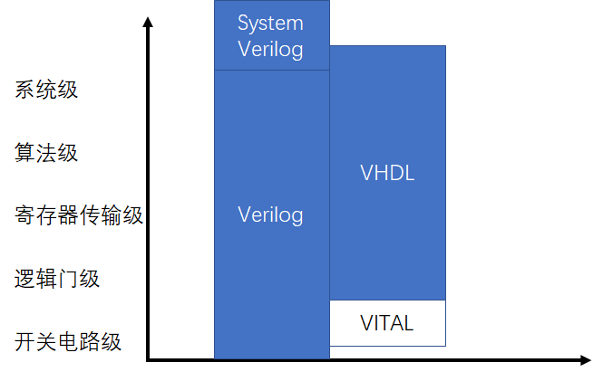
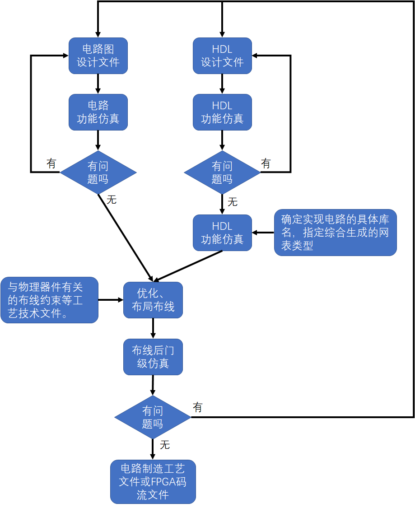
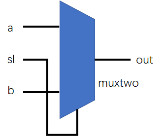
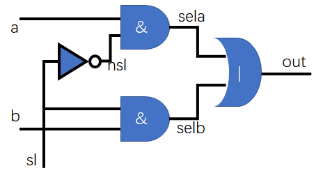
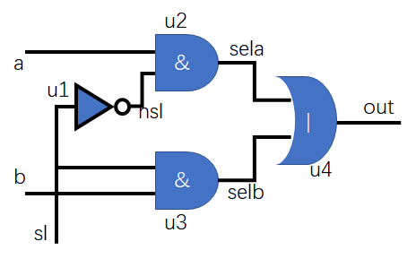
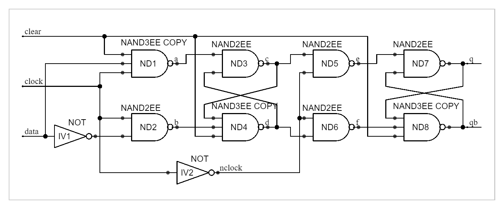

# 开发环境

[全平台轻量开源verilog仿真工具iverilog+GTKWave使用教程](https://www.cnblogs.com/whik/p/11980103.html)

如果你只是想检查Verilog文件的语法是否有错误，然后进行一些基本的时序仿真，那么Icarus Verilog 就是一个不错的选择。相比于各大FPGA厂商的IDE几个G的大小，Icarus Verilog 显得极其小巧，最新版安装包大小仅有17MB，支持全平台：Windows+Linux+MacOS，并且源代码开源。本文将介绍如何使用Icarus Verilog来进行verilog文件的编译和仿真。

# 第1章 Verilog的基本知识

数字电路系统设计：

1. 从上到下（从抽象到具体）逐层描述自己的设计思想，用一系列分层的模块来描述极其复杂的数字系统。
2. 利用EDA工具逐层进行仿真验证
3. 将需要编程具体物理电路的模块组合经过自由综合工具转换到**门级电路网表**。
4. ASIC或者FPGA实现功能。

------

Verilog HDL和VHDL的比较：



重点是Verilog简单啊，入门容易。

------

逻辑网表EDIF：

EDIF是电子设计交换格式（Electronic Design Interchange Format）的英文字头缩写。

EDIF综合了多种格式中的最佳特性，1985年的EDIF100版本提供了门阵列、半导体集成电路设计和布线自动化交换信息的格式，而后的EDIF200版本是不同EDA厂家之间交换设计数据的标准格式。CAD框架标准解决的是不同EDA厂家工具集成和实时通信问题，EDIF格式解决的是用不同EDA厂家工具完成设计的数据交流问题。

EDIF文件包含一系列的库（libraries），每个库包含一系列的单元（cells），每个单元具有1个或多个视图（views）。

> 这块不禁让人向导Concept HDL啊，library、cell、views。不会之前好难，会了之后真香。

视图使用原理图（Schematic）、版图（layout）、行为（Behaviour）和文档（Document）等格式（View Type）来描述。每个视图具有一个接口（interface）和一个内容（contents），通过它们来清晰定义视图。Cell单元还通过（view map）属性和其他View视图相连。

------

HDL设计流程图：



# 第2章 Verilog语法的基本概念

Verilog既是一种**行为描述**语言，也是一种**结构描述**语言。

- 行为描述—逻辑—reg形变量
- 结构描述—连线—wire型变量

------

Verilog模型：

Verilog模型可以是实际电路的不同级别的抽象，这些抽象的级别和他们所对应的模型类型共有以下五种。

1. 系统级（system-level）
2. 算法级（algorithm-level）
3. RTL级（register transfer level）
4. 门级（gate-level）
5. 开关级（switch-level）

Verilog语言本身非常适合**算法级**和**RTL级**的模型设计。

------

示例1

```verilog
module muxtwo(out,a,b,sl)
    input a,b,sl;
    output out;
    reg out;
    always@(sl or a or b)
        if (! sl) out = a;
    	else out =b;
endmodule
```



示例2

```verilog
module muxtwo(out,a,b,sl)
    input a,b,sl;
    output out;
    wire nsl,sela,selb;
    	assign nsl = ~sl;//阻塞赋值
    	assign sela = a&nsl;
    	assign selb = b&sl;
    	assign out = sela|selb;
endmodule
```



> wire型变量赋值表示某个逻辑输出连接到这个线上面了。
>
> wire形变量，体现了Verilog结构描述的部分。

示例3

```verilog
module muxtwo(out,a,b,sl)
    input a,b,sl;
    output out;
    not			u1(nsl,sl);
    and		#1	u2(sela,a,nsl);
    and		#2	u3(selb,b,sl);
    or		#3	u4(out,sela,selb);
endmodule
```



> 把示例1或者示例2转换为示例3的过程成为综合，示例3很容易跟某种工艺基本元件对应起来。
>
> 后续需要理解的部分：
>
> 1. 符合何种风格的Verilog模块是可以综合的。
> 2. 何种风格的模块是不可以综合的。
> 3. 不可以综合的Verilog模块有什么作用等。
>
> 前面讲过，综合后产生**门级电路网表**，

------

示例4

```verilog
module adder(cout,sum,a,b,cin);
    input [2:0] a,b;//[MSB:LSB],所以是3bit
    input cin;
    output cout;
    output [2:0] sum;
    assign {cout,sum} = a+b+cin;
    //{,}是什么运算符？起拼接的作用 如 a = {b[5],b[4:0]},意思为 b的最高位和b的低五位拼接起来，组成的a为6位
endmodule
```

> 做了一个3bit的加法器。

示例5

```verilog
module compare(equal,a,b);
    output equal;
    input [1:0] a,b;//[MSB:LSB]，所以是2bit
    assign equal = (a==b)?1:0;
    /*如果a、b两个输入信号相等，输出为1，否则为0*/
endmodule
```

> 做了一个2bit数比较器。

示例6

```verilog
module trist2(out,in,enable);
    output out;
    input in,enable;
    bufif1 mybuf(out,in.enable);
endmodule
pic need to be inserted
```

> 内部套了一个实例化的三态门选择器，

示例7

```verilog
module trist1(sout,sin,ena);
    output sout;
    input sin,ena;
    mytri tri_inst(.out(sout),.in(sin),.enable(ena));
endmodule

module mytri(out,in,enable);
    output out;
    input in,enable;
    	assign out = enable?in:'bz;//'bz是高阻？
endmodule
```

> 模块引用示例，.表示被引用模块的端口。名称必须与被引用模块的端口定义一致，小括号中表示与该端口连接的线路（wire型变量）。

以上三个例子都是可以综合的。

------

# 第2版

# 第一章 数字信号处理、计算、程序、 算法和硬线逻辑的基本概念

# 第二章 Verilog HDL设计方法概述

# 第三章 Verilog HDL的基本语法

## 3.1.简单的Verilog HDL模块

### 3.1.1.简单的Verilog HDL程序介绍

- Verilog HDL程序是由模块构成的。每个模块的内容都是嵌在module和endmodule两个
  语句之间。每个模块实现特定的功能。模块是可以进行层次嵌套的。正因为如此,才可
  以将大型的数字电路设计分割成不同的小模块来实现特定的功能,最后通过顶层模块
  调用子模块来实现整体功能。
- 每个模块要进行端口定义,并说明输入输出口,然后对模块的功能进行行为逻辑描述。
- Verilog HDL程序的书写格式自由,一行可以写几个语句,一个语句也可以分写多行。
- 除了endmodule语句外,每个语句和数据定义的最后必须有分号。
- 可以用/*.....*/和//.......对Verilog HDL程序的任何部分作注释。一个好的,有使用价值的源程序都应当加上必要的注释,以增强程序的可读性和可维护性。

### 3.1.2.模块的结构

Verilog的基本设计单元是“模块”(block)。一个模块是由两部分组成的，一部分描述接口，另一部分描述逻辑功能，即定义输入是如何影响输出的。栗子如下：

```verilog
module block (a,b,c,d);
    input a,b;
    output c,d;
    
    assign c= a | b ;
    assign d= a & b;
endmodule
```

### 3.1.3.模块的端口定义

模块的端口声明了模块的输入输出口。其格式如下：
module 模块名(口1，口2，口3，口4, ………);

### 3.1.4.模块内容

模块的内容包括I/O说明、内部信号声明、功能定义。

- I/O说明的格式如下：

  module module_name(input port1,input port2,…output port1,output port2… );

- 内部信号说明：

  reg [width-1 : 0] R变量1，R变量2 。。。。；

  wire [width-1 : 0] W变量1，W变量2 。。。。；

- 功能定义:

  模块中最重要的部分是逻辑功能定义部分。有三种方法可在模块中产生逻辑。

  - 用“assign”声明语句，如：

    ```verilog
    assign a = b & c;
    ```

  - 用实例元件，如：

    ```verilog
    and and_inst( q, a, b );
    ```

  - 用“always”块，如：

    ```verilog
    always @(posedge clk or posedge clr)
        begin
        if(clr) q <= 0;
        else if(en) q <= d;
    end
    ```

## 3.2.数据类型及其常量、变量

四种基本数据类型：

1. reg型
2. wire型
3. integer型
4. parameter型

### 3.2.1.常量

1. 数字

   1. 整数

      整数常量的四种表示形式：

      > 1. 二进制整数(b或B)
      > 2. 十进制整数(d或D)
      > 3. 十六进制整数(h或H)
      > 4. 八进制整数(o或O)
      >
      > 实际上常用的知识前三种。。

      数字表达方式：

      > 1. <位宽><进制><数字>这是一种全面的描述方式。
      > 2. <进制><数字>在这种描述方式中,数字的位宽采用缺省位宽(这由具体的机器系统
      >    决定,但至少32位)。
      > 3. <数字>在这种描述方式中,采用缺省进制十进制。

   2. x和z值

      在数字电路中,x代表不定值,z代表高阻值。一个x可以用来定义十六进制数的四位二进制数的状态,八进制数的三位,二进制数的一位。z的表示方式同x类似。z还有一种表达方式是可以写作?。在使用case表达式时建议使用这种写法,以提高程序的可读性。见下例:

      > 4'b10x0 //位宽为4的二进制数从低位数起第二位为不定值
      > 4'b101z //位宽为4的二进制数从低位数起第一位为高阻值
      > 12'dz //位宽为12的十进制数其值为高阻值(第一种表达方式)
      > 12'd? //位宽为12的十进制数其值为高阻值(第二种表达方式)
      > 8'h4x //位宽为8的十六进制数其低四位值为不定值

      对于0、x、z，可以表示十进制数的全部位；赋全0、全x或者全z可采用'b0、'bx或者'bz的方式；

      顺带，说道赋值，赋全1可采用赋~0或赋-1的方式较为简洁。

   3. 负数

      一个数字可以被定义为负数,只需在位宽表达式前加一个减号,减号必须写在数字定义表达式的最前
      面。注意减号不可以放在位宽和进制之间也不可以放在进制和具体的数之间。见下例:

      > -8'd5 //这个表达式代表5的补数（用八位二进制数表示)
      > 8'd-5 //非法格式

   4. 下划线

      下划线可以用来分隔开数的表达以提高程序可读性。但不可以用在位宽和进制处,只能用在具体的数
      字之间。见下例:

      > 16'b1010_1011_1111_1010 //合法格式
      > 8'b_0011_1010 //非法格式

2. 参数（parameter）型

   看着类似宏定义！！不太一样，可以使用#()将参数传递到module里面。

   在Verilog HDL中用parameter来定义常量，parameter型数据是一种常数型的数据，其说明格式如下：

   > parameter 参数名1＝表达式，参数名2＝表达式, **…**， 参数名n＝表达式;

   模块间传递参数：

   ```verilog
   module Decode(A,F);
       parameter Width=1, Polarity=1;
       ……………
   endmodule
   
   module Top;
       wire[3:0] A4;
       wire[4:0] A5;
       wire[15:0] F16;
       wire[31:0] F32;
       Decode #(4,0) D1(A4,F16);//其中的#(4,0)向实例化的Decode模块内部传递两个参数值
       Decode #(5) D2(A5,F32);//其中的#(5)向实例化的Decode模块内部传递一个参数值
   endmodule
   ```

   神奇！defparam语句在一个模块中改变另一个模块的参数：

   ```verilog
   module Test;
       wire W;
       Top T ( );
   endmodule
   
   module Top;
       wire W
       Block B1 ( );
       Block B2 ( );
   endmodule
   
   module Block;
   	Parameter P = 0;
   endmodule
   
   module Annotate;
       defparam//Test模块里面实例化了一个Top模块为T，T里面实例化的Block模块B1、B2里面的参数都可以更改；
       //注意原始的模块原型prototype申明里面的参数未改动
       Test.T.B1.P = 2,
       Test.T.B2.P = 3;
   endmodule
   ```

### 3.2.2.变量

两个驱动源的表格：

| wire/tri | 0    | 1    | x    | z    |
| -------- | ---- | ---- | ---- | ---- |
| 0        | 0    | x    | x    | 0    |
| 1        | x    | 1    | x    | 1    |
| x        | x    | x    | x    | x    |
| z        | 0    | 1    | x    | z    |

1. wire型

   wire型数据常用来表示用于以assign关键字指定的组合逻辑信号。Verilog程序模块中输入输出信号类型缺省时自动定义为wire型。wire型信号可以用作任何方程式的输入，也可以用作“assign”语句或实例元件的输出。

   wire型信号的格式同reg型信号的很类似。其格式如下：

   ```verilog
   wire [n-1:0] 数据名1,数据名2,…数据名i; //共有i条总线，每条总线内有n条线路
   wire [n:1] 数据名1,数据名2,…数据名i;
   ```

   栗子：

   ```verilog
   wire a; //定义了一个一位的wire型数据
   wire [7:0] b; //定义了一个八位的wire型数据
   wire [4:1] c, d; //定义了二个四位的wire型数据
   ```

2. reg型

   寄存器是数据储存单元的抽象。reg类型数据的缺省初始值为不定值，x。

   reg型数据常用来表示用于 “always”模块内的指定信号， 常代表触发器。 通常， 在设计中要由“always”块通过使用行为描述语句来表达逻辑关系。在“always”块内被赋值的每一个信号都必须定义成reg型。

   reg型数据的格式如下：

   ```verilog
   reg [n-1:0] 数据名1,数据名2,… 数据名i;
   reg [n:1] 数据名1,数据名2,… 数据名i;
   ```

   栗子

   ```verilog
   reg rega; //定义了一个一位的名为rega的reg型数据
   reg [3:0] regb; //定义了一个四位的名为regb的reg型数据
   reg [4:1] regc, regd; //定义了两个四位的名为regc和regd的reg型数据
   ```

3. memory型

   当一个reg型数据是一个表达式中的操作数时，它的值被当作是无符号值，即正值。例如：当一个四位的寄存器用作表达式中的操作数时，如果开始寄存器被赋以值-1,则在表达式中进行运算时，其值被认为是+15。

   数组中的每一个单元通过一个数组索引进行寻址。在Verilog语言中没有多维数组存在。其格式如下：

   ```verilog
   reg [n-1:0] 存储器名[m-1:0]；
   reg [n-1:0] 存储器名[m:1]；
   ```

## 3.3. 运算符及表达式

### 3.3.1.基本的算术运算符

算术运算符：+、-、*、/、%

### 3.3.2.位运算符

- 取反~

  | 原bit | ~原bit |
  | ----- | ------ |
  | 0     | 1      |
  | 1     | 0      |
  | x     | x      |

- 按位与&

  | &    | 0    | 1    | x    |
  | ---- | ---- | ---- | ---- |
  | 0    | 0    | 0    | 0    |
  | 1    | 0    | 1    | x    |
  | x    | 0    | x    | x    |

- 按位或|

  | \|   | 0    | 1    | x    |
  | ---- | ---- | ---- | ---- |
  | 0    | 0    | 1    | x    |
  | 1    | 1    | 1    | 1    |
  | x    | x    | 1    | x    |

- 按位异或^（XOR）

  | ^    | 0    | 1    | x    |
  | ---- | ---- | ---- | ---- |
  | 0    | 0    | 1    | x    |
  | 1    | 1    | 0    | x    |
  | x    | x    | x    | x    |

- 按位同或^~

  | ^~   | 0    | 1    | x    |
  | ---- | ---- | ---- | ---- |
  | 0    | 1    | 0    | x    |
  | 1    | 0    | 1    | x    |
  | x    | x    | x    | x    |

- 不同长度的数据进行位运算

  自动的将两者按右端对齐.**位数少的操作数会在相应的高位用0填满**,以使两个操作数按位进行操作.

### 3.3.3 逻辑运算符

逻辑运算符：！、&&、||

逻辑运算符中"&&"和"||"的优先级别低于关系运算符,"!" 高于算术运算符。不确定的加括号准没错。

### 3.3.4.关系运算符

关系运算符：>、<、>=、<=。

### 3.3.5.等式运算符

等式运算符： `==、！、===、！==`

Case等式运算符：

| ===  | 0    | 1    | x    | z    |
| ---- | ---- | ---- | ---- | ---- |
| 0    | 1    | 0    | 0    | 0    |
| 1    | 0    | 1    | 0    | 0    |
| x    | 0    | 0    | 1    | 0    |
| z    | 0    | 0    | 0    | 1    |

逻辑等式运算符：

| ==   | 0    | 1    | x    | z    |
| ---- | ---- | ---- | ---- | ---- |
| 0    | 1    | 0    | x    | x    |
| 1    | 0    | 1    | x    | x    |
| x    | x    | x    | x    | x    |
| z    | x    | x    | x    | x    |

### 3.3.6.移位运算符

a >> n 或 a << n;

a代表要进行移位的操作数，n代表要移几位。这两种移位运算都用0来填补移出的空位。

### 3.3.7.位拼接运算符(Concatation)

位拼接运算符{};

{信号1的某几位，信号2的某几位，..,..,信号n的某几位}

位拼接还可以用重复法来简化表达式。见下例：

{4{w}} //这等同于{w,w,w,w}

### 3.3.8.缩减运算符(reduction operator)

栗子：

```verilog
reg [3:0] B;
reg C;
C = &B;
//相当于：
C =( (B[0]&B[1]) & B[2] ) & B[3];
```

### 3.3.9.优先级别

略

### 3.3.10.关键词

略

## 3.4 赋值语句和块语句

### 3.4.1 赋值语句

两种赋值方式：

1. 非阻塞(Non_Blocking)赋值方式( 如 b <= a; )
   1. 块结束后才完成赋值操作。
   2. b的值并不是立刻就改变的。
   3. 这是一种比较常用的赋值方法。（特别在编写可综合模块时）
2. 阻塞(Blocking)赋值方式( 如 b = a; )
   1. 赋值语句执行完后,块才结束。
   2. b的值在赋值语句执行完后立刻就改变的。
   3. 可能会产生意想不到的结果。

### 3.4.2 块语句

verilog主要的模块之间都是并行执行的，例如各个always之间、always与assign之间、assign之间，如果你在一个always中要对a赋值，而在另一个always中要使用a的值，这时候就要注意了，两者并行的，处理先后不能确定。

块语句有两种，一种是begin_end语句，通常用来标识顺序执行的语句，用它来标识的块称为顺序块。一种是fork_join语句，通常用来标识并行执行的语句， 用它来标识的块称为并行块。

1. 顺序块

   这里面的内容都是顺序执行的，比如b=a； c=b，先执行一条，再执行下一条，那就是c=a了如果里面有两组if/else，就是先执行前一组，再执行后一组。但是如果是非阻塞，那就要特殊对待，多个非阻塞赋值是在一个块结束时一起执行的，比如b<=a； c<=b，那就跟之前不同了，当执行c<=b 时b还没有变化成a的值，因此这个赋值的结果是b被赋值前的值，这两条语句其实是独立的、并行的。好处是放得先后顺序没关系，只要在一个块内，随便写。

   顺序块有以下特点：

   1. 块内的语句是按顺序执行的，即只有上面一条语句执行完后下面的语句才能执行。
   2. 每条语句的延迟时间是相对于前一条语句的仿真时间而言的。
   3. 直到最后一条语句执行完，程序流程控制才跳出该语句块。

   顺序块的格式如下：

   ```verilog
   begin
       //语句1;
       //语句2;
       //......
       //语句n;
   end
   //或者
   begin:块名
      	//块内声明语句
       //语句1;
       //语句2;
       //......
       //语句n;
   end
   ```

2. 并行块

   并行块有以下四个特点：

   1. 块内语句是同时执行的，即程序流程控制一进入到该并行块，块内语句则开始同时并行
      地执行。
   2. 块内每条语句的延迟时间是相对于程序流程控制进入到块内时的仿真时间的。
   3. 延迟时间是用来给赋值语句提供执行时序的。
   4. 当按时间时序排序在最后的语句执行完后或一个disable语句执行时，程序流程控制跳
      出该程序块。

   并行块的格式如下：

   ```verilog
   fork//fork真有意思，分叉，fork()函数生成子进程也是分叉！！join，是又汇合了啊。。
       //语句1;
       //语句2;
       //......
       //语句n;
   join
   //或者
   fork:块名
      	//块内声明语句
       //语句1;
       //语句2;
       //......
       //语句n;
   join
   ```

3. 块名

   在VerilgHDL语言中，可以给每个块取一个名字，这样做的原因有以下几点。

   1. 这样可以在块内定义局部变量，即只在块内使用的变量。
   2. 这样可以允许块被其它语句调用，如被disable语句。
   3. 在Verilog语言里，所有的变量都是静态的，即所有的变量都只有一个唯一的存储地址，因此进入或跳出块并不影响存储在变量内的值。

4. 起始时间和结束时间

   在并行块和顺序块中都有一个起始时间和结束时间的概念。对于顺序块，起始时间就是第一条语句开始被执行的时间，结束时间就是最后一条语句执行完的时间。而对于并行块来说，起始时间对于块内所有的语句是相同的，即程序流程控制进入该块的时间，其结束时间是按时间排序在最后的语句执行完的时间。

## 3.5.条件语句

### 3.5.1. if_else语句

六点说明：

1. 三种形式的if语句中在if后面都有“表达式” ，一般为逻辑表达式或关系表达式。系统对表达式的值进行判断，若为0,x,z，按“假”处理，若为1，按“真”处理，执行指定的语句。
2. 第二、第三种形式的if语句中，在每个else前面有一分号，整个语句结束处有一分号。
3. 在if和else后面可以包含一个内嵌的操作语句(如上例)，也可以有多个操作语句，此时用begin和end这两个关键词将几个语句包含起来成为一个复合块语句。
4. 允许一定形式的表达式简写方式。
5. if语句的嵌套
6. if_else例子

### 3.5.2. case语句

一般形式如下：

```verilog
case(表达式) <case分支项> endcase
casez(表达式)<case分支项> endcase
casex(表达式)<case分支项> endcase
```

case, casez, casex 的真值表：

| case | 0    | 1    | x    | z    |
| ---- | ---- | ---- | ---- | ---- |
| 0    | 1    | 0    | 0    | 0    |
| 1    | 0    | 1    | 0    | 0    |
| x    | 0    | 0    | 1    |      |
| z    | 0    | 0    | 0    | 1    |

| casez | 0    | 1    | x    | z    |
| ----- | ---- | ---- | ---- | ---- |
| 0     | 1    | 0    | 0    | 1    |
| 1     | 0    | 1    | 0    | 1    |
| x     | 0    | 0    | 1    | 1    |
| z     | 1    | 1    | 1    | 1    |

| casex | 0    | 1    | x    | z    |
| ----- | ---- | ---- | ---- | ---- |
| 0     | 1    | 0    | 1    | 1    |
| 1     | 0    | 1    | 1    | 1    |
| x     | 1    | 1    | 1    | 1    |
| z     | 1    | 1    | 1    | 1    |

### 3.5.3.由于使用条件语句不当在设计中生成了原本没想到有的锁存器

栗子：

```verilog
//有锁存器
always @(al or d)
begin
    if(al) a<=d;
end
//无锁存器
always @(al or d)
begin
    if(al) a<=d;
    else q<=0;
end
//****************************************
//有锁存器
always @(sel[1:0] or a or b)
    case (sel[1:0])
        2'b00: q<=a;
        2'b11: q<=b;
    endcase
//无锁存器
always @(sel[1:0] or a or b)
    case (sel[1:0])
        2'b00: q<=a;
        2'b11: q<=b;
        default: q<='b0;
    endcase
```

避免偶然生成锁存器的错误。如果用到if语句，最好写上else项。如果用case语句，最好写上default项。遵循上面两条原则，就可以避免发生这种错误，使设计者更加明确设计目标，同时也增强了Verilog程序的可读性。

## 3.6.循环语句

四类循环语句：

1. forever 连续执行的语句。

   forever循环语句常用于产生周期性的波形，用来作为仿真测试信号。它与always语句不同处在于不能独立写在程序中，而必须写在initial块中。

2. repeat 连续执行一条语句n次。

   repeat(次数表达式) 语句；

3. while 执行一条语句直到某个条件不满足。如果一开始条件不满足则一次都不执行。

   while(表达式) 语句；

4. for 通过以下三个步骤来决定语句的循环执行。

   1. 先给控制循环次数的变量赋初试值
   2. 判定控制循环的表达式的值，为假则跳出循环，为真则执行指定的语句，转到第三步。
   3. 执行一条语句来修正控制循环变量次数的变量的值，然后返回第二步。

## 3.7.结构说明语句

四种结构说明语句：

1. initial 说明语句

   一个模块中可以有多个initial块，它们都是并行运行的。initial块常用于测试文件和虚拟模块的编写，用来产生仿真测试信号和设置信号记录等仿真环境。

2. always 说明语句

   always@(敏感事件列表) 用于描述时序逻辑

   敏感事件上升沿 posedge，下降沿 negedge，或电平敏感事件列表中可以包含多个敏感事件，但不可以同时包括电平敏感事件和边沿敏感事件；
   也不可以同时包括同一个信号的上升沿和下降沿，这两个事件可以合并为一个电平敏感事件。

   > 凡是always块内输出，都要定义成reg型的。
   > 由这一点也可以看出，定义成reg型的不一定全是寄存器。

   沿触发的always块常常描述时序逻辑， 如果符合可综合风格要求可用综合工具自动转换为表示时序逻辑的寄存器组和门级逻辑，而电平触发的always块常常用来描述组合逻辑和带锁存器的组合逻辑，如果符合可综合风格要求可转换为表示组合逻辑的门级逻辑或带锁存器的组合逻辑。一个模块中可以有多个always块，它们都是并行运行的。

------

**task和function说明语句不同点**

任务和函数有些不同，主要的不同有以下四点：

- 函数只能与主模块共用同一个仿真时间单位，而任务可以定义自己的仿真时间单位。
- 函数不能启动任务，而任务能启动其它任务和函数。
- 函数至少要有一个输入变量，而任务可以没有或有多个任何类型的变量。
- 函数返回一个值，而任务则不返回值。

栗子：

定义一任务或函数对一个16位的字进行操作让高字节与低字节互换，把它变为另一个字(假定这个任务或函数名为: switch_bytes)。

```verilog
//任务，返回的新字Byte是通过输出端口的变量实现
switch_bytes(old_word,new_word);
//函数，返回的新字Byte是通过函数本身返回值实现
new_word = switch_bytes(old_word);
```

------

抄一些网上的说明：

- task和function综合出来的电路都是组合电路。。

------

1. task 说明语句

   抄一些网上对task的说明：

   - module里可以含有task，但task里不可含有module；
   - task极少用在可综合的设计中.因为task不支持always@xxxxxx,所以不能象c的函数那样用.当然,task用在testbench很方便；【这块有点不懂，是彻底不支持always还是不支持常用always实现的时序逻辑呢？】
   - task module之间的区别：主要的区别在于module可以实现很复杂的功能，里面可以包括时序和组合等各种设计要素；然而task却不可以，task里面不可以有always这样的语句，亦即task即使实现某种逻辑功能，也只能实现组合逻辑功能（如果写成module就不局限于此）。还有task可以自己调用自己，并且这样也有可能是可综合的；而module是不可以自己例化自己的，这是不合法的，更不要说可否综合。

2. function 说明语句

   与任务相比较函数的使用有较多的约束，下面给出的是函数的使用规则：

   1. 函数的定义不能包含有任何的时间控制语句，即任何用＃、@、或wait来标识的语句。
   2. 函数不能启动任务。
   3. 定义函数时至少要有一个输入参量。
   4. 在函数的定义中必须有一条赋值语句给函数中的一个内部变量赋以函数的结果值，该内部变量具有和函数名相同的名字。

## 3.8.系统函数和任务

### 3.8.1.$display和$write任务

### 3.8.2.系统任务$monitor

### 3.8.3.时间度量系统函数$time

### 3.8.4.系统任务$finish

### 3.8.5.系统任务$stop

### 3.8.6.系统任务$readmemb和$readmemh

### 3.8.7.系统任务$random

## 3.9.编译预处理

预处理命令以符号“ `”开头(注意这个符号是不同于单引号“ '”的)。

### 3.9.1.宏定义 `define

### 3.9.2.“文件包含”处理`include

### 3.9.3.时间尺度 `timescale

### 3.9.4.条件编译命令`ifdef、`else、`endif

## 3.10.小结

Verilog和c语言不同且需要着重理解的点：

1. 块与块之间的并行执行的概念；
2. task和function的概念。
3. Verilog HDL还有许多系统函数和任务也是C语言中没有的如:$monitor、$readmemb、$stop等等
4. 其他

# 第四章 不同抽象级别的Verilog HDL模型

## 4.1.门级结构描述

### 4.1.1.与非门、或门和反向器等及其说明语法

八个基本的门类型GATATYPE：

- and 与门
- nand 与非门
- or 或门
- nor 或非门
- xor 异或门
- xnor 异或非门/同或门
- buf 缓冲器
- not 非门

### 4.1.2.用门级结构描述D触发器

Code：

```verilog
module flop
    (
        input data,clock,clear;
        output q,qb;
    )
    nand	#10 nd1(a,data,clock,clear),
    			nd2(b,ndata,clock),
                nd4(d,c,b,clear),
                nd5(e,c,nclock),
                nd6(f,d,nclock),
                nd8(qb,q,f,clear);
    nand	#9	nd3(c,a,d),
				nd7(q,e,qb);
    not 	#10	iv1(ndata,data),
				iv2(nclock,clock);
endmodule
```



想要了解D flip-flop触发器，需要先看一下D latch锁存器，最好能先看看SR 锁存器，既然都看了SR锁存器了，顺带把555定时器也看一下最好。最能能一块把触发器flip-flop、锁存器latch、寄存器register之间的区别和联系一块屡清楚。

### 4.1.3.由已经设计成的模块来构成更高一层的模块

上一小结编写的flop模块引用如下：

1. flop f1op_d( d1, clk, clrb, q, qn);
2. flop flop_d (.clock(clk),.q(q),.clear(clrb),.qb(qn),.data(d1));

栗子：

```verilog
module hardreg(d,clk,clrb,q);
    input clk,clrb;
    input[3:0] d;
    output[3:0] q;
    flop f1(d[0],clk,clrb,q[0],),
    f2(d[1],clk,clrb,q[1],),
    f3(d[2],clk,clrb,q[2],),
    f4(d[3],clk,clrb,q[3],);
endmodule
```

### 4.1.4 用户定义的原语（UDP）

对于数字系统的设计人员来说，只要了解UDP的作用就可以了，而对微电子行业的基本逻辑元器件设计工程师，必须深入了解UDP的描述，才能把所设计的基本逻辑元件，通过EDA工具呈现给系统设计工程师。

## 4.2.Verilog HDL的行为描述建模

### 4.2.1仅用于产生仿真测试信号的Verilog HDL行为描述建模

待补充

### 4.2.2.Verilog HDL建模在TOP-DOWN设计中的作用和行为建模的可综合性问题

待补充

## 4.3.用Verilog HDL建模进行TOP-DOWN设计的实例

【重点待补充】

## 4.4.小结

目前，用门级和RTL级抽象描述的Verilog HDL模块可以用综合器转换成标准的逻辑网表；用算法级描述的Verilog HDL模块，只有部分综合器能把它转换成标准的逻辑网表；而用系统级描述的模块，目前尚未有综合器能把它转换成标准的逻辑网表，往往只用于系统仿真。

# 第五章 基本运算逻辑和它们的 Verilog HDL 模型

## 5.1 加法器

待补充

## 5.2 乘法器

待补充

## 5.3 比较器

待补充

## 5.4 多路器

待补充

## 5.5 总线和总线操作

待补充

## 5.6 流水线（pipeline）

待补充

# 第六章 运算和数据流动控制逻辑

## 6.1 数字逻辑电路的种类

待补充

## 6.2 数字逻辑电路的构成

待补充

## 6.3 数据流动的控制

待补充

## 6.4 为什么在 Verilog HDL 设计中一定要用同步而不能用异步时序逻辑

待补充

# 第七章 有限状态机和可综合风格的Verilog HDL

有限状态机（Finite-State Machine，FSM），又成为有限状态自动机，简称状态机，是表示有限个状态以及在这些状态之间的转移和动作等行为的数学模型。笔者常在电机控制、通信协议解析等应用场景下应用FSM。 本文所讲的是基于硬件描述语言Verilog HDL的有限状态机的编写技巧及规范。众所周知FPGA以其并行性和可重构性为世人所知，而在当今的电子世界，基本所有的器件都是串行的，所以作为控制单元或者是可编程单元的FPGA需要进行并行转串行与外界进行通信、控制等，而有限状态机以其简单实用、结构清晰而恰如其分的充当着这个角色。

## 7.1.有限状态机

【重点待补充】

2014-01-072014-01-092014-01-112014-01-132014-01-152014-01-172014-01-192014-01-212014-01-23需求学习准备理解需求原型UI设计设计框架开发未来任务未来任务功能测试压力测试测试报告耍设计开发测试

## 7.2. 可综合风格的Verilog HDL模块实例：

### 7.2.1.组合逻辑电路设计实例

### 7.2.2. 时序逻辑电路设计实

### 7.2.3.状态机的置位与复位

#### 7.2.3.1. 状态机的异步置位与复位

#### 7.2.3.2. 状态机的同步置位与复位

### 7.2.4.深入理解阻塞和非阻塞赋值的不同

### 7.2.5. 复杂时序逻辑电路设计实践

# 第八章 可综合的VerilogHDL设计实例

---简化的RISC CPU设计简介---

## 8.1.什么是CPU？

## 8.2. RISC CPU结构

八个基本部件：

1)时钟发生器
2)指令寄存器
3)累加器
4)RISC CPU算术逻辑运算单元
5)数据控制器
6)状态控制器
7)程序计数器
8)地址多路器

### 8.2.1时钟发生器

### 8.2.2 指令寄存器

### 8.2.3.累加器

### 8.2.4.算术运算器

### 8.2.5.数据控制器

### 8.2.6.地址多路器

### 8.2.7.程序计数器

### 8.2.8.状态控制器

### 8.2.9.外围模块

## 8.3. RISC_CPU 操作和时序

### 8.3.1.系统的复位和启动操作

### 8.3.2.总线读操作

### 8.3.3写总线操作

## 8.4.RISC_CPU寻址方式和指令系统

## 8.5. RISC_CPU模块的调试

### 8.5.1. RISC_CPU模块的前仿真

### 8.5.2. RISC_CPU模块的综合

### 8.5.3.RISC_CPU模块的优化和布局布线

# 第九章 虚拟器件和虚拟接口模型

## 9.1 虚拟器件和虚拟接口模块的供应商

## 9.2 虚拟模块的设计

## 9.3 虚拟接口模块的实例

# 第十章 设计练习进阶

【非常重要，多练习！！】
