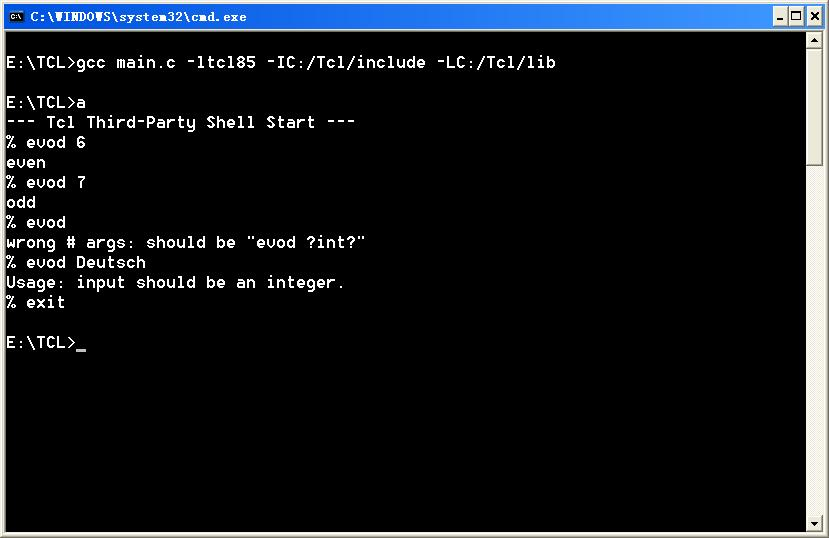

## tcl脚本加载C实现的动态库

 

**1. 为Tcl编写一个用C实现的扩展函数。**

```c++
#include <stdio.h>
#include <stdlib.h>
#include <string.h>
#include <tcl.h>
 
extern "C" {
    // extern for C++.
    int Myimpltcl_Init(Tcl_Interp *Interp);
    int Myimpltcl_Unload(Tcl_Interp *Interp);
}
 
int Action_FuncA(int notUsed, Tcl_Interp *interp, int argc, char **argv) {
    if (argc != 3) {
        // check args, same as main function args.
        Tcl_SetResult(interp, "Usage::Action_FuncA arg1 arg2",
            TCL_VOLATILE);
        return TCL_ERROR;
    }
    printf("argv[1] is %s.\n", argv[1]);
    printf("argv[2] is %s.\n", argv[2]);
    // return string.
    Tcl_SetResult(interp, "return of Action_FuncA", TCL_VOLATILE);
    return TCL_OK;
}
 
int Action_FuncB(int notUsed, Tcl_Interp *interp, int argc, char **argv) {
    if (argc != 2) {
        // check args, same as main function args.
        Tcl_SetResult(interp, "Usage::Action_FuncB arg1",
            TCL_VOLATILE);
        return TCL_ERROR;
    }
    printf("argv[1] is %s.\n", argv[1]);
    // return string.
    Tcl_SetResult(interp, "return of Action_FuncB", TCL_VOLATILE);
    return TCL_OK;
}
 
int Myimpltcl_Init(Tcl_Interp *Interp) {
    // initialize operation.
    Tcl_CreateCommand (Interp, "Action_FuncA", (Tcl_CmdProc *)Action_FuncA, 0, 0);
    Tcl_CreateCommand (Interp, "Action_FuncB", (Tcl_CmdProc *)Action_FuncB, 0, 0);
    return TCL_OK;
}
 
int Myimpltcl_Unload(Tcl_Interp *Interp, int flags) {
    // destroy operation.
    return TCL_OK;
}
```

**分析：**

tcl.h是加载tcl需要头文件。

**初始化函数 Myimpltcl_Init**

　　使用Tcl_CreateCommand函数创建一个可以在tcl脚本中调用的函数，函数的实现指向C实现的函数。

| 创建方法            | Tcl中可以调用的函数名称 | C中实现的函数名称                                            |
| ------------------- | ----------------------- | ------------------------------------------------------------ |
| `Tcl_CreateCommand` | `Action_FuncA`          | `int   Action_FuncA(int notUsed, Tcl_Interp *interp, int argc,  char**argv) ` |
| `Tcl_CreateCommand` | `Action_FuncB`          | `int Action_FuncB( int notUsed, Tcl_Interp *interp,  int argc,  char **argv)` |


**退出函数 `Myimpltcl_Unload`**

　　tcl卸载动态库时会调用的函数，用于是否内存和其他的资源。

 

**2. 编写Makefile文件**

```
CC = gcc -g -O3 -w
SHARED_FLAG = -fPIC -shared
PROJECT = libmyimpltcl.so
 
INC  = -I./
INC += -I$(TCL_HOME)/include
LIB = -L$(TCL_HOME)/lib -ltcl8.5
 
all : $(PROJECT)
 
$(PROJECT) :
    $(CC) myimpltcl.cpp ${SHARED_FLAG} -o $(PROJECT) $(INC) $(LIB)
 
clean:
    rm -rf *.o *.a *.so
```

**分析：**

生成的动态库名称必须是libmyimpltcl.so，为什么呢？

Tcl加载C编写的so库的规则是。

void *handle = dlopen("libmyimpltcl.so", RTLD_NOW | RTLD_GLOBAL);

将so库的名称去掉lib前缀

 libmyimpltcl.so 

把去掉前缀的第一个字母变成大写并增加后缀_Init

myimpltcl --> Myimpltcl_Init

拼接成新的字符串作用动态库的入库函数，用dlsym系统调用得到so中的C函数地址，并执行

dlsym(handle, "Myimpltcl_Init");

 

**3. 测试**

```
[user@host tcl]# tclsh
% load libmyimpltcl.so
% # 加载编译好的so库
% info loaded
% # 查看加载过的库信息
{libmyimpltcl.so Myimpltcl}
% set ret [Action_FuncA param1 param2]
% # 调用so中的C函数Action_FuncA
argv[1] is param1.
argv[2] is param2.
return of Action_FuncA
% puts $ret
return of Action_FuncA
% set retB [Action_FuncB 123]
% # 调用so中的C函数Action_FuncB
argv[1] is 123.
return of Action_FuncB
% puts $retB
return of Action_FuncB
```

　　

Done.

## C++中使用TCL

示例1

```cpp
/* Well House Consultant - building TCL into a C application */
/* Extended Tcl - an extra command written in "C" */

#include <stdio.h>
#include <tcl.h>

int equal(ClientData notneededhere, Tcl_Interp *ipointer, int eq_argc, char *eq_argv[]) {
   /* Should check argument count! */
   if (strcmp(eq_argv[1],eq_argv[2]) == 0) {
       ipointer->result = "1";
   } else {
       ipointer->result = "0";
   }
   return TCL_OK;
}

main (int argc, char *argv[]) {

   Tcl_Interp *myinterp;
   int status;

   printf ("Your Tcl Program will run ... \n");

   myinterp = Tcl_CreateInterp();
   Tcl_CreateCommand(myinterp,"same",equal, (ClientData) NULL, (Tcl_CmdDeleteProc *) NULL);
   status = Tcl_EvalFile(myinterp,argv[1]);

   printf ("Your Tcl Program has completed\n");
}
```

示例2

```cpp
// tcltest.cpp: 定义应用程序的入口点。
//
#include <tcl.h>
#include <stdio.h>
#include <stdlib.h>
#include <string.h>
#include <math.h>
Tcl_Interp* interp;
int
PowObjCmd(ClientData clientData, Tcl_Interp* interp,
    int objc, Tcl_Obj* CONST objv[])
{
    Tcl_Obj* resultptr;
    double    x, y, result;
    int       error;

    if (objc != 3) {
        Tcl_WrongNumArgs(interp, 2, objv,
            "Usage : pow x y");
        return TCL_ERROR;
    }
    error = Tcl_GetDoubleFromObj(interp, objv[1], &x);
    if (error != TCL_OK) return error;
    error = Tcl_GetDoubleFromObj(interp, objv[2], &y);
    if (error != TCL_OK) return error;

    result = pow(x, y);
    resultptr = Tcl_GetObjResult(interp);
    Tcl_SetDoubleObj(resultptr, result);
    return TCL_OK;
}
int
Example_Init() {
    interp = Tcl_CreateInterp();
    if (interp == NULL)
    {
        return 1;
    }
    Tcl_CreateObjCommand(interp, "pow111", PowObjCmd,
        (ClientData)NULL, (Tcl_CmdDeleteProc*)NULL);
    return TCL_OK;
}
int main()
{
    int ret;
    Example_Init();
    Tcl_Eval(interp, "puts {hello world!!!}");
    Tcl_Eval(interp, "set a 123");
    Tcl_Eval(interp, "puts [expr $a +23]");
    Tcl_Eval(interp, "puts [pow111 2 3]");
    ret = Tcl_EvalFile(interp, "test.tcl");
    if (ret == TCL_ERROR)
    {
        printf("Tcl  script  error :%d", interp->errorLineDontUse);
        //DataLog::insertERROR(logdata);
    }
    printf("ok %d\n", ret);
    return 0;
}
```

示例

```cpp
/*
*    Copyright (c) 2014 eryar All Rights Reserved.
*
*           File : Main.cpp
*         Author : eryar@163.com
*           Date : 2014-01-09 18:58
*        Version : 1.0v
*
*    Description : Create new command for Tcl in C. Refer to
*                  1. Tcl and Tk Toolkit
*                  2. Practical Programming in Tcl and Tk
*
*      Key Words : Tcl/Tk, C Interface, New Command
*                  
*/

#include <tcl.h>
#include <stdlib.h>
#include <string.h>

#pragma comment(lib, "tcl85.lib")


/*
* @breif Definitions for application-specific command procedures.
*/
int RandomCmd(ClientData clientData, Tcl_Interp* interp, int objc, Tcl_Obj *CONST objv[])
{
    if (objc != 2)
    {
        Tcl_WrongNumArgs(interp, 1, objv, "?range");
        return TCL_ERROR;
    }

    int limit = 0;
    Tcl_Obj* result = NULL;

    Tcl_GetIntFromObj(interp, objv[1], &limit);

    result = Tcl_NewIntObj(rand() % limit);

    Tcl_SetObjResult(interp, result);

    return TCL_OK;
}


int EqualCmd(ClientData clientData, Tcl_Interp* interp, int objc, Tcl_Obj *CONST objv[])
{
    if (objc != 3)
    {
        Tcl_WrongNumArgs(interp, 1, objv, "string1 string2");
        return TCL_ERROR;
    }

    Tcl_Obj* result = NULL;

    char* arg1 = Tcl_GetString(objv[1]);
    char* arg2 = Tcl_GetString(objv[2]);

    if (strcmp(arg1, arg2) == 0)
    {
        result = Tcl_NewBooleanObj(1);
    }
    else
    {
        result = Tcl_NewBooleanObj(0);
    }

    Tcl_SetObjResult(interp, result);

    return TCL_OK;
}


/*
* @breif Tcl_AppInit is called from Tcl_Main after the Tcl interpreter has been created,
*        and before the script file or interactive command loop is entered.
*/
int Tcl_AppInit(Tcl_Interp* interp)
{
    // Initialize packages Tcl_Init sets up the Tcl library facility.
    if (Tcl_Init(interp) == TCL_ERROR)
    {
        return TCL_ERROR;
    }

    // Register application-specific commands.
    Tcl_CreateObjCommand(interp, "randomcmd", RandomCmd, NULL, NULL);
    Tcl_CreateObjCommand(interp, "equalcmd", EqualCmd, NULL, NULL);

    return TCL_OK;
}


int main(int argc, char* argv[])
{
    Tcl_Main(argc, argv, Tcl_AppInit);

    return 0;
}
```


## Tcl/C混合编程：将Tcl嵌入你自己的程序

Tcl/Tk同Python一样，是一种高级语言。所不同的是，Python追求高大全，几乎我们能想得到的所有计算机领域都有Python的库，甚至如CUDA调用，符号计算，3D显示等都可以。Tcl却恰恰相反，它追求的是小巧精致，尽管没有那么华丽的库，但这也是它的优点。整个Tcl/tk库可以简单而无缝的嵌入到任何人自己开发的程序而不使程序臃肿变大很多，这使得程序功能的提升具有无限的潜力。在很多EDA工具中都嵌入了Tcl环境。一些科学应用的程序如Hyperchem也嵌入了Tcl，做的最好的当属VMD。可以说，如果没有tcl,VMD的功能得打折90%！


这篇文章主要的内容，就是试图介绍一下如何将Tcl嵌入到自己编写的程序中。这里，默认读者已经熟悉Tcl/tk语言和简单的C语言编程。当然，我们不会将Tcl的全部API介绍一遍，这里只介绍一些最重要的函数。我们使用Tcl8.5.


如果需要tcl/C的更详细的文档，可以阅读Tcl.h中的注释。


1 准备


Tcl/tk是横跨Windows/Linux/Mac的语言，在各个环境下它的目录结构都类似。对于编程人员，最重要的是/lib和/include，它们分别是Tcl/tk的链接库和头文件文件夹。因此，在编译程序时，记得将这些文件夹加入到-L和-I选项中，并且开启-ltcl85 -ltk85开关。如果使用gcc，直接将这些选项加入到命令行即可，如果用Visual C++，记得修改Project的setting。


2 “Hello World!”

现在我们开始编写第一个Tcl/C混合程序。


```cpp
// Filename: main.c

#include <tcl.h>

#include <stdio.h>

int Tcl_AppInit(Tcl_Interp *interp){
  return (Tcl_Init(interp) == (TCL_ERROR))?TCL_ERROR:TCL_OK;
}

int main(int argc, char** argv)
{
  printf("--- Tcl Third-Party Shell Start ---\n");
  Tcl_Main(argc, argv, Tcl_AppInit);
  printf("--- Tcl Third-Party Shell End ---\n");
  return 0;
}
```

编译命令：gcc -o a.exe main.c -ltcl85 -IC:/Tcl/include -LC:/Tcl/lib

运行结果如图:


现在分析一下这个程序。一些顾名思义的地方我们就不费文字来介绍了。

1) 首先必须导入tcl的头文件<tcl.h>；

2) 在主程序main中，我们调用了一个Tcl函数：Tcl_Main(argc, argv, Tcl_AppInit)。这个函数的第三个参数是一个TCL初始化函数的指针，这个函数必须由自己定义。

3) 在Tcl_AppInit(Tcl_Interp *interp)中，interp是一个tcl解释器的指针，它必须由Tcl_Init来初始化。

我们的tcl初始化函数只干了这么多。

4) 我们发现，Tcl_Main之前的C语言与平时的编程没什么不同。而调用Tcl_Main之后，程序中开启了一个tcl的shell，在这个shell结束后，后面的命令并没有执行，而是直接退出了。

我们这个简单的程序算是一个完整的TCL/C程序了。

3 扩展新命令：字符串方法

这部分写在这里是出于易于理解的考虑，因为我本人不建议这种方法。读者可以跳过这里，直接阅读4.

扩展命令需要两个函数,一个创建命令，一个删除命令。需要注意，并不是创建的命令都需要删除，除非有特别原因。

Tcl_Command Tcl_CreateCommand(interp, cmdName, proc, clientData, deleteProc)

int Tcl_DeleteCommand(interp, cmdName)

这里，proc是实现名字为cmdName的新命令的函数，clientData在TK编程时很有用，在本文中先设为0；deleteProc是调用Tcl_DeleteCommand时自动先调用的函数指针，本文中也设为0。

新命令必须在Tcl_AppInit中定义。新命令的格式是：

int evod_proc(ClientData clientData, Tcl_Interp *interp, int argc, const char** argv)

对这些参数的理解，我们通过实例来看。假设我们在TCL中需要定义一个命令evod，它的格式:

evod int

若int是个偶数，则输出“even”，否则输出“odd”。可以这样实现：

```cpp
#include <tcl.h>
#include <string.h>
#include <stdio.h>
int evod_proc(ClientData clientData, Tcl_Interp *interp, int argc, const char** argv)
{
  int a;
  char res[8];
  if(argc != 2)
  {
	Tcl_SetResult(interp, "wrong # args: should be \"evod ?int?\"", TCL_STATIC);
	return TCL_ERROR;
  }  else  {
     if(Tcl_GetInt(interp, argv[1], &a) != TCL_OK) 
  	 {
   			Tcl_SetResult(interp, "Usage: input should be an integer.", TCL_STATIC);
         	 return TCL_ERROR;
      }
      strcpy(res, (a%2)?"odd":"even");
      Tcl_SetResult(interp, res, TCL_VOLATILE);
      return TCL_OK;
  }

}

int Tcl_AppInit(Tcl_Interp *interp){
  if(Tcl_Init(interp) != TCL_OK) return TCL_ERROR;
  Tcl_CreateCommand(interp, "evod", evod_proc, (ClientData)0, 0);
  return TCL_OK;
}

int main(int argc, char** argv){
  printf("--- Tcl Third-Party Shell Start ---\n");
  Tcl_Main(argc, argv, Tcl_AppInit);
  printf("--- Tcl Third-Party Shell End--\n");
  return 0;
}
```



好啦，evod已经诞生了。


1) 我们在Tcl_AppInit添加了evod这个命令：

Tcl_CreateCommand(interp, "evod", evod_proc, (ClientData)0, 0);

然后在evod_proc中实现，我们发现，对argc argv的使用方法和一般C语言的使用方法一样，就不再赘述。如果命令错误，则返回TCL_ERROR，如果顺利则返回TCL_OK。

2) 对于输出的字符串，我们使用Tcl_SetResult(interp, buffer, TCL_XX);其中buffer是要显示的字符串的缓冲区。第三个参数是结果的“释放方式”。如果是静态字符串，通常可以用TCL_STATIC，如果是某种堆栈变量，就用TCL_VOLATILE。如果这个字符串是通过Tcl_Alloc动态分配的，就设为TCL_DYNAMIC。

3) Tcl_GetInt是一个读取整数的函数。


4 扩展新命令：Tcl_Obj方法


这种单纯使用字符串的方法比较简单，但是原始。TCL8.5似乎更倾向使用Tcl_Obj的方法。请看下面的代码，它可以实现与上述代码完全相同的功能：

```cpp
#include <tcl.h>

#include <string.h>

#include <stdio.h>

int evod_objproc(ClientData clientData, Tcl_Interp *interp, int objc, Tcl_Obj *CONST objv[])

{

  int a;

  char res[8];

  if(objc != 2)

  {

Tcl_WrongNumArgs(interp, 1, objv, "?int?");

return TCL_ERROR;

  }

  else

  {

​    if(Tcl_GetIntFromObj(interp, objv[1], &a) != TCL_OK) 

{

​    Tcl_SetStringObj(Tcl_GetObjResult(interp), "Usage: input should be an integer.", -1);

​      return TCL_ERROR;

​    }

strcpy(res, (a%2)?"odd":"even");

Tcl_SetStringObj(Tcl_GetObjResult(interp), res, -1);

//Tcl_SetIntObj(Tcl_GetObjResult(interp), 10);

return TCL_OK;

  }

}

int Tcl_AppInit(Tcl_Interp *interp)

{

  if(Tcl_Init(interp) != TCL_OK) return TCL_ERROR;

  //Tcl_CreateCommand(interp, "evod", evod_proc, (ClientData)0, 0);

  Tcl_CreateObjCommand(interp, "evod", evod_objproc, (ClientData)0, 0);

  return TCL_OK;

}

int main(int argc, char** argv)

{

  printf("--- Tcl Third-Party Shell Start ---\n");

  Tcl_Main(argc, argv, Tcl_AppInit);

  printf("--- Tcl Third-Party Shell End ---\n");  

  return 0;

}
```


我们对比一下，

1) 命令的创建由Tcl_CreateCommand改为Tcl_CreateObjCommand；

2) 命令的格式:

int cmdName(ClientData clientData, Tcl_Interp *interp, int objc, Tcl_Obj *CONST objv[])

这里，CONST是TCL定义的一个宏，可以理解为一个跨平台的const。

3) 设置结果时，Tcl_SetResult变为Tcl_SetStringObj，Tcl_SetIntObj或Tcl_SetDoubleObj等。其中第一个参数是interp->result的指针，我们用Tcl_GetObjResult来得到它。至于Tcl_SetStringObj，它不仅可以接受字符串，还可以是任意的二进制串；第三个参数是表明串中止的符号。对于通常的字符串，如果以'\0'结尾，则为-1。

4) Tcl_WrongNumArgs是一个简单的函数，直接格式化成标准的“参数个数不对”的字符串。

5) Tcl_Obj方法的好处是可以很容易的在各种格式间转换。事实上，对于任意一个类型XX，都存在

 Tcl_SetXXObj(resultPtr, value)

 Tcl_GetXXFromObj(interp, objPtr, valuePtr)

 Tcl_NewXXObj(resultPtr, value)

如果自己定义了一些特殊结构，则可以定义相应的这类函数来直接操作Tcl_Obj。已经内置的XX有String,Int，Double等。


5 扩展新命令：使用列表


也许有人会对Tcl_Obj的使用感到厌恶。但是我强烈建议在编写Tcl/C程序是使用这种方法。它使得编程变得更加统一。看一个例子。我们知道，tcl中有一个非常好用的数据结构list，我们可以通过Tcl_Obj的方法很容易的在底层访问list。如果用字符串的方法，这将非常麻烦。


现在改进evod，使它的参数变为一个列表，返回也是一个列表：偶数为0，奇数为1，非整数为-1.代码见下：


```cpp


\#include <tcl.h>

\#include <stdio.h>


int evod_objproc(ClientData clientData, Tcl_Interp *interp, int objc, Tcl_Obj *CONST objv[])

{

  int num; 

  int a, i;

  Tcl_Obj **list;

  Tcl_Obj *result = Tcl_NewListObj(0, NULL);

  

  if(objc != 2)

  {

Tcl_WrongNumArgs(interp, 1, objv, "?list?");

return TCL_ERROR;

  }

  else

  {

​    if(Tcl_ListObjGetElements(interp, objv[1], &num, &list) != TCL_OK) 

{

​    Tcl_SetStringObj(Tcl_GetObjResult(interp), "Internal Error!", -1);

​      return TCL_ERROR;

​    }

for(i = 0; i < num; i++)

{

  if(Tcl_GetIntFromObj(interp, list[i], &a) != TCL_OK)

Tcl_ListObjAppendElement(interp, result, Tcl_NewIntObj(-1));

  else

Tcl_ListObjAppendElement(interp, result, Tcl_NewIntObj(a%2));

}

Tcl_SetObjResult(interp, result);

return TCL_OK;

  }

}


int Tcl_AppInit(Tcl_Interp *interp)

{

  if(Tcl_Init(interp) != TCL_OK) return TCL_ERROR;

  //Tcl_CreateCommand(interp, "evod", evod_proc, (ClientData)0, 0);

  Tcl_CreateObjCommand(interp, "evod", evod_objproc, (ClientData)0, 0);

  return TCL_OK;

}


int main(int argc, char** argv)

{

  printf("--- Tcl Third-Party Shell Start ---\n");

  Tcl_Main(argc, argv, Tcl_AppInit);

  printf("--- Tcl Third-Party Shell End ---\n");  

  return 0;

}
```


1) 我们用Tcl_ListObjGetElements得到列表。可见第四个参数是一个Tcl_Obj指针数组（三重指针），他就是列表，第三个参数返回了列表长度.

2) Tcl_ListObjAppendElement向列表添加Tcl_Obj.注意我们用了Tcl_NewListObj和Tcl_NewIntObj轻易的产生了Tcl_Obj。

3) Tcl_SetObjResult可将任意Tcl_Obj导入结果中。


可见使用Tcl_Obj具有很大的优越性！


6 离开Tcl_Main


我们以上的程序似乎只是个TCL的shell。如果把主程序改成如下的样子，就可以更加的灵活：

```cpp
int main(int argc, char** argv)

{

  printf("--- Tcl Third-Party Shell Start ---\n");

  //Tcl_Main(argc, argv, Tcl_AppInit);

  Tcl_Interp *interp;

  interp = Tcl_CreateInterp(); 

  Tcl_CreateObjCommand(interp, "evod", evod_objproc, (ClientData)0, 0);

  Tcl_Eval(interp, "puts [evod {56 37 love -5.8}]");

  printf("--- Tcl Third-Party Shell End ---\n");  

  return 0;

}
```


好了，经过这些讲解，原则上你可以将tcl嵌入你自己编的任何程序了，只要你再多熟悉一些API。


## [C++(QT)调用TCL解释器](https://orycho.com/archives/2286.html)

TCL作为一种工具语言已经在很多地方得到广泛的应用，在土木方面著名的例子就是ANSYS了。当然作为UCB开发的OpenSees自然也是要用自家的TCL语言了，不过最新的OpenSees源代码中已经增加了对于Python语言的支持。虽然官方尚没有公开Python的使用方式，但是相信应该很快就可以看到使用Python语言建立OpenSees模型了。OpenSees作为一个C++编写的软件，如果用C++实现一个类似于ANSYS中的APDL语言，会大大增加工作量，因此在使用TCL语言建模时需要调用TCL解释器对tcl脚本进行解析，这也是在安装OpenSees的时候需要先安装tcl/tk的原因。

如果有同学安装了Python的集成包，比如Anaconda或者Winpython之类，就会发现不需要安装tcl/tk就可以运行OpenSees了，我自己的电脑就没有安装OpenSees官网提供的tcl/tk安装程序而能够直接运行64位的OpenSees。为了能够自己实现C++中调用TCL解释器，首先还是要安装一下ActiveTcl的，我自己安装的是32位ActiveTcl，这并不影响我电脑运行64位的OpenSees，因为OpenSees调用的是Anaconda中64为的tcl86.dll。

回归主题，因为我自己使用的是32为gcc编译器，因此为了比较好的继承性，我直接下载了32位的ActiveTcl，下载地址可以从ActiveTcl官网找到，这里给一个ActiveTcl 8.5的下载链接：[点击下载](http://downloads.activestate.com/ActiveTcl/releases/8.5.18.0/ActiveTcl8.5.18.0.298892-win32-ix86-threaded.exe)

下载之后直接安装到C:\Program Files\Tcl目录下即可，打开Qt Creator新建一个Project：


C++(QT)调用TCL解释器

选择Qt Console Application，因为我只是建立一个测试程，选择Choose…后设置项目的名称和路径：


C++(QT)调用TCL解释器

完成之后需要做一件重要的事情就是将Tcl目录下的include和lib复制到工程文件夹E:\QT\tcltest\tcltest下并从新命名为tcltkinclude和tcltklib：


C++(QT)调用TCL解释器


C++(QT)调用TCL解释器

然后回到Qt Creator中右键工程文件夹，选择添加库…：


C++(QT)调用TCL解释器

选择外部库：


C++(QT)调用TCL解释器

在外部库的设置页面，选择tcktklib中的tcl85.lib，链接选择动态，将“为debug版本添加‘d’作为后缀”选项去掉，点击下一步完成添加：


C++(QT)调用TCL解释器

这时候pro文件中自动增加了tcl85的库文件，但是还缺少头文件的位置，因此增加INCLUDEPATH += $$PWD/tcltkinclude到pro文件中去，这样pro文件应该与下面一致：

```qt
QT += core
QT -= gui

CONFIG += c++11

TARGET = tcltest
CONFIG += console
CONFIG -= app_bundle

TEMPLATE = app

SOURCES += main.cpp

INCLUDEPATH += $$PWD/tcltkinclude

unix|win32: LIBS += -L$$PWD/tcltklib/ -ltcl85

INCLUDEPATH += $$PWD/tcltklib
DEPENDPATH += $$PWD/tcltklib
```


然后回到main.cpp直接Ctrl+R运行一下，如果没有出错会出现一个黑框框。然后在main.cpp中增加include “tcl.h”，这样在主文件中输入Tcl_就可以看到Qt Creator的智能提示了：


C++(QT)调用TCL解释器

这样环境就部署好了，下面先创建一个test.tcl文件，文件的路径为E:\QT\tcltest\tcltest\test.tcl：


C++(QT)调用TCL解释器

在main.cpp中写入下面的语句：


```cpp
#include <QCoreApplication>
#include <iostream>
#include "tcl.h"
using namespace std;

int main(int argc, char *argv[])
{
    QCoreApplication a(argc, argv);
    Tcl_Interp *interp = Tcl_CreateInterp();
    int Res;
    const char *detail;
    Res = Tcl_EvalFile(interp, "E:/QT/tcltest/tcltest/test.tcl");
    detail = Tcl_GetStringResult(interp);
    if (Res != TCL_OK)
    {
        cout<<"Failed!"<<endl;
        cout<<detail<<endl;
    }
    else
    {
        cout<<"Success!"<<endl;
    }
    Tcl_DeleteInterp(interp);
    return a.exec();
}
```


稍微解释一下，需要先生成一个解释器实例，Tcl_CreateInterp()用于创建这个实例并返回Tcl_Interp *的指针。具体可以参看Tcl的C接口[帮助文档](https://www.tcl.tk/man/tcl8.6/TclLib/contents.htm)，然后使用了两个函数Tcl_EvalFile()和Tcl_GetStringResult()。

Tcl_EvalFile()需要两个参数，第一个是解释器的指针，即刚才创建的interp这个指针， 第二个为文件路径，注意在Qt中需要使用正斜杠/代替Windows的反斜杠\，否则会出错。Tcl_EvalFile()会返回一个下面之一的整数表示执行结果：

- 0 (TCL_OK)
- 1 (TCL_ERROR)
- 2 (TCL_RETURN)
- 3 (TCL_BREAK)
- 4 (TCL_CONTINUE)

Tcl_GetStringResult()可以从解释器接受解释器的信息，这个信息不是程序中的输出信息，是解释器解释tcl失败的原因，可以用来辅助调试。

这里我用没有用qDebug()而是直接用了cout输出到控制台，直接使用Ctrl+R执行之后就可以看到黑框框里面直接输出“orycho”和“Success!”表明调用tcl解释器成功：


C++(QT)调用TCL解释器

至此，成功在C++中调用TCL解释器对tcl文本文件进行解释。

- [孜孜不倦](https://orycho.com/archives/tag/孜孜不倦)

## [C++(QT)创建自定义TCL命令](https://orycho.com/archives/2313.html)


上次完成了在QT中使用C++调用Tcl解释器的任务，这次将会为Tcl解释器增加一些自定义的命令，用来提高用户的操控性。这次的目标是自定义一个length的命令，用来计算平面点之间的坐标，输入形式按照: length x1 y1 x2 y2的形式输入。Tcl解释器截取length命令后调用C++程序完成点(x1, y1)和(x2, y2)距离的计算。因此我们先写一个简单的Tcl测试程序:

```tcl
for {set i 0} {$i < 3} {incr i 1} {
	length $i [expr 2*$i] 3 4
}
```


这样计算的是一系列点与点(3, 4)之间的距离。上面的代码直接使用Tcl解释器是不能运行的，因为解释器会提示length为未知关键字，因此需要我们为Tcl解释器加一个“壳子”，包装的代码如下所示：


```cpp
#include <QCoreApplication>
#include <iostream>
#include <QDebug>
#include "tcl.h"
using namespace std;

int length(ClientData clientData, Tcl_Interp *interp, int argc, Tcl_Obj* const *argv);

int main(int argc, char *argv[])
{
    QCoreApplication a(argc, argv);
    Tcl_Interp *interp = Tcl_CreateInterp();
    Tcl_CreateObjCommand(interp, "length", &length,
              (ClientData)NULL, (Tcl_CmdDeleteProc*)NULL);
    int Res;
    const char *detail;
    Res = Tcl_EvalFile(interp, "E:/QT/tcltest/tcltest/test.tcl");
    detail = Tcl_GetStringResult(interp);
    if (Res != TCL_OK)
    {
        cout<<"Failed!"<<endl;
        cout<<detail<<endl;
    }
    else
    {
        cout<<"Success!"<<endl;
    }
    Tcl_DeleteInterp(interp);
    return a.exec();
}

int length(ClientData clientData, Tcl_Interp *interp, int argc, Tcl_Obj *const *argv)
{
    double x_1 = QString(Tcl_GetString(argv[1])).toDouble();
    double y_1 = QString(Tcl_GetString(argv[2])).toDouble();
    double x_2 = QString(Tcl_GetString(argv[3])).toDouble();
    double y_2 = QString(Tcl_GetString(argv[4])).toDouble();
    cout<<"Point_1 Coord: "<<x_1<<"  "<<y_1<<endl;
    cout<<"Point_2 Coord: "<<x_2<<"  "<<y_2<<endl;
    double res = sqrt(pow((x_1-x_2),2)+pow((y_1-y_2),2));
    cout<<"Length: "<< res <<endl;
    cout<<"=============================="<<endl;
    return TCL_OK;
}
```


关于Tcl解释器的配置，可以看我之前写的[C++(QT)调用TCL解释器](https://orycho.com/archives/2286.html)。这里主要说几个命令：

Tcl_CreateObjCommand命令用于向Tcl解释器增加一个自定义命令，在这个命令里面，需要指定一个增加命令的解释器，命令的名称，以及处理这个命令调用的函数的这里定义的是length命令，当Tcl解释器遇到length命令的时候，会在C++中调用相应的length函数执行命令，这样我们就可以“截取”我们自定义的命令。

下面根据官方API介绍一下Tcl_CreateObjCommand命令的参数：


```cpp
Tcl_CreateObjCommand(interp, cmdName, proc, clientData, deleteProc)
```


- Tcl_Interp *interp (in): 解释器指针;
- char *cmdName (in): 命令名称;
- Tcl_ObjCmdProc *proc (in): 执行cmdName的时候会调用proc函数;
- ClientData clientData (in): 传递给proc或者deleteProc的参数;
- Tcl_CmdDeleteProc *deleteProc (in): 在cmdName删除之前解释器会调用deleteProc函数执行一些用户自定义的操作;


创建的length函数格式如下：


```cpp
Tcl_CreateObjCommand(interp, cmdName, proc, clientData, deleteProc)
```


clientData与interp由Tcl_CreateObjCommand命令传递过来，argc表示命令的数量，argv则是一个Tcl_Obj的指针数组，这两个东西看上去复杂用起来比较简单。结合我们的length命令：

```tclsh
length $i [expr 2*$i] 3 4
```


argc为5表示总共五个参数，包括length本身，而argv[0]~argv[4]指代这四个参数的Tcl_Obj，使用Tcl_GetString()函数可以转换Tcl_Obj为char类型指针，具体可以看上面完整的程序代码。

因此我们运行上面的命令，可以得到下图所示的结果：


C++(QT)创建自定义TCL命令

这样就成功的将自定义length命令中的两个点的坐标和长度计算出来了。这也是OpenSees内部处理OpenSees自定义命令的方法。像node, element, EqualDof等等的命令都是OpenSees通过这种方式创建的。当用户加载OpenSees的Tcl脚本时，OpenSees内部通过上述方式获取node的坐标，element的单元类型，然后将这些信息存放在内存中，组成矩阵计算结构响应。

PS: 这篇文章很早就写了一半，无奈教研室网络虽然速度飞快，但是和我服务器的连接很不稳定，50%+的掉包使得网站一直难以更新。。。