

> 本章节介绍用于处理和表示互连寄生（interconnect parasitics）现象的各种技术，以验证设计的时序。

● 在数字设计中，==将标准单元或块（block）的引脚连接在一起的线（wire）称为网络（net）==。网络`通常`只有一个驱动，但它可以驱动多个扇出单元或块。物理实现（physical implementation）后，网络可以穿过芯片的多个金属层，各种金属层具有不同的电阻和电容值。对于等效的电气表示，通常将网络划分为多个段（segment），每个段均由等效的寄生参数表示。我们也==将段称为互连走线（interconnect trace）==，也就是说，它是特定金属层上网络的一部分。

## 4.1 互连RLC

互连电阻（R）来自设计实现中各种金属层和过孔（vias）中的互连走线。图4-1是一个穿越各种金属层和过孔的网络示例。因此，可以将互连电阻视为单元的输出引脚与扇出单元的输入引脚之间的电阻。

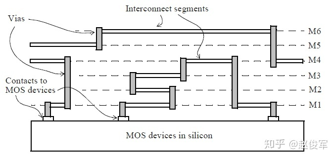图4-1

互连电容（C）也来自金属走线，包括接地电容以及相邻信号路径之间的电容。

互连电感（L）是由于电流环路而产生的，通常，电感效应在芯片内可以忽略不计，仅在封装和板级分析中考虑。在芯片级设计中，电流环路又窄又短，这意味着电流返回路径是通过电源或地信号而紧密相连的。在大多数情况下，时序分析不考虑片上电感，片上电感分析的任何进一步描述都超出了本书的范围。接下来仅分析互连电阻和互连电容的表示方法。

理想情况下，互连走线一部分的电阻和电容（RC）用分布式（distributed）RC树表示，如图4-2所示。 在此图中，RC树的总电阻和总电容Rt和Ct分别等于Rp * L和Cp * L，其中Rp和Cp分别是单位长度走线的互连电阻和电容值，L是走线长度。Rp和Cp值通常是从各种配置下提取的寄生参数中获得的，并由ASIC代工厂提供。

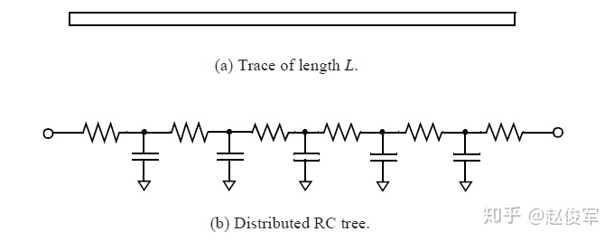图4-2

RC互连可以通过各种简化模型来表示，这些将在下面的小节中进行介绍。

### T模型

使用T模型表示时，总电容Ct被建模为在电阻树中间的连接。总电阻Rt被分为两部分（每部分为Rt / 2），Ct连接在电阻树的中点，如图4-3所示。

图4-3

### π模型

在如图4-4所示的π模型中，总电容Ct被分为两部分（每部分为Ct / 2），并连接在电阻的两侧。

图4-4

通过将Rt和Ct分成多个部分，可以获得分布式RC树的更准确表示。若分为N个部分，则每个中间部分的电阻和电容值分别为Rt / N和Ct /N，而两端部分需要根据T模型或π模型的概念来进行建模。图4-5中两端部分使用了T模型进行建模，而图4-6中两端部分使用了π模型进行建模。

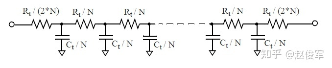图4-5

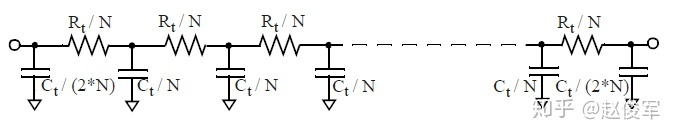图4-6

## 4.2 线负载模型

在进行布局规划（floorplanning）或布局（layout）之前，可以使用线负载模型（wireload models）来估计由互连线带来的电容、电阻以及面积开销。线负载模型可用于根据扇出数量来估计网络的长度，线负载模型取决于块（block）的面积，具有不同面积的设计可以选择不同的线负载模型。线负载模型还可以将网络的估计长度映射（map）为电阻、电容以及由于布线而产生的相应面积开销。

块内的平均走线长度与块的面积密切相关：随着块面积的增加，平均走线长度也会增加。图4-7显示，对于不同的面积（芯片或块），通常将使用不同的线负载模型来确定寄生效应。因此，下图中面积小的块的电容比较小。

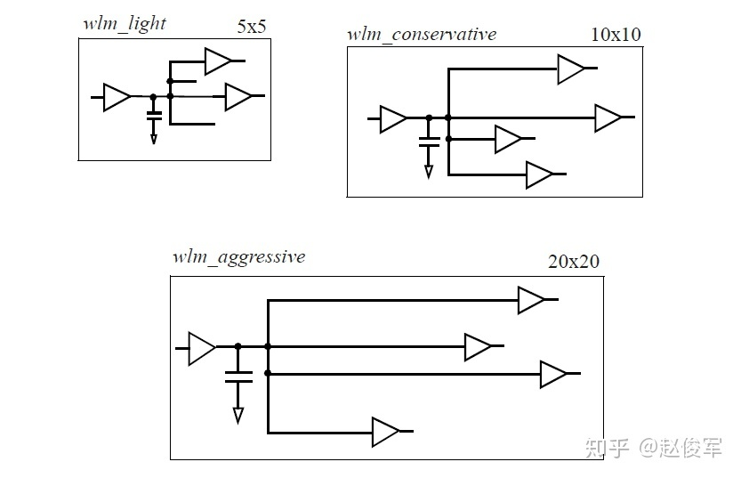图4-7

以下是一个线负载模型的例子：

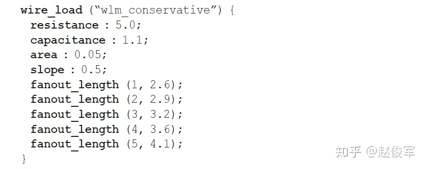

**resistance**是互连线单位长度的电阻值，**capacitance**是互连线单位长度的电容值，**area**是互连线单位长度的面积开销，**slope**是用于扇出-长度（**fanout_length**）表中未指定的数据点的外推斜率。

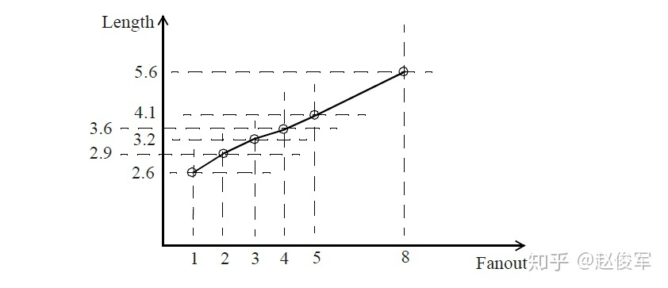图4-8

线负载模型描述了互连线长度与扇出之间的函数关系，上面的示例如图4-8所示。对于表中未明确列出的任何扇出值，可使用具有指定斜率的线性外推法计算得到互连线长度。例如，扇出为8时可进行如下计算：

● 互连线长度 = 4.1 + （8 - 5） * 0.5 = 5.6

● 电容值 = 5.6 * 1.1 = 6.16

● 电阻值 = 5.6 * 5 =28.0

● 面积开销 = 5.6 * 0.05 = 0.28

上述计算结果中长度、电容、电阻、面积的单位都会在库（library）中指定。

## 4.2.1 互连树

一旦确定了预布局（pre-layout）后互连线的电阻电容估计值（即Rwire和Cwire），下一个问题便是互连结构。互连RC结构相对于驱动单元该如何分布呢？ 这一点很重要，因为从驱动引脚（driver pin）到负载引脚（load pin）的互连延迟取决于互连的结构。通常，互连延迟取决于沿路径的互连电阻和电容大小。因此，延迟值可能会有所不同，具体取决于给这个网络（net）假定的拓扑结构。

对于预布局估计，可以使用以下三种不同形式来表示互连RC树（见图4-9）。请注意，每个互连线的总长度（以及电阻和电容估计值）在这三种情况下是相同的。

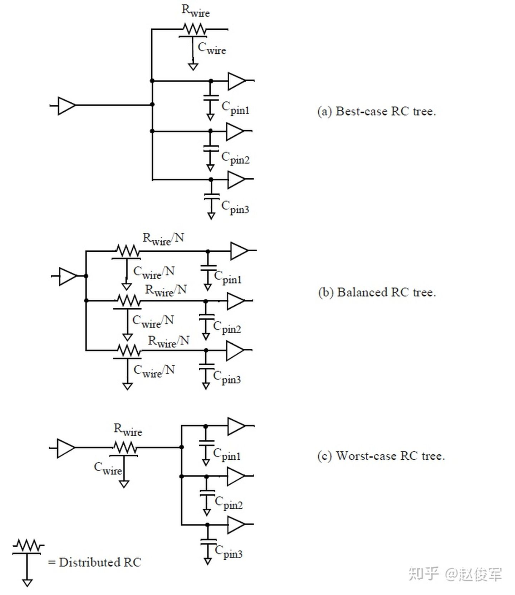图4-9

● **Best-case tree**

 在最佳情况树中，假定负载引脚在物理上与驱动引脚相邻。因此，到负载引脚的路径中都没有互连电阻，来自其它扇出引脚的所有互连线电容和引脚电容仍然作为驱动引脚上的负载。

● **Balanced tree**

 在这种情况下，假定每个负载引脚都在互连线的一部分上，并且每条到达负载引脚的路径上的总电阻和电容都相等。

● **Worst-case tree**

 在最差情况树中，假定所有负载引脚都集中在互连线的另一端。因此，每条到负载引脚的路径上都会有全部的互连线电阻和电容。

## 4.2.2 指定线负载模型

使用以下命令指定线负载模型：

 **set_wire_load_model** "wlm_cons" **-library** "lib_stdcell"

以上命令表示使用单元库lib_stdcell中的线负载模型wlm_cons。

当一个网络跨越了设计层次（hierarchical）的边界时，可以基于线负载模式（wireload mode）将不同的线负载模型应用于每个层次中网络的不同部分。这些线负载模式是：

● **top**

● **enclosed**

● **segmented**

可以使用**set_wire_load_mode**来指定线负载模式：

 **set_wire_load_mode** enclosed

在**top**线负载模式下，层次结构中的所有网络都将继承顶层（top）的线负载模型，即忽略下级层级中指定的任何线负载模型。因此，顶层的线负载模型具有优先权。对于图4-10所示的例子，块B1中指定的wlm_cons线负载模型优先于块B2、B3和B4中指定的所有其它线负载模型。

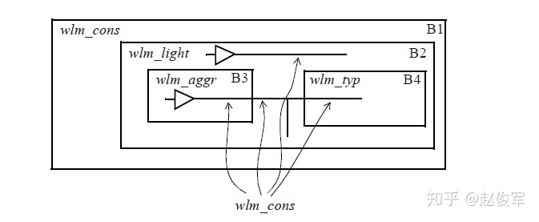图4-10

在**enclosed**线负载模式下，将完全包含网络的那个块中使用的线负载模型用于整个网络。对于图4-11中所示的例子，网络NETQ被完全包含在块B2中，因此将块B2的线负载模型wlm_light用于该网络。同理，完全包含在块B3中的网络使用wlm_aggr线负载模型，而完全包含在块B5中的网络使用wlm_typ线负载模型。

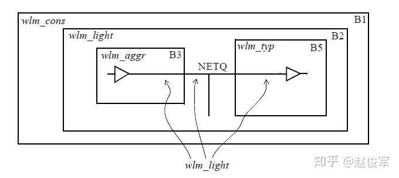图4-11

在**segmented**线负载模式下，网络的每段（segment）都从包含该段的块中获取其线负载模型，网络的每个部分都在该层次内使用适当的线负载模型。图4-12举例说明了一个网络NETQ，它的三段分别在三个块中。B3块中此网络的扇出互连使用wlm_aggr线负载模型，B4块中使用wlm_typ线负载模型，B2块中使用wlm_light线负载模型。

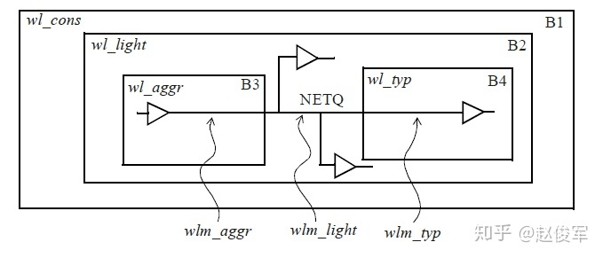图4-12

通常，是根据模块的芯片面积来选择线负载模型的。但是，可以根据用户的判断修改或更改它们。例如，可以为面积在0到400之间的块选择线负载模型wlm_aggr，为面积在400到1000之间的块选择线负载模型wlm_typ，为面积大于1000的块选择线负载模型wlm_cons。 线负载模型通常在单元库中定义，但是用户也可以自定义线负载模型。可以在单元库中将默认的线负载模型指定为：

 **default_wire_load** : "wlm_light" ；

在单元库中定义了一个线负载模型选择组，该组根据面积选择线负载模型，以下是一个示例：

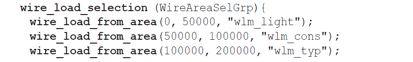

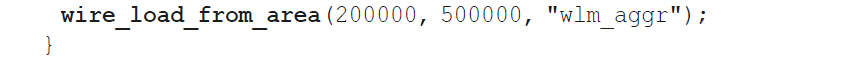

单元库可以包含许多这样的选择组。通过使用**set_wire_load_selection_group**，可以选择特定的一个组供STA使用。

 **set_wire_load_selection_group** WireAreaSelGrp

本节介绍了在物理实现之前（即在预布局阶段）估算寄生参数的建模过程。下一节将介绍从布局中提取得到的寄生参数的表示方法。

## 4.3 提取所得寄生参数的表示方法

从布局（layout）中提取的寄生参数可以用三种格式描述：

● 详尽的寄生参数格式 ：Detailed Standard Parasitic Format（DSPF）

● 精简的寄生参数格式 ：Reduced Standard Parasitic Format（RSPF）

● 标准的寄生参数格式 ：Standard Parasitic Extraction Format（SPEF）

一些工具还提供了专用的寄生参数二进制表示格式，例如SBPF；这有助于减小文件存储空间，并加快了工具读取寄生参数的速度。下面分别对以上三种格式进行简要说明。

## 4.3.1 详尽的寄生参数格式

使用DSPF格式时，详尽的寄生参数以**SPICE**格式表示。**SPICE**中的Comment语句用于表明单元类型、单元引脚及其电容。电阻和电容值采用标准**SPICE**语法，并且单元实例也包含在此表示格式中。这种格式的优势在于，DSPF文件可以用作**SPICE**仿真器本身的输入。但是，缺点是DSPF语法过于详细和冗长，导致模块的总文件大小非常大。因此，这种格式在实际中仅用于相对较小的一组网络。

以下是DSPF文件的示例，描述了从主输入IN到缓冲器BUF的输入引脚A以及从BUF的输出引脚OUT到主输出引脚OUT的一个网络互连。

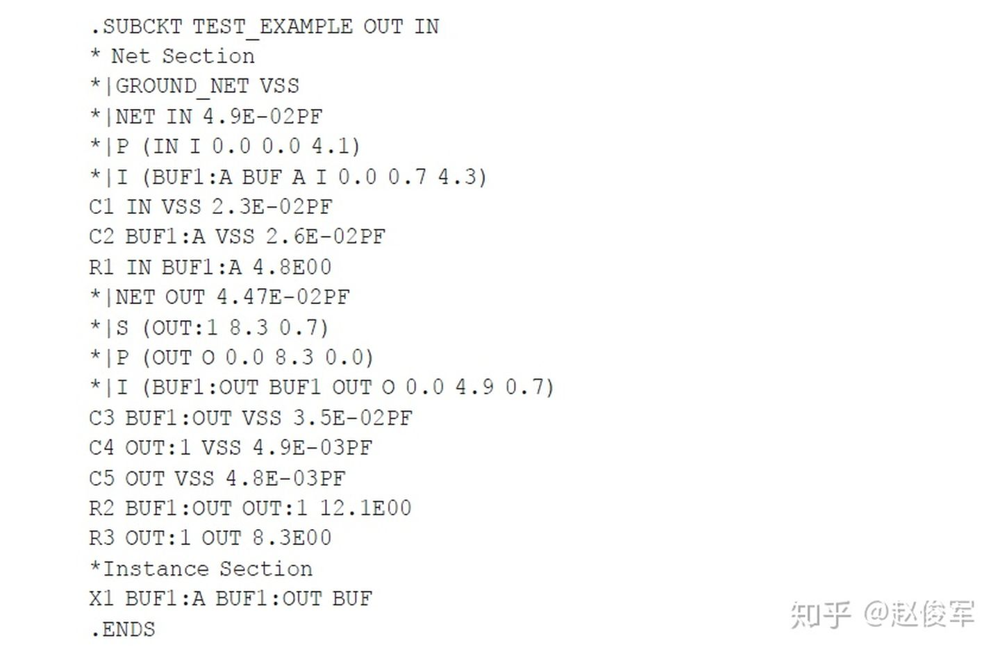

DSPF中的非标准**SPICE**语句是以 * |开头，并具有以下格式：

## 4.3.2 精简的寄生参数格式

使用RSPF格式时，寄生参数以精简的形式表示。精简格式包括电压源和受控电流源。RSPF格式也是**SPICE**文件，也可以将其读取到类似**SPICE**的仿真器中。RSPF格式要求简化详细的寄生参数并将其映射为精简格式，因此这是RSPF格式的一个缺点，因为寄生提取过程的重点通常是提取的精度，而不是压缩成RSPF之类的精简格式。RSPF格式的另一个限制是不能以这种格式表示双向信号流。

以下是RSPF文件的示例，原始设计和等效表示如图4-13所示。

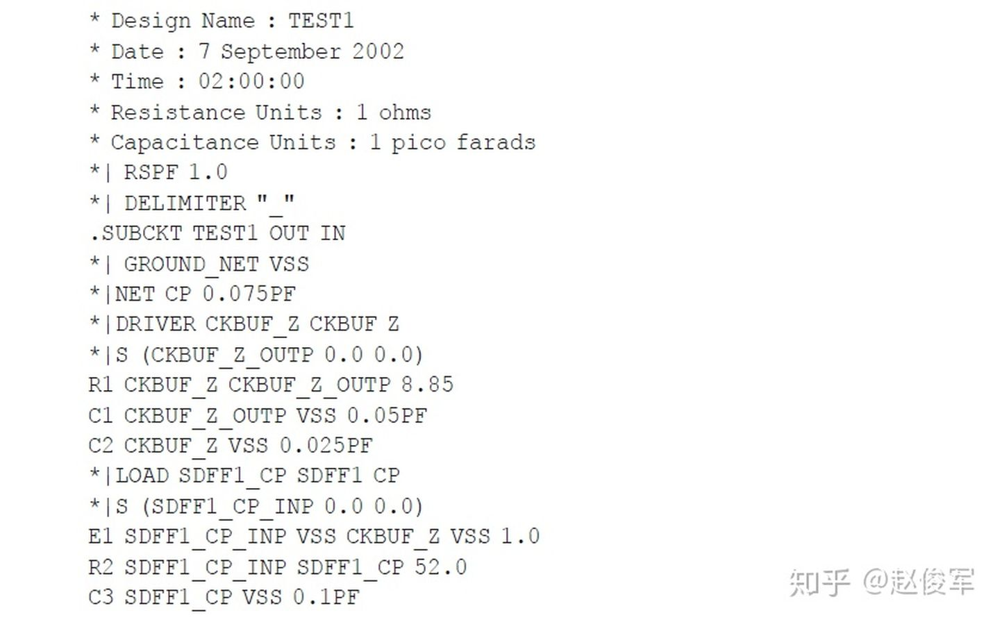

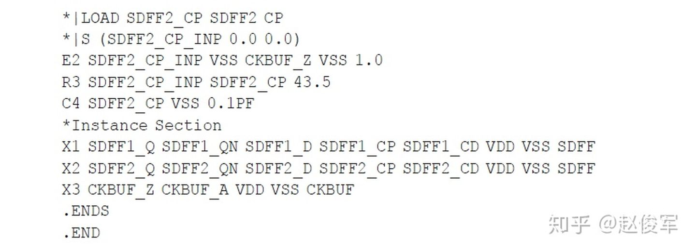

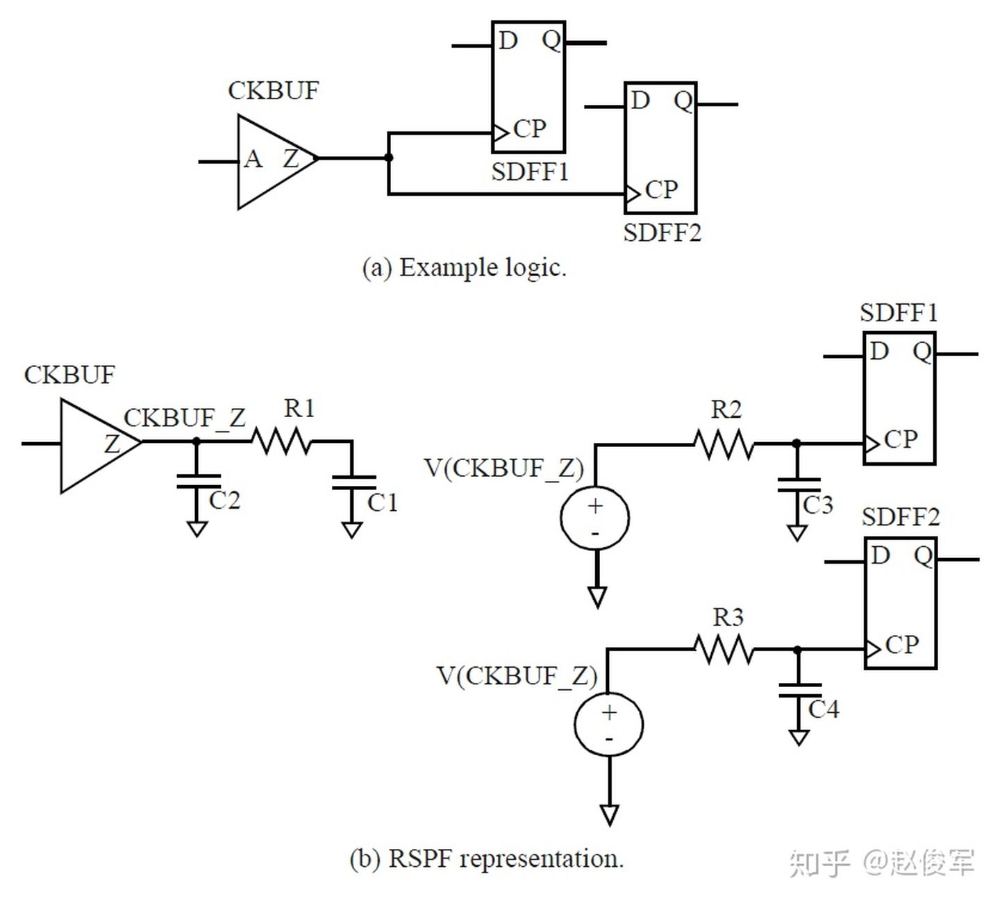图4-13

这个文件具有以下特点：

● 在每个扇出单元的输入引脚上都使用0.1pF的电容（C3和C4）和电阻（R2和R3）对引脚到引脚（pin-to-pin）的互连延迟进行建模，电阻值的选取原则是使RC延迟对应于引脚到引脚的互连延迟。驱动单元输出引脚上的π型负载模拟了通过该单元的延迟。

● 输入端的RC元件由理想电压源（E1和E2）驱动，该电压源等于驱动单元输出端的电压。

## 4.3.3 标准的寄生参数格式

SPEF是一种紧凑格式，可以表示详细的寄生参数。下面是一个具有两个扇出的网络的示例：

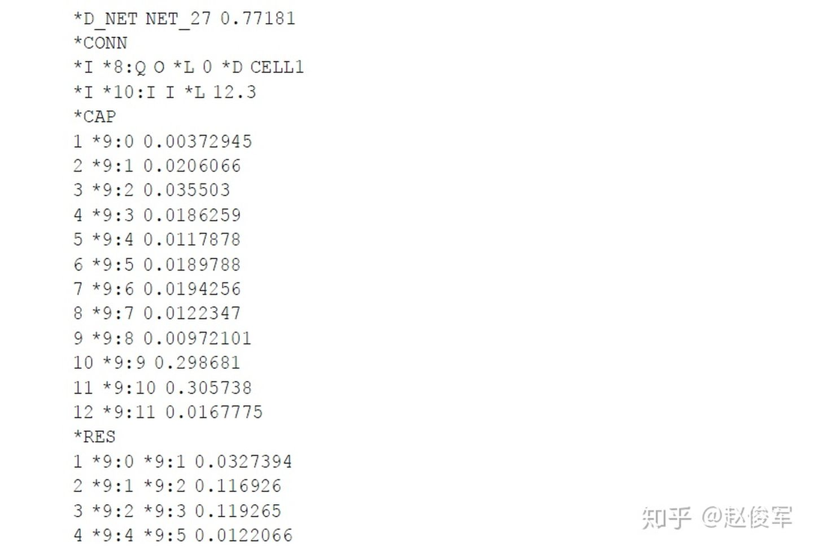

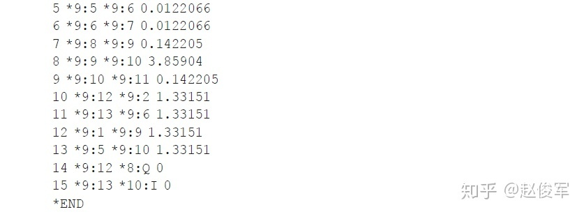

寄生电阻和电容的单位在SPEF文件的开头中指定，附录C中提供了SPEF文件的更详细说明。由于SPEF的紧凑性和表示的完整性，它是设计中寄生参数表示方法的首选格式。

## 4.4 耦合电容的表示方法

上一节说明了将一个网络的电容表示为接地（grounded）电容的情况。由于纳米技术中的大多数电容是侧壁（sidewall）电容，因此这些电容的恰当表示形式应该是信号到信号（signal-to-signal）的耦合电容（Coupling Capacitance）。

DSPF中耦合电容的表示是对原始DSPF标准的附加（add-on），因此不是唯一的。耦合电容会在两组耦合网络之间被复制，这意味着由于两组网络中有重复的耦合电容，因此DSPF无法直接被读入**SPICE**。一些输出DSPF的工具通过在两个耦合网络中各包含一半的耦合电容解决了这一问题。

RSPF是精简的格式，因此不适合表示耦合电容。

SPEF标准以统一和明确的方式处理耦合电容，因此是考虑串扰（crosstalk）时序时优先选择的提取格式。此外，就文件大小而言，SPEF是紧凑的表示格式，适合用于表示带耦合或不带耦合的寄生参数。

如附录C中所描述，管理文件大小的机制之一是在文件的开头列出名称目录（name directory）。现在，许多提取工具在SPEF文件的开头指定了网络名目录（将网络名表示为索引），从而避免了重复网络名的冗长性，这样可以大大减小文件大小。附录C中列举了一个SPEF的名称目录示例。

## 4.5 分层方法

大型复杂的设计通常在物理设计过程中需要使用分层方法（hierarchical methodology）来进行寄生参数提取和时序验证。在这种情况下，模块的寄生参数会在模块级别提取，然后可以在更高的层次上使用。

可以将从一个模块的布局中提取得到的寄生参数用于尚未完成布局的另一个模块的时序验证。在这种情况下，通常将已布局完的模块的寄生参数与预布局模块的基于线负载模型的估计寄生参数结合使用。

在使用分层方法的流程中，顶层（top）模块的布局最先完成，但其中的模块仍为黑匣子（预布局），基于线负载模型估计所得的寄生参数可以结合从布局完成的顶层中提取得到的寄生参数用于较低层次的模块。 一旦各模块的布局也完成了，就可以将从顶部和模块的布局中提取得到的寄生参数结合在一起。

### 布局中的重复模块

如果将一个设计模块在布局中复制多次，则可以将从一个实例（instantiation）中提取的寄生参数用于所有实例，这就要求该模块的布局在各方面对于每个实例都是相同的。例如，从布局内的布线网络看，布局环境（environment）应该没有差异，这意味着模块内网络不与模块外部的任何网络电容耦合。可以做到这一点的一种方法是：确保没有在模块内布线任何顶层的网络，并且对在块的边界附近布线的网络有足够的保护或间距。

## 4.6 减少关键网络的寄生参数

本节简要概述了管理寄生参数对关键（critical）网络影响的常用技术。

### 降低互连电阻

对于关键网络，重要的是要保持较低的压摆率（slew）或快速的过渡时间（transition），这意味着应降低互连电阻。通常，有两种方法可以实现较低的电阻：

● 宽走线（Wide trace）：具有比最小宽度更加宽的走线可以降低互连电阻，而且不会引起寄生电容的显著增加。因此，可以减少总的RC互连延迟和过渡时间。

● 在较高（较厚）金属中布线：较高的金属层通常具有低电阻率，可用于给关键信号布线。较低的互连电阻可减少互连延迟以及目标引脚（destination pin）上的过渡时间。

### 增加走线间距

增加走线之间的间距可以减少网络的耦合电容和总电容。大的耦合电容会增加串扰，避免串扰是在长距离相邻走线中布线的网络的重要考虑因素。

### 相关网络的寄生参数

在许多情况下，一组网络必须在时序上匹配。比如高速DDR接口的一个字节通道内的数据信号，因为需要保证一个字节通道内的所有信号都具有相同的寄生参数，所以这些信号都应在同一金属层中布线。例如，虽然金属层M2和M3具有相同的平均值和相同的统计变化，但是这些变化是独立的，从而这两个金属层中的寄生参数变化是无关的。因此，如果对于关键信号的时序匹配很重要，则在每个金属层中的布线必须相同。

