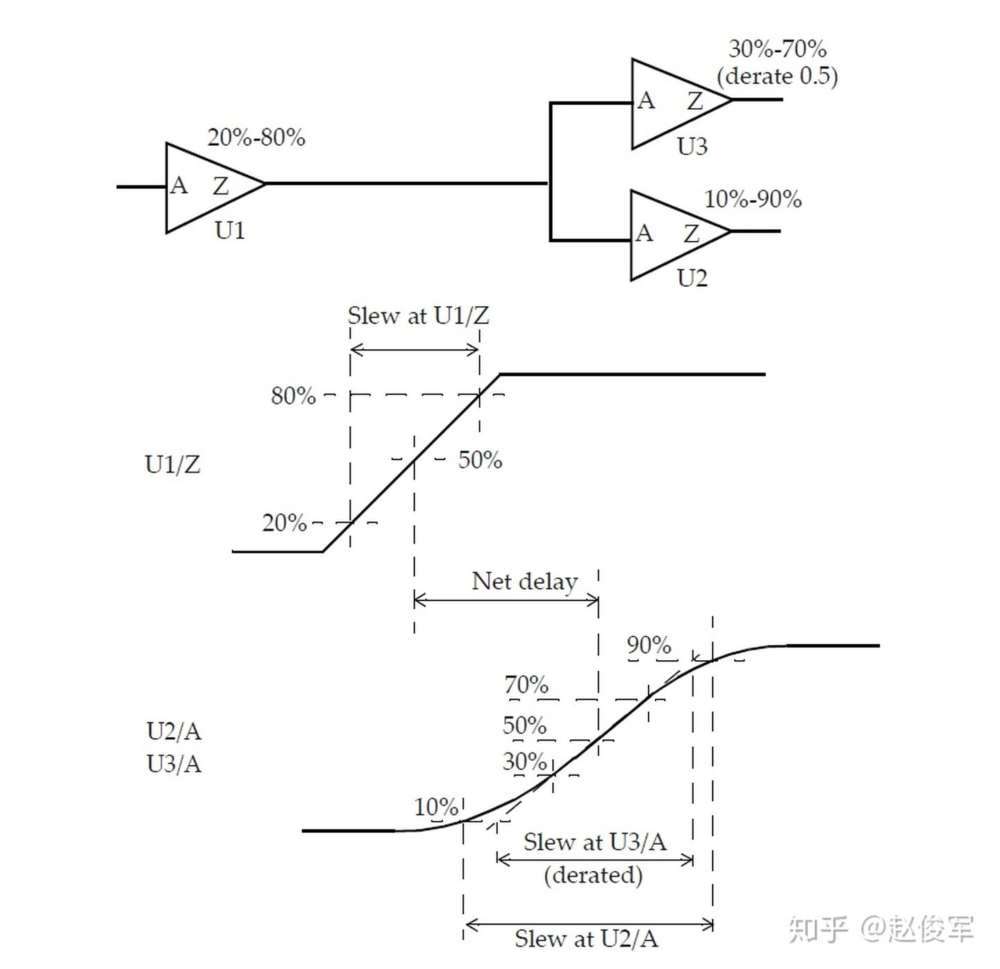

<div>
<style>
img{
    width: 60%;
    //padding-left: 20%;
}
</style>
</div>


> 本章节介绍了用于布局前后时序验证的基于单元（cell-based）的设计的延迟计算（delay calculation）。


● 前几章重点介绍了对互连线和单元库的建模，单元和互连线建模技术可用于获得设计的时序信息。

## 5.1 概述

## 5.1.1 延迟计算基础

典型的设计中包括各种组合逻辑单元和时序逻辑单元，我们使用如图5-1中所示的逻辑设计来描述延迟计算的概念：

图5-1

库中为每个单元的每个输入引脚都指定了电容值，因此，设计中的每个网络都具有容性负载，该负载是该网络每个扇出的引脚负载电容再加上互连线的寄生电容之和。为了简单起见，本节中暂不考虑互连线的影响，这些内容将在后面章节中进行介绍。不考虑互连寄生的影响，图5-1中的内部网络NET0的电容将由UAND1和UNOR2单元的输入引脚电容组成；输出O1具有UNOR2单元的输入引脚电容再加上逻辑模块输出端口的任何电容性负载；输入I1和I2具有UAND1和UINV0单元的输入引脚电容。通过这种抽象，图5-1中的逻辑设计可以用图5-2所示的等效表示来描述：

图5-2

如第3章所述，单元库中包含了用于各种时序弧的NLDM时序模型，非线性模型以输入过渡时间和输出负载电容的形式表示为二维表格。==逻辑单元的输出过渡时间也以输入过渡时间和总输出负载电容的形式表示为二维表格==。因此，如果在逻辑块的输入引脚处（I1和I2）指定了输入过渡时间（或称压摆），则可以从库中获得UINV0单元和UAND1单元（对于输入I1）的时序弧的输出过渡时间和延迟。对扇出单元使用如上相同的方法，则可以获得通过UAND1单元的另一条时序弧（从NET0到O1）以及通过UNOR2单元的过渡时间和延迟。对于多输入单元（例如UAND1），不同的输入引脚会导致不同的输出过渡时间值，对扇出网络过渡时间的选择取决于压摆合并（slew merge）选项，这将在5.4节中进行介绍。使用上述方法，可以基于输入引脚上的过渡时间和输出引脚上的电容来获得通过任何逻辑单元的延迟。

## 5.1.2 带互连线的延迟计算

### 布局前时序

如第4章所述，在布局前（pre-layout）时序验证期间，使用线负载模型估算了互连寄生参数。在许多情况下，线负载模型中电阻的影响被设置为了0。在这种情况下，线负载是纯电容性的，因此上一部分中描述的延迟计算方法适用于，计算所有时序弧的延迟。

如果线负载模型考虑了互连电阻的影响，则将NLDM模型与总网络电容一起使用，以计算通过单元的延迟。由于互连线是电阻性的，因此从驱动单元的输出到扇出单元的输入引脚会有额外的延迟。互连线的延迟计算过程将在5.3节中进行介绍。

### 布局后时序

金属走线的寄生参数将被映射为驱动单元和目标单元之间的RC网络。以图5-1中示例为例，网络的互连电阻如图5-3所示。内部网络（例如图5-1中的NET0）映射到了多个子节点，如图5-3所示。因此，反相器单元UINV0的输出负载由RC结构组成。由于NLDM表格仅针对输入过渡时间和输出负载电容而言，因此输出引脚上的电阻性负载意味着NLDM表格不能直接应用。下一节将介绍如何将NLDM表格模型与互连电阻一起结合使用。

图5-3

## 5.2 使用有效电容计算单元延迟

如上所述，当单元输出端的负载包含互连电阻时，NLDM模型不可直接使用。因此，采用“有效”电容法来处理电阻的影响。

有效电容法试图找到一个可以用作等效负载的电容，以使原始设计与具有等效电容负载的设计在单元输出的时序方面表现一致。这个等效电容被称为有效电容（effective capacitance）。

图5-4（a）为在扇出处具有RC互连的单元，该RC互连可由等效的π模型表示，如图5-4（b）所示。有效电容的概念是为了获得等效的输出电容Ceff（如图5-4（c）所示），此时通过单元的延迟与具有RC互连负载的原始设计相同。通常，具有RC互连负载的单元输出波形与具有单个电容性负载的单元输出波形非常不同。

图5-4

图5-5中展示了具有总电容、有效电容的单元输出端的代表性波形以及具有实际RC互连的波形。选择准确的有效电容Ceff应该可以使得图5-4（c）中单元输出处的延迟（在过渡波形的中点测得）与图5-4（a）中的延迟相同，如图5-5所示。

图5-5

使用π模型等效表示RC互连时，有效电容可以表示为：

 ● Ceff = C1 + k * C2 , 0 <= k <= 1

其中C1是近端（near-end）电容，C2是远端（far-end）电容，如图5-4（b）所示。k的值在0到1之间。在互连电阻可忽略的情况下，有效电容几乎等于总电容。通过在图5-4（b）中将R设置为0，可以直接解释这一点。同样，如果互连电阻相对较大，则有效电容几乎等于近端电容C1，这可以通过将R增加到无限大（本质上是开路）的极限情况来解释。

有效电容是以下各项的函数：

● 驱动单元

● 负载的特性，尤其是驱动单元负载的输入阻抗。

对于给定的互连线，输出驱动较弱的单元将比驱动较强的单元具有更大的有效电容。因此有效电容的值将介于最小值C1（对于较大的互连电阻或者较强的驱动单元）与最大值C1+C2（对于小到可忽略的互连电阻或较弱的驱动单元）之间。注意，目标引脚的转换要晚于驱动单元的输出。==近端电容充电速度比远端电容快的现象也被称为互连线的电阻屏蔽效应（resistive shielding effect），因为驱动单元只能看到一部分远端电容==。

与通过库中的NLDM模型直接查找来计算延迟不同，延迟计算工具通过迭代过程获得有效电容。就算法而言，第一步是获取单元输出端看到的实际RC负载的驱动点阻抗（可以使用二阶AWE或Arnoldi算法等方法计算实际RC负载的驱动点阻抗）。计算有效电容的下一步是使两种情况下直到过渡波形中点为止传输的电荷量相等：使用实际RC负载时（基于驱动点阻抗）在单元输出处传输的电荷与使用有效电容作为负载时的电荷传输量相匹配，请注意，电荷传输匹配仅到过渡波形的中点为止。该过程从有效电容的估算值开始，然后迭代更新估算值。在大多数实际情况下，有效电容值会在少量次数的迭代中收敛。

因此，有效电容近似值是计算通过单元的延迟的优秀模型。但是，使用有效电容法获得的输出压摆（slew）与单元输出处的实际波形并不一致。有效电容近似值不能代表单元输出处的波形，尤其是波形的后半部分。请注意，在典型情况下，需要关注的波形并不是在单元输出处，而是在互连线的终点处，也即扇出单元的输入引脚处。

有多种方法可以计算互连线终点处的延迟和波形。在许多实现（implementation）方法中，有效电容的计算过程还会计算驱动单元的等效戴维宁（Thevenin）电压源。戴维宁电压源由具有串联电阻Rd的电压源组成，如图5-6所示。串联电阻Rd对应于单元输出级的下拉电阻（或上拉电阻）。

图5-6

本节介绍了使用有效电容替代RC互连来计算通过驱动单元的延迟。有效电容的计算还提供了等效的戴维宁电压源模型，然后将其用于获取通过RC互连的时序。接下来将具体介绍获取通过RC互连时序信息的过程。

## 5.3 互连线延迟

如第4章所述，网络的互连寄生通常由RC电路表示，RC互连电路可以是布局前或布局后的。虽然布局后的互连寄生可以包括与相邻网络的耦合，但是基本延迟计算中将所有电容（包括耦合电容）都视为接地电容。一个网络及其驱动单元和扇出单元的寄生参数如图5-7所示：

图5-7

使用有效电容法，可以分别获得通过驱动单元和通过互连线的延迟。使用有效电容法可获得通过驱动单元的延迟，并在单元的输出端提供等效的戴维宁电压源，然后使用戴维宁电压源分别计算通过互连线的延迟。互连线部分具有一个输入和与目标引脚一样多的输出。在互连线输入端使用等效戴维宁电压源，计算到每个目标引脚的延迟，如图5-6所示。

在布局前进行分析时，RC互连结构由RC树类型决定，而RC互连结构又决定了互连线延迟。4.2节中已详细介绍了三种类型的RC互连树表示形式，所选的RC树类型通常在库中定义。通常，最坏情况（worst-case）的慢速库会选择最坏情况的RC树，因为该类型的树提供了最大的互连线延迟。类似地，最佳情况（best-case）的RC树结构中不包括从源引脚到目标引脚的任何电阻，通常在最佳情况的快速工艺角时被选择。因此，最佳情况RC树的互连延迟等于零。典型（typical）情况RC树和最坏情况RC树的互连延迟的处理方式与布局后RC互连一样。

### Elmore延迟模型

Elmore延迟模型（如图5-8所示）适用于RC树。什么是RC树？ RC树应满足以下三个条件：

● 有单一的输入（源）节点

● 没有任何电阻回路

● 所有电容都在节点和地之间

Elmore延迟可以看作是找到每段的延迟，即R与下游电容的乘积，然后取各延迟之和。

图5-8

到各个中间节点的延迟计算如下：


Elmore延迟在数学上考虑的是脉冲响应的第一时刻。 现在，我们将Elmore延迟模型进行如下简化表示：互连线的寄生电阻与电容分别为Rwire和Cwire，互连线远端的引脚电容由负载电容Cload来建模。等效的RC网络可以简化为π模型或T模型，分别如前面章节四中图4-4和图4-3所示。两种模型都具有如下走线延迟（基于Elmore延迟方程）：

● Rwire * （ Cwire / 2 + Cload）

这是因为Cload在充电路径中能看到整个互连线的电阻，而Cwire电容在T模型中仅能看到Rwire / 2且Cwire / 2在π模型中能看到Rwire。以上方法也可以扩展到更复杂的互连结构。

下面给出了使用线负载模型和平衡（balanced）RC树（以及最坏情况RC树）计算一个网络的Elmore延迟的示例。

使用平衡RC树模型时，网络的电阻和电容在网络的各个分支之间平均分配（假设扇出为N）。对于具有引脚负载Cpin的分支，使用平衡RC树的延迟为：

● （Rwire / N）* （Cwire / （2N）+ Cpin）

使用最坏情况RC树模型时，网络的每个分支终点都考虑了网络的电阻和整个电容。此时的延迟值如下所示，这里的Cpins是所有扇出的总引脚负载：

● Rwire * （Cwire / 2 + Cpins）

图5-9是一个设计实例：

图5-9

如果我们使用最坏情况RC树模型来计算网络N1的延迟，我们将得到：

● Rwire * （Cwire / 2 + Cpins）= 0.3 * （0.5 + 2.3）=0.84

如果使用平衡RC树模型，则对于网络N1的两个分支，将得到以下延迟：

● 到NOR2单元的分支 ： （0.3 / 2）* （0.5 / 2 + 1.3）= 0.2325

● 到BUF单元的分支： （0.3 / 2）*（0.5 / 2 + 1.0）= 0.1875

### 高阶互连线延迟估计

如上所述，Elmore延迟考虑的是脉冲响应的第一时刻，而AWE（渐近波形评估）、Arnoldi或其他方法能够匹配更高阶的响应时刻。通过进行更高阶的估计，可以提高计算互连线延迟的精度。

### 全部片上延迟计算

到目前为止，本章已经介绍了单元延迟以及单元输出处互连线的延迟计算。因此，给定在单元输入处的过渡时间，可以计算通过单元和单元输出处互连线的延迟。互连线远端（终点）的过渡时间是下一级的输入，整个设计过程中都会重复此过程，这样就计算出了设计中每个时序弧的延迟。


## 5.4 压摆合并

当多个压摆到达一个公共点时（例如在多输入单元的情况下）会发生什么呢？这种公共点称为压摆合并点（slew merge point）。 选择哪个压摆在压摆合并点处继续向下传播呢？考虑图5-10所示的2输入单元：

图5-10

由于引脚A上的信号改变，引脚Z上的压摆到达较早，但上升缓慢（压摆较小）；由于引脚B上的信号改变，引脚Z上的压摆到达较晚，但上升很快（压摆较大）。在压摆合并点（例如引脚Z），应选择哪个压摆进一步传播呢？取决于所执行的时序分析的类型（最大或最小时序路径分析），这些压摆值中的任何一个都可能是正确的。

进行最大时序路径分析时有两种可能性：

● 最差的压摆传播（Worst slew propagation）：此模式选择要在合并点传播最坏的压摆，这将是图5-10（a）中的压摆。对于通过引脚A-> Z的时序路径，此选择是准确的，但对于通过引脚B-> Z的任何时序路径都是悲观的。

● 最差的到达时间传播（Worst arrival propagation）：此模式选择要在合并点传播最差的到达时间，这对应于图5-10（b）中的压摆。在这种情况下选择的压摆对于通过引脚B-> Z的时序路径是准确的，但对于通过引脚A-> Z的时序路径是乐观的。

同样，进行最小时序路径分析时也有两种可能性：

● 最佳的压摆传播（Best slew propagation）：此模式选择要在合并点传播最佳的压摆，这就是图5-10（b）中的压摆。对于通过引脚B-> Z的时序路径，此选择是准确的，但对于通过引脚A> Z的任何时序路径，该选择的压摆值较小。对于经过A-> Z的路径，路径延迟小于实际值，因此对于最小时序路径分析是悲观的。

● 最佳的到达时间传播（Best arrival propagation）：此模式选择要在合并点传播最佳的到达时间，这对应于图5 10（a）中的压摆。在这种情况下，选择的压摆对于通过引脚A-> Z的时序路径是准确的，但大于通过引脚B-> Z的时序路径的实际值。对于经过B-> Z的路径，路径延迟大于实际值，因此对于最小时序路径分析是乐观的。

设计人员可以在静态时序分析环境之外执行延迟计算，以生成SDF文件。在这种情况下，延迟计算工具通常使用最差的压摆传播。生成的SDF文件足以用于最大时序路径分析，但对于最小时序路径分析可能是过于乐观的。

大多数静态时序分析工具均使用最差和最佳的压摆传播作为默认设置，因为它会保守地限制分析。但是，在分析特定路径时可以使用精确的压摆传播，精确的压摆传播需要在时序分析工具中启用一个选项。因此，重要的是要了解静态时序分析工具中默认使用哪种压摆传播模式，并清楚其可能过于悲观的情况。

## 5.5 不同压摆阈值

通常，库会指定在单元表征（characterization）期间使用的压摆（过渡时间）阈值。问题是，当具有一组压摆阈值的单元驱动其他具有不同压摆阈值设置的单元时，会发生什么呢？ 考虑图5-11中所示的情况，具有20%-80%压摆阈值的单元驱动两个扇出单元，其中一个具有10%-90%的压摆阈值，另一个具有30%-70%的压摆阈值且压摆降额系数为0.5。

图5-11

U1单元的压摆设置在单元库中定义如下：

```
slew_lower_threshold_pct_rise： 20.00
slew_upper_threshold_pct_rise：80.00
slew_derate_from_library：1.00
input_threshold_pct_fall：50.00
output_threshold_pct_fall：50.00
input_threshold_pct_rise：50.00
output_threshold_pct_rise：50.00
slew_lower_threshold_pct_fall：20.00
slew_upper_threshold_pct_fall：80.00
```

U2单元的压摆设置在另一个单元库中定义如下：

```
slew_lower_threshold_pct_rise：10.00
slew_upper_threshold_pct_rise：90.00
slew_derate_from_library：1.00
slew_lower_threshold_pct_fall：10.00
slew_upper_threshold_pct_fall：90.00
```

U3单元的压摆设置在另一个单元库中定义如下：

```
slew_lower_threshold_pct_rise：30.00
slew_upper_threshold_pct_rise：70.00
slew_derate_from_library：0.5
slew_lower_threshold_pct_fall：30.00
slew_upper_threshold_pct_fall：70.00
```

上面仅展示了与U2和U3压摆相关的设置， 输入和输出阈值的延迟相关设置为50％，未在上面显示。延迟计算工具会根据连接到这个网络的单元的压摆阈值来计算过渡时间。图5-11显示了U1 / Z处的压摆如何与此引脚上的切换波形相对应，U1/ Z处的等效戴维宁源可用于获得扇出单元输入端的切换波形。延迟计算工具会根据U2 / A和U3 / A处的波形及其压摆阈值，计算出U2 / A和U3 / A处的压摆。请注意，U2 / A的压摆是基于10%-90%设置的，而U3 / A所用的压摆是基于30%-70%设置，然后根据库中指定的压摆降额（slew derate）系数0.5使用的。 此示例说明了如何根据切换波形和扇出单元的压摆阈值设置来计算扇出单元输入端的压摆。

在可能不考虑互连电阻的预布局（pre-layout）设计阶段时，可以按以下方式计算具有不同阈值的网络处的压摆。例如，10%-90%压摆阈值和20%-80%压摆阈值之间的关系为：

● slew2080 / （0.8 - 0.2） = slew1090 / （0.9 - 0.1）

因此，10%-90%阈值测量点设置时的500ps压摆对应于20%-80%阈值测量点设置时（500ps * 0.6）/ 0.8 = 375ps的压摆。类似地，20%-80%阈值测量点设置时的600ps压摆对应于10%-90%阈值测量点设置时（600ps * 0.8）/ 0.6 = 800ps的压摆。

## 5.6 不同电压域

典型的设计中可能会对芯片的不同部分使用不同的电源。在这种情况下，在不同电压域之间的接口处应使用电平转换单元（level shifting cell）。电平转换单元在一个电压域接受输入，而在另一电压域提供输出。例如，一个标准单元输入可以为1.2V，其输出可以为较低的电压，如0.9V。下图5-12为一个示例：

图5-12

请注意，延迟是根据50％阈值点计算的。对于接口单元的不同引脚，这些点可能处于不同的电压。

## 5.7 路径延迟计算

一旦得到了每个时序弧的全部延迟，则可以将设计中各个单元的时序表示为时序图。通过组合逻辑单元的时序可以表示为从输入到输出的时序弧。类似地，互连线可用从源引脚到每个目的引脚的相应弧表示，表示为单独的时序弧。一旦整个设计由相应的时序弧标定（annotate）了，计算路径延迟就是将沿路径的所有网络和单元的时序弧相加起来即可。

## 5.7.1 组合逻辑路径延迟

考虑串联的三个反相器，如图5-13所示。在考虑从网络N0到网络N3的路径时，我们同时考虑了上升沿和下降沿路径，现假设网络N0处有上升沿。

图5-13

可以指定第一个反相器输入端的过渡时间（或压摆），若没有此类指定的话，就假定过渡时间为0（相当于理想情况）。输入UINVa / A处的过渡时间可通过使用上一节中指定的互连延迟模型来确定，同样，这个互连延迟模型也可用于确定网络N0的延迟Tn0。

根据UINVa输出处的RC负载，可以获得输出处UINVa/Z的有效电容。输入处UINVa/A的过渡时间和输出处UINVa/Z的等效有效负载则可用于获得单元输出下降延迟（output fall delay）。

等效的戴维宁电压源模型在引脚UINVa/Z上通过互连延迟模型可确定引脚UINVb/A上的过渡时间，互连延迟模型还用于确定网络N1上的延迟Tn1。

一旦知道了输入UINVb/A的过渡时间，就可以类似地计算通过UINVb的延迟。UINVb/Z处的RC互连以及引脚UINVc/A的引脚电容可用于确定N2处的有效负载。UINVb/A处的过渡时间可用于确定通过反相器UINVb的输出上升延迟（output rise delay），依此类推。

最后一级的负载由明确的负载说明来指定，如果没有指定，则仅使用网络N3的线负载。

上述分析假设网络N0为上升沿，对于网络N0的下降沿，可以进行类似的分析。因此，在这个简单的示例中，存在两条具有以下延迟的时序路径：

● Tfall = Tn0rise + Tafall + Tn1fall + Tbrise + Tn2rise + Tcfall + Tn3fall

● Trise = Tn0fall + Tarise + Tn1rise + Tbfall + Tn2fall + Tcrise + Tn3rise

通常，由于驱动单元输出处的戴维宁电压源模型不同，通过互连线的上升和下降延迟可能会有所不同。

## 5.7.2 到触发器的路径

### 输入到触发器路径

考虑从输入SDT到触发器UFF1的时序路径，如图5-14所示：

图5-14

我们需要同时考虑上升沿和下降沿路径。对于输入SDT的上升沿，数据路径延迟为：

● Tn1rise + Tafall + Tn2fall + Tbuf1fall + Tn3fall + Tbrise + Tn4rise

同样，对于输入SDT的下降沿，数据路径延迟为：

● Tn1fall + Tarise + Tn2rise + Tbuf1rise + Tn3rise + Tbfall + Tn4fall

输入MCLK上升沿的捕获（capture）时钟路径延迟为：

● Tn5rise + Tbuf2rise + Tn6rise

### 触发器到触发器路径

图5-15给出了两个触发器之间的数据路径和相应的时钟路径的示例：

图5-15

UFF0 / Q上升沿的数据路径延迟为：

● Tck2qrise + Tn1rise + Tafall + Tn2fall + Tbfall + Tn3fall

输入PCLK上升沿的发起（launch）时钟路径延迟为：

● Tn4rise + T5rise + Tn5arise

输入PCLK上升沿的捕获（capture）时钟路径延迟为：

● Tn4rise + T5rise + Tn5brise + T6rise + Tn6rise

需要注意单元的单边性（unateness），因为边沿方向在通过单元时可能会改变（上升沿变下降沿，下降沿变上升沿）。

## 5.7.3 多路径

在任何两点之间，可以有很多路径。最长的路径是花费时间最多的路径，这也称为最差路径、较晚路径或最大路径。最短的路径是花费时间最少的路径，这也称为最佳路径、较早路径或最小路径。

请参见图5-16中时序弧的逻辑和延迟。两个触发器之间的最长路径是通过单元UBUF1、UNOR2和UNAND3，两个触发器之间的最短路径是通过单元UNAND3。

图5-16

## 5.8 裕量计算

裕量（Slack）是信号需要到达时间（Required Time）与实际到达时间（Arrival Time）之差。在图5-17中，要求数据在7ns时保持稳定才能满足建立时间（setup）要求。但是，数据在1ns时就已稳定。因此，裕量为6ns（= 7ns-1ns）。

图5-17

假设数据需要到达的时间是从捕获触发器的建立时间获得的，则计算过程如下：

● 需要到达时间Required_Time = Tperiod - Tsetup = 10 - 3 = 7ns

● 实际到达时间Arrival_Time = 1ns

● 裕量Slack = Required_Time - Arrival_Time = 7 - 1 = 6ns

同样，如果两个信号之间的偏斜（skew）要求为100ps，并且测得的偏斜为60ps，则偏斜的裕量为40ps（= 100ps-60ps）。

