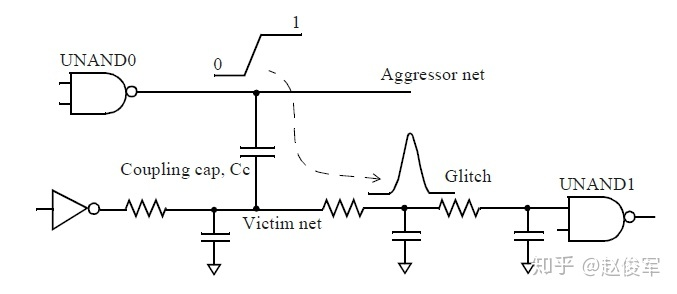

# 第六章：串扰噪声

> 本章节介绍了纳米技术中ASIC的信号完整性（signal integrity）。

● 在深亚微米（submicron）技术中，串扰（crosstalk）在设计的信号完整性中起着重要作用，串扰噪声是指两个或多个信号之间无意间的耦合。相关的噪声和串扰分析技术，即毛刺分析和串扰分析，可用于静态时序分析中，这将在本章中进行介绍。这些技术可用于使ASIC稳定运行。

## 6.1 概述

噪声是指影响芯片正常运行的不良或无意的现象。在纳米技术中，噪声会影响功能或器件的时序。

为什么会有噪声和信号完整性？

噪声在深亚微米技术中起重要作用的原因有以下几个：

● 金属层数量的增加：例如，一个0.25um或0.3um的工艺具有四个或五个金属层，而在65nm和45nm工艺中增加到了十个或更多的金属层。章节四中的图4-1已描绘过了金属互连线的多层结构。

● 垂直占主导地位的金属长宽比：这意味着走线既细又高，与早期工艺几何形状中比较宽不同。因此，较大比例的电容是由侧壁耦合电容组成的，该侧壁耦合电容即为相邻信号线之间的走线间电容。

● 更高的布线密度：由于具有更精细的几何形状，更多的金属线可以在物理上紧密相邻。

● 大量的交互设备和互连线：在同一硅片面积中封装了更多的标准单元和信号走线，从而导致更多的交互。

● 由于频率变高而导致波形切换加快：快速的边沿速率会导致更多的电流尖峰以及对相邻走线和单元的更大耦合效应。

● 较低的电源电压：电源电压的降低使得噪声裕量较小。

在本章中，我们特别研究串扰噪声的影响。串扰噪声是指两个或多个信号之间无意识的耦合。串扰噪声是由芯片上相邻信号之间的电容耦合引起的，这会导致一个网络的高低电平切换，从而对耦合信号产生意外影响。受影响的信号称为受害者（victim），而产生影响的信号称为攻击者（aggressor）。请注意，两个耦合的网络可能会相互影响，并且通常一个网络可能既是受害者又是攻击者。

图6-1给出了几个信号走线耦合在一起的示例，图中描绘了提取得到的耦合互连的分布式RC以及几个驱动单元和扇出单元。在此示例中，网络N1和N2之间的耦合电容为Cc1 + Cc4，而Cc2 + Cc5是网络N2和N3之间的耦合电容。

图6-1

广泛地讲，串扰会带来两种类型的噪声效应：毛刺（glitch）是指由于相邻攻击者电平切换的耦合而在稳定受害者信号上产生的噪声；以及由于受害者电平切换与攻击者电平切换的耦合而导致的时序变化（串扰增量延迟）。接下去的两小节将介绍这两种类型的串扰噪声。

## 6.2 串扰毛刺分析

## 6.2.1 基础

一个稳定的信号网络可能会由于攻击者电平切换时通过耦合电容转移的电荷而产生毛刺（正或负）。图6-2所示为攻击者网络上升沿电平切换的串扰引起的正毛刺。将两个网络之间的耦合电容描绘为一个集总（lumped）电容Cc而不是分布式（distributed）耦合电容，这是为了简化下面的说明，而又不失一般性。在提取所得网表的典型表示中，耦合电容可以分布在多个段中，如之前6.1节中所示。

图6-2

在此示例中，与非门单元UNAND0电平切换并为其输出网络充电（标记为“攻击者”）。一些电荷也通过耦合电容Cc转移到“受害”网络上，并导致正毛刺。转移的电荷量与攻击者和受害者之间的耦合电容Cc直接相关。向受害网络的接地电容上转移的电荷会导致该网络上的毛刺。由于通过驱动单元INV2的下拉（pull-down）结构转移了电荷，因此可以恢复受害网络上的稳定值（在这种情况下为低电平）。

毛刺的幅度取决于多种因素，其中一些因素是：

● 攻击者与受害者之间的耦合电容：耦合电容越大，毛刺的幅度越大。

● 攻击者网络的压摆（slew）：攻击者网络上的压摆越快，毛刺的幅度越大。通常，较快的压摆是因为驱动攻击者网络的单元具有较高的输出驱动强度。

● 受害者网络接地电容：受害者网络上的接地电容越小，毛刺的幅度越大。

● 受害者网络驱动强度：受害者网络的单元输出驱动强度越小，毛刺的幅度越大。

总体而言，虽然受害者网络上的稳定值得以恢复，但由于以下原因，毛刺依然可能会影响电路的功能。

● 毛刺幅度可能足够大，以至于扇出单元可以将其视为不同的逻辑值（例如，受害者网络上的逻辑0可能在扇出单元处被视为逻辑1）。 这对于时序逻辑单元（触发器或锁存器）或存储器而言尤其重要，在这些单元中，时钟或异步置位/复位引脚上的毛刺会严重影响设计功能。类似地，锁存器输入端的数据信号出现毛刺会导致锁存不正确的数据，如果在输入数据时发生毛刺也可能造成灾难性的后果。

● 即使受害者网络不驱动时序逻辑单元，但也可能通过受害者网络的扇出传播较大的毛刺，并到达时序逻辑单元的输入，这将对设计造成灾难性的后果。

## 6.2.2 毛刺种类

毛刺具有许多不同种类：

### 上升和下降毛刺

前面小节中的讨论说明了受害者网络上的上升毛刺（Rise Glitch），该受害者网络一直稳定在低电平。类似的情况是在稳定的高电平信号上出现负毛刺，电平下降切换的攻击者网络会在稳定的高电平信号上引起下降毛刺（Fall Glitch）。

### 过冲和下冲毛刺

当上升的攻击者网络与稳定高电平的受害者网络耦合时会发生什么呢？仍会有一个毛刺使受害者网络的电压值超过其稳定的高电平，这种毛刺称为过冲毛刺（Overshoot Glitch）。类似地，下降的攻击者网络与稳定低电平的受害者网络耦合时，会在受害者网络上引起下冲毛刺（Undershoot Glitch）。

由串扰引起的所有四种毛刺情况如图6-3所示：

图6-3

如前面小节所述，毛刺由耦合电容、攻击者的压摆和受害者网络的驱动强度决定。计算毛刺基于的是攻击者网络转移的电流量、受害者网络的RC互连 、以及驱动受害者网络的单元的输出阻抗。详细的毛刺计算是基于库模型的：相关的噪声模型是第3章中描述的标准单元库模型的一部分，3.7节中的输出dc_current模型与单元的输出阻抗有关。

## 6.2.3 毛刺阈值和传播

如何确定网络上的一个毛刺是否可以通过扇出单元传播？如前面的小节所述，由攻击者网络耦合引起的毛刺是否可以通过扇出单元传播，具体取决于扇出单元和毛刺属性（例如毛刺高度和毛刺宽度）。该分析可以基于直流（DC）或交流（AC）噪声阈值。直流噪声分析仅检查毛刺幅度并且比较保守，而交流噪声分析则检查其他属性，例如毛刺宽度和扇出单元输出负载。下面介绍了毛刺的直流和交流分析中使用的各种阈值标准。

### 直流阈值

直流噪声裕度（DC noise margin）是对毛刺幅度的一种检查，是指在确保正确逻辑功能的同时对输入单元的直流噪声限制。例如，只要反相器单元的输入保持在VIL最大值以下，则输出就可以保持为高电平（高于VOH最小值）。类似地，只要输入保持在VIH最小值以上，反相器单元的输出就可以保持为低电平（低于VOL最大值）。这些限制是基于单元的DC传输特性获得的，并且可以记录在单元库中。

VOH是被视为逻辑1或高电平的输出电压范围，VIL是被视为逻辑0或低电平的输入电压范围，VIH是被视为逻辑1的输入电压范围，VOL是被视为逻辑0的输出电压范围。图6-4给出了一个反相器单元的输入-输出DC传输特性图：

图6-4

VILmax和VIHmin也称为DC裕度极限，基于VIH和VIL的DC裕度是稳态噪声极限，因此可以用作确定毛刺是否会通过扇出单元传播的判断依据。直流噪声裕量限制适用于单元的每个输入引脚。通常，DC裕度限制对于上升毛刺（输入低电平）和下降毛刺（输入高电平）是分开独立的。直流裕度的模型可以指定为单元库描述的一部分。低于直流裕度极限的毛刺（例如，低于扇出引脚的VILmax的上升毛刺）不能通过扇出传播，无论毛刺的宽度如何。因此，保守的毛刺分析会检查（所有毛刺）峰值电压电平是否满足扇出单元的VIL和VIH电平。即使有任何毛刺产生，只要所有网络都能满足扇出单元的VIL和VIH电平，就可以得出结论：毛刺对设计的功能没有任何影响（因为毛刺不会导致输出发生任何变化）。

图6-5给出了DC裕量极限的示例。对于设计中的所有网络，DC噪声裕量可以固定为相同的极限值。可以设置最大可容忍的噪声（或毛刺）幅值，在此幅值之上，噪声可以通过单元传播到输出引脚。通常，此检查可保证毛刺电平小于VILmax或大于VIHmin。毛刺高度（height）通常表示为电源的百分比。 因此，如果将DC噪声裕量设置为30％，则表明任何高度大于电压摆幅30％的毛刺都将被标识为可能通过单元传播并影响设计功能的潜在毛刺。

图6-5

并非所有幅度大于DC噪声裕量的毛刺都能改变单元的输出。毛刺的宽度也是确定毛刺是否会传播到输出的重要考虑因素。单元输入端的窄毛刺通常不会对单元输出产生任何影响。但是，DC噪声裕量仅使用恒定的最差高度值（worst-case value），而与信号噪声宽度无关。如图6-6中的示例提供了噪声抑制水平，该噪声抑制水平是单元噪声容限的非常保守的估计。

图6-6

### 交流阈值

如以上小节所述，毛刺分析的DC裕度极限是保守的，因为是在最坏情况下分析设计的。DC裕量极限不检查毛刺宽度，也不会影响设计的正常运行。

在大多数情况下，设计可能无法通过保守的DC噪声分析。因此，必须针对毛刺宽度和单元的输出负载来验证毛刺的影响。通常，如果毛刺很窄或扇出单元的输出电容较大，则毛刺不会影响正常的功能运行。毛刺宽度和输出电容的影响都可以用扇出单元的惯性（inertia）来解释。通常，单级（single stage）的单元将阻止任何比通过该单元的延迟还要窄得多的输入毛刺。这是因为在毛刺较窄的情况下，毛刺会在扇出单元可以响应之前就结束了，因此，非常窄的毛刺对单元没有任何影响。由于输出负载会增加通过单元的延迟，因此增加输出负载的作用是使输入端的毛刺影响最小化，尽管这会增加单元延迟。

交流噪声抑制如图6-7所示（对于固定的输出电容）。黑色阴影区域表示良好或可接受的毛刺，因为这些毛刺太窄或太矮，或既窄又矮，因此对单元的功能行为没有影响。浅阴影区域表示不良或不可接受的毛刺，因为这些毛刺太宽或太高，或既宽又高，因此在单元输入端的这种毛刺会影响单元的输出。在毛刺较宽的极限情况下，毛刺阈值对应于DC噪声裕量，如图6-7所示。

图6-7

对于给定的单元，增加输出负载会增加噪声容限，因为这会增加惯性延迟和可以通过单元的毛刺宽度，下面的示例说明了这种现象。图6-8（a）所示为一个未加负载的反相器单元，其输入端具有正毛刺。输入毛刺高于单元的直流裕量，因此会在其输出端引起毛刺。图6-8（b）中为相同的反相器单元，其输出端有一定负载。此时输入端相同的输入毛刺会导致输出端的毛刺小很多。如果反相器单元的输出负载更高，如图6-8（c）所示，则反相器单元的输出将没有任何毛刺。因此，增加输出端的负载可使单元更加能够抵抗从输入端传播到输出端的噪声。

图6-8

如上所述，可以忽略低于AC阈值的毛刺（图6-7中的AC噪声抑制区域），或者可以认为扇出单元不受这种毛刺的影响。AC阈值区域是取决于输出负载和毛刺宽度的。如第3章中所述，抗扰度模型（noise immunity model）包括上述AC噪声抑制的影响，3.7节中介绍的**propagated_noise**模型除了对通过单元的传播进行建模外，还包括了AC噪声阈值的影响。

如果毛刺大于AC阈值会怎么样？在毛刺幅度超过AC阈值的情况下，单元输入处的毛刺会在单元输出处产生另一种毛刺。输出毛刺的高度和宽度是输入毛刺的宽度、高度以及输出负载的函数。该信息在单元库中进行了表征，该单元库中包含了有关输出毛刺幅度和宽度的详细表格或函数，并且这些函数是输入引脚的毛刺幅度、毛刺宽度和输出引脚负载的函数。毛刺传播会在库中的**propagated_noise**模型进行描述，第3章中已详细介绍了**propagated_noise**模型。

我们在上述内容中，对扇出单元输出处的毛刺（以及毛刺的传播）进行了计算，并在扇出网络上进行了相同的检查，依此类推。

尽管我们在上面的讨论中使用了通用术语“毛刺”，但应注意，这分别适用于前一小节中提到的所有类型的毛刺：上升毛刺（由早期模型中的**propagated_noise_high**或**noise_immunity_high**建模），下降毛刺（由早期模型中的**propagated_noise_low**或**noise_immunity_low**建模），过冲毛刺（由**noise_immunity_above_high**建模）和下冲毛刺（由**noise_immunity_below_low**建模）。

总而言之，单元的不同输入对毛刺阈值有不同的限制，这是毛刺宽度和输出电容的函数，对于输入高电平（向低电平过渡的毛刺）和输入低电平（向高电平过渡的毛刺），这些限制是独立的。噪声分析检查毛刺峰值以及宽度，并分析是否可以忽略或是否可以传播到扇出。

## 6.2.4 多攻击者的噪声累积

图6-9介绍了由于单个攻击者网络电平切换而在受害者网络上引入串扰毛刺的耦合。通常，受害者网络可以电容耦合到许多网络。当多个网络同时电平切换时，由于有多个攻击者，对受害者网络的串扰耦合噪声影响会更加严重。

图6-9

大多数由多个攻击者网络引起的耦合分析都考虑了每个攻击者网络引起的毛刺效应，并计算了对受害者网络的累积效应，这看起来很保守，但这确实表明了受害者网络的最坏情况。另一种方法是使用RMS（均方根）方法，使用RMS方法时，是通过单个攻击者网络引起的毛刺的均方根来计算受害者网络的毛刺幅度的。

## 6.2.5 多攻击者的时序相关性

对于由多个攻击者引起的串扰，分析时必须考虑攻击者网络的时序相关性，并确定多个攻击者是否可以同时电平切换。STA会从攻击者网络的时序窗口获取此信息。在时序分析过程中，将获得网络的最早（earliest）和最迟（latest）电平切换时间，这些时间表示网络可以在一个时钟周期内切换的时序窗口。电平切换窗口（上升和下降）提供了有关攻击者网络是否可以一起切换的必要信息。

根据多个攻击者是否可以同时电平切换，将决定是否要合并单个攻击者对受害者网络带来的毛刺。第一步，毛刺分析为每个潜在的攻击者分别计算四种毛刺（上升、下降、下冲和过冲）。下一步将来自各个单独攻击者的毛刺带来的影响合并在一起，多个攻击者可以针对每种不同类型的毛刺分别进行组合。例如，考虑与攻击者网络A1、A2、A3和A4耦合的受害者网络V。在分析过程中，可能A1、A2和A4会引起上升和过冲毛刺，而只有A2和A3会造成下冲和下降毛刺。

考虑另一个示例，当四个攻击者网络中任何一个电平切换时，都会引起上升毛刺。如图6-10所示为时序窗口和每个攻击者网络引起的毛刺幅度。基于时序窗口，毛刺分析确定了可能导致最大毛刺的最坏情况的攻击者组合。在此示例中，电平切换窗口可分为四个区域，其中每个区域都显示了可能进行电平切换的攻击者网络，每个攻击者所引起的毛刺幅度也如图6-10所示。区域1中攻击者网络A1和A2会进行电平切换，这可能导致毛刺幅度为0.21（= 0.11 + 0.10）。区域2中攻击者网络A1、A2和A3会进行电平切换，这可能导致毛刺幅度为0.30（= 0.11 + 0.10 + 0.09）。区域3中攻击者网络A1和A3会进行电平切换，这可能导致毛刺幅度为0.20（= 0.11 + 0.09）。区域4中攻击者网络A3和A4会进行电平切换，可导致0.32（= 0.09 + 0.23）的毛刺幅度。

图6-10

因此，区域4具有0.32这个情况最差的毛刺幅度。请注意，不使用时序窗口进行的分析将预测总毛刺幅度为0.53（= 0.11 + 0.10 + 0.09 + 0.23），这可能过于悲观。

## 6.2.6 多攻击者的功能相关性

对于多个攻击者，时序窗口通过考虑不同网络可能进行电平切换的不同时间段来减少分析中的悲观度。另外，要考虑的另一个因素是各种信号之间的功能相关性。例如，扫描控制（scan control）信号仅在扫描模式（scan mode）下电平切换，并且在执行设计的正常功能或任务模式时保持稳定。因此，在功能模式期间，扫描控制信号不会在其它任何信号上引起毛刺，扫描控制信号只有在扫描模式期间才可能成为攻击者。在某些情况下，测试时钟和功能时钟是互斥的，因此只有在关闭功能时钟时，测试时钟才可以在测试期间处于有效状态。在这些设计中，由测试时钟控制的逻辑和由功能时钟控制的逻辑创建了两组独立且互不相干的攻击者。在这种情况下，测试时钟控制的攻击者无法与功能时钟控制的其它攻击者结合使用，以进行最坏情况的噪声计算。功能相关性的另一个示例是两个攻击者彼此互补（逻辑相反）。在这种情况下，信号及其互补信号不可能在同一方向上进行电平切换以进行串扰噪声计算。

图6-11中所示为网络N1与其它三个网络N2、N3和N4耦合的示例。在功能相关性分析中，需要考虑网络的功能。假设网络N4是一个常数（例如，一个模式设置网络），因此尽管其与网络N1耦合但不能成为网络N1的攻击者。假设网络N2是调试总线（debug bus）的一部分，其在功能模式时处于稳定状态。因此，网络N2也不可能成为网络N1的攻击者。假设网络N3传输功能数据，则只能将网络N3视为网络N1的潜在攻击者。

图6-11

## 6.3 串扰延迟分析

## 6.3.1 基础

纳米设计中典型网络的电容提取包括许多相邻网络的影响，其中一些是接地电容，而其它一些则来自其它信号网络的一部分走线。接地电容和信号间电容如图6-1所示。在基本延迟计算时（不考虑任何串扰），所有这些电容均被视为网络总电容的一部分。当相邻网络稳定（或电平不切换）时，信号间电容也可以视为接地电容。当一个相邻网络电平切换时，通过耦合电容的充电电流会影响该网络的时序。网络间的等效电容会根据攻击者网络电平切换的方向而变大或变小，下面的一个简单示例对此进行了说明。

从图6-12中可以看出，网络N1通过电容Cc耦合到相邻的网络（标记为攻击者网络），并通过电容Cg接地。此示例假定网络N1在输出端具有上升电平过渡，并根据攻击者网络是否同时进行电平切换来考虑不同的情况。

图6-12

各种情况下，驱动单元所需的电容电荷可能会有所不同，如下所述。

● 攻击者网络处于稳定状态：在这种情况下，网络N1的驱动单元将提供电荷使Cg和Cc充电至Vdd。因此，该网络的驱动单元提供的总电荷为（Cg + Cc）* Vdd。这种情况可以进行基本的延迟计算，因为在这种情况下未考虑来自攻击者网络的串扰。表6-13中为此情况下在网络N1电平切换前后Cg和Cc中的电荷量：

表6-13

● 攻击者网络朝同方向切换电平： 在这种情况下，往同方向电平切换的攻击者网络可以起辅助驱动单元的作用。如果攻击者网络同时以相同的压摆（相同的过渡时间）进行电平切换，则驱动单元提供的总电荷仅为（Cg * Vdd ）。如果攻击者网络的压摆比N1网络压摆更快，则所需的实际电荷可能甚至小于（Cg * Vdd），因为攻击者网络也可以为Cg提供充电电流。因此，在攻击者朝相同方向切换电平时，来自驱动单元的所需电荷会小于表6-13中描述的攻击者处于稳定状态时的所需电荷。因此，当攻击者网络朝相同方向切换电平时会导致网络N1切换电平的延迟更短， 延迟的减少被标记为负串扰延迟（negative crosstalk delay）。这种情况请参见表6-14，通常会在进行最小路径分析时考虑此情况。

表6-14

● 攻击者网络朝相反方向切换电平：在这种情况下，耦合电容需要从-Vdd充电到Vdd。因此在电平切换前后，耦合电容上的电荷变化量为（2 * Cc * Vdd），网络N1的驱动单元以及攻击者网络均需要提供额外的电荷。这种情况会导致网络N1切换电平的延迟更大，延迟的增加被标记为正串扰延迟（positive crosstalk delay）。这种情况请参阅表6-15，通常会在进行最大路径分析时考虑此情况。

表6-15

上面的示例说明了在各种情况下电容Cc的充电以及它如何影响网络N1切换电平的延迟。该示例仅考虑了网络N1处的上升过渡，但是类似的分析也适用于下降过渡。

## 6.3.2 正负串扰

基本延迟计算（不考虑任何串扰）假定驱动单元为网络总电容Ctotal（= Cground + Cc）的轨到轨（rail-to-rail）过渡提供了所有必要的电荷。如前一小节所述，当耦合（攻击者）网络和受害者网络朝相反方向切换电平时，耦合电容Cc所需的电荷会更大。朝相反方向电平切换的攻击者网络增加了来自受害者网络驱动单元的所需电荷量，并且增加了驱动单元和受害者网络互连的延迟。

类似地，当耦合（攻击者）网络和受害者网络朝相同方向切换电平时，Cc上的电荷在受害者和攻击者切换电平前后都保持不变。这减少了来自受害者网络驱动单元的所需电荷，并且减少了驱动单元和受害者网络互连的延迟。

综上所述，同时切换受害者和攻击者的电平会影响受害者网络过渡的时序。根据攻击者网络电平切换方向的不同，串扰延迟影响可能为正（减慢受害者网络过渡时间）或为负（加快受害者网络过渡时间）。

正串扰延迟影响的示例如图6-16所示。受害者网络在下降的同时，攻击者网络却在上升。攻击者网络向相反方向的电平切换会增加受害者网络的延迟。正串扰（positive crosstalk）会影响驱动单元以及互连线，这两者的延迟都会增加。

图6-16

串扰延迟为负的情况如图6-17所示。攻击者网络与受害者网络同时上升，攻击者网络与受害者网络朝相同方向的电平切换可减少受害者网络的延迟。如前所述，负串扰（negative crosstalk）会影响驱动单元和互连线的时序，两者的延迟都会减小。

图6-17

注意，最差的正串扰延迟和最差的负串扰延迟会分别针对上升和下降延迟进行计算。一般来说，由于串扰而导致的最大上升时间、最小上升时间、最大下降时间、最大下降时间延迟的攻击者是不同的，这将在下面的小节中进行介绍。

## 6.3.3 多攻击者的累积效应

在多攻击者的串扰延迟分析中将累积由每个攻击者串扰带来的影响，这类似于6.2节中介绍的串扰毛刺分析。当多个网络同时进行电平切换时，对受害者网络的串扰延迟影响将由于多攻击者而变得更加复杂。

大多数由于多攻击者而导致的耦合分析都增加了每个攻击者的增量影响，并计算了对受害者网络的累积影响。这可能看起来很保守，但是它确实表明了受害者网络最差情况的串扰延迟。

与多攻击者时的串扰毛刺分析相似，也可以使用均方根（RMS）法，这种方法的悲观度不如直接累加每个攻击者带来的影响。

## 6.3.4 攻击者与受害者网络的时序相关性

串扰延迟分析时序相关的处理在概念上类似于6.2节中介绍的串扰毛刺分析时序相关内容。只有当攻击者可以与受害者网络同时切换电平时，串扰才会影响受害者的延迟，这是使用攻击者和受害者网络的时序窗口确定的。如6.2节所述，时序窗口表示网络可以在一个时钟周期内切换的最早（earliest）和最迟（latest）时间。如果攻击者和受害者网络的时序窗口重叠，则可以计算出串扰对延迟的影响。对于多攻击者，也将类似地分析多个攻击者的时序窗口。计算各种时序区域的可能影响，并考虑串扰延迟影响最严重的时序区域，以进行延迟分析。

考虑下面的示例，其中三个攻击者网络可能会影响受害者网络的时序。攻击者网络（A1，A2，A3）与受害者网络（V）电容耦合，并且它们的时序窗口与受害者网络的时序窗口有重叠部分。图6-18中为时序窗口以及每个攻击者可能造成的串扰延迟影响。基于时序窗口，串扰延迟分析可以确定引起最大串扰延迟影响的攻击者组合。在此示例中，时序窗口可分为三个重叠区域，每个区域中都有不同的攻击者进行电平切换。区域1中A1和A2进行电平切换，这可能导致串扰延迟影响为0.26（= 0.12 + 0.14）。区域2中仅A1进行电平切换，带来的串扰延迟影响为0.14。区域3中仅A3进行电平切换，带来的串扰延迟影响为0.23。因此，区域1的串扰延迟影响0.26为最坏的情况。

图6-18

如前所述，串扰延迟分析将分别计算四种类型的串扰延迟。串扰延迟的四种类型是：正上升延迟（上升沿提前到达）、负上升延迟（上升沿滞后到达）、正下降延迟和负下降延迟。通常，在这四种情况下，网络可以具有不同的攻击者组合。例如，受害者网络具有攻击者网络A1、A2、A3和A4。在串扰延迟分析过程中，A1、A2、A4可能对正上升和负下降延迟有影响，而A2和A3对负上升和正下降延迟有影响。

## 6.3.5 攻击者与受害者网络的功能相关性

除时序窗口外，串扰延迟计算还会考虑各种信号之间的功能相关性。例如，扫描控制信号仅在扫描模式期间进行电平切换，并且在执行设计的功能或任务模式期间保持稳定。因此，在功能模式期间，扫描控制信号不可能成为攻击者。扫描控制信号只能在扫描模式期间成为攻击者，在这种情况下，扫描控制信号不能与其他功能信号组合在一起，以进行最差情况的噪声计算。

功能相关性的另一个示例是两个攻击者互补（逻辑相反）的情况。在这种情况下，信号及其互补信号永远都不可能朝相同方向上切换电平以进行串扰噪声计算。可以利用这种类型的功能相关性信息，来确保仅实际上可以一起切换电平的信号作为攻击者，从而使串扰分析结果不会过于悲观。

## 6.4 使用串扰延迟进行时序检查

需要为设计中的每个单元和互连线计算以下四种类型的串扰延迟影响：

● 正上升延迟（Positive rise delay）：上升沿提前到达

● 负上升延迟（Negative rise delay）：上升沿滞后到达

● 正下降延迟（Positive fall delay）：下降沿提前到达

● 负下降延迟（Negative fall delay）：下降沿滞后到达

然后，在时序分析时将串扰延迟影响用于最大和最小路径的时序检查（建立时间和保持时间检查），对数据发起和捕获触发器的时钟路径处理方式是不同的。本节将介绍建立时间和保持时间检查时对数据路径和时钟路径的详细分析。

## 6.4.1 建立时间分析

带有串扰分析的STA可以通过最差情况下数据路径和时钟路径的串扰延迟来验证设计的时序。考虑图6-19所示的逻辑电路，其中串扰可能会沿着数据路径和时钟路径在各种网络处发生。建立时间检查的最差条件是发起时钟（launch clock）路径和数据路径都具有正串扰，而捕获时钟（capture clock）路径具有负串扰。发起时钟路径和数据路径上的正串扰影响会延迟数据到达捕获触发器的时间。此外，捕获时钟路径上的负串扰影响会导致捕获触发器的时钟有效沿过早地到达。

图6-19

基于上述介绍，建立时间（或最大路径）分析将假定：

● 发起时钟路径出现正串扰延迟，因此发起数据较迟；

● 数据路径出现正串扰延迟，因此数据到达目的地需要更长的时间；

● 捕获时钟路径的串扰延迟为负，因此捕获触发器会更早捕获数据。

由于建立时间检查的发起和捕获时钟沿是不同的（通常间隔一个时钟周期），所以公共时钟路径（common clock path）对于发起和捕获时钟沿可能具有不同的串扰影响。

## 6.4.2 保持时间分析

STA的最差情况保持时间（或最小路径）分析类似于前面小节中介绍的最差情况建立时间分析。根据图6-19所示的逻辑电路，当发起时钟路径和数据路径均具有负串扰且捕获时钟路径具有正串扰时，会发生最差的保持时间检查条件。发起时钟路径和数据路径上的负串扰影响导致数据提前到达捕获触发器。此外，捕获时钟路径上的正串扰会导致捕获触发器的时钟有效沿延迟到达。

保持时间分析与建立时间分析对公共时钟路径上的串扰分析存在一个重要的区别：在保持时间分析中，发起和捕获时钟边沿通常是同一个边沿，通过公共时钟路径部分的时钟沿不会对发起时钟路径和捕获时钟路径具有不同的串扰影响，因此，最差情况的保持时间分析会从公共时钟路径中消除串扰影响。

因此，具有串扰的STA最差情况保持时间（或最小路径）分析将假定：

● 发起时钟（不包括公共时钟路径部分）的串扰延迟影响为负，因此可以较早地发起数据；

● 数据路径的串扰延迟影响为负，因此数据会较早到达目的地；

● 捕获时钟（不包括公共时钟路径部分）的串扰延迟影响为正，因此捕获触发器会较迟地捕获数据。

如上所述，在保持时间分析中不考虑对时钟树公共路径部分的串扰影响，仅针对时钟树的非公共路径部分计算发起时钟的正串扰影响和捕获时钟的负串扰影响。在用于保持时间分析的STA报告中，公共时钟路径可能会显示发起时钟路径和捕获时钟路径具有不同的串扰影响。但是，来自公共时钟路径的串扰影响会被作为公共路径悲观度单独减去。10.1节中将介绍一个STA报告中常见的减去路径悲观度的示例。

如前面小节所述，建立时间分析涉及时钟的两个不同边沿，这些边沿可能会在时序上受到不同影响。因此，在建立时间分析中，发起和捕获时钟路径均考虑了公共路径的串扰影响。

时钟信号至关重要，因为时钟树上的任何串扰都直接转化为时钟抖动（jitter）并影响设计的性能。因此，应该采取特殊的方法来减少时钟信号上的串扰。常见的避免噪声的方法是时钟树的屏蔽（shield），这将在6.6节中进行详细讨论。

## 6.5 计算复杂度

大型的纳米级设计通常过于复杂，以至于无法在合理的时间内对每个耦合电容进行分析。典型网络的寄生参数提取包含了许多相邻信号的耦合电容。大型设计通常需要对寄生参数提取、串扰延迟分析和串扰毛刺分析进行适当的设置。选择这些设置可为分析提供可以接受的准确度，同时确保对CPU的要求仍然可行。本节介绍了可用于分析大型纳米级设计的一些技术。

### 分层设计与分析

4.5节已介绍了可用于验证大型设计的分层方法（Hierarchical Methodology），类似的方法也可用于降低提取寄生参数和进行分析的复杂性。

对于大型设计，运行（run）一次通常无法实现寄生参数的提取。每个层级模块的寄生参数可以分别提取，这又需要在设计实现的时候使用了分层设计方法。这意味着在分层模块内部的信号与模块外部的信号之间不存在耦合，这可以通过不在模块边界上布线或通过在模块上添加屏蔽层来实现。另外，信号网络不应该布在靠近模块边界的地方，并且任何布线网络都应在靠近模块边界的地方进行屏蔽保护，这样可以避免与其他模块的网络耦合。

### 耦合电容的过滤

即使对于中等规模的模块，寄生参数通常也会包括大量非常小的耦合电容。小耦合电容可以在提取过程中或在分析过程中过滤掉。

这样的过滤是基于以下原则的：

● 较小的值：在串扰或噪声分析中，可以忽略非常小的耦合电容，例如低于1fF。在提取过程中，数值较小的耦合电容可以视为接地电容。

● 耦合比：耦合对受害者网络的影响是基于耦合电容相对于受害者网络总电容的相对值。具有较小耦合比（例如低于0.001）的攻击者网络可以从串扰延迟分析或串扰毛刺分析中排除。

● 合并小型攻击者：可以将影响很小的多个攻击者映射为一个较大的虚拟攻击者。这可能有点悲观，但可以简化分析。可以通过切换攻击者的子集来缓解一些悲观度，攻击者的确切子集可以通过统计方法来确定。

## 6.6 噪声避免技术

前面的小节介绍了串扰效应的影响和分析。在本小节中，我们将介绍一些可以在物理设计阶段使用的噪声避免技术。

● 屏蔽（Shielding）：此方法要求将屏蔽线放在关键信号的两侧，屏蔽线已连接到了电源或地。关键信号的屏蔽确保了关键信号没有有效的攻击者，因为在同一金属层中最相邻的走线是处于固定电位的屏蔽走线。尽管在不同的金属层中可能存在来自布线的某些耦合，但是大多数耦合电容还是由于同一层中的电容耦合引起的。由于不同金属层（上方和下方）通常会正交走线，这样跨层的电容耦合会最小化。因此，将屏蔽线放置在同一金属层中可确保关键信号的耦合最小。如果由于布线拥塞而无法使用接地或电源线进行屏蔽，则可以把在功能模式下保持不变、电平切换不频繁的信号（如扫描控制信号）布线为关键信号的直接相邻信号。这些屏蔽方法可确保不会由于相邻网络的电容耦合而产生串扰。

● 线距（Wire spacing）：这减少了与相邻网络的耦合。

● 快速压摆（Fast slew rate）：网络上的压摆较快表示该网络不易受到串扰的影响。

● 保持良好的稳定电源（Maintain good stable supply）：这对于串扰而言并不重要，但对于最大程度地减少由于电源变化而引起的抖动至关重要。由于电源上的噪声，可能会在时钟信号上引入大量噪声。应该添加足够的去耦电容，以最大程度地减少电源上的噪声。

● 保护环（Guard ring）：衬底（substrate）上的保护环（或双重保护环）有助于将关键的模拟电路与数字噪声隔离开来。

● 深n阱（Deep n-well）：与上面类似，因为在模拟部分具有深n阱，有助于防止噪声耦合到数字部分。

● 隔离块（Isolating a block）：在分层设计流程中，可以将布线晕圈（halos）添加到块的边界；此外，还可以将隔离缓冲器（isolation buffers）添加到块的每个IO中。

