## Static Timing Analysis

------

### Difference between Dynamic Timing Analysis and Static Timing Analysis

| Dynamic Timing Analysis                                      | Static Timing Analysis                                       |
| :----------------------------------------------------------- | :----------------------------------------------------------- |
| Verifies functionality of the design by applying input vectors and checking for correct output vectors | Checks Static Delay requirements of the circuit without any input or output vectors, so analysis times are relatively short and STA does not check for logical correctness of the design |
| Quality increases with the increase of input test vectors    | Clock related all information has to be fed to the design in the form of constraints and the correctness of the constraints decides the quality |
| Increased Test Vectors increase Simulation Time              | Timing can be analyzed for worst case and best case simultaneously and also all timing paths are considered |
| Can be used for synchronous as well as asynchronous designs  | Not suitable for asynchronous designs                        |
| Also best suitable for designs having clocks crossing multiple domains | Not suitable for designs having clocks crossing multiple domains |
| Computational complexity involved in finding the Input Patterns/Vectors that produces maximum delay at the output | Has more pessimism and thus gives maximum delay of the design and STA and it works with timing models |
|                                                              |                                                              |

------

### Static Timing Analysis

- Effective methodology for verifying the timing characteristics of a design without the use of test vectors
- Static Timing Analysis can be done only for Register-Transfer-Logic (RTL) designs
- Functionality of the design must be cleared before the design is subjected to STA 在对设计进行 STA 之前，必须明确设计的功能
- STA approach typically takes a fraction of the time it takes to run logic simulation  STA 方法通常只需要运行逻辑仿真所需时间的一小部分

STA is basically method of adding the net delays and cell delays to obtain path delays. Then STA tool analyzes all paths from each and every start point to each and every end point and compares it against the constraint(timing specification) that exists for that path.

------

### Purpose of Static Timing Analysis

- First, STA calculates the path delays for optimization tools. then based on the path delays, the optimization tool chooses cells from the timing library to create a circuit that meets your timing requirement.
- Second, STA analyzes the timing of a circuit to verify that the circuit works at the specified frequency.

------

### Main steps of STA

- Break the design into sets of timing paths
- Calculate the delay of each path
- Check all path delays to see if the given timing constraints are met

------

### STA inputs and outputs

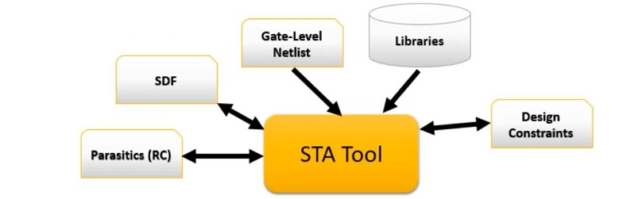

------

### Timing Report

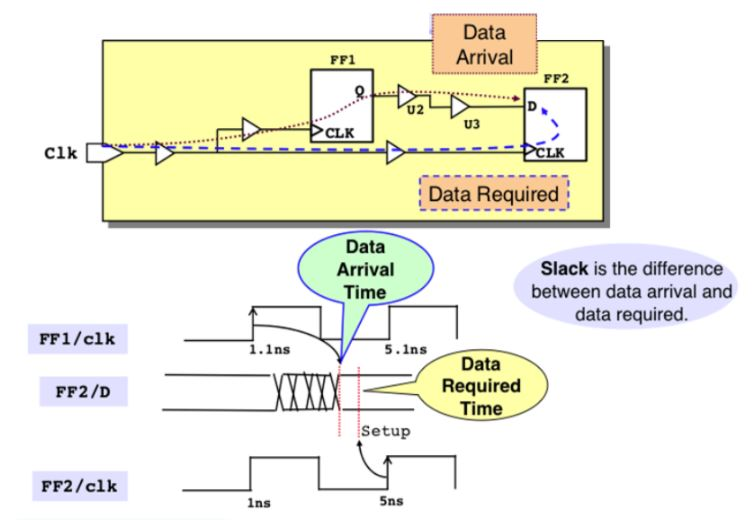

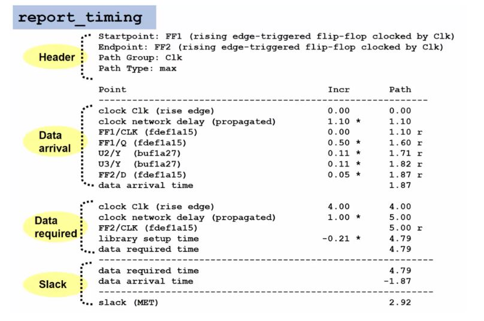

------

The above timing report is divided in 4 parts as

>**Header**
>- it consist of start point(FF1) and end point(FF2)
>- path group which tells for which timing path group it belogs.
>- Path type : here it is max which states setup and if it was min then it is hold.
> 
> **Data Arrival Section**
>- reports the total time taken to arrive at D Pin of Flip flop 2. (ref fig just above timing report)
> 
> **Data Required Section**
> - reports the total time taken to arrive the clock pin of FF1 minus the setup time of FF2. (ref fig just above timing report)
> 
> **Slack**
> timing difference between required and arrival time i.e (RT-AT)

#### Typical symbols which can be seen in PrimeTime report :

- “&” after an incremental delay number shows that the delay number is calculated with Resistor-Capacitor (RC) network back-annotation.

- “\*” for Standard Delay Format (SDF) back-annotation

- “+” for lumped RC

- “H” for hybrid annotation

- “r” in the path column for the rising edge of the signal

- “f” in the path column for the falling edge of the signal

Most timing reports use ns for the time unit. However, you can use the PrimeTime command `report_units` to report all theunits, such as capacitance, resistance, time, and voltage units used by the design.

------

### Clocked Storage Elements

#### Transparent Latch, Level Sensitive

Data passes through Latch when clock high, latched when clock is low
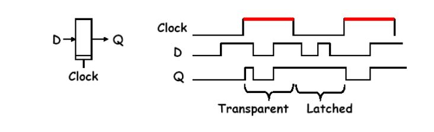

#### D-Type Register or Flip-Flop, Edge-Triggered

Data captured on rising edge of clock, held for rest of the cycle
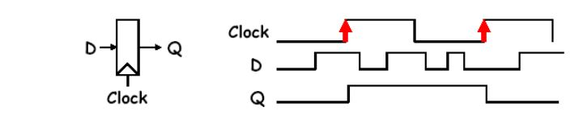

------

### Delays

- **Time** taken by a signal to propagate through a Cell or Net
- **Actual Path Delay** is sum of net and Cell Delays along the timing path
- **Cell Delay** is a function of Input Transition Time (Slew Rate), Total Output Load (Net Cap + Sum of attached pin caps) and Process Parameters (Temperature, Power Level)

**Intrinsic delay**    Internal to the Cell from Input pin to Output pin caused by internal capacitance

**Propagation Delay**  
- Delay by a cell for a change of input signal to result a change at output signal (输入信号变化到输出信号变化的时间) as a function of Input Slew and Output load 
- Propagation Delay can be Low to High (tPLH) and High to Low (tPHL)
- Maximum Propagation Delay (Clock to Q) is considered for Setup check

**Contamination Delay**
- Best case delay from valid input to output
- Minimum Propagation Delay (Clock to Q) which is called Contamination Delay is considered for Hold check

**Net Delay**
Total time for charging/discharging all the parasitic present in the given net

------

### Pins related to Clock Design

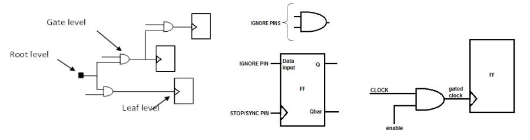
**Start/ Source / Root Pins**
- Source pin of a Clock

**Stop/ Sink/ Leaf Pins**
- All Clock Pins of Flip Flops
- Clock wont propagate after this Pin

**Through pin**
- To make a Clock pin of a flop not a CTS Leaf pin

**Preserved Pin**
- If we need to preserve a pin w.r.t. location etc.

**Exclude/ Ignore Pins**
- All non-clock pins (D pin of Flip Flops or combo logic inputs)
- Not considered for Clock propagation

**Float Pins (Implicit Stop/ Macro Model)**
- Same as Stop/ Sink Pin but internal Clock Latency of it is considered for Clock Tree
- Its actually entry pin of the Hard Macro

**Explicit Sync (Stop) Pin**  显式同步（停止）引脚
- Input of combo logic while considering Clock Tree
- Important while considering Clock Gating

**Explicit Exclude (Ignore) Sync Pin**  显式排除（忽略）同步引脚
- Clock Pin of Flop is not considered as Sync/ Stop pin
- This pin is due to Clock Gating concept
- In clock gating the signal will be given to AND Gate

------

### Timing Arc

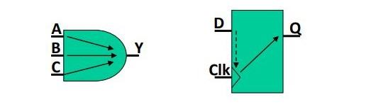

- Timing Arc is internal to the cell
- Combinational Cells has Timing Arcs from each Input to each Output of the cell
- Flip-flops have Timing Arcs from the Clock Input pin to Data Output Q pin (Propagation delay/ Delay Arc) and from Clock Input pin to Data Input D pin (setup, hold checks/ Constraint Arc)
- Latches have 2 timing arcs:
	- Clock pin to Output Q pin, when D is stable
	- Data D pin to Output Q pin when D changes (Latch is transparent)

------

### Timing Unate

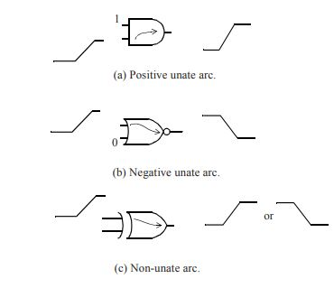
**positive unate** /[ju:'neit] 单边/ if a rising transition on an input causes the output to rise (or not to change) and a falling transition on an input causes the output to fall (or not to change). For example, the timing arcs for *AND* and *OR* type cells are positive unate. See Figure(a)

A **negative unate** timing arc is one where a rising transition on an input causes the output to have a falling transition (or not to change) and a fall ing transition on an input causes the output to have a rising transition (or not to change). For example, the timing arcs for *NAND* and *NOR* type cells are negative unate.See Figure(b)

In a **non-unate timing arc**, the output transition cannot be determined solely from the direction of change of an input but also depends upon the state of the other inputs. For example, the timing arcs in an *XOR cell (exclusive-or)* are non-unate. See Figure(c).

Unateness is important for timing as it specifies how the edges (transitions) can propagate through a cell and how they appear at the output of the cell.

One can take advantage of the non-unateness property of a timing arc, such as when an xor cell is used, to invert the polarity of a clock. See the example below(figure). If input POLCTRL is a logic-0, the clock DDRCLK on output of the cell UXOR0 has the same polarity as the input clock MEMCLK. If POLCTRL is a logic-1, the clock on the output of the cell UXOR0 has the opposite polarity as the input clock MEMCLK.
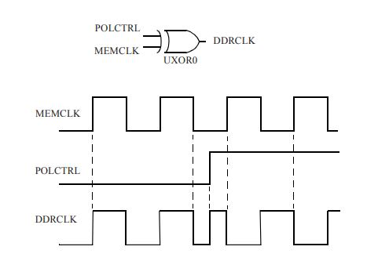

------

### Clock definitions in STA

- Synchronous Clocks
	- 2 clocks are synchronous w.r.t.（ with respect to 的缩写。是 关于；谈及，谈到的意思） each other
	- Timing paths launched by one clock and captured by another
- Asynchronous Clocks
	- 2 clocks are asynchronous w.r.t. each other
	- If no timing relation, STA can’t be applied, so the tool wont check the timing
- Mutually-Exclusive Clocks  **互斥时钟**
	- Only one clock can be active at the circuit at any given time
- Generated Clocks
	- Clock generated from a clock source as a multiple of the source clock frequency
	- The frequency can be a multiple or can be a divided by of the source clock
- Virtual Clocks
	- Exists but not associated with any pin or port of the design
	- Used as a reference in STA to specify Input Delays and Output Loads relative to a clock (Needed to fix the Input2Reg and Reg2Output Violations)
	- By defining Virtual Clock IO Constraints can be defined relative to this Virtual Clock with no specification of the source port or pin

------

### Timing Paths

A Timing Path is a point-to-point path in a design which can propagate data from one flip-flop to another

- Each path has a start point and an end point
- Start point: Input ports or Clock pins of flip-flops
- Endpoints: Output ports or Data input pins of flip-flops

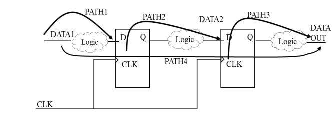

------

### Timing Path Groups

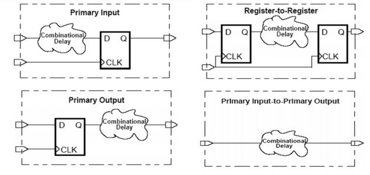

Timing paths are grouped into path groups by the clocks controlling their endpoints

- Input pin/port to Register
	- Delays off-chip + Combinational logic delays up to the first sequential device

- Register to Register
	- Start at a sequential device
	- CLK-to-Q transition delay + the combinational logic delay + external delay requirements

- Register to Output pin/port
	- Delay and timing constraint (Setup and Hold) times between sequential devices for synchronous clocks + source and destination clock propagation times

- Input pin/port to Output pin/ports 
	- Delays off-chip + combinational logic delays + external delay requirements

------

### Clock Latency

- Total time taken by the clock signal to reach the input of the register
	- ***Source latency*** is the time between clock sources to clock definition ports
	- ***Network latency*** is the time between clock definition ports to clock leaf cells in the design

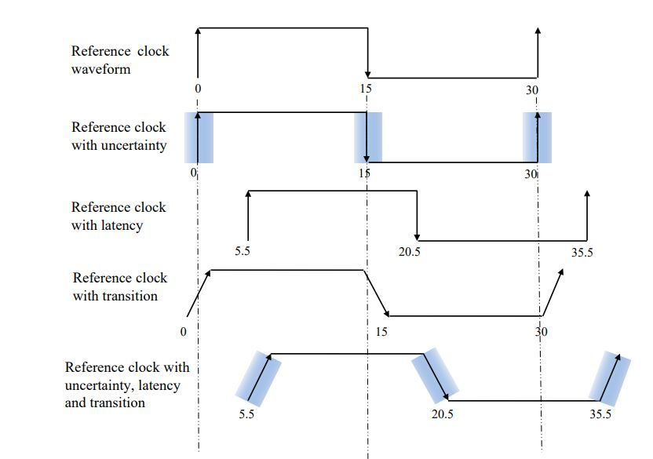
### Insertion Delay (ID)

- ID is the clock latency, but after Clock Tree is synthesized. 
- ID is the physical delay and Clock Latency is the virtual delay
- Latency is a target given to the tool through SDC file or clock tree attribute file and Insertion Delay is the achieved delay value after CTS

------

### Clock Uncertainty

- Clock Uncertainty is the time difference between the arrivals of clock signals at registers in one clock domain or between domains
- Uncertainties include Clock Skew, Clock Jitter and Clock Margin

- **Clock Skew** refers to the absolute time difference in clock signal arrival between two points in the clock network
     $T_{LAUNCH\_CLOCK} - T_{CAPTURE\_CLOCK} = T_{SKEW}$

- **Positive Skew** occurs when the Capture Clock is late w.r.t. Launch Clock
  
- **Negative Skew** occurs when the Capture Clock is early w.r.t. Launch Clock  

- **Local Skew** is the Skew between the clock phase delays of two flip-flops which are the Source and Target flop of a path (Source and Destination flop)本地偏斜是两个触发器的时钟相位延迟之间的偏斜，这两个触发器是路径的源触发器和目标触发器（源触发器和目标触发器）
  
- **Global Skew** is the difference between the longest and shortest branch of a Clock Tree (Maximum Insertion Delay – Minimum Insertion Delay)全局偏差是时钟树的最长和最短分支之间的差异（最大插入延迟 - 最小插入延迟）

------

### Clock Jitter

- Jitter is the short-term variations of a signal with respect to its ideal position in time
- The two major components of Jitter are random Jitter and deterministic Jitter
- Factors causing Jitter includes imperfections in Clock oscillator, supply voltage variations, Temperature variations, Crosstalk

### Glitch

- Unexpected switching of any waveform
- Due to late arrival time of Gate and it is for a short period of time
- Cause extra delay and also it can cause extra power from false transitions

------
### Clock 
#### Pulse Width

- Pulse Width is the time between the active and inactive states of the same signal
- Minimum high pulse width is the amount of time after the rising edge of a clock, that the clock signal of a clocked device must remain stable
- Minimum low pulse width is the amount of time after the falling edge of a clock, that the clock signal of a clocked device must remain stable

#### Duty Cycle

- Percentage of clock period having high pulse
- Typically clock waveforms are of 50% Duty Cycle

#### Transition/ Slew

- Time taken by a signal to change the state (Volts/Second)
- Rise Slew (tR) is called Rise Time and Fall Slew (tF) is called Fall Time
- Minimum/ Maximum Transition is the Minimum/ Maximum slope allowed at leaf pins
- Transition affects Power Dissipation, Latency and Pulse width

### Timing Graph 
#### Asynchronous Path  
- A path from an input port to an asynchronous set or clear pin of a sequential element

#### Critical Path

- The path which creates longest delay
- Also called worst path/ late path/ max. path
- Timing sensitive functional paths no additional gates are allowed to be added to the path

#### Shortest Path

- One that takes the shortest time; this is also called the best path or early path or a min path

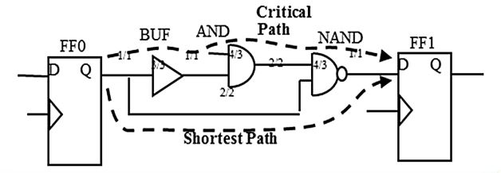

------

#### Clock Gating Path

- Path passed through a “gated element” to achieve additional advantages
- Clock Gating transformation does not change the state of the flops and register

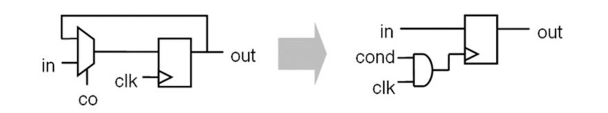

------

#### Launch Path
- Launch path is launch clock path which is responsible for launching the data at launch flip flop

#### Capture Path
- Capture path is capture clock path which is responsible for capturing the data at capture flip flop

#### Arrival Time
- Launch path and data path together constitute arrival time of data at the input of capture flip-flop

#### Required Time
- Capture clock period and its path delay together constitute required time of data at the input of capture register

------

### Common Path Pessimism

- Same Clock Path may be a Launch Path for one Data Path and can be a Capture Path for another Data Path
- While doing OCV derating, same path may get both Min./ Max. delay
- But a path can have either as a Maximum delay or a Minimum delay (or anything in between) but never both delays at the same time
- STA tools will have techniques to remove artificially introduced pessimism between the Launch Clock Path and the Capture Clock Path

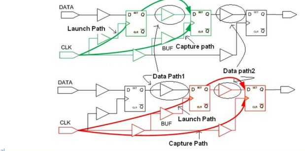

------

#### Slack 松弛

- Difference between Required Time (RT) and Arrival Time (AT)
- Positive Slack at a node implies that the arrival time at that node may be increased without affecting the overall delay of the circuit
- Negative Slack implies that a path is too slow, and the path must speed up if the whole circuit is to work at the desired speed

#### Setup Time

Setup time is the minimum amount of time the data signal should be held steady before the clock event so that the data are reliably sampled by the clock
**TLAUNCH_CLOCK + TCLK-Q_MAX + TCOMB_MAX ≤ TCAPTURE_CLOCK - TSETUP**

#### Hold Time

Hold time is the minimum amount of time the data signal should be held steady after the clock event so that the data are reliably sampled
**TLAUNCH CLOCK + TCLK-Q_MIN + TCOMBO_MIN ≥ TCAPTURE_CLOCK + THOLD**

------

### Setup Time and Hold Time Violations

- If Setup time, TSETUP for a flip-flop and if the data is not stable before TSETUP from the active edge of clock, then there is a Setup Violation at that flip-flop
- If hold time, THOLD for a flip flop and if the data is not stable after THOLD time from the active edge of clock, then there is a hold violation at that flip-flop
- For a single cycle circuit the signal has to propagate through Data path in one clock cycle

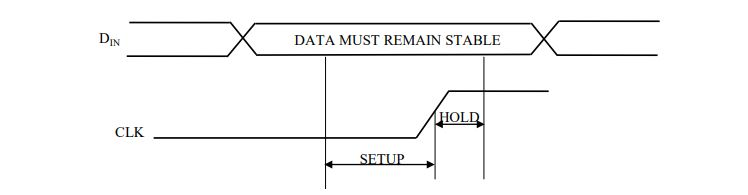

------

### Recovery Time

- Recovery time is the minimum time that an asynchronous control input pin must be stable after being de-asserted and before the next clock transition (active edge)

### Removal Time

- Removal time is the minimum time that an asynchronous control input pin must be stable before being de-asserted and before the previous clock transition (active edge)

### Recovery Time and Removal Time Violations

- This check is to ensure that the asynchronously signal rise/ fall edge is not occurring at the clock edge; it should be some time before or after the clock edge
- If that violates, then Recovery Time and Removal Time Violations
- Although a flip-flop is asynchronously SET or CLEAR, the negation from its RESET state is synchronous

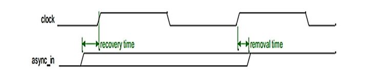

------

### Single Cycle Path

- Timing path that is designed to take only one clock cycle for the data to propagate from the start point to the endpoint
- Start point and endpoint are flops clocked by the same clock
- By default tool will consider all timing paths as single cycle paths

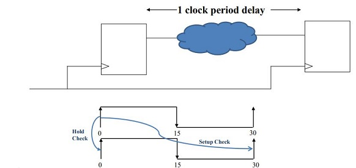

------

### Multi-Cycle Path

- Timing path that is designed to take more than one clock cycle for the data to propagate from the start point to the endpoint
- Start point and endpoint are flops clocked by the same clock
- Need to specify the Launch edge and Capturing edge in SDC

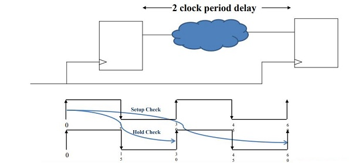

------

### Half Cycle Path

- Timing path that is designed to take half clock cycle (both of the clock edges) for the data to propagate from the start point to the endpoint
- Start point and endpoint are flops clocked by the same clock
- No need to specify the Launch edge and Capturing edge in SDC, since the tool can identify it from the netlist

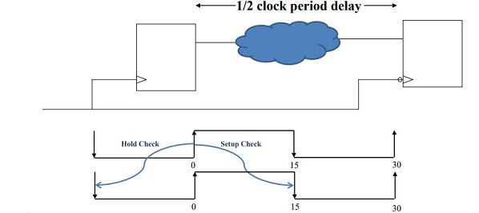

------

### False Path

- Physically exist in the design but are Logically/ Functionally inactive/incorrect path
- Means no data is transferred from Start Point to End Point
- The goal in STA is to do timing analysis on all “true” timing paths, so these paths are excluded from timing analysis
- Similarly timing can be disable for a pin or port or cell where the delay will be computed but won’t report it

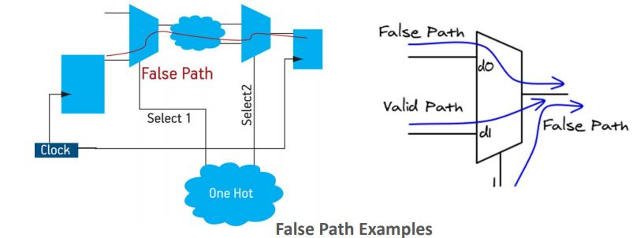

------

### Clock Domain Crossing (CDC)

- For designs with Asynchronous Clock Domains, the CDC signal violates the Setup/ Hold window of the receiving clock, resulting in metastability
- Metastability results in unpredicted values and unpredictable delays
- Those clocks has to be balanced together else, due to difference in the latency that may lead to timing violations
- Max. Delay Constraint is used to make CDC paths to get synchronized

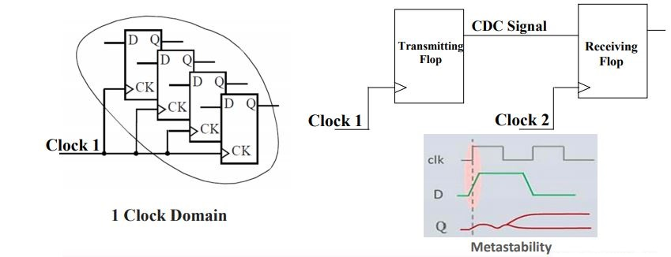

------

### Clock Domain Synchronization Scheme

- Pulse Width check
  - The control signals is stable for longer than one receive clock period
  - Ensures that data will not be lost due to inadequate width of the control signal
- Data Stability check
  - The data updated by the transmit domain cannot be captured by the immediately following receive clock edge
  - Ensures that the captured data will not be metastable in the receive domain

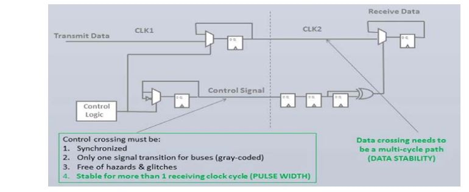

------

### Bottleneck Analysis

- Lists the cells causing the timing violations on multiple paths
- By identifying and fixing the violation caused by a Bottleneck Cell improved timing can be achieved

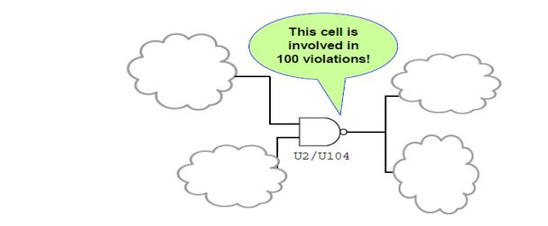

------

### Multi-VT Cells

- Different threshold voltages are achieved by implanting dopants in different concentration
- Need Multi-VT Library
- Sub-threshold leakage varies exponentially with VT compared to the weaker dependency of delay over VT
- If the optimization target is power performance, first use the HVT cells library and then try LVT cells
- If the optimization target is to meet timing then first use LVT cells and then HVT cells
- If you swap the capture flop from SVT to LVT or HVT, there will be very minimal setup/hold impact in most flops, it is of zero impact for hold
- If you swap the launch flop from SVT to LVT or HVT, Setup will be improve and hold will be impacted correspondingly

#### High Voltage Threshold (HVT )

- Use in non-timing critical paths
- Use in power critical paths
- Has low leakage and low speed

#### Low Voltage Threshold (LVT )

- Use in timing critical paths
- Use in non-power critical paths
- Has high leakage and high speed

#### Standard Voltage Threshold/ Regular Voltage Threshold (SVT/ RVT)

- Medium delay and medium power requirement

------

### Time Borrowing

- Time Borrowing is basically for Latched based Timing Analysis
- Edge-triggered flip-flops change states at the clock edges, whereas latches change states as long as the clock pin is enabled
- In latch based design longer combinational path can be compensated by shorter path delays in the subsequent logic stages
- The technique of Borrowing Time from the shorter paths of the subsequent logic stages to the longer path is called Time Borrowing or Cycle Stealing
  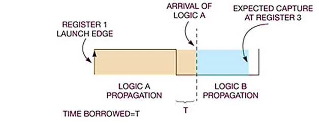
- Time Borrowing typically only affects setup slack calculation since time borrowing slows data arrival times
- When the clocks of the Launching and Capturing Latches are out of phase, time borrowing is not to happen
- Timing borrowing can be multistage
- Maximum Borrow Time: Clock Pulse Width minus the library Setup Time of the Latch
- Negative Borrow Time: Arrival Time minus the clock edge is a negative number, the amount of time borrowing is negative (no borrowing)

#### Time Borrowing: Scenarios

- Scenario 1: When data is launching from a positive edge triggered flip flop and capture is to a negative level sensitive latch
- Scenario 2: When launch is from a negative level sensitive latch and capture is to a positive edge triggered flip flop
- Scenario 3: When launch and capture are from positive level sensitive latches

------

### Types of Static Timing Analysis

- Path Based STA (PBA)
	- First, extract all possible topological paths
	- Next, for each path calculate it’s delay and compare it with endpoint (required) value
	- Calculate the Arrival Time (AT) by adding cell delay in timing paths
	- Check all path delays to see if the given Required Arrival Time (RAT) is met
- Graph Based STA (GBA)
	- Two types of timing data :
	- Arrival times, AT (propagated forward from inputs)
	- Required Arrival Times RAT (propagated from outputs)
	- Slack is calculated on every design element: Slack = RT – AT

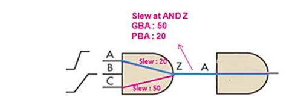

------

#### Difference between Path Based STA(PBA) and Graphh Based STA(GBA)

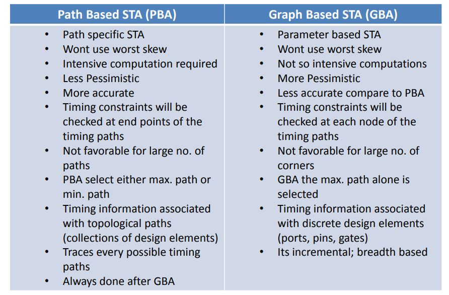

------

#### Block-based STA vs. Path-based STA (example)

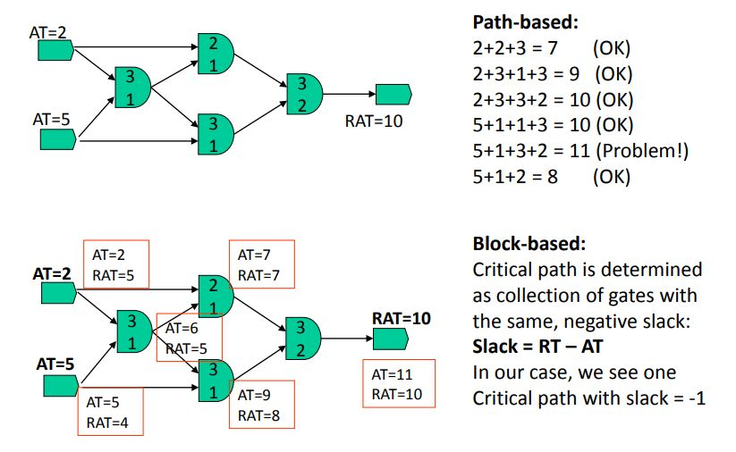