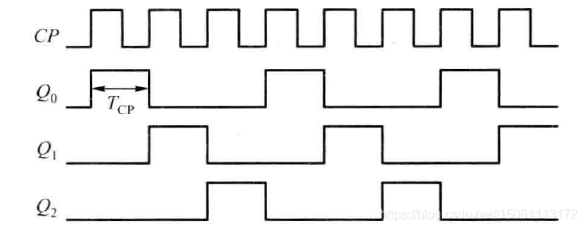

# 时序分析与约束——目的与作用

## **为什么要进行时序分析**？

首先请大家思考一个问题，假如用Verilog写了一个十分简单的计数器，就是**每一个时钟上升沿加一**的那种，那么这个计数器稳定运行的**最快频率**是多少？

`100M？1G？10G？`

其实从代码上看，可以达到**无限快**的频率，不管多快，不就是自增嘛，都是一样的道理。可是现实情况好像**不太对**。这就好比，别人拍一下手，你在纸上画条线。如果2秒拍一下，那你肯定谈笑风生。问题是，假如有人能一秒拍100次手呢？你笑的出来嘛。为啥？因为毕竟你画线**需要一个时间**，从人眼看到，再到大脑反应，手执行都要时间。假如别人拍手的时间间隔小于画线间隔，那肯定画不准。

同样的，对于上面说的FPGA程序，计数器自增也要一个**最短时间**。FPGA中**信号的传输**，**触发器动作**等等都要时间。

**时钟间隔**一旦大于**最短时间**，肯定乱套。

**时序分析**其实就是对这些时间之间的关系进行分析，得出一个报告，让开发者明白，哪些地方出了问题，从而进行修改。另外，时序分析是在**布局布线**之后，针对某一确定的器件、器件中确定的位置以及器件内资源之间的特定连线而分析的。

## 时序约束

所谓的时序约束，通俗的说，就是一些我们知道但是编译器不知道的**时序信息**。

这些信息有两个作用：

- 指导时序分析器进行时序分析
- 指导编译器进行更好的**综合、布局与布线**。

对于第一个作用，举个小例子说明一下。假如希望时序分析器帮我们分析一下，当系统主频是50MHz时可以稳定工作嘛。可是问题是时序分析器怎么知道我们希望的主频是50MHz啊？就算变量名叫clk50M人家也不知道啊。因此我们得告诉它，输入时钟是50M！这就是一条时序约束。有了这个，时序分析器才会在50MHz的条件下进行计算。

多说一句，Quartus II中的时序分析器TimeQuest默认的时钟频率可是1GHz。

- 下面举一个小例子说明时序信息是怎么**影响综合**的。

假如我们想用4个输入a、b、c、d进行“与”操作，那么可以这样实现：

但是假如d到达时间较晚(**注意！这其实就是一条时序约束信息！**)，那么最终输出不仅需要**等待d的到来**，还要**等待d穿过两个与门**。

所以我们可以换一种实现方法：

这样，d只需要穿过一个与门即可，较上一种实现方法，减小了输出延时。也就是说，时序约束信息可以对HDL代码综合时进行优化。

- 时序约束还会影响到布局布线的过程。

在之前的文章[FPGA的实现过程](https://zhuanlan.zhihu.com/p/130916138)中，我们提到，**布局**是将LUT级网表合理地放到FPGA中，而布线是将这些网表中的器件连接起来。所以**布局布线**非常像已经画好了**电路原理图**，然后再画**PCB板**的过程。虽然电路原理图是实现电路功能时最重要的部分，但是PCB板的布局也非常重要。特别是在一些高速PCB中，布板时要极为注意电路板的**电磁兼容**、**信号完整性**等问题。

当然了，我们**不太可能**像画PCB板一样对每条线路手动连线，这个过程是交给Quartus II这样的编译器来完成的。但是我们至少可以对这个布局布线的过程做一些干预，或者说施加一些**约束**，告诉编译器一些我们想**要达到的目标**或者一些我们**已经知道的参数**，比如希望某个时钟信号运行到多高的频率、某个信号有多大的延迟等等。这样在具体布局布线的时候，Quartus II就会以我们提出的时序要求为**目标**，进行优化设计。

在实际操作中，时序分析与时序约束相辅相成。比如我们通常会先对设计输入时序约束，然后布局布线之后进行时序分析，假如分析得到的结果不满足要求，就要**再**进行时序约束，甚至修改代码，然后再分析，不断**迭代**，直到得到一个理想的结果。

最后总结一下时序分析与约束的作用：

**时序分析**:检验生成的电路是否满足时序要求

**时序约束**:提供设计的要求与约束，为时序分析提供依据，对综合、布局与布线进行优化

------

# 1.时序逻辑电路的基本结构与分类

## 1.1时序电路的基本结构

时序电路的基本结构如下图所示，它由完成逻辑运算的组合电路和起记忆作用的存储电路两部分构成，其中，存储电路由触发器或锁存器组成。为了方便，图中各组逻辑变量均已向量形式表示，其中，$\ I=(I_{1},I_{2},...,I_{i})$  ! 为**输入信号**，$\ O=(O_{1},O_{2},...,O_{j})$为**输出信号**，$\  E=(E_{1},E_{2},...,E_{k})$为驱动存储电路转换为下一状态的**激励信号**，而!$\  S=(S_{1},S_{2},...,S_{m})$为存储电路状态，称为**状态信号**，亦称为**状态变量**，它表示时序电路当时的状态，称为**现态**。状态变量[S] 被反馈到组合电路的输入端，与输入信号 [I] 一起决定时序电路的输出信号 [O] ，并产生对存储电路的激励信号 [E] ，从而确定电路的下一状态，即**次态**。

上述四组变量间的逻辑关系可用下列三个向量函数形式的方程来表达：$E=f(I,S)$，$S^{n+1}=g(E,S^{n})$，$O=h(I,S)$ 。其中，$E=f(I,S)$表达了激励信号与输入信号，状态变量的关系，称为时序电路的**激励方程**。$S^{n+1}=g(E,S^{n})$表达了存储电路从现态到次态的转换，故称为状态转换方程，简称**转换方程**，$S^{n}$和$S^{n+1}$分别表示存储电路的现态和次态。$O=h(I,S)$表达了时序电路的输出信号与输入信号、状态变量的关系，称为**输出方程**。

如上所述，**时序电路是状态依赖**的，故而又称为**状态机**（State Machine，SM）。**有限数量的存储单元**构成的状态机的**状态数是有限的**，称为**有限状态机**（Finite State Machine，FSM）。

根据上述时序电路的结构和方程可见，时序电路具有以下特征：

（1）时序电路由组合电路和存储电路构成；

（2）时序电路的状态与时间因素相关，即**时序电路在任一时刻的状态变量不仅是输入信号的函数，而且还是电路以前状态的函数**，**并由当前输入变量和状态决定电路的下一状态**（因此，不同于组合电路，时序电路无法依据输入输出方程直接还原到原始电路）；

（3）时序电路的输出信号由输入信号和电路状态共同决定。

## 1.2异步与同步时序电路

存储电路中根据存储单元改变的特点，可以将时序电路分为同步时序电路和异步时序电路两大类，在**同步时序电路**中，**所有存储单元的\**状态改变\**是在统一的时钟脉冲控制下同时发生的**。在**异步时序电路中**，**各存储单元的\**状态改变\**不是同时发生的**，时钟脉冲只控制存储电路中的部分存储单元，其他则靠输入信号或时序电路内部信号来控制，甚至还有些异步时序电路（例如SR锁存器）没有时钟脉冲，只靠输入信号经过内部电路传递去控制存储单元。而根据电路是对脉冲边沿敏感还是电平敏感，异步时序电路又分为**脉冲异步时序电路**（由触发器构成）和**电平异步时序电路**（由锁存器构成）两种。

**异步时序电路**的**状态转换取决于以任意时间间隔变化的输入信号序列**，若有多个信号输入，其存储电路的状态转换因存在时间差异而可能造成短时间输出状态的不稳定，而且这种不稳定的状态有时是不容易判定的，常常给电路设计和调试带来困难。

不同于异步时序电路，**同步时序电路**中**存储电路状态的转换是在同一时钟脉冲源的同一边沿作用下同步进行的**，它也称作**时钟同步状态机**（Clocked Synchronous SM），结构如下图所示：

同步时序电路的存储电路一般用触发器实现，所有触发器的时钟输入都应该接在同一个时钟脉冲源上，而且它们的时钟脉冲触发沿也都应一致。因此，**所有触发器的状态更新是在同一时刻**，**其输出状态变换的时间差异很小**。 **在时钟脉冲两次作用的间隔期间**，从**触发器输入到状态输出的通路被切断**，即使此时输入信号发生变化，也**不会改变个触发器的输出状态**，所以较少发生因状态转换不同步而引起的输出状态不稳定的现象。**更重要的是，同步时序电路的状态很容易用固定周期的时钟脉冲沿清楚地分离为序列步进**。其中，每一个步进都可以通过输入信号和所有触发器的现态单独进行分析，从而有一套较系统、易掌握的分析与设计方法，电路行为也很容易用HDL来描述。所以，**目前结构较复杂、运行速度较高的时序电路广泛采用同步方法来实现**。很多大规模可编程逻辑器件的应用电路和专用集成电路的设计，也都采用同步时序电路的结构。

**结论**：异步设计的毛刺无法避免，时序设计过于费时费力，其所需调整的时序路径和需要附加的相关约束相当繁琐，现在的EDA 工具都是基于时序驱动的优化策略，异步时序电路增加了时序分析的难度，需要确定最佳时序路径所需的计算量超出想像。而同步设计不仅能有效地避免毛刺的影响，使得设计更可靠；还能够使设计出的同步时序电路更易于分析及实现；不仅仅如此，目前几乎所有的仿真工具都仅能支持同步仿真，所以在FPGA设计中极力推荐使用同步设计方法，除非在某些特殊的场合。

在进入时序电路的分析前，先解释一下穆尔和米利的概念，在时序电路中，可以根据输出信号的特点，将其分为穆尔（Moore）型和米利（Mealy）型时序电路。在**穆尔型时序电路**中，**输出信号仅仅取决于存储电路的状态**；在**米利型时序电路**中，**输出信号不仅取决于存储电路的状态，而且还取决于外部输入信号**。

## 1.3米利型和穆尔型时序电路

**米利型时序电路**的结构如下图所示，实际上是**将**时序逻辑的基本结构图（见1.1）中的**组合电路查拆解**成**激励组合电路和输出组合电路**两部分。米利型时序电路的输出信号$O$是状态变量$S$和输入信号$I$二者的函数，即$O=h(I,S)$。这种**时序电路在时钟脉冲的两个触发沿之间**，**输出信号随时可能受到非时钟同步的输入信号作用而发生变化**，从而**影响电路输出的同步性**。

 **穆尔型时序电路**是米利型时序电路的一种特例，它的输出信号$O$仅仅是状态变量$S$的函数，即$O=h(S)$，结构如下图所示。穆尔型时序电路的**输出仅取决于时钟同步的个触发器的状态**，**在时钟脉冲沿触发的间隔期间**，**不受非同步的输入信号影响**。实际上，米利型时序电路中有时也有一个或多个输出可能是穆尔型的，即它们的输出只取决于触发器的状态。

**在现代高速时序电路设计中， 一般尽量采用穆尔型时序电路结构，以利于后续高速电路的同步**。在米利型时序电路的输出端增加一级存储电路，构成“流水线输出”形式，是将其转化为穆尔型电路的最简单的方法，电路结构入下图所示。需要注意的是，**流水线存储电路将输出信号延迟一个时钟周期**。虽然**流水线输出电路增加了一些逻辑元件**，**但它的输出信号同步特性更好**，**具有更好的稳定性和抗干扰性能**。在大规模集成电路技术成熟的今天， 节省逻辑元件的数量经常不再是逻辑电路设计追求的唯一目标，电路工作的稳定性和可靠性，以及工作速度的提高才是更重要的追求。

# 2.时序逻辑电路功能的表达

时序电路的功能可用**逻辑方程组**、**转换表**、**状态图**和**时序图**等形式来表达，也可以用**HDL语言**描述。理论上讲，有了**激励方程组、转换方程和输出方程组**，时序电路的功能就被唯一地确定了。但是，对于许多时序电路而言，仅从这三组方程还不易判断其逻辑功能，**在设计时序电路时，也往往很难根据所给出的逻辑需求直接写出这三组方程（**就像知道人的寿命是各个因素的函数，但是由于变量过于复杂， 并且变量之间又有很复杂的关系，所以没法直接写出函数**）**。因此，还需要用能够**直观反应电路状态变化序列全过程**的**转换表**、**状态表和状态图**来帮助。三组方程、转换表、状态表和状态图之间可以实现相互转换，根据其中任意一种表达方式，都可以画出时序图。

以下图中的同步时序电路为例，它**由组合电路和存储电路两大部分组成**。其中，存储部分由两个$D$ 触发器$FF_{1}$、$FF_{0}$构成，两者共用一个时钟信号$CP$，从而构成一个同步时序电路。

组合电路又分为激励电路和输出电路两部分。电路的输入信号为$A$，输出信号为$X$、$Y$。对触发器$FF_{1}$和$FF_{0}$的激励信号分别为$D_{1}$和$D_{0}$，$Q_{1}$和$Q_{0}$为电路的状态变量。从图中可以看出，输出信号为$Y$是状态变量$Q_{1}$和$Q_{0}$和输入信号$A$的函数，所以从总体上看，是一个米利型时序电路；但是，输出信号$X$纯粹由状态变量$Q_{1}$和$Q_{0}$决定，电路中又存在一个穆尔型输出$X$。

## 2.1逻辑方程组

（1）**激励方程组**

根据上述组合电路，写出对两个$D$触发器的激励方程组$D_{0}=(Q_{1}+Q_{0})\cdot A$，$D_{0}=\overline{Q_{0}}\cdot A$。

（2）**转换方程组**

将上述两个$D$触发器的激励方程组分别带入$D$触发器的**特性方程**$Q^{n+1}=D$，于是，得到转换方程组，$Q_{0}^{n+1}=(Q_{1}^{n}+Q_{0}^{n})\cdot A$，$Q_{1}^{n+1}=\overline{Q_{0}^{n}}\cdot A $。以上两式表明，触发器的次态$Q_{0}^{n+1}$和$Q_{1}^{n+1} $是输入变量$A$和触发器现态$Q_{0}^{n}$和$Q_{1}^{n}$的函数。

（3）**输出方程组**

由逻辑图中两个输出变量和，根据输出组合电路得到输出方程组$X=\overline{Q_{1}}\cdot Q_0$，$Y=(Q_1+Q_0)\cdot \overline{A}$。显然，是穆尔型输出，是米利型输出。

上述三组方程中，**激励方程组和输出方程组表达了时序电路中全部组合电路的特性**，而**转换方程组则表达了存储电路从现态到次态的状态转换特性**。转换方程两边的状态变量，分别以上标$n$表示现态，以上标$ n+1 $表示次态，以区别这种不同的状态。

## 2.2转换表

根据逻辑方程组中的转换方程组和输出方程组列出真值表，如下表所示。真值表的输入变量为$Q_{1}^{n}$、$Q_{0}^{n}$和$A$，输出变量为$Q_{1}^{n+1}$、$Q_{0}^{n+1}$和$X$、$Y$。由于该真值表反应了触发器从现态到次态的转换，故称为**状态转换真值表**。一般来说，有$m$位状态变量和$i$位输入信号，就存在$2^{m+i}$种状态-输出组合，真值表就有$2^{m+i}$行。

在分析和设计时序电路时，更常用的是**转换表，**如下表所示。它与上面的真值表完全等效，但**形式更紧凑明了**。下表**用矩阵形式表达出在不同现态和输入条件下，电路的状态转换和输出逻辑值**。表中，输出信号$X$是穆尔型输出，故将其与现态$Q_{1}^{n}$  $Q_{0}^{n}$对应的逻辑值单列一栏；输出信号$Y$的逻辑值不仅取决于$Q_{1}^{n}$和$Q_{0}^{n}$，而且还会跟随$A$变化，所以表示在$A=0$和$A=1$两栏的斜线后面。需要注意的是，虽然它与斜线前的次态$Q_{1}^{n+1}$  $ Q_{0}^{n+1}$列在一起，但仍是现态和输入的函数。

**注**：穆尔型输出由于不受输入的影响，仅受现态影响，因此将其单独写在一列。

## 2.3状态表

转换表以各触发器逻辑值的编码表示时序电路的状态。在分析一个电路时，**给每个编码状态分别赋予一个具体名称有时便于与实际问题结合进行分析与记忆**；**时序电路设计过程中，在尚未进行状态分配前，也\**必须首先给各个状态命名\**，以表达状态之间的转换关系**。简单地给本例中地四个状态分别命名为$00=a$，$01=b$，$10=c$，$11=d$。当然，也可以用意义更明显的中、英文单词或数字对状态命名。将2.2中的转换表中$Q_{1}Q_{0}$的状态用状态名替代，得到状态表如下表（表中，$S^{n}$表示现态，$S^{n+1}$表示次态，斜线后的逻辑值为输出变量$Y$的值）。

相比于转换表，使用状态表更容易理解时序电路的行为和结果。如果状态明明合理，即使较复杂的时序电路，直接**通过状态名就可以得到各状态的实际意义和转换关系**（以投币机为例，用“已投币0元”代表状态00，用“已投币1元”代表状态01，用“已投币2元”代表状态10，用“已投币3元”代表状态11。这里仅为示意，**对状态命名可以更加清晰地明白各个状态转换之间的逻辑关系**）。但是，状态表中的状态变量没有标明编码，与时序电路的3个逻辑方程组及实际电路图难以联系，这方面的信息少于转换表。转换表和状态表虽然形式和内容相似，然而在应用上是有差别的。

## 2.4状态图

将2.3中的状态表转换为如下图所示的**状态图**（**逐行按状态和转换条件填入**），可以更直观地表示出**时序电路运行中的全部状态**、**各状态间相互转换的关系以及转换的条件与结果**。图中，每一个圆圈都对应着一个状态，圆圈中标出表状态名；每一个带箭头的方向线都表示一个转换，箭头指示出状态转换的方向。当方向线的起点和中终点都在同一个圆圈上时，则表示状态不变。引起该状态转换的输入变量逻辑值在方向线旁斜线左侧，如图中值。米利型输出变量的逻辑值标在方向线旁斜线右侧，是本次状态转换前的逻辑值，如图中值，它由方向线起点的状态和斜线前的输入变量共同决定。而穆尔型输出变量的逻辑值则标在圆圈内的状态名后，因为状态一旦确定，其输出值随之确定，如图中值。当设计时序电路时，首先需要画出这种形式的状态图，以**明确状态的数目、状态转换的方向以及状态转换的条件和相应的输出信号**。

状态图也可以与状态表相对应，如下表所示，圆圈中以二进制编码表示状态，在分析时序电路时可先得到这种形式的状态图，然后再进一步研究其功能。

需要强调的是，上述两图中**状态转换的方向，取决于电路中下一个时钟脉冲触发沿到来前瞬间的输入信号**。 如果在此之前输入信号发生改变，则状态转换的方向也会立即改变。如上图中，当处于状态$c$时，如果输入$A$保持为1，则输出$Y$为0，下一状态将转换为$d$；若在下一个时钟脉冲触发沿到来前，$A$由1变化为0，则$Y$立即变化为1，则下一状态将转换为$a$。

注：**绘制状态图时需要注意不能露画方向线**（原则上，以某一状态七点的方向线数量应为$2^{i}$，$i$为电路输入变量的数目，即输入变量的每一种组合应当对应1根方向线）。

## 2.5时序图

与组合电路一样，**波形图能直观地表达时序电路中各信号在时间上的对应关系**，通常把时序电路的状态、输出对输入信号（包括时钟信号）响应的波形图称为**时序图**。它不仅便于电路调试时检查逻辑功能、排查故障或差错，而且在运用HDL设计电路时可用于电路的仿真。从逻辑方程组、转换表或状态图都可以导出时序图。时序图如下图所示（假设$Q_{1}Q_{0}$初态为00）：

使用时序图时需要注意的是，**时序图有时并不完全表达出电路状态转换的全部过程，而是根据需要仅画出部分典型的波形图**。如上图就没有表达出当状态$Q_{1}Q_{0}$为11时而输出$A$为0时的状态转换波形和输出波形。

# 3.同步时序电路的分析

同步时序电路的分析实际上是一个读图、试图的过程：按照给定的时序电路，通过分析其状态和输出信号在输入信号和时钟作用下的转换规律，理解其逻辑功能和工作特性。

## 3.1分析同步时序逻辑电路的一般步骤

1.根据给定的同步时序电路**导出下列逻辑方程组；**

（1）对每个触发器导出激励方程，组成**激励方程组**；

（2）将各触发器的激励方程代入相应触发器的特性方程，得到各触发器的转换方程，组成**转换方程组**；

（3）对应每个输出变量导出输出方程，组成**输出方程组**。

2.根据转换方程组和输出方程组，**列出电路的转换表或状态表，画出状态图和时序图；**

3.确定电路的逻辑功能，必要的话，可用文字详细描述。

## 3.2同步时序逻辑电路分析实例

### 3.2.1穆尔型电路示例

分析下图所示同步时序电路的逻辑功能。

解：观察上述电路图可以发现，该同步时序电路没有输入信号，输出为三个触发器的状态，是穆尔型时序电路。

1.根据电路列出逻辑方程组

（1）激励方程组：$D_{0}=\overline{Q_{0}}\cdot \overline{Q_{1}}$，$D_{1}=Q_{0}$，$D_{2}=Q_{1}$；

（2）转换方程组（由于使用$D$触发器，其特性方程为$Q^{n+1}=D$：$Q_{0}^{n+1}=D_0=\overline{Q_{1}^{n}}\cdot \overline{Q_{0}^{n}}$，$Q_{1}^{n+1}=D_1=Q_{0}^{n}$，$Q_{2}^{n+1}=D_2=Q_{1}^{n}$；

（3）输出方程组：$Z_{0}=Q_0$，$Z_{1}=Q_1$，$Z_{2}=Q_2$。

2.列出转换表

由于该电路的输出$Z_2$，$Z_1$，$Z_0$就是各触发器的状态，所以转换表中可不再单列输出蓝，并且电路中没有输入信号，转换表如下所示：

3.画出状态图

根据跟换标画出点的状态图如下图所示：

 由图可见，**001、010、100三个状态形成闭合回路**，电路正常工作时，其状态总是按照回路中的箭头方向变化。这三个状态构成了有效序列，称它们为**有效状态**，其余的五个状态则称为**无效状态**。从状态图还可以看出，无论电路的初始状态如何，经过若干个$CP$脉冲之后，总能进入有效状态。若**电路能从无效状态经一定过程自动进入有效状态**，则称其为**自校正能力**。因此，该电路是具有自校正能力的同步时序电路。

4.画出时序图

设电路的初始状态为$Q_{2}Q_{1}Q_{0}=000$，根据转换表或状态图，可画出时序图如下所示：

5.逻辑功能分析

仅从转换表不太容易观察到该电路的逻辑功能，而由状态图可见，电路的有效状态是三位循环码。从时序图可以看出，电路正常工作时，各触发器的$Q$端轮流出现一个脉冲信号，其宽度为一个$CP$周期，即1$T_{cp}$，循环周期为3$T_{cp}$，这个动作可以看作是在$CP$脉冲作用下，电路把宽度为1$T_{cp}$的脉冲一次分配给$Q_{0}$、$Q_{1}$、$Q_{2}$各端，因此，电路的功能为**脉冲分配器**或**节拍脉冲产生器**。

### 3.2.2米利型电路示例

分析下图所示同步时序电路的逻辑功能。

 解：1.根据电路列出逻辑方程组

（1）激励方程组：$D_{1}=X\oplus Q_{1}\oplus Q_{0}$，$D_{0}=\overline{Q_{0}}$；

（2）转换方程组（由于使用$D$触发器，其特性方程为$Q^{n+1}=D$）：$Q_{1}^{n+1}=D_1=X\oplus Q_{1}^{n}\oplus Q_{0}^{n}$，$Q_{0}^{n+1}=D_0=\overline{Q_{0}^{n}}$；

（3）输出方程组：$Z=X\cdot \overline{Q_{1}^{n}}\cdot \overline{Q_{0}^{n}}+\overline{X}\cdot Q_{1}^{n}\cdot Q_{0}^{n}$。

2.列出转换表

 3.画出状态图

 4.逻辑功能分析

通过状态图可以看出，当外部输入等于0 时，状态转移按00→01→10→11→00 循环变化，因此可以实现模4加法计数器功能。当外部输入等于1时，状态转移按00→11→10→01→00 循环变化，因此可以实现模4减法计数器功能。因此，该电路是一个同步模4可逆计数器。

# 4.同步时序逻辑电路的设计

**时序电路设计**又称为**时序电路综合**，其任务是根据给定的逻辑功能需求，选择适当的逻辑器件，设计出符合要求的时序电路。用触发器及门电路设计同步时序电路是时序电路设计的基础，也是用Verilog HDL对时序电路进行描述及使用可编程逻辑器件设计时序电路的基础。

## 4.1设计同步时序逻辑电路的一般步骤

设计同步时序逻辑电路的一般步骤如下图所示：

### 4.1.1由给定的逻辑功能建立原始状态图和原始状态表

通常，所要设计的时序电路的逻辑功能是通过文字、波形或波形图来描述的，首先必须把它们**变换成规范的状态图和状态表**。这种直接从图文描述得到的状态图和状态表分别称为**原始状态图**和**原始状态表**。这个过程是对实际问题进行分析的过程，具体步骤如下：

（1）**明确电路的输入条件和输出条件**，分别确定输入变量和输出变量的数目和名称。同步时序电路的**时钟脉冲**$CP$（或$\overline{CP}$）一**般不作为输入变量考虑**；

（2）找出所有可能的状态以及状态转换之间的关系和输入条件。不同的状态以字符来命名。可以**假定一个初始状态**，***\*以该状态为现态\****，根绝输入条件确定输出及次态。以此类推，知道把每一个状态的输出和下一个可能转换的状态全部找出后，则建立起原始状态图；

（3）根据原始状态图建立原始状态表

由于所有的设计步骤都将在原始状态图或原始状态表的基础上后进行，只有在它们全面、正确反应给定设计要求的条件下，才有可能获得成功的设计结果。

### 4.1.2状态化简

原始状态图或原始状态表很有可能隐含多余的状态，去除多余状态的过程称为状态化简，其目的是减少电路中触发器及门电路的数量，但不能改变原始状态图或原始状态表所表达的全部逻辑功能。**状态化简建立在等价的基础上**：如果两个状态分别作为现态，其任何相同输入所建立的次态及产生的输出均完全相同，则这两个状态称为等价状态。凡是**两个等价状态都可以合并成一个状态而不改变输入-输出关系**。

### 4.1.3状态分配

对每个状态指定一个特定的二进制代码，称为**状态分配**或**状态编码**。编码方案不同，设计出的电路结构也就不同。编码方案选择得当，设计出的电路可能工作更可靠，也可能结构相对简单。

首选，要确定状态编码的位数。同步时序电路的状态取决于触发器的状态组合，触发器的个数$N$即状态编码的位数。$N$与所要求的状态数$M$需满足如下关系:$M\leq 2^{N}$。

其次，要对每个状态确定编码。从$2^{N}$各状态中取$M$各状态组合可能存在多种不同方案，随着$N$值得增大，编码方案得数目会急剧增加（从$N$位编码中取$M$个状态，其可能的状态分配方案数目为$S=\frac{2^N!}{(2^N-M)!}$。例如，$N=3$，$M=3$，其可能的编码方案总数达6720之多），面对大量得编码方案是难以一一进行仔细比较的。一般来说，**遵循状态变化的顺序**，以二进制数自然递增顺序编码可化简电路。而使用具有一定特征的编码，如**格雷码**，则**有利于降低输出信号产生竞争-冒险的可能性**。

状态分配完成，则可将状态表中的状态名替换为状态编码，得到转换表。

### 4.1.4选择触发器类型

触发器类型选择的余地实际上是非常小的。小规模集成电路的触发器产品，大多是触发器和$JK$触发器，选择具有较强逻辑的触发器，有时可化简激励电路。如前所述，很多可编程器件中采用触发器来实现时序电路设计，如有特殊要求，用触发器也非常容易构成其他逻辑功能的触发器。

### 4.1.5确定激励方程组和输出方程组

根据转换表，用卡诺图或其他方式对逻辑函数进行化简，可求得电路的激励方程组和输出方程组。这两个方程组决定了同步时序电路的组合电路部分。

### 4.1.6画出逻辑图，并检查自校正能力

按照前一步导出的激励方程组和输出方程组，可画出接近工程实现的逻辑电路图。

有些同步时序电路设计中会出现没有用到的无效状态，当电路上电后有可能陷入这些无效状态而退出。因此，**设计的最后一步应检验电路是否能进入有效状态，即是否具有自校正能力。如果不能自校正，则需修改设计**。

有些时序电路要求必须从指定的初始状态开始工作，而不允许从任何其他状态启动。这时，应利用触发器的直接置0、置1功能，在开始工作之前先将电路置为有效状态。下图是一个典型的**低电平手动复位信号产生电路**，当按键开关按下，则产生低电平复位信号$\overline{RESET}$，案件抬起，系统则进入正常工作状态。

下图是一典型的**上电自动复位电路**，他利用**电容两端电压不能突变**的原理，在上电之处将复位信号$\overline{RESET}$保持在低电平，将系统预置为初始状态。随着电源$+V_{CC}$通过电阻$R$对电容$C$充电，使两端电压逐渐升高，经过一段时间之后，信号才跨越逻辑阈值转换为高电平，使系统脱离复位状态而进入正常工作状态。虽然设计了复位电路的时序电路在正常工作时可不考虑自校正问题，但是，如果外界干扰等偶发因素使时序电路进入无效的循环状态，则可能出现所谓的“死机”现象，这是逻辑电路设计不得不预先考虑的问题。

## 4.2同步时序逻辑电路设计实例

### 4.2.1用触发器设计一个同步递增8421计数器

分析：计数器实际上是**对时钟脉冲进行计数**，**每到来一个时钟脉冲触发沿，计数器改变一次状态**。在每到个时钟脉冲作用下，计数器的状态输出编码值加1，编码顺序与8421BCD码一致。每经过10个状态，计数器完成一个计数周期，共有10个状态，可用0~9十个数字命名各个状态。由于电路的状态数、状态转换关系及状态编码都是明确的，因此设计过程比较简单。

（1）列出转换表

10个状态表的计数器共需要4个触发器构成。由于触发器功能比较简单，可将激励信号同时列入转换表中，如下图所示。这是一个**穆尔型时序电路**（**无外接输入端**），输出变量即状态编码。

（2）确定激励方程组

按（1）中转换表画出各**触发器激励信号**的卡诺图如下所示：

4个触发器可组合 16个状态（0000\~1111），其中有6个状态（1010\~1111）在8421BCD计数器中是无效状态，在卡诺图中以无关项×表示（**包含“1”项尽可能多地圈入无关项，但是不要圈中均为无关项**）。于是，得到激励方程组（**本例中，激励方程组也是转换方程**）：

$$ Q_{3}^{n+1}=D_{3}=Q_{3}^{n}\cdot \overline{Q_{0}^{n}}+Q_{2}^{n}\cdot Q_{1}^{n}\cdot Q_{0}^{n} $$

$$ Q_{2}^{n+1}=D_{2}=Q_{2}^{n}\cdot \overline{Q_{1}^{n}}+Q_{2}^{n}\cdot \overline{Q_{0}^{n}}+\overline{Q_{2}^{n}}\cdot Q_{1}^{n}\cdot Q_{0}^{n} $$

$$ Q_{1}^{n+1}=D_{1}=Q_{1}^{n}\cdot\overline{Q_{0}^{n}}+\overline{Q_{3}^{n}}\cdot \overline{Q_{1}^{n}}\cdot Q_{0}^{n} $$

$$ Q_{0}^{n+1}=D_{0}=\overline{Q_{0}^{n}} $$

（3）画出逻辑图

根据激励方程组可画出逻辑图如下所示：

上图中，各触发器的直接置0端为低电平有效，计数工作时，电路的输入端应保持为高电平。 

（4）检查自校正能力

该电路有6个**无效状态**：1010、1011、1100、1101、1110和1111，**分别以它们作为现态，带入电路的转换方程组而求其次态**。如果还没有进入有效状态，再以新的状态作为现态求下一个次态，以此类推，**看最终能否进入有效状态**。结果证明，这6个状态在一或两个时钟周期后全部都能进入有效循环状态。

## 不能自校正电路的修改方法

如果发现所设计的电路不能自校正，则应修改设计。方法是：在激励信号卡诺圈的包围圈中，**对无关项×的处理作适当修改**，即**原来取代1圈入包围圈的**，**可试取0而不圈入包围圈**，于是，得到新的激励方程和逻辑图，然后再检查其自校正能力，直到能自校正为止。

（5）画出状态图

状态如如下所示：

如果要求电路必须从0000开始计数，则可将前述复位电路连接在输入端。在开始计数前使产生低电平脉冲，强制4个触发器进入0000的初始状态，待=1后再开始计数。

### 4.2.2用触发器设计一个给定原始状态图的逻辑功能的同步时序电路

（1）列出原始状态表

根据原始状态图列出原始状态表如下：

（2）转换化简

观察（1）中状原始态表发现，**状态$e$、$g$是等价状态，可以合并**（状态等价的定义如下：如果两个状态分别作为现态，其任何相同输入所建立的次态及产生的输出均完全相同，则这两个状态称为等价状态，可参见4.1.2）。下表是（1）中原始状态表化简的结果：将状态** $g$ **一行删除，并用状态** $e $ **替换（1）表中$ S^{n+1}/Y $栏中的状态** $g$ **。

继续观察上表，发现$d$和$f$也是等价的，状态$f$亦可去除，代之以$d$。于是，得到下表所示状态表。检查该表，已不存在等价状态，因此是最简状态表。

最简状态表对应的状态图如下所示：

上述状态花间过程将原有的7个过程化简为5个，而**输入-输出特性**与原始状态表和原始状态图完全相同。 

（3）状态分配

下表列出了五个状态，最简单的状态分配是使用**自然二进制码**，取二进制计数序列的前5个连续编码，如下表中的状态分配方案1。结合状态图可以看出，这种二进制编码的递增顺序基本上与相应的状态转换顺序一致。对于较简单的电路，按这种状态分配方案构成的电路，其组合电路将相对简单一些。

上表中所列方案2为**格雷码方案**。如果状态图示出的状态转换顺序是简单的从$a$)到$e$，那么它从**从一个状态转换到下一状态仅有一个触发器改变状态**，**使用这种方案将降低电路发生竞争-冒险的可能**，**提高电路的可靠性**。遗憾的是，本例并不是一个简单的单循环序列（例如00→01→11→10→00）

上表中所列方案3为“**一对一”（One-hot Encoding）编码方案**。**虽然这将使用较多的触发器**，**但它的编码方案非常简单**，**可有效地化简电路**，**并换得工作可靠性和工作速度得提高**。**在大规模可编程逻辑器件，如FPGA中，触发器数量较多而逻辑门相对较少，“一对一”的编码方案有时反而更有利于提高器件资源的利用率**。

采用方案1中的自然二进制码分配状态，得到的转换表如下表所示：

（4）确定激励方程组和输出方程组

该电路需要用3个$D$触发器实现（共有5个状态，3个触发器能实现8个状态），它们的输出分别为$Q_{2}$、$Q_{1}$、$Q_{0}$。于是，由上表可得状态转换真值表如下表所示：

由于触发器的特性方程为$Q_{n+1}=D$，所以根据上表，可以画出$D_{2}$、$D_{1}$、$D_{0}$的$Y$的卡诺图如下所示：

京卡诺图化简，得到三个触发器的激励方程组：$D_{2}=Q_{1}^{n}\cdot Q_{0}^{n}\cdot \overline{A}$，$D_{1}=\overline{Q_{1}^{n}}\cdot Q_{0}^{n}+Q_{1}^{n}\cdot A+Q_{2}^{n}\cdot A$ ，$D_{0}=A$；和输出方程$Y=Q_1\cdot Q_0\cdot A+Q_2\cdot A$（**实际上熟练的情况下可直接由状态转换图直接得到卡诺图，而不需要借助状态转换真值表**）。

（5）画出逻辑图

根据激励方程组和输出方程组，可以画出下图所示的逻辑图。并且在电路中引出了直接复位端$\overline{RESET}$，可外接复位电路，强制电路在开启上电时从状态000开始工作。

 （6）检查自校正能力

该电路有3个无效状态：101、110和111，需要评估电路受到外界干扰时万一落入这3个无效状态的影响。将101、110和111分别作为现态，与可能出现的所有输入信号一起分别带入电路的转换方程组而求其次态。结果证明，无论在何种情况下，这3个状态在一个时钟周期后全部都能进入有效状态。于是，可以进一步画出**完全状态图**如下所示：

### 4.2.3用$D$触发器设计一个简易的自动售货机

要求设计一个简易的自动售货机，该自动售货机**只能投入一元硬币**，当连续投入三个硬币以后，售货机才会给出一瓶饮料；假如投入了两枚硬币，发现没有硬币了，自动售货机不退还硬币，直至投入三枚硬币才会输出饮料。

分析：该电路有一个输入和一个输出，是一个米利型电路。假设为一元硬币输入，投入一元硬币为1，未投入一元硬币就为0；$Z$为饮料输出，送出饮料为1，未送出饮料为0。这里，假设$S_{0}$为初态，$S_{1}$为投入一元后的状态，$S_{2}$为投入两元后的状态。

解：建立状态图是进行成功设计的第一步，这一步很关键，而且也是比较困难的一步，因为它没有规律可循，只有具体问题作具体分析，根据不同的设计要求找出其对应的逻辑关系并建立出状态图。

首先设自动售货机处于$S_{0}$状态，紧接着投入一个一元硬币，也就是说等于1，那么电路状态由转换到$S_{1}$状态，表示已收到一枚硬币，又因为只收到一个一枚硬币，饮料不会送出，也就是说为0；当电路处于状态时，再投入一枚一元硬币，也就是等于1，那么电路状态会由状态转换到状态$S_{2}$，表示已收到两枚硬币，又因为只收到两个硬币，饮料不会送出，也就是说$Z$为0；当电路处于状态时，再投入一枚一元硬币，也就是说等于1，那么电路状态会由状态转换到状态，表示已连续收到三个一元硬币，此时饮料送出，变为0。**状态图**如下所示：

接下来**根据状态图进行状态编码**。一共有三个状态，即$M=3$，因此使用2个触发器。两个触发器确定四种不同的状态：00、01、10和11。令$S_{0}=00$，$S_{1}=01$，$S_{2}=10$，得到编码后的特性表如下：

其中，11为无效状态。依次根据特性表写出它的状态方程和输出方程，由于使用的是触发器实现，根据触发器的特性方程（$Q^{n+1}=D$）可得到该电路的激励方程组和输出方程。激励方程组为：$Q_{1}^{n+1}=D_{1}=X\cdot \overline{Q_1}\cdot Q_0+\overline{X}\cdot Q_1\cdot \overline{Q_0}$，$Q_{0}^{n+1}=D_{0}=X\cdot \overline{Q_1}\cdot \overline{Q_0}+\overline{X}\cdot \overline{Q_1}\cdot Q_0$。输出方程为：$Z=X\cdot Q_1\cdot \overline{Q_0}$。

根据方程画出电路图如下：

*References：*

*1.康华光《 电子技术基础 数字部分》（第六版）；*

*2.锆石科技《HELLO FPGA数字部分》*