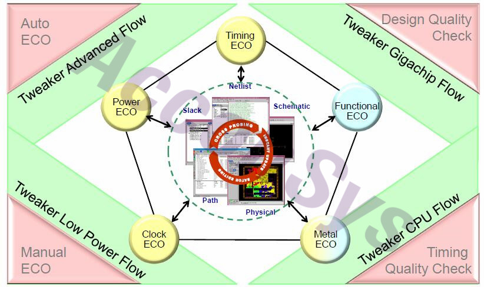
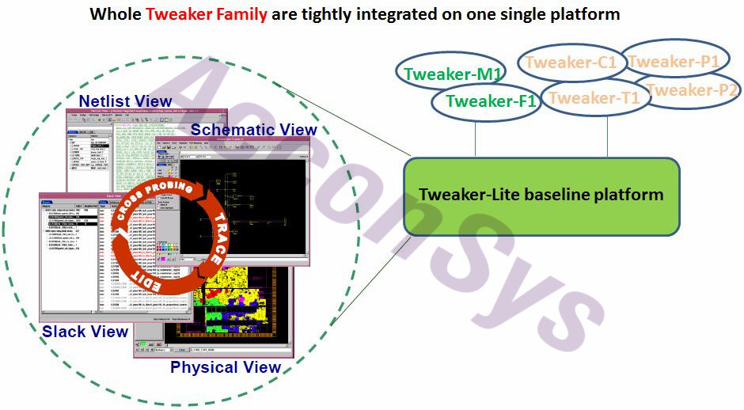
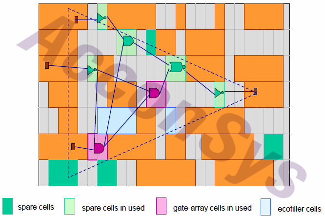

https://zhuanlan.zhihu.com/p/69305837

# Tweaker

**关键技术 ** 
- 采用MMMC技术在一次运行中实现多种ECO优化  
- Minimum ECO logic专利技术算法  
- 单一License可覆盖超过200种应用场景(scenarios)  
- 基于Physical Aware与Power Domain Aware(CPF/UPF)的优化策略  
- 基于signoff数据采用局部、增量和安全的优化分析  
- 支持主流的静态时序分析工具与布局布线工具  
- 支持跨越设计边界的ECO优化  
- 超过500次成功tape-out验证，工艺涵盖110nm到7nm  
- 友好的GUI提供高效的分析及手动ECO能力  

**全面的ECO自动优化平台**
  作为业界主流的ECO自动优化工具，Tweaker已为众多客户所采用。其采用了独特的ECO 技术架构，并基于设计的静态时序分析和布局布线等sign-off数据，对设计进行ECO domain的划分，对设计进行局部的、增量的且安全的MMMC优化。Tweaker在优化的过程中充分考虑Physical Aware及Power Aware特性, 显著地降低迭代时间和减少额外错误被引入的机会。作为业界领先的ECO优化设计自动化技术的领导厂商，Dorado一直致力于ECO优化技术的探索和创新。在ECO优化方面提供全面的解决方案。产品包括有: Tweaker-F1, Tweaker-T1, Tweaker-M1, Tweaker-P1, Tweaker-P2和Tweaker-C1. 肯

**图1-Tweaker产品系列**

**Tweaker-F1：**在post-layout网表中自动插入优化的逻辑电路实现functional ECO;思
**Tweaker-T1：**采用MMMC(multi-mode, multi-corner)和Physical Aware的优化方案实现setup timing/hold timing /max transition/max capacitance的ECO优化;
**Tweaker-M1：**在post-silicon阶段，通过spare cell和gate array cell实现transition/setup timing/hold timing等ECO优化;

**Tweaker-P1：**采用swapping和sizing等优化策略实现leakage power的降低;

**Tweaker-P2：**结合功耗分析工具输出结果，实现dynamic power的优化;

**Tweaker-C1：**通过增加buffer, 增加dummy load等优化策略实现clock network的优化。

**Metal ECO****技术降低****IC****再次流片成本**

随着摩尔定律的发展，集成电路的工艺越来越先进，但对集成电路设计者而言，流片的成本却越来越高。所以当芯片流片以后，为了节约成本，Metal层的ECO就显得尤为重要。而由于初期分配资源有限，Metal ECO技术就能更好地利用已有资源，降低了费用。奥

Dorado公司的Metal ECO工具---Tweaker-M1利用设计中的spare cells和gate array cells等多重资源进行ECO综合，并生成最优的Netlist结果，同时自动化程度高，操作方便。它的示意图如下图所示。肯

  Tweaker-M1能帮助设计师快速实现如下功能：思**●  可回收****floating cells****
****●  Spare cells****和****gate array cells****组合利用****
****●  小单元组合成大单元****
****●  Timing aware****和自动****timing/drv****违例修复****
****●   可利用时序较好的单元**