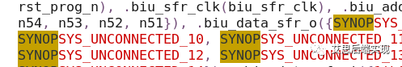

https://zhuanlan.zhihu.com/p/69305837


ECO详细介绍 集成电路

全称：Engineering Change Order 工程改动要求

分类：

类1：Logic ECO：负责改动电路的逻辑功能

类2：Physical ECO：负责改动电路的物理实现以满足各种约束要求


# 版图ECO的那点事（上）

原创 艾思后端设计 [艾思后端实现](javascript:void(0);) *4月7日*

ECO是所有版图工程是都不能忽略的关键路径，一个良好的ECO流程、策略可以加速流片的时间，反过来，可能让整个团队在一周内没有产出。为了让小伙伴们可以从繁重的ECO流程里跳脱出来，基于笔者的设计经验，分三期给大家带来一个系列的文章：版图ECO的那点事，希望能引起大家的共鸣。


## **功能修改ECO的带入方式**

对于版图工程师，经常会碰到一些function ECO的需求，尤其是在冲击最终Tape-Out的关键时期，会有如下的一种境地（*以时序修复的过程举例*）


从上图可以看到，为了保证数据库有优先级的收敛，最后的timing ECO会分为几个主要步骤

- 功能模式的时序修复：function mode
- 存储器自测模式的时序修复：mbist mode
- 其他测试模式的时序修复：test mode
- 芯片接口时序修复：IO mode

功能模式的重要性、工作量和难度都是最大的，需要尽早地修复。然后是其他的模式，基本上是按照步骤和优先级完成整个芯片的时序修复的。

通常我们统一把改变功能的ECO，称之为function ECO，但是实际上，这种ECO可能是针对真正的function mode的，也有可能是针对mbist 逻辑的，或者at-speed test mode的。
由于function ECO会引起潜在的timing arc的变化，带入function ECO的时间点是有讲究的。一般来讲，只会在一种模式的timing 修复告一段落的时候，我们才会带入这个模式的function ECO。
假如在时间节点Pre-B，前端准备好了一个比较大的function ECO，这个ECO是给mbist服务的。通常我们需要先验证这个脚本的正确性，如果脚本本身没问题，我们在这个Pre-B的时候并不带入，因为这个时候整个mbist的时序还不够稳定。<内建自测试技术(MBIST)>


等待到了Pre-C的节点，mbist 的时序修复基本完成的阶段，这时可以相当自信的使用增量方式代入这个ECO。

理论上讲，新出来的timing violation都是由于这个脚本引起的。这里的timing violation通常有两种类型

- 由于实现function ECO的时候，原先的cell被push，data上的timing变差：
  *PS：APR工具一般不会去push clock path上的cell，clock的变差一般是应为re-route引起的。*
- 新加入的cell带来了新的timing arc：这些timing 需要重新核定和修复，由于已经进入到ECO阶段了，建议直接在PT里边进行核查就好。APR里边只需要关注physical就好。

### 【敲黑板划重点】

**增量设计工作模式，是ECO阶段的重重之重，任何违背增量设计方案的举动，都会造成局部损耗，甚至团灭**

## **功能ECO的脚本生成的探究和技巧**

后端的同学一般会在最终layout的节点，给前端同学分享最终layout版本的网表，一般为了阅读方便，后端都是给前端同学一个不带PG信息的netlist。前端同学在完善数据库的过程中，同时也会对各种问题进行评估，最终给出解决方案：

- 软件改动
- 约束用户行为
- 硬件改动

如果有任何需要在硬件方面做的功能修改，前端的同学会先保证RTL修改、验证完成后，对相应的final layout的网表进行修改。
综上所述，一个function ECO的诞生无外乎下面的过程：


前端主要是关注功能，后端主要是关注实现，对于下面的几个主题的关注度，这里展示一下：


前端的同学基于final layout的网表，改出来一版带function ECO的功能网表，基本就算大功告成了

通常在后端工具里边，工程师习惯使用脚本来处理一切，在ICC里边，一定要会使用下面的这个命令，这样才可以把前端工程师给入的netlist平滑过渡为脚本：


通常来讲，直接使用这个命令会产生完整的ECO命令，如下例

```tcl
open_mw_cel -lib $MW_LIB $MW_CEL
eco_netist -by_verilog_file $ECO_netlist -diff_only -output eco_change.tcl
```

这个命令，并不会改变数据库的状态，因为我们使用了diff_only选项。运行过程如下：


这些消息只是打印了一下设计的summary，并没有ECO改变的细节，这里我们一起看一下ECO的脚本的小结


可以看到，这里的动作非常多，这难道是前端的期望？


不要慌张，打开脚本一探究竟！一起来看一下ECO的脚本，eco_change.tcl

在整个ECO的前面大半部分，主要都是tie connection的准备，这里以高亮的pin举例，操作如下：

1. 断掉当前连接
2. 移除当前连接对应的net
3. 使用SNPS_LOGIC0 net连接高亮pin

这么多的tie 连接肯定是和ECO没有关系的了，

### 【敲黑板划重点】

**- Tie connection derived from synthesis
如果在综合网表里边看到这个连接，那么它就是tie connection
**
**在ICC里边，就会相应的报告出来tie connection：
**
**由于我们的ECO后的netlist里边，上边两种情况并没有被ICC工具定性为tie connection，所以ICC需要使用额外的操作来完成对应的tie connection （其实是重复和冗余的，大家知道为什么了吧？）**

```
create_net -tie_low LOGIC_0
create_net -tie_high LOGIC_1
connect LOGIC_0 $CELL/TIE_LOW_PIN
connect LOGIC_1 $CELL/TIE_HIGH_PIN
```

**- SYNOPSYS_UNCONNECT的处理
如果在网表里边存在下面的连接声明

**
**
**为了数据库的完整性，ICC需要在所有没有连接的pin上去接一个SYNOPSYS_UNCONNECT的net，这种操作经常会出现在总线连接的情况下：一组总线，有部分的pin有连接，那么其他的pin就会连接到SYNOPSYS_UNCONNECT上了。这样会产生大量冗余的重新连接的命令**
**抓住细节，探寻本真， 合理使用命令和相关的变量，是高效合理完成工作的必要条件**

为了有效解决这两个问题，这里隆重介绍两位大侠，有了他们护法，上述的问题可以迎刃而解（前提是原始layout 网表里边没有leaf cell的floating input ）


这两个变量在icc里边，默认都是false，在进行eco_netlist的时候，需要把他们设置成true（如上图）。

1. 变量一（eco_netlist_ignore_tie_changes）: 设置为true的时候，所有网表里边带来的tie connection，都被eco_netlist忽略，开一下这个选项打开时的ECO 命令的summary:

   和原始的ECO脚本相比，减少了很多connect_net的命令，create_net也减少了，最重要的是，create_net -tie 是没有的

   
   
2. 变量二（eco_netlist_preprocess_for_verilog）：这个变量可以忽略网表里边的SYNOPSYS_UNCONNECT，首先这些连接不会对数据库产生任何影响，但是如果需要ICC处理的话，他的方法也很简单，把连接SYNOPSYS_UNCONNECT的pin都会再（append）连接到一个新的net上，名字和这个pin一样，
   *PS：这个做法真的有意义吗？需要问问ICC的开发人员了*

   从上图可以看到，eco应用以后，多连了一个net，其实是没有任何用处的。
   所以，在把第二个变量改成true，ECO脚本的真实面貌就呈现出来了，其实这个ECO真的很简单！

### 本讲小结

1. **增量设计工作模式，是ECO阶段的重重之重，任何违背增量这几方案的举动，都会造成局部损耗，甚至团灭**
2. **抓住细节，探寻本真， 合理使用命令和相关的变量，是高效合理完成工作的必要条件**

记住和贯彻这两个工作准则，一定会让同学们的工作成绩突飞猛进、技术能力大大提升。


# 版图ECO的那点事（中）

在上一讲中，和大家一起讨论地两个关键话题：

- 功能ECO的介入时机
- eco_netlist的用法和技巧
  *点击查看上期文章：[版图ECO的那点事（上）](https://mp.weixin.qq.com/s?__biz=MzUyMjg0MTcwMQ==&mid=2247484300&idx=1&sn=041f03afac65078d3317be63f10555d6&chksm=f9c4f886ceb37190c2eb5c48178efd4f36f8a06554c0dd23c74b358aab5067fc2f5b90e9be56&token=1552478016&lang=zh_CN#rd)*

在这一讲中，大家一起来看看ECO实现时候的小技巧。

## ECO版图实现的技巧和经验

在实际的ECO中，版图的实现是非常重要的步骤。是否能完成STA的脚本期望，是数据库能否走向收敛的关键点。一般的STA对应的ECO和相应的修复方法如下：

| 类别                           | 问题描述                                     | 修复手段                               | 实现方法                                    |
| ------------------------------ | -------------------------------------------- | -------------------------------------- | ------------------------------------------- |
| max_transition max_capacitance | 驱动不够 负载过大 input cap过大 绕线过长     | 增加驱动 打短绕线 负载分割             | size_cell add_buffer_on_route split_fanout  |
| setup violation                | 数据侧延迟过大 捕捉侧时钟过早 发射级时钟过晚 | 做快数据 做慢捕捉侧时钟 做快发射级时钟 | size_cell insert_buffer add_buffer_on_route |
| hold violation                 | 数据侧延迟过小 捕捉侧时钟过晚 发射级时钟过早 | 做慢数据 做快捕捉侧时钟 做慢发射级时钟 | size_cell insert_buffer add_buffer_on_route |

可以看到，ECO的物理实现就是两种情形

- size_cell
- add buffer
  这里边最会产生的影响其实是面积和器件的位置变动（dis-placement）
  通常的版图和ECO流程如下图，在sign-off阶段，理想的是以类似silicon-freeze的方式进行操作
  
  ECO的简明流程如下：
  
  这里的关键节点是在，placement/legalization，任何器件的位置变动带来的意外的影响都有可能导致ECO无法按照期望方向进行，这是因为，原有数据库的cell的放置被调整，之前的绕线需要做相应的调整，同时带来更多的timing/驱动能力的问题，这样就会给数据库带来不期望的抖动。
  为了尽可能保证原有数据库的状态，这里需要引入一个新名词：**Minimal Physical Impact Flow（MPI）**
  

为了实现MPI的效果，ICC给出了它的一套解决方案。

### 【敲黑板划重点】


**较小的dis-placement带来更为稳定的版图数据，绕线的挑战也比较小，这个是MPI的核心思想**

下边一起来看一下，如何使用合理的命令和流程来弱化legalization带来的影响：

传统的legalize命令在跑流程的时候，可以很好的进行增量性的legalization，但是到了ECO这里，legalize的动作相对于版图的稳定性而言，就是有点太大了，需要使用place_eco_cells来实现MPI：

从上边这个截图可以看出来，传统的legalize模式，带来的明显的average/max dis-placement，但是place_eco_cell可以非常好的避免这种情况的发生。place_eco_cell可以实现MPI的目标，而且run-time速度也很快，这到底是为什么呢？天底下还有这么既省时又省力的两全其美的好事情？

通常使用的legalize_placement -increment命令，它是一个全局命令，它会在需要legalize的cell就近找寻位置，如果找不到，那么就会push周围的cell，从而在ECO cell就近产生足够的空间，这样会产生明显的涟漪效应，尤其在高利用率的区域。但是place_eco_cell的行为完全不一样，它的操作范围完全是有用户决定的，它的目的就是一个：**在规定的范围内，完成目标cell的legalization，如果在规定的区域内（dis-placement threshold）找不到，它就直接放弃，较小的作用范围，带来的就是高速的执行速度**。
这里有一个test-case，一个全局的的时序修复（size_cell），基于同样的改变，看看两个命令的表现：

- CMD: legalize_placement -increment
  
  可以看到，这里有30871个cell的位置被改变，ECO的cell其实只有7081个cell。可见大约有23K个cell的移动，是为了来给ECO cell腾挪空间的。
- CMD: place_eco_cell -eco_changed -displacement_threshold 10 -max_displacement_threshold 10


仔细看图片描述，place_eco_cell的作用范围只有10um，目标cell也只有eco_changed的7081个cell，所以runtime极快。
在使用place_eco_cell之后，如何原始数据库的cell并没有被动到，只有ECO_changed cell 被动到，所以有一些没法完成legalize的cell，需要使用legalize_placement -increment 再次调整，保证整个数据库的legalization。

这里可以看到，使用legalize_placement -increment ，moved cell较之前会有所好转。

这样通过两步走的手段，可以有效地保证eco_changed的cell的legalization，也能最大限度地完成其他cell的原地不动。这里附带完整脚本流程图如下：


# 版图ECO的那点事（下）


诱人（催人）的流片日（Tape-Out day）迫在眉睫，项目经理天天黑着脸在后端组来回踱步，但依然强（目）颜（露）欢（凶）笑（光）：各位后端大神啊，ECO状态如何？这周能不能把芯片TO出去啊？


各位经理，各位同学，先别着急，ECO的最后几轮，才是真正考验数据库、流程、floorplan的关键时候，成王败寇，此刻方才见分晓！
这一讲中，就一起来看看ECO的收尾阶段，到底有什么潜在的坑，让一些chip意外滑过了TO-day。

## MCMM的挑战

通常，在芯片的后期，每一次的时需调整，都是谨小慎微的，基本原则就是稳稳当当的走好最后一公里，别处岔子。
通常的FAB会提供多个PVT的库，同样，一颗芯片会有多种工作模式（在前文有描述：[版图ECO的那点事（上）](https://blog.csdn.net/i_chip_backend/article/details/105336023)）
同样，还有来自extraction（寄生参数抽取）的一些区别。这样，用户可能会遇到如下的timing signoff组合拳挑战。
以TSMC 40nm 的工艺举例：

可以看到在一个模式和一个寄生参数抽取的前提下，有18个corner（**支持DVFS的系统**）之多，如果站看模式和寄生参数的区别，会更为复杂，示例如下：

可以看到，总共有216（12\*18）个MCMM需要完成，对于每一天，进行这么多的时序分析也不太现实。但是流片前的真正的时序签收还是一定要full-cover。通常，会把一些比较重要的setup/hold corner在每一天进行检查，例如下面视图：

剩下的corner会在流片前的一两周做最后的全覆盖检查。最后面的ECO基本都是在和这些corner来战斗

## VT cell的妙用

**“ECO的时序信息通常是增量示的，除非你改变了绕线”**，这个是需要在ECO后期阶段牢记的一点。这个时期的ECO就是手术刀操作，是时候体现你的微操能力了。
对于一个数据库，经常会遇到在接近TO的ECO的迭代中，会冒出来一些和修复timing没有关系的微小的setup/hold violation，譬如：3ps的hold violation。这个大多是由于绕线的细微改变，而导致的时序变化。这个时候，VT cell就会派上用场。
使用VT cell进行timng ECO的好处有三点：

- 省时间
- 省时间
- 省时间

首先，时间是TO前最值钱的，要知道让FAB做一下hot或者super hot，也就能省一、两天的时间，但是费用基本都是翻倍！
使用VT cell进行ECO，最大的方便时省略了ECO 绕线、寄生参数的抽取和STA的re-run。这三个步骤的时间是非常长的。有了VT cell的帮忙，这些时间统统可以省略。
但是VT cell也不是万能的，有如下的一些考量：

- 对时序的影响非常微小：只有在violation 非常小的时候（譬如：10ps以内），才好用
- 对应VT cell的pin是兼容的，VT cell置换时候的任何size_up/size_down都不能省略绕线
  一个使用VT cell来修复hold violation的示例如下

```bash
# hold_buf_1 original ref_name is: LVT_BUF_2
size_cell hold_buf_1 HVT_BUF_2
12
```

这个脚本把一个LVT cell换成一个同等大小的HVT cell，LVT cell的速度比较快，如果换做HVT cell，可以增加延迟，有可能解决hold 延迟。
通过XOR，可以看到我们的LVT_BUF_2和HVT_BUF_2有如下的layer 区别，可以看到，VT cell 的替换时无需重绕线的：


## Metal fill 的影响

先进工艺是需要fill的支持，来保证流片的物理需求，fill是基于绕线和布局的，言下之意就是如果绕线或者布局改变了，就需要重新跑fill。譬如：M4 和 M4 fill

由于先进工艺的线距越来越近，之间的耦合电容的影响也越来越明显，所以在先进工艺，一定不能忽略fill对timing的影响，tape-out之前，一定要保证fill的信息完全和真实的数据库匹配，这样跑出来的timing才完整，可信。
在寄生参数抽取的时候，需要使用下面的语句，否则你的fill是没法在timing signoff里边发挥自己的作用的：


### 【敲黑板划重点】


**兼顾metal fill，corner 全覆盖以及VT cell的灵活使用，是ECO后期成功收敛的关键要素**

终于，历尽九九八十一难，趟过了十万八千里，在ECO的保驾护航中，终于看到了一句：**Good Chip！**
每一个芯片都是一样的坚实，但每一款芯片都有说不尽道不完的ECO故事！我们的ECO三讲虽然告一段落了，但是国产之芯的路上，依然有无数的ECO等我们去完成。为了那颗心中的芯，一起努力，与君共勉之！


