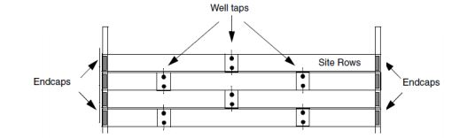
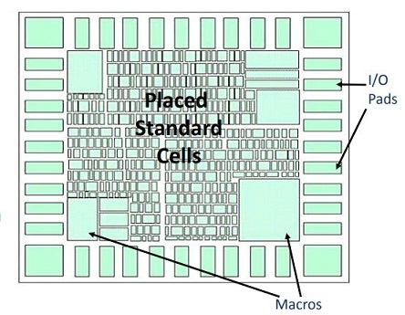
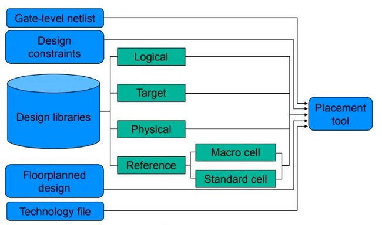
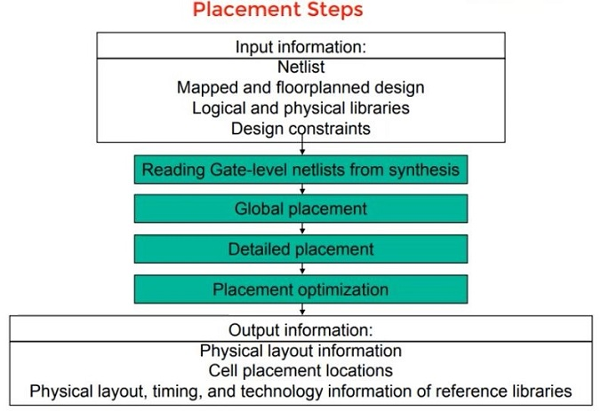
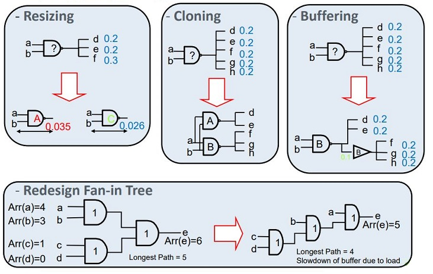
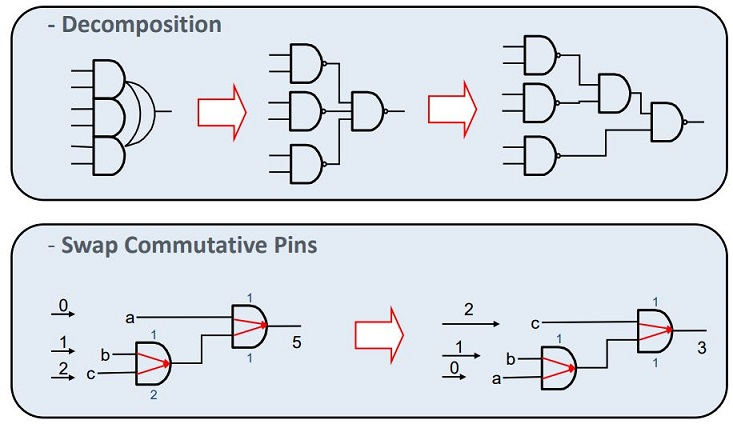

## Pre-Placement 

### Physical-Only Cells (Well Taps, End Caps) 

- These library cells do not have signal connectivity and connect only to the power and ground rails
- End Caps ensure that gaps do not occur between the Well and Implant Layers and also prevents DRC violations by satisfying Well tie-off requirements for core rows
- Well Taps help to tie Substrate and N-wells to VDD and VSS levels and thus prevent Latch-up

### Special Cells (Spare cells, Decap Cells) 

- Spare Cells for ECO and Decaps for avoiding Instantaneous Voltage Drop (IVD)
- Place Decaps closer to Power Pads or any larger Drivers

### Cell Padding 

- Cell Padding is done to reserve space for avoiding Routing Congestion
- Cell Padding adds Hard Constraints to Placement
- The Constraints are honored by Cell, Legalization, CTS, and Timing Optimization

------

## Pre-Placement Optimization 

### Pre-Placement Optimization Goals 

- Routability
- Performance (Timing)
- Power (with Cells)

### Optimizations before Placement 

- Delay models must be removed (if any)
- Zero-RC (0-RC) Optimization
- Isolation Cell Insertion
- Multi Corner Multi Mode (MCMM) settings before Std. Cell Placement

### Zero-RC Optimization 

- Optimizes the netlist without any delay models, thus provides an optimal starting point for placement
- Timing during 0-RC Opt and that of during Synthesis has to be matched
- Else indicate problems in the Technology File, Timing Library, Constraint Files, or overall design
- Logical restructuring and up/down size are optimizations at the 0-RC stage

Note: Take care of don’t use cells while doing optimization

------

## Placement 

------

- Placement is the process of placing standard cell in the design. the tool determines the location of each standard cell on the die. the tool places these based on the algorithms which it uses internally.
  
- Placement does not just place the standard cells available in the synthesized netlist. it also optimizes the design. placement also determines the routability of design.
  
- Placement will be driven by different criteria like timing driven, congestion driven and power optimization.

Automated Standard Cell Placement for placing the Standard Cells in Placement Tracks

### Placement Objectives 

- Total wire length
- Routability
- Performance
- Power
- Heat distribution

Timing checks only with slow corners at Placement stage

Only Setup Time check, since buffers are getting added during Clock Tree Synthesis

------

### Goals of Placement: 

- Timing, Power and Area optimizations
- Minimum congestion
- Minimal cell density, pin density and congestion hot-spots
- Minimal timing DRVs

------

### Inputs of Placement: 

- Technology file (.tf)
- Netlist
- SDC
- Library files (.lib & .lef) & TLU+ file
- Floorplan & Powerplan DEF file

------

### Things to be checked before placement 

1. Check for any missing/extra placement & routing blockages.
2. Don't use cell list and whether it is properly applied in the tool.
3. Don't touch on cells and nets (make sure that, these are applied).
4. Better to have limit the local density (otherwise local congestion can create issue in routing/eco stage).
5. Understand all optimization options and placement switches set in the tool.
6. There should not be any high WNS timing violations.
7. Make sure that clock is ideal network.
8. Take care of integration guidelines of any special IPs (these won't be reported in any of the checks). Have custom scripts to check these guidelines.
9. Fix all the hard macros and pre-placed cells.
10. Check the pin access

------

- Before the start of placement optimization all wire load model (WLM) are removed.
- Placement uses RC values from virtual route (VR) to calculate timing.
- VR is the shortest manhattan distance between two pins.
- VR RCs is more accurate than WLM RCs.

------

### Placement Methods 

**Timing Driven Placement**

- To Refine placement based on congestion, timing and power
- To optimize large sets of path delays
- Net Based

**Congestion Driven Placement**

- To distance standard cell instances from each other such that more routing tracks are created between them

- Control the delay on signal path by imposing an upper bound delay or weight to net

------

------

### Global/ Coarse Placement 

- To get the approximate initial location
- Cells are not legally placed and there can be overlapping

------

### Detail/ Legal Placement 

- To avoid cell overlapping
- Cells have legalized locations
- Legalize placement will place the cells in their legal position with no overlap

------

### Placement Legalization 

- Placed Macros are legally oriented with Standard Cell Rows

------

### In-Place Optimizations 

- **Scan Chain Reordering:** DFT tool flow makes a list of all the scan-able flops in the design, and sorts them based on their hierarchy. In APR tool scan chains are reordered on the basis of placement of flops & Q-SI routing. This is nothing but scan-chain reordering. Scan-chain reordering helps to reduce congestion, total wire-length etc…

------

- After Placement, report Congestion, Utilization and Timing
- Tie off cell instances provide connectivity between the Tiehigh and Tie-low logical inputs pins of the Netlist instances to Power and Ground
- Tie off cells are placed after the placement of Standard Cells
- After placement check the Cell Density

------

### Global Route (GR) 

- Whole region is divided into an array of rectangular sub-regions each of which may accommodate tens of routing tracks in each dimension called Global Cells
- Global Route is performed to estimate the inter-connect parasitics and Routing Congestion Map

------

## Placement Opt./ Pre CTS Optimization 

**Cell Sizing**

- Sized up/ down to meet optimizing for timing and area
- Up sizing will give timing advantage and Down sizing will give area advantage

**VT Swapping**

- To optimize for leakage power (HVT, RVT/SVT, LVT)

**Cloning**

- To reduce fanout

**Buffering**

- Long nets are buffered or remove buffers to bring the timing advantage

**Re-Buffering**

- To improve slews, reduce net capacitance and reduce fanout

**Logical Restructuring**

- To optimize timing and area without changing the functionality of the design
- Breaking complex cells into simpler cells or vice versa

**Pin Swapping**

**Optimization techniques**

**Timing Optimization techniques**

## Placement Qualifications 

- Unplaced cells (should be 0)
- Cells overlap (should be 0)
- Utilization
- Minimal timing issue
- Minimal congestion issue
- Minimal timing DRVs
- Total area after optimization

------

## Placement Output 

- Congestion report
- Timing report
- Design with all std cells placed in core area
- Logs
- Placement DEF file

----

REF： [Placement | Physical Design | VLSI Back-End Adventure (vlsi-backend-adventure.com)](https://www.vlsi-backend-adventure.com/placement.html)