### What is Synthesis? 

- Synthesis is process of transferring higher level of abstraction (RTL) to implementable lower level of abstraction . It is the process of transforming RTL to gate-level netlist.
- Synthesis process can be optimized for Speed(timing)/Area/Testability (DFT)/Power(DFP)/Run time.
- Inputs : RTL, Technology libraries, Constraints (Environment, clocks, IO delays etc.).
- Outputs : Netlist , SDC, Reports etc.
- Design Compiler (DC) from Synopsys and RTL Compiler from Cadence are the tools widely used for synthesis.
- Synthesis is described as translation plus logic optimization plus mapping. In terms of the Synopsys tools, translation is performed during reading the files. Logic optimization and mapping are performed by the compile command.

Synthesis = Translation + Logic Optimization + Mapping   HDL > Generic Boolean logic > Optimize > Map > Netlist

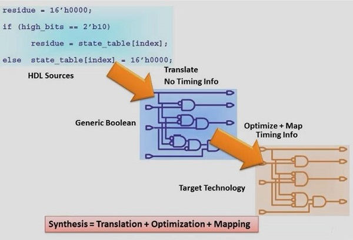


------

### Goals of Synthesis 

- To Get a Gate-level Netlist.
- Inserting Clock Gates.
- Logic Optimization.
- Inserting DFT Logic.
- Logic Equivalence between RTL and Netlist should be maintained.

------

### Synthesis Flow 

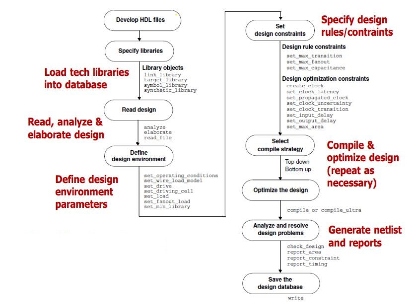

------

### Inputs and Outputs of Synthesis 

- **Inputs of Synthesis**

	- RTL: HDL Files
	
	- Libraries
	
	- Constraints
	
	- UPF (Power intent for power aware synthesis)

- **Ouputs of Synthesis**

	- Netlist
	
	- Reports (QOR, Area, Timing etc.)
	
	- UPF: Unified Power Format


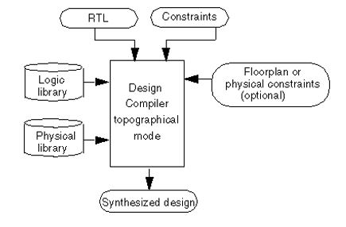


Inputs and Outputs in DC topographical mode

------

### HDL files generation & library setup 

- HDL input files are written in VHDL or Verilog or SytemVerilog.
- HDL partitioning and coding style directly affect the synthesis and optimization process.
- Libraries are based on the semiconductor technology used.
- There are different types of libraries with different definitions viz. link libraries(Libraries to link against), target libraries(your cell libarary), symbol libraries(Symbol libraries contain definitions of the graphic symbols that represent library cells in the design schematics.), synthetic libraries(DesignWare libraries) etc.

------

### Reading files  

There are two methods to read files into DC. One is to use analyze and elaborate commands; the other is to use read_file command.

- **Analyze and Elaborate**
	- **Analyze command does the following:**

		- Reads HDL source files and performs HDL syntax checking and Synopsys rule checking.
		
		- Check files for errors without building generic logic for the design.
		
		- Created HDL library objects in an intermediate form.
		
		- Stores the intermediate files in a location specified by **define_design_lib** command.

	- **Elaborate command does the following:**

		- Translates the design into its GTECH representation.
		
		- Allows changing of parameter values defined in the source code.
		
		- Replaces the HDL arithmetic operators in the code with the Design ware components.
		
		- Performs link automatically.

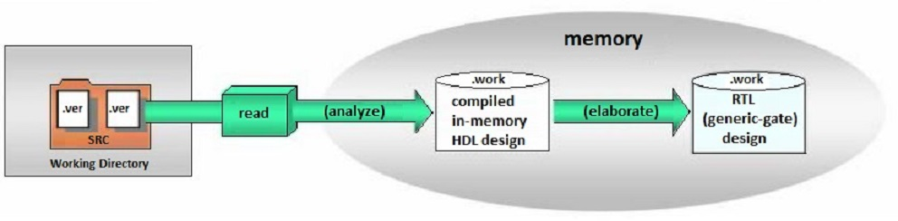

- **The read_file command does the following:**

	- Performs the same operation as analyze and elaborate in one step.
	
	- Does not create intermediate files for Verilog.
	
	- Creates intermediate files for VHDL.
	
	- Does not execute the link command automatically. Link has to be done manually after read_file command.
	
	- Reads several different formats viz. VHDL, Verilog, system Verilog, ddc.

------

### Design environment Constraints  

- Once the design have been read in, you need to define design environment and design constraints.

- **Design environment:** It consists of Operating Conditions, Wire Load Models and System Interface requirements.

- ***Operating Conditions***:  It consists of Process, voltage and temperature requirements. The effect each of these can have on the chip need to be considered during synthesis and timing analysis.

	- Most libraries have default setting for operating conditions. Operating conditions can also be explicitly specified by using **set_operating_condition** command. Operating conditions are set in dc_setup.tcl file using set_operating_condition command.

- **Wire Load Models:** It allows DC to estimate the effect of wire length and fan out on resistance, capacitance and area of nets. DC uses these values to calculate wire delays. We use zero WLM when synthesis is done using DC.

- Wire load models are not needed when synthesis is done using DCT/DCG i.e. topographical mode. Net delays are estimated by virtual routing in DCT/DCG.

- **System Interface:** The information regarding outside logic driving and receiving signals from your ASIC is captured through these constraints. It consists of Input drive strength (set_driving_cell), Capacitive load (set_load), output fan out load etc..

- report_lib, report_design are few of the commands to see the loaded environment constraints.


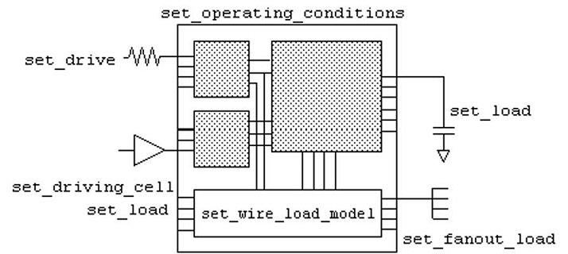
Commands Used to Define the Design Environment


------


### Timing Paths  

- The timing analysis tool finds and analyses all of the timing paths in the design. Each timing path has a startpoint and an endpoint.
- The startpoint of a path is a clock pin of a sequential element or an input port of the design.
- The endpoint of a path is a data input pin of a sequential element or an output port of the design.
- There are four types of timing paths as shown in the below figure.

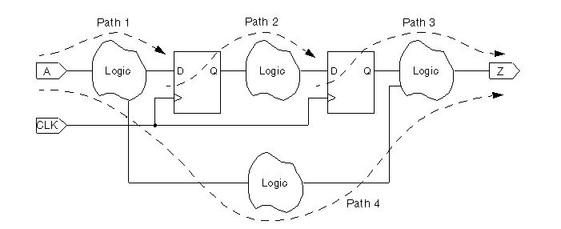


- Path 1 starts at an input port and ends at the data input of a sequential element.    
- Path 2 starts at the clock pin of a sequential element and ends at the data input of a sequential element.    
- Path 3 starts at the clock pin of a sequential element and ends at an output port.    
- Path 4 starts at an input port and ends at an output port.       

  <br />

- Static timing analysis is a method of validating the timing performance of a design by checking all possible paths for timing violations under worst-case conditions. Setup and hold are most important timing checks performed.

- **Setup:** The time for which the data should be stable before the active edge of the clock is called the setup time.

- **Hold:** The time for which the data should be stable after the active edge of the clock is called the hold time.

- For all the timing paths slack is calculated while performing setup and hold timing checks. Formulas for slack calculations for setup and hold are given below.
  
> **Setup slack** = Data Required time – Data Arrival time
   **Hold Slack** = Data Arrival time – Data Required time


------

### Timing Path Example 

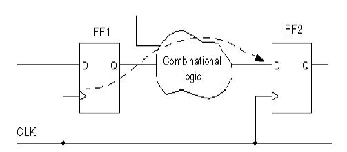A timing path example for setup is given for a register to register path

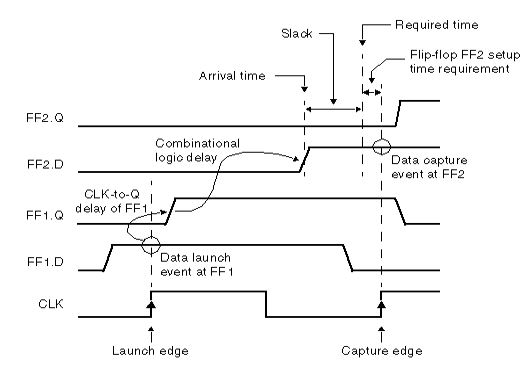Waveform for setup timing check.

------


### Constraints 

- When Design Compiler optimizes your design, it uses two types of constraints:

	- Design Rule Constraints: The logic library defines these implicit constraints. These constraints are required for a design to function correctly. They apply to any design that uses the library. By default, design rule constraints have a higher priority than optimization constraints.  
	- Optimization Constraints: You define these explicit constraints. Optimization constraints apply to the design on which you are working for the duration of the dc_shell session and represent the design’s goals. During optimization, Design Compiler attempts to meet these goals, but no design rules are violated by the process. To optimize a design correctly, you must set realistic constraints.

- Design Compiler tries to meet both design rule constraints and optimization constraints, but design rule constraints take precedence

### Major Design Rule Constraints 

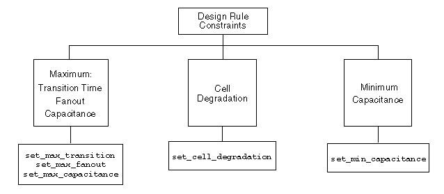


### Major Design Optimization Constraints 

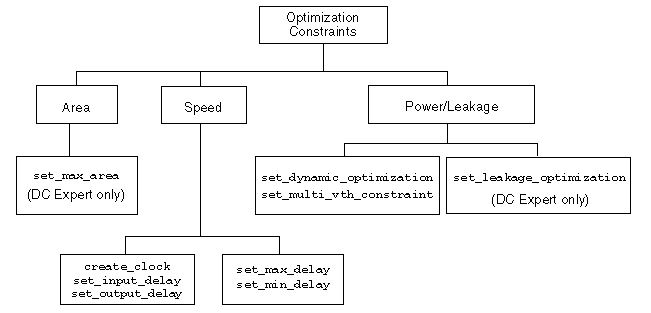


- By default, Design Compiler prioritizes costs in the following order:
	1. **Design rule costs**
		- Connection class
		- Multiple port nets
		- Maximum transition time
		- Maximum fanout
		- Maximum capacitance
		- Cell degradation
	1. **Optimization costs**
		- Maximum delay
		- Minimum delay
		- Maximum power
		- Maximum area

- The goal of Design Compiler is to meet all constraints. However, by default, it gives precedence to design rule constraints because design rule constraints are functional requirements for designs. Using the default priority, Design Compiler fixes design rule violations even at the expense of violating your delay or area constraints.

------

### Timing Constraints 

- To accurately set up timing constraints, you need to specify the following:
	- Clocks
	- I/O Timing requirements
	- Combinational path delay requirements
	- Timing exceptions

- **CLOCKS:** To define a clock create_clock command is used, and **create_generated_clock** command is used to define internally generated clock. Few specifications of clock include clock source, clock period, duty cycle, clock name etc.

- A create clock and divide by 2 generated clock example is given below.
```sdc
create_clock -name SYSCLK_NAME -period 2 -waveform {0 1} [get_ports SYSCLK]
create_generated_clock -name DIVIDE -source [get_ports SYSCLK] divide_by 2 [get_pins FF1/Q]
```

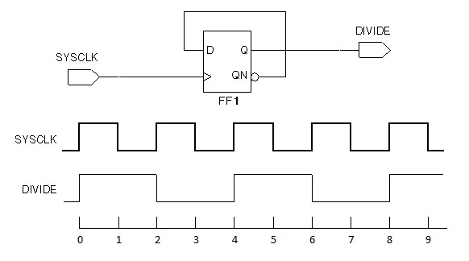

------

- **Clock network effects** should also be specified for the clocks defined. Clock latency, uncertainty and transition time are few of the clock network effects.
- **Clock latency:** Latency is the amount of time it takes for the clock signal to be propagated from the original clock source to the sequential elements in the design. It consists of two components, source latency and network latency. Source latency is the delay from the original clock source to the clock definition point in the design. Network latency is the delay from the clock definition point to the register clock pin.


**Diagram explaining clock latency, uncertainty and transition time.**

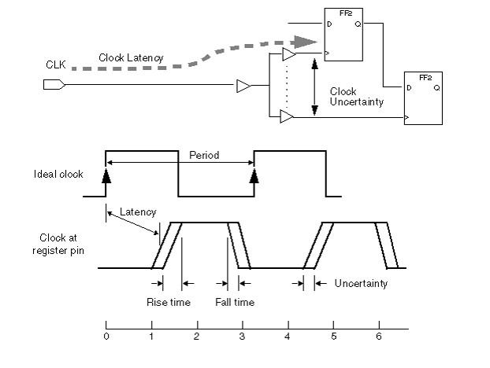

- **Uncertainty:** Uncertainty is the maximum difference between the arrival of clock signals at registers. This is also called skew. The larger the skew, the more difficult it is to meet the timing constraints.
- **Transition time:** Transition time is the amount of time it takes for a signal to change from logic low to logic high (rise time), or from logic high to logic low (fall time). The transition time of a signal at an input of a cell affects the delay to the output of the cell and the transition time of the output signal.
- **set_clock_latency, set_clock_uncertainty and set_clock_transition** commands are used to specify latency, uncertainty and transition time respectively.
- **get_clocks** command gives the list of clocks defined in the current design.
- **report_clocks** command gives the details of the clocks defined in the current design.

------

### IO Timing 

- Need to specify timing requirements for input and output ports, otherwise DC assumes the signal arrives at input port at time 0 and does not constraint any path that end at output port.
- The **set_input_delay** and **set_ouput_delay** commands are used to constraint input and output port delays.
- The **set_input_delay** command is used to specify how much time is used by external logic. DC then calculated how much time is left for internal logic and tries to meet it.
```sdc
     set_input_delay 4.5 -clock CLK1 [get_ports IN1]
     set_input_delay 2.3 -clock CLK2 -add_delay [get_ports IN1}
```
- The **set_ouput_delay** command is used to specify how much time the external logic needs. DC then calculated how much time is left for internal logic and tries to meet it.
     `set_output_delay 4.3 -clock CLK1 [get_ports OUT1]`

------

### Combinational Delay 

- To constraint a purely combinational path **set_max_delay** and **set_min_delay** commands can be used.
- **set_max_delay** command allows you to specify the maximum delay of a timing path I.e. from a startpoint to endpoint. DC will try to make the path less than the specified delay value. `set_max_delay 10.0 -to [get_ports Y]`
- **set_min_delay** command allows you to specify minimum delay of a timing path. If a path violates the requirement given in a set_min_delay command, DC tries to meet the path by adding delays (buffers). `set_min_delay 10.0 -from [get_ports {A B}] -to [get_ports Z]`

------

### Timing Exceptions 

- A **false path** is a logic path in the design that exists but should not be analysed for timing. A false path is a point-to-point timing exception that removes all timing constraints from a path, which prevents errors from being reported but does not stop delay calculation. DC command used for setting a false path is set_false_path. This command is useful in constraining asynchronous paths and logically false paths.   
```shell
  set_false_path -from [get_clocks CLKA] -to [get_clocks CLKB]   
  set_false_path -from [get_clocks CLKB] -to [get_clocks CLKA]
```
- The **set_multicycle_path** is used to specify that more than one clock cycle is required for a timing path i.e. from startpoint to the endpoint.   
  `set_multicycle_path 10 -setup -to [get_pins FF1/D]`

------

### Area 

- DC will perform minimal area optimization unless an area constraint is set. Area can be constraint using **set_max_area** command.
- Most cases have a zero max area constraint, in this case DC tries to achieve the best possible area with the impact on run time.
- Another option that may provide an optimal run time and good quality of results is to set the maximum area to around 90 % of the minimum area.   
  **set_max_area X**

------

### Compile 

- The process of optimization is done through compile (compile_ultra). Optimization consists of three steps viz. Architectural, Logic level and Gate level optimization. Optimization is based on HDL coding style and constraints set.
- **Architectural:** This phase includes tasks such as sharing common sub expressions, sharing resources and selecting Design ware components. After this optimization, the design is represented in GTECH format.
- **Logic level:** It can be described as a Boolean equation manipulation. It can be sub divided into two processes viz. Structuring and Flattening.
- **Gate Level:** It is during this stage the logic is actually converted to gates. This optimization has four processes viz. Mapping, Delay Optimization, Design Rule Fixing and Area Optimization.
- Different compile command options can be used for the design specific requirements.
- Few tips for better quality results are:
	- Ungroup unnecessary hierarchies.
	- Ungroup smaller blocks to allow shared optimization across boundaries.
	- Use group_path command to isolate IO paths.
	- Setting timing exceptions by using wildcards can impact run time, try to avoid it as much as possible.
- Example of compile ultra: **compile_ultra -gate_clock -scan -no_autoungroup -no_seq_output_inversion -spg**

------

### Compile Strategies 

- Compile strategies in Design Compiler to compile hierarchical designs in either wire load mode or topographical mode:
- **Top-Down Compilation:** The top-level design and all its subdesigns are compiled together.
- **Bottom-Up Compilation:** The individual subdesigns are compiled separately, starting from the bottom of the hierarchy and proceeding up through the levels of the hierarchy until the top-level design is compiled.
- **Mixed Compile:** The top-down or bottom-up strategy, whichever is most appropriate, is applied to the individual subdesigns.

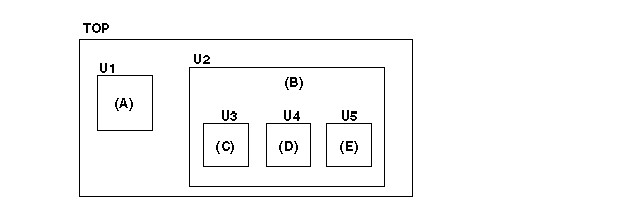

------

### DC optimization flow 

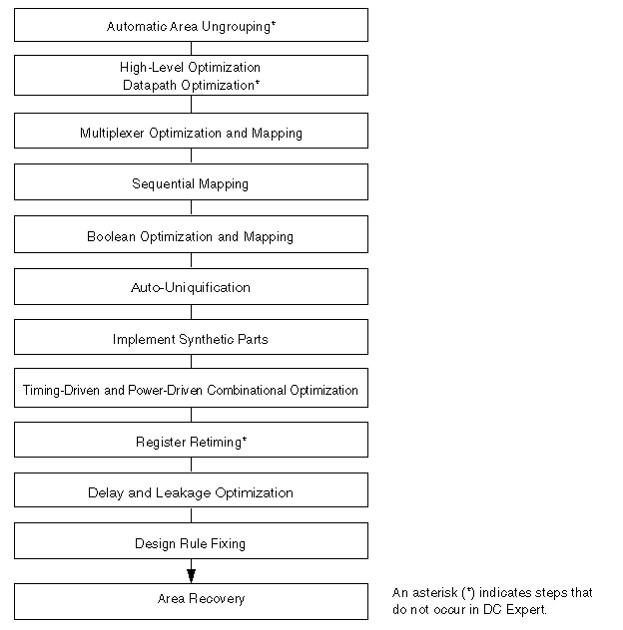

------

### Optimization Techniques 

- A sub design can be preserved during optimization by using the set_dont_touch command.
- The group_path command can be used to create path groups. The group_path command allows you to
	- Control the optimization of your design
	- Optimize near-critical paths
	- Optimize all paths
	
	- To indicate that the path from input in3 to FF1 is the highest-priority path, use the following command to create a high-priority path group:   
          `group_path -name group3 -from in3 -to FF1/D -weight 2.5 –critical_range 0.1`
- Design Compiler supports two methods for calculating the maximum delay cost:
	- Worst Negative Slack Method (default behavior)
	- Critical Range Negative Slack Method
           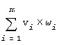
      m is the number of path groups.
      vi is the worst violator in the i th path group.
      wi is the weight assigned to the i th path group (the default is 1.0).

- Using the critical range negative slack method, the equation for the maximum delay cost is:

  ![[attachments/逻辑综合/Pasted image 20230925143952.png]]

	 m is the number of path groups.        
	 n is the number of paths in the critical range in the path group.        
	 vij is a violator within the critical range of the i th path group.        
	 wi is the weight assigned to the i th path group.  

------

### Boundary Optimization 

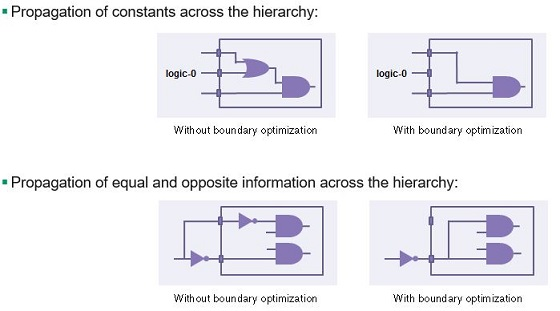

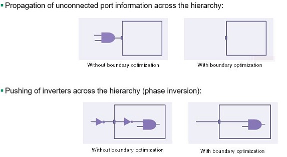

------

### Ungrouping 

- Ungrouping merges sub-designs of a given level of the hierarchy into the parent cell or design. It removes hierarchical boundaries and allows Design Compiler to improve timing by reducing the levels of logic and to improve area by sharing logic.

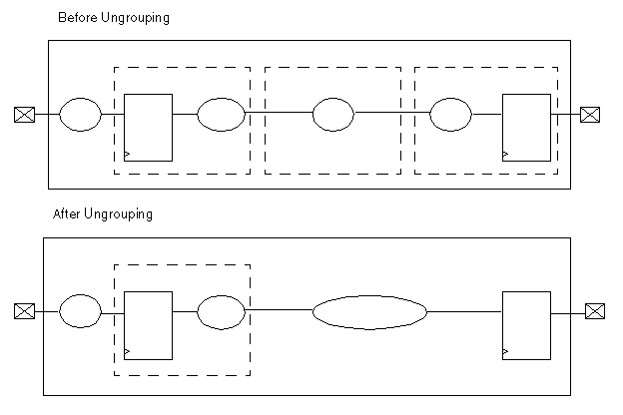

------

### Generate Reports 

- **check_timing:** This command checks for constraint problems such as undefined clocking, undefined input arrival times and undefined output constraints.
- **report_qor:** This command reports timing-path group and cell count details, along with current design statistics such as combinational, noncombinational, and total area. The command also reports static power, design rule violations, and compile-time details.
- **report_constraint:** This command tells you whether the design meets the timing, area, power, and design rule constraints.
- **report_timing:** This command provides detailed, point-by-point information on the clock paths and data paths that have the worst slack, along with the delay and slack calculation. You can control the scope of the design that is reported, the number of paths to report, and the types of path information that are included in the report. This information is very helpful in determining the cause of timing violations and how to fix them.
- **check_mv_design** command checks the designs multivoltage constraints, electrical isolation requirements, and connection rules. 
- **report_clock_timing:** It reports the clock latency, transition time and skew characteristics at specified clock pins of sequential elements in the network.

------

### Write Files 

- Once the design is successfully compiled and verified after analyses, the next and final step is to write out the files. Write command is used for writing out the required files viz. netlist.
  `write -fromat [verilog | ddc | VHDL] -hierarchy -output [name]`


---

Ref： [Logic Synthesis | Physical Design | VLSI Back-End Adventure (vlsi-backend-adventure.com)](https://www.vlsi-backend-adventure.com/logic_synthesis.html)

