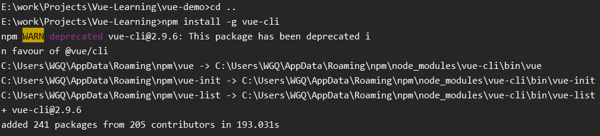
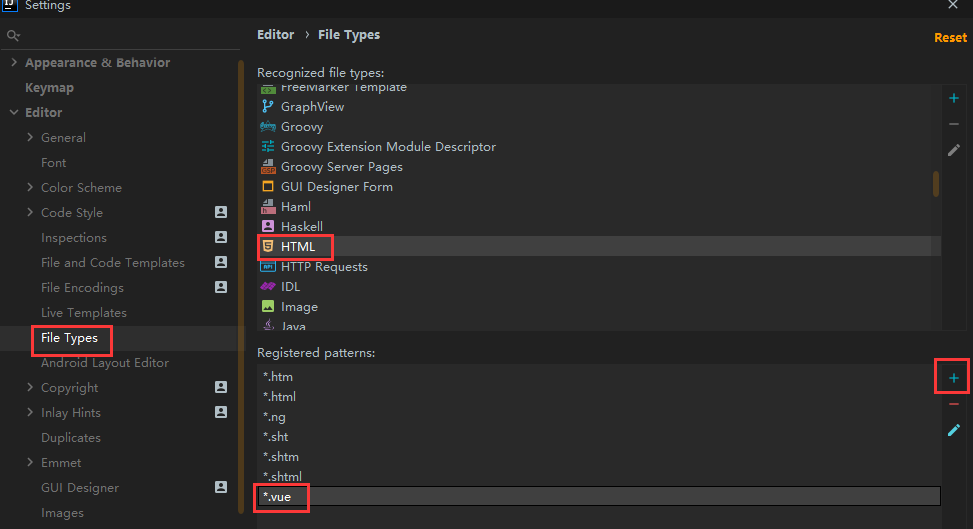
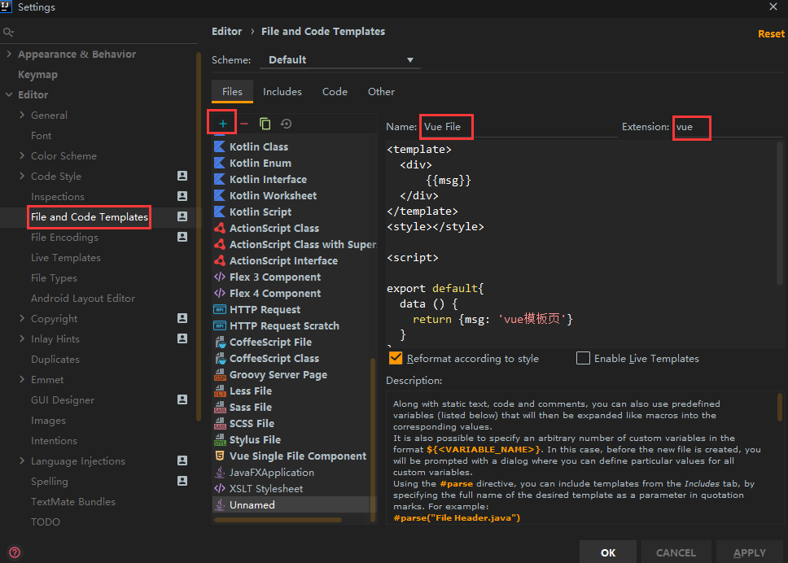
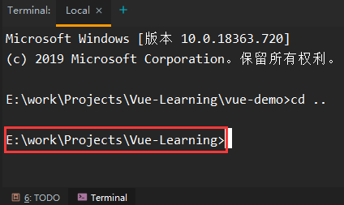
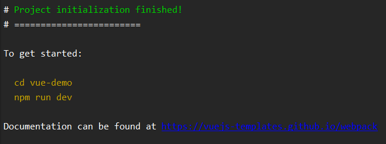
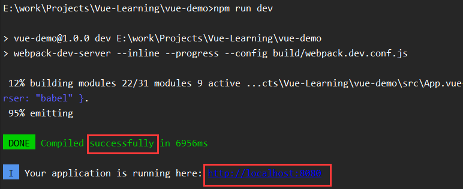
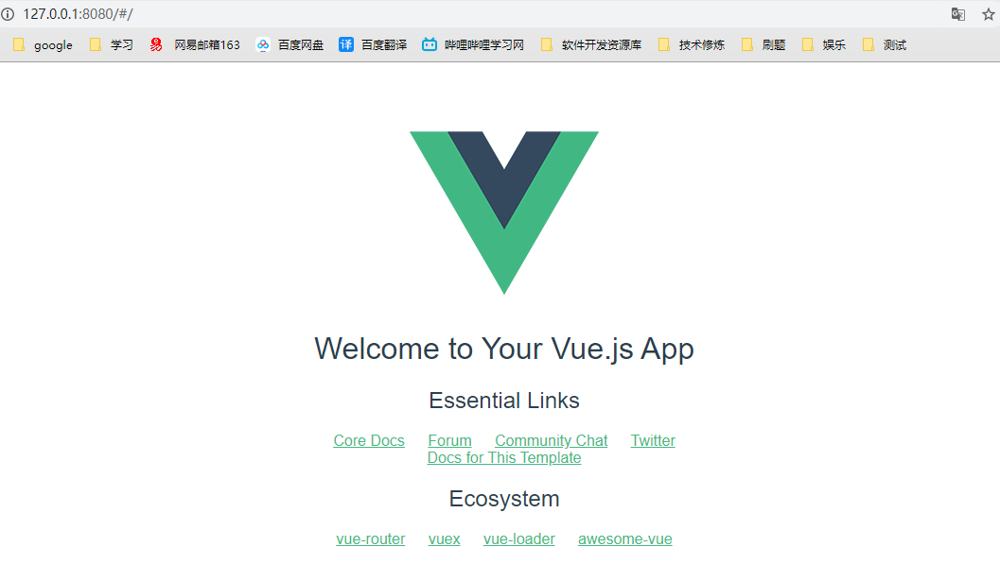

# IDEA 搭建 Vue 项目 Demo

## 前言

本人在学习计算机专业知识的过程中，深知学习笔记的重要性，所以整理了相关学习笔记，为了在需要的时候方便查看，目前正在逐渐完善和补充中，如果本学习笔记有幸被您光顾和使用，在使用中出现任何疑问或者有更好的见解的话，可以右下角 OPEN CHAT 我，也可以右上角 邮我，当然还可以加入我的讨论组，如果觉得本书对你有帮助，可以打赏我，以鼓励我更好的创作，下面附赞助二维码，再次谢谢您的大力支持！

<div ></div>

> 觉得文章好，不妨请我喝杯 Coffee，祝福好心人年年高升！

## 环境准备

### 安装 node.js


### 安装 vue-li

> 全局安装 vue-cli，在命令行中执行：npm install -g vue-cli



### 安装 vue.js

* 打开 IDEA，File --> Settings --> Plugins 中搜索 vue.js 进行安装


## 配置 IDEA

### HTML 添加 *.vue类型

* File --> Settings --> Editor --> File Types --> HTML 选中  点下方的 + 添加 *.vue 后缀



### 设置 js

* File --> Settings --> Language & Frameworks --> JavaScript 选择 ECMAScript 6  和勾选 Prefer Strict mode(如果有的话。没有就算了)

### 设置 vue 模版

* 可添可不添
* File --> Settings --> Editor --> File and Code Templates --> +



Vue File：

```vue
<template>
  <div>
      {{msg}}
  </div>
</template>
<style></style>

<script>

export default{
  data () {
    return {msg: 'vue模板页'}
  }
}
</script>
```

## 创建 vue 项目 Demo

* 选择一个想要创建 vue 项目的文件夹，打开 Terminal 可以看到当前的目录



* 输入 vue init webpack project-name，回车 （ project-name 为项目名 ）

  * 举例：（ vue-demo 必须为空文件夹，否则可能会安装失败 ）

  * ```vue
     vue init webpack vue-demo
    ```

  * 初始化的时候会询问安装的细节：( 可以参考 )

  * ```vue
    ？Project name ---- 项目名称，直接回车即可；
    
    ？Project description ---- 项目描述，按需填写。无需填写可以直接回车；
    
    ？Author ---- 作者
    
    ？Vue build ---- 构建模式，一般默认第一个；
    
    ？Install vue-router? ---- 是否安装vue-router。选Y。后边构建项目会用到。
    
    ？Use ESLint to lint yout code? ---- 格式校验，按需；
    
    ？Set up unit tests ---- 测试相关，按需；
    
    ？Setup e2e tests with Nightwatch? ---- 测试相关，按需；
    
    ？Should we run ‘npm install’ for you after the project has been created? ---- 按需，这里我选Yes, use NPM。如果选No，后续自己在目标
    
    目录下执行npm install即可。
    ```

  * Result：初始化成功



!> 这样构建出来的项目，可以直接运行。进入项目所在目录，执行 npm run dev，执行完看到以下提示：




输入 [http://localhost:8080](http://localhost:8080/)  就可以看到这个页面了：




