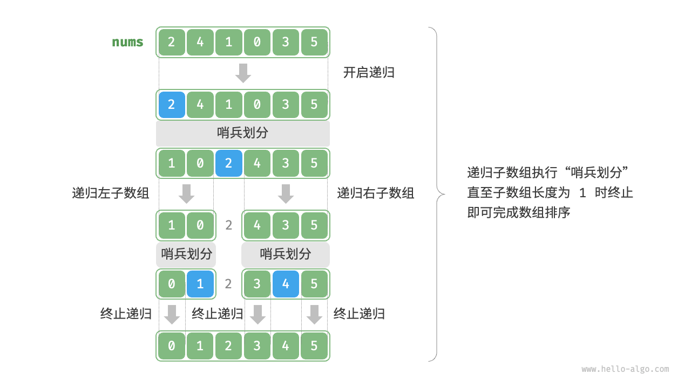
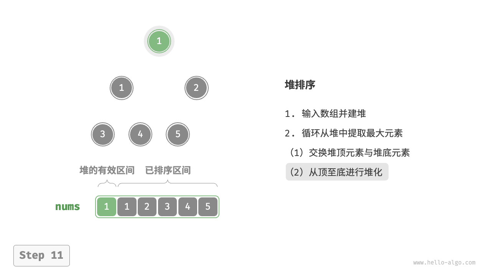
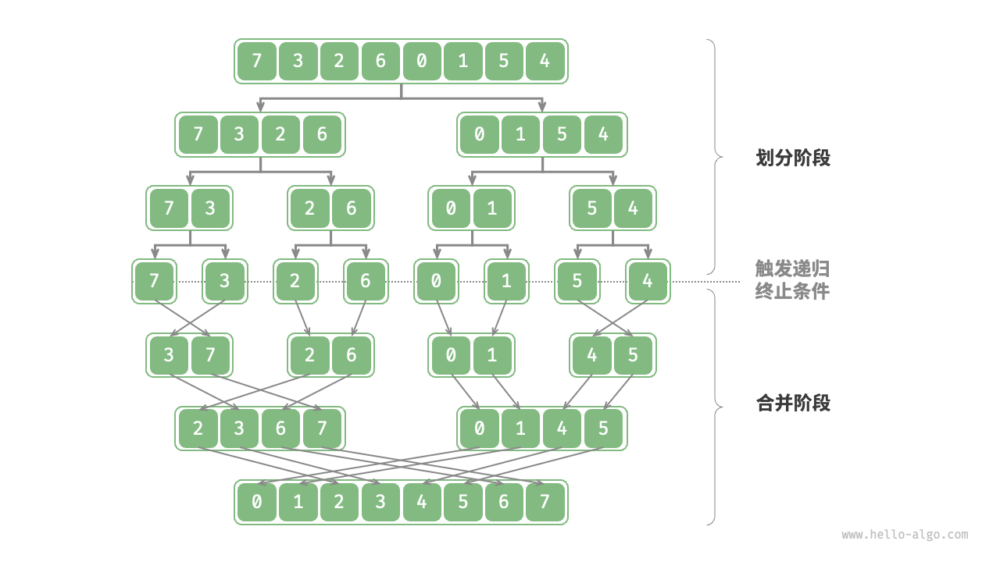

## 快速、归并、堆、希尔

### 快速排序（Quick Sort）：
* <u>思想：快速排序的核心操作是“哨兵划分”。选取一个基准元素作为哨兵，将数组分为比基准元素小和比基准元素大的两个部分，对这两个部分分别进行快速排序，重复进行直到整个数组排序完成。</u>
* <span style="color: rgb(255, 41, 65);">不稳定排序</span>
* 算法流程：
    1. 首先，对原数组执行一次“哨兵划分”，得到未排序的左子数组和右子数组。
    2. 然后，对左子数组和右子数组分别递归执行“哨兵划分”。
    3. 持续递归，直至子数组长度为 1 时终止，从而完成整个数组的排序。
* 图解：


* 代码：
    ```golang
    /* 哨兵划分 */
    func (q *quickSort) partition(nums []int, left, right int) int {
        // 以 nums[left] 为基准数
        i, j := left, right
        for i < j {
            for i < j && nums[j] >= nums[left] {
                j-- // 从右向左找首个小于基准数的元素
            }
            for i < j && nums[i] <= nums[left] {
                i++ // 从左向右找首个大于基准数的元素
            }
            // 元素交换
            nums[i], nums[j] = nums[j], nums[i]
        }
        // 将基准数交换至两子数组的分界线
        nums[i], nums[left] = nums[left], nums[i]
        return i // 返回基准数的索引
    }

    /* 快速排序 */
    func (q *quickSort) quickSort(nums []int, left, right int) {
        // 子数组长度为 1 时终止递归
        if left >= right {
            return
        }
        // 哨兵划分
        pivot := q.partition(nums, left, right)
        // 递归左子数组、右子数组
        q.quickSort(nums, left, pivot-1)
        q.quickSort(nums, pivot+1, right)
    }
    ```

### 堆排序（Heap Sort）：
* <u>思想：将数组构建成一个最大堆或最小堆，每次取出堆顶元素，然后重新调整堆，重复进行直到整个数组排序完成。</u>
* <span style="color: rgb(255, 41, 65);">不稳定排序</span>
* 算法流程：
    1. 输入数组并建立大顶堆。最大元素位于堆顶。
    2. `将堆顶元素与堆底元素交换`。完成交换后，堆的长度减 $1$ ，已排序元素数量加 $1$ 。
    3. 重新执行堆化操作（sift down）。完成堆化后，堆的性质得到修复（堆顶为当前最大元素）。
    4. 循环执行第`2`步和第`3`步。循环 $n - 1$ 轮后，即可完成数组排序。
* 图解：



* 代码：
    ```golang
    /* 堆的长度为 n ，从节点 i 开始，从顶至底堆化 */
    func siftDown(nums *[]int, n, i int) {
        for true {
            // 判断节点 i, l, r 中值最大的节点，记为 ma
            l := 2*i + 1
            r := 2*i + 2
            ma := i
            if l < n && (*nums)[l] > (*nums)[ma] {
                ma = l
            }
            if r < n && (*nums)[r] > (*nums)[ma] {
                ma = r
            }
            // 若节点 i 最大或索引 l, r 越界，则无须继续堆化，跳出
            if ma == i {
                break
            }
            // 交换两节点
            (*nums)[i], (*nums)[ma] = (*nums)[ma], (*nums)[i]
            // 循环向下堆化
            i = ma
        }
    }

    /* 堆排序 */
    func heapSort(nums *[]int) {
        // 建堆操作：堆化除叶节点以外的其他所有节点
        for i := len(*nums)/2 - 1; i >= 0; i-- {
            siftDown(nums, len(*nums), i)
        }
        // 从堆中提取最大元素，循环 n-1 轮
        for i := len(*nums) - 1; i > 0; i-- {
            // 交换根节点与最右叶节点（交换首元素与尾元素）
            (*nums)[0], (*nums)[i] = (*nums)[i], (*nums)[0]
            // 以根节点为起点，从顶至底进行堆化
            siftDown(nums, i, 0)
        }
    }

    ```

### 归并排序（Merge Sort）：
* <u>思想：将数组分成两个部分，对每个部分分别进行排序，然后将两个已排序的部分合并成一个有序的数组。</u>
* $O(nlogn)$ 中唯一<span style="color: rgb(255, 41, 65);">的稳定排序</span>
* <span style="color: rgb(255, 41, 65);">归并排序与二叉树后序遍历的递归顺序是一致的</span>
* 空间复杂度为$O(n)$、非原地排序,合并时需要借助辅助数组实现
* 算法流程：
    * `划分阶段`：
        * 通过递归不断地将数组从中点处分开，将长数组的排序问题转换为短数组的排序问题。
            * 从顶至底递归地将数组从中点切分为两个子数组。
            * 计算数组中点 `mid` ，递归划分左子数组（区间 `[left, mid]` ）和右子数组（区间 `[mid + 1, right]` ）。
            * 递归执行步骤 `1.` ，直至子数组区间长度为 1 时终止。
    * 合并阶段：
        * 当子数组长度为 1 时终止划分，从底至顶地开始合并。持续地将左右两个较短的有序数组合并为一个较长的有序数组，直至结束。
* 图解：


* 代码：
    ```golang
    /* 合并左子数组和右子数组 */
    func merge(nums []int, left, mid, right int) {
        // 左子数组区间为 [left, mid], 右子数组区间为 [mid+1, right]
        // 创建一个临时数组 tmp ，用于存放合并后的结果
        tmp := make([]int, right-left+1)
        // 初始化左子数组和右子数组的起始索引
        i, j, k := left, mid+1, 0
        // 当左右子数组都还有元素时，进行比较并将较小的元素复制到临时数组中
        for i <= mid && j <= right {
            if nums[i] <= nums[j] {
                tmp[k] = nums[i]
                i++
            } else {
                tmp[k] = nums[j]
                j++
            }
            k++
        }
        // 将左子数组和右子数组的剩余元素复制到临时数组中
        for i <= mid {
            tmp[k] = nums[i]
            i++
            k++
        }
        for j <= right {
            tmp[k] = nums[j]
            j++
            k++
        }
        // 将临时数组 tmp 中的元素复制回原数组 nums 的对应区间
        for k := 0; k < len(tmp); k++ {
            nums[left+k] = tmp[k]
        }
    }

    /* 归并排序 */
    func mergeSort(nums []int, left, right int) {
        // 终止条件
        if left >= right {
            return
        }
        // 划分阶段
        mid := left + (right - left) / 2
        mergeSort(nums, left, mid)
        mergeSort(nums, mid+1, right)
        // 合并阶段
        merge(nums, left, mid, right)
    }

    ```

### 希尔排序（Shell Sort）：
* <u>思想：插入排序的改进版，先将数组按照一定间隔分为若干个子序列，对每个子序列进行插入排序，然后缩小间隔再进行排序，直到间隔为 1 时进行最后一次排序。</u>
* <span style="color: rgb(255, 41, 65);">不稳定排序</span>
* 代码：
    ```golang
    func shellSort(arr []int) {
        n := len(arr)
        for gap := n / 2; gap > 0; gap /= 2 {
            for i := gap; i < n; i++ {
                temp := arr[i]
                j := i
                for j >= gap && arr[j-gap] > temp {
                    arr[j] = arr[j-gap]
                    j -= gap
                }
                arr[j] = temp
            }
        }
    }

    ```