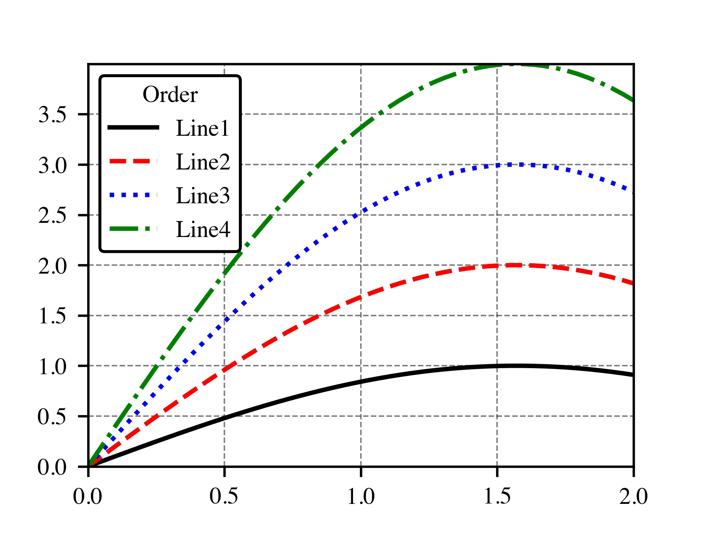
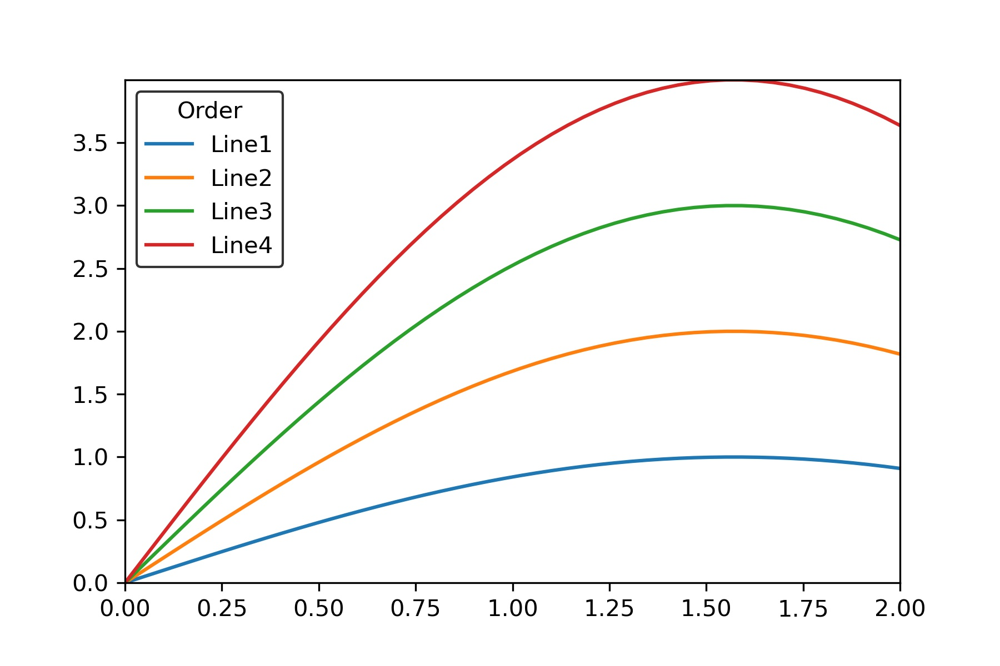
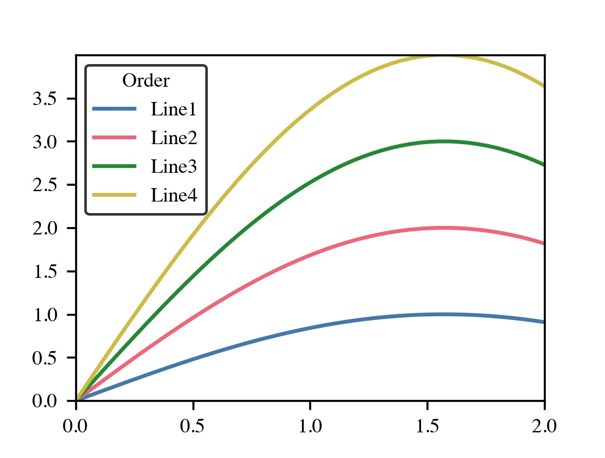
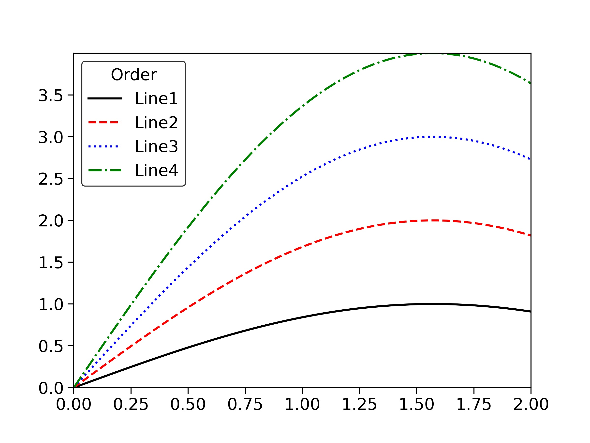
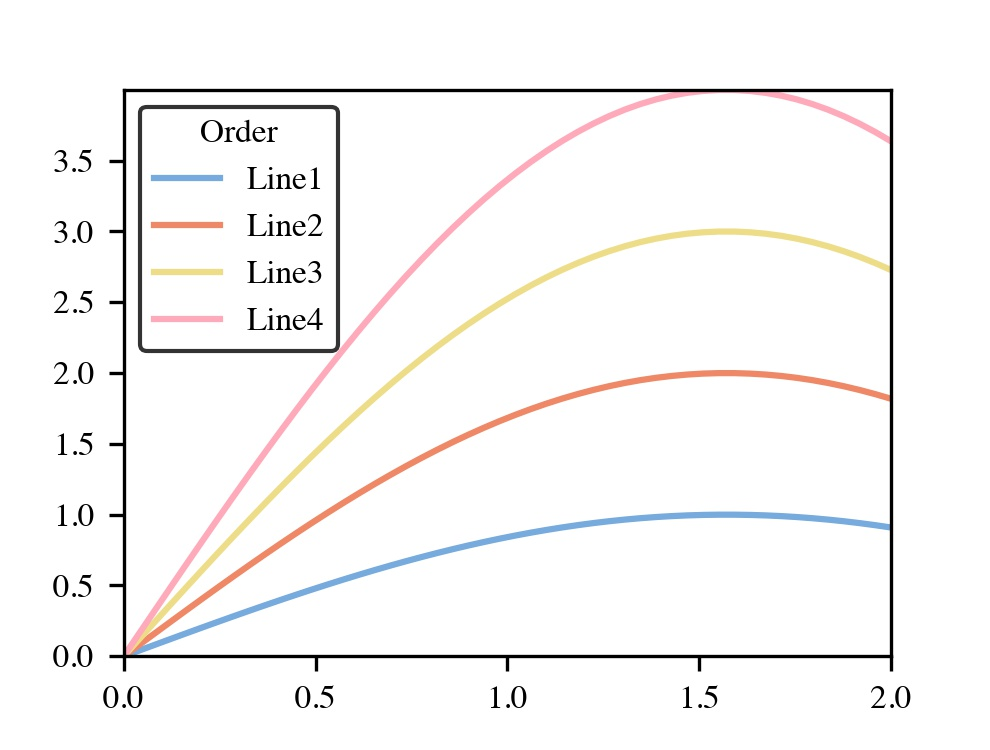
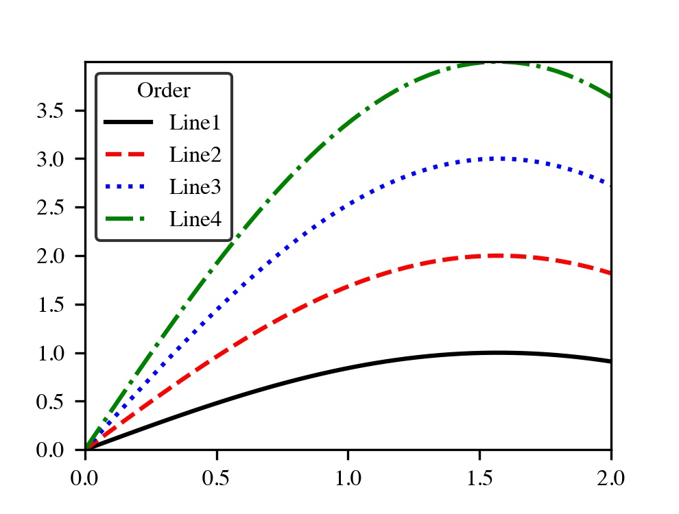
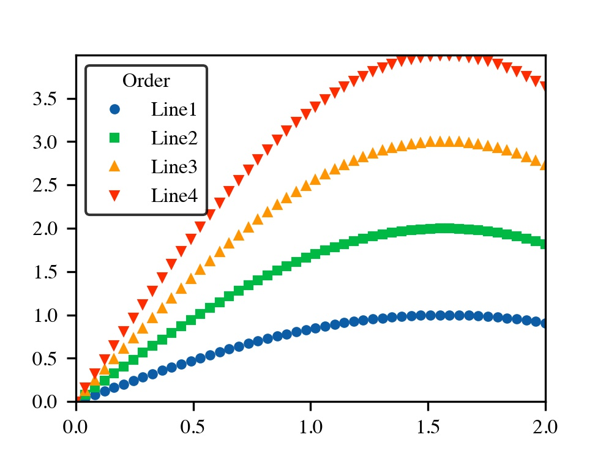
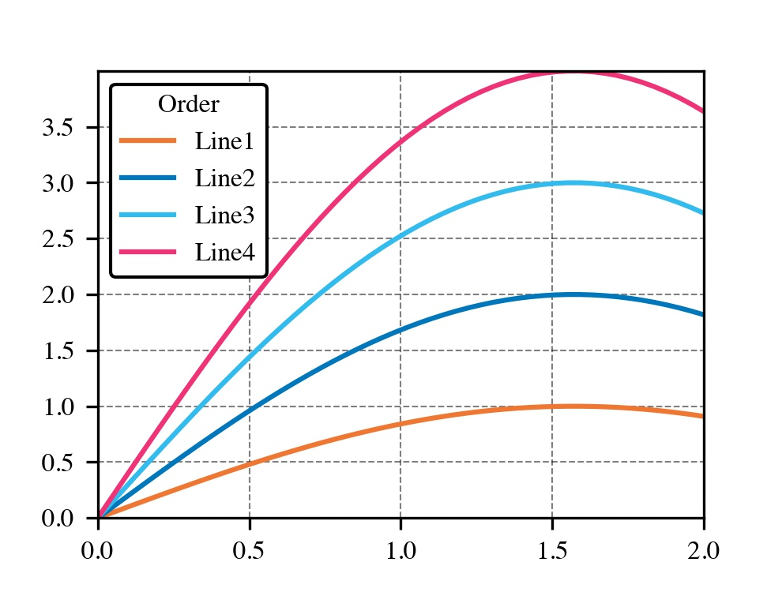

# SciencePlots: 一款论文绘图神器

> 说明：SciencePlots是一个基于Matplotlib的补充包，主要包含了一些图表样式配置文件，通过调用这些文件，就可以绘制出比较好看的数据可视化图表。从而避免了每次画图时都要从头开始手动配置图表的格式。
>
> 目前只支持折线图和散点图的作图，暂时不支持柱状图之类的图表。

## 安装方式

> 推荐第一种安装方式，可以下载最新的配置文件

```python
# for latest version
pip install git+https://github.com/garrettj403/SciencePlots.git

# for last release
pip install SciencePlots
```

该工具包主要由以下几种配置文件组成：

* 主题类型: Science，IEEE以及scatter(散点图)类型。这类配置文件主要是对图片的大小、分辨率、字体的大小和种类、折线的类型和marker的大小形状等的配置。
* 颜色类型: bright, high-vis等风格。改变图表中的曲线颜色。
* 网格类型: grid. 如果你希望你的图表中有网格，导入它即可。 

## 使用方式

使用方式有3种，不过在这里我比较推荐使用以下这种方式：

```python
import numpy as  np 
import matplotlib.pyplot as plt
with plt.style.context(['ieee','grid']):
    x = np.linspace(0.0,2.0)
    y = np.sin(x)
    plt.plot(x,y,label = "Line1")
    plt.plot(x,2*y, label = "Line2")
    plt.plot(x,3*y, label = "Line3")
    plt.plot(x,4*y, label = "Line4")
    plt.autoscale(tight = True)
    plt.legend(title = 'Order', edgecolor = 'k')
    plt.show()
```

> 这种方式能够保证只有在with语句中的图表才会采用ieee, grid的风格，不会影响到with语句之外的图表风格。

绘制效果图如下：



不使用SciencePlots的时候，执行下列案例代码：

```python
import numpy as  np 
import matplotlib.pyplot as plt

x = np.linspace(0,2)
y = np.sin(x)
plt.plot(x,y,label = "Line1")
plt.plot(x,2*y, label = "Line2")
plt.plot(x,3*y, label = "Line3")
plt.plot(x,4*y, label = "Line4")
plt.autoscale(tight = True)
plt.legend(title = 'Order', edgecolor = 'k')
plt.savefig('test1.jpg', dpi=300)
plt.show()
```

效果图如下：



如果查看该工具支持的风格呢？执行下列代码：

```python
import matplotlib 

print(matplotlib.get_configdir())
```

执行这段代码，会获取到风格样式配置文件所在的地址，会看到里面会包含很多风格文件，如下：


> 🎁 这些配置文件可以根据自己的需求进行修改，可以尝试尝试自己定制绘图样式喔！

下面分享一些SciencePlots提供的其他样式，来感受一下这个工具包的完美！听说已经有不少发表的文章使用了这个工具包，感兴趣的可以试试看。

样式一：

```python
import numpy as  np 
import matplotlib.pyplot as plt
with plt.style.context(['ieee', 'bright']):
    x = np.linspace(0,2)
    y = np.sin(x)
    plt.plot(x,y,label = "Line1")
    plt.plot(x,2*y, label = "Line2")
    plt.plot(x,3*y, label = "Line3")
    plt.plot(x,4*y, label = "Line4")
    plt.autoscale(tight = True)
    plt.legend(title = 'Order', edgecolor = 'k')
    plt.savefig('test2.jpg', dpi=300)
    plt.show()
```

效果图如下：



样式二：

```python
import numpy as  np 
import matplotlib.pyplot as plt
with plt.style.context(['ieee', 'notebook']):
    x = np.linspace(0,2)
    y = np.sin(x)
    plt.plot(x,y,label = "Line1")
    plt.plot(x,2*y, label = "Line2")
    plt.plot(x,3*y, label = "Line3")
    plt.plot(x,4*y, label = "Line4")
    plt.autoscale(tight = True)
    plt.legend(title = 'Order', edgecolor = 'k')
    plt.savefig('test3.jpg', dpi=300)
    plt.show()
```

效果图如下：



样式三：

```python
import numpy as  np 
import matplotlib.pyplot as plt
with plt.style.context(['ieee', 'light']):
    x = np.linspace(0,2)
    y = np.sin(x)
    plt.plot(x,y,label = "Line1")
    plt.plot(x,2*y, label = "Line2")
    plt.plot(x,3*y, label = "Line3")
    plt.plot(x,4*y, label = "Line4")
    plt.autoscale(tight = True)
    plt.legend(title = 'Order', edgecolor = 'k')
    plt.savefig('test4.jpg', dpi=300)
    plt.show()
```

效果图如下：



样式四：

```python
import numpy as  np 
import matplotlib.pyplot as plt
with plt.style.context(['ieee']):
    x = np.linspace(0,2)
    y = np.sin(x)
    plt.plot(x,y,label = "Line1")
    plt.plot(x,2*y, label = "Line2")
    plt.plot(x,3*y, label = "Line3")
    plt.plot(x,4*y, label = "Line4")
    plt.autoscale(tight = True)
    plt.legend(title = 'Order', edgecolor = 'k')
    plt.savefig('test5.jpg', dpi=300)
    plt.show()
```

效果图如下：



样式五：

```python
import numpy as  np 
import matplotlib.pyplot as plt
with plt.style.context(['ieee', 'scatter']):
    x = np.linspace(0,2)
    y = np.sin(x)
    plt.plot(x,y,label = "Line1")
    plt.plot(x,2*y, label = "Line2")
    plt.plot(x,3*y, label = "Line3")
    plt.plot(x,4*y, label = "Line4")
    plt.autoscale(tight = True)
    plt.legend(title = 'Order', edgecolor = 'k')
    plt.savefig('test6.jpg', dpi=300)
    plt.show()
```

效果图如下：



样式六：

```python
import numpy as  np 
import matplotlib.pyplot as plt
with plt.style.context(['ieee', 'scatter', 'grid']):
    x = np.linspace(0,2)
    y = np.sin(x)
    plt.plot(x,y,label = "Line1")
    plt.plot(x,2*y, label = "Line2")
    plt.plot(x,3*y, label = "Line3")
    plt.plot(x,4*y, label = "Line4")
    plt.autoscale(tight = True)
    plt.legend(title = 'Order', edgecolor = 'k')
    plt.savefig('test7.jpg', dpi=300)
    plt.show()
```

效果图如下：


样式七：

```python
import numpy as  np 
import matplotlib.pyplot as plt
with plt.style.context(['ieee', 'grid', 'vibrant']):
    x = np.linspace(0,2)
    y = np.sin(x)
    plt.plot(x,y,label = "Line1")
    plt.plot(x,2*y, label = "Line2")
    plt.plot(x,3*y, label = "Line3")
    plt.plot(x,4*y, label = "Line4")
    plt.autoscale(tight = True)
    plt.legend(title = 'Order', edgecolor = 'k')
    plt.savefig('test8.jpg', dpi=300)
    plt.show()
```

效果图如下：



> 🦜 当然风格样式还有很多，不同组合方式会有不同的效果，如果感兴趣的话，可以自己尝试尝试复现一下！

