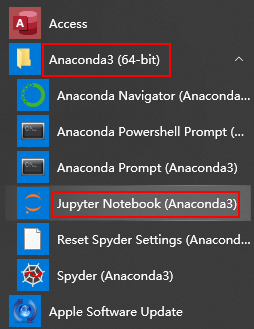
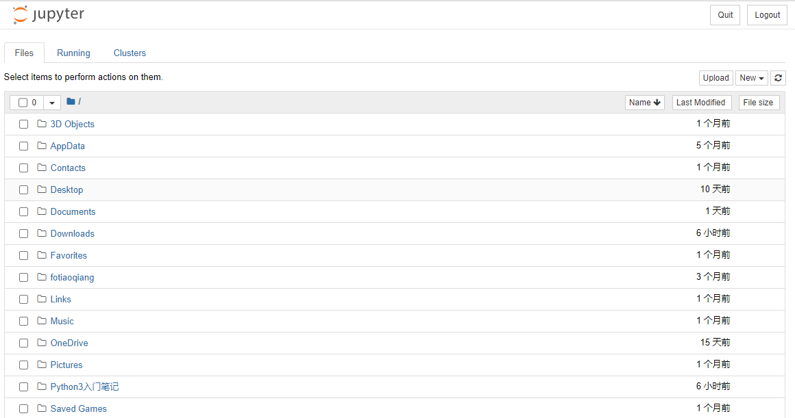
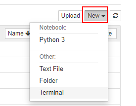
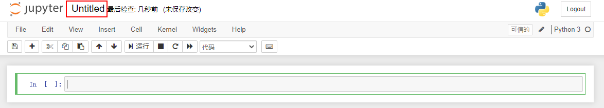
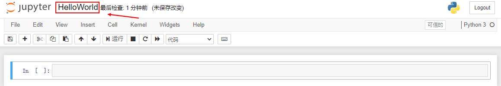
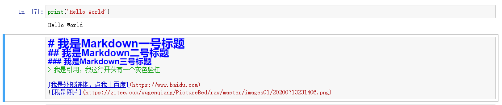
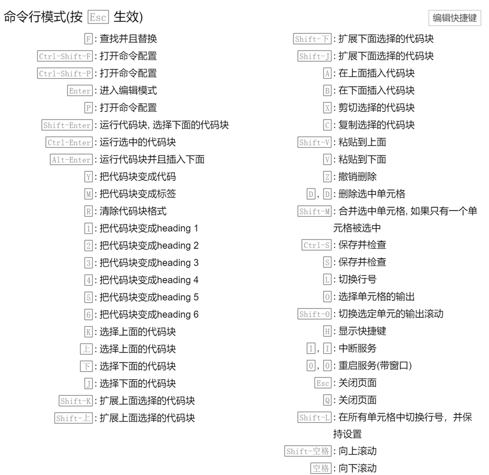
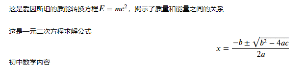

# Jupyter notebook 使用指南

## 前言

在我们的日常学习中，能够编写和运行 Python 文件的程序很多，比如 Python 安装自带的 IDE、程序员喜爱的Pycharm、数据科学全家桶 Anaconda，还有 Spyder、Thonny 等。就我个人使用而言，如果进行大型项目推荐使用 Pycharm，如果进行数据处理和分析，最好选用 Jupyter notebook。可以说，**Jupyter notebook 是用Python 进行数据科学、机器学习的必备工具。**


> 🔊 突出优点：

- 学习 Jupyter notebook 非常容易，按照我的教程一步一步做，再自己尝试一下，之后写代码即可健步如飞。

- 能够独立运行一个、几个或全部 Python 代码块，更容易看到中间变量的值，从而进行调试
- 可以插入 Markdown 说明文字和 Latex 数学公式，让枯燥的代码充满颜值，可读性爆表
- 能够调用 Ipython 丰富的“魔法函数”，比如程序计时、重复运行、显示图片等
- 写好的代码和文档能够以网页和 ppt 的形式在线分享。[在线看 Jupyter notebook 文件 ](https://nbviewer.jupyter.org/)
- 可以在云端远程服务器运行，不需本地安装配置各种环境。[体验一下](https://jupyter.org/try)

🔔 文件中包含了 Markdown 说明文档、代码块、代码运行结果、图片嵌入等元素，特别适合 Python 数据科学和机器学习撰写文档。

🔔 吴恩达的《深度学习》慕课的课后编程作业、大数据竞赛网站 Kaggle 上的代码文档、美国大学的数据科学课程的课后资料及编程作业，都是以 Jupyter notebook 文件的形式给出的，也就是`.ipynb`文件。

> 其实 Jupyter notebook 不止可以运行 Python，还可以运行 Julia、R、Javascript 等语言，这也是`jupyter`这个名字的由来。[Jupyter notebook 支持的编程语言](https://github.com/jupyter/jupyter/wiki/Jupyter-kernels)

🔔 Jupyter notebook 集编程和写作于一身，这就叫做“文学编程”。

## 安装和运行

> 在浏览器网页中运行 Python

### Ipython 内核

Ipython 是更高级的 Python 解释器，而 Jupyter notebook 是基于 Ipython 内核的，在浏览器中以网页形式运行 Python 代码的工具，十分方便。

> Ipython 是啥？
>
> Ipython 可以理解成更高级的 Python 解释器，相比原生的 Python 交互式命令行，Ipython 有更强大的命令计数、自动补全等交互功能。
>
> Spyder 和 Jupyter notebook 都是以 Ipython 为内核的。


### 安装 Jupyter notebook

如果你安装了 Python 数据科学全家桶 Anaconda，那么其中自带了 Jupyter notebook。



如果你没安装 Anaconda，可以直接在命令行里运行这行命令

```shell
pip install jupyter -i //pypi.tuna.tsinghua.edu.cn/simple
```


### 运行 Jupyter notebook

打开命令行，输入 `jupyter notebook`，回车。稍等片刻即可跳出浏览器网页。



🎉 看右上角：



* 点击 New --> Python3 即可创建 Python 文档。

* 点击 New --> Folder 可以创建新文件夹。

* 点击 New --> Text File 可以创建空的`.txt`文件。

* 点击 New --> Terminal 可以打开操作系统命令行，你可以使用操作系统对应的命令行进行目录切换、解压文件等操作。

🔊 最常用的是点击右边的 New --> Python3，创建 Python 文档。

## 使用写代码

### 写下并运行第一行 Python 代码

点击左上角`Untitled`给新建的 Python 文档文件重新命名。



自古第一行代码，总是会写 Hello World，故名称设置为了 HelloWorld



在代码框中输入第一行 Python 代码，`shift + 回车`运行


### 蓝绿两模式：命令模式、编辑模式

Jupyter notebook 中，代码和文档都存在于一个个单元格中，每个单元格都有`蓝色`和`绿色`两种状态。

- 命令模式（蓝色）：用于执行键盘输入的快捷命令（新增单元格、剪切、复制等等）。通过 `Esc` 键从绿色的编辑模式切换到蓝色的命令模式，此时单元左侧显示蓝色竖线。

- 编辑模式（绿色）：编辑文本和代码。选中单元并按 `Enter` 键进入编辑模式，此时单元左侧显示绿色竖线。

> 命令模式和编辑模式，其实是源自于著名的 vim 编辑器，vim 编辑器以特别难学和学成之后可以超神而闻名于世。

### 两种单元格：代码单元格和 Markdown 单元格

Jupyter notebook 中，有两种单元格：代码单元格和 Markdown 单元格。

- 代码单元格：这里是你编写代码的地方，通过按 `Shift + Enter` 运行代码，其结果显示在本单元下方。代码单元左边有 `In [1]:` 这样的序列标记，方便人们查看代码的执行次序。在蓝色命令模式下，按`y`键可以将 Markdown 单元格转换为代码单元格。
- Markdown 单元格：在这里对文本进行编辑，采用 markdown 的语法规范，可以设置文本格式、插入链接、图片甚至数学公式。同样使用 `Shift + Enter` 运行 markdown 单元来显示渲染后的文本。在蓝色命令模式下按`m`键可以将代码单元格转换为 Markdown 单元格。

> Markdown 是程序员通用的撰写文档的语法，可以轻松实现标题、引用、链接、图片等，非常简洁易学，Github 代码托管网站、有道云笔记、简书、知乎、CSDN 论坛、电子邮件等都支持 Markdown 语法。
>

编辑 Markdown 单元格，输入以下内容：

```
# 我是Markdown一号标题
## 我是Markdown二号标题
### 我是Markdown三号标题
> 我是引用，我这行开头有一个灰色竖杠

[我是外部链接，点我上百度](https://www.baidu.com)

```

如下图：




然后按`shift`+`Enter`运行该单元格。


## 抛弃鼠标，只用键盘

下面介绍 Jupyter notebook 快捷键，掌握这些快捷键之后，你将彻底解放你拿鼠标的那只手，更专注、高效地敲代码了。

### 最常用快捷键（必会）

| 快捷键        | 释义                               |
| ------------- | ---------------------------------- |
| h             | 查看所有快捷键                     |
| Enter         | 从命令模式进入编辑模式             |
| Esc           | 从编辑模式退回到命令模式           |
| m             | 将代码单元格转换为 Markdown 单元格 |
| y             | 将 Markdown 单元格转换为代码单元格 |
| shift + Enter | 运行本单元格，选择下面的代码块     |
| ctrl + Enter  | 运行本单元格                       |
| alt + Enter   | 运行本单元格，在下方新建一个单元格 |
| a             | 在上方新建一个单元格（above）      |
| b             | 在下方新建一个单元格（below）      |
| d             | 删除选中的单元格（delete）         |
| x             | 剪切本单元格                       |
| c             | 复制本单元格                       |
| shift + v     | 粘贴到上面                         |
| v             | 粘贴到下面                         |
| l             | 显示代码行号                       |


### 所有快捷键

h 查看所有快捷键




## 在 Markdown 单元格中输入数学公式

分别在两个 Markdown 单元格内输入以下内容：

```latex
这是爱因斯坦的质能转换方程$E=mc^2$，揭示了质量和能量之间的关系
```

```latex
这是一元二次方程求解公式
$$x = \frac{-b\pm \sqrt{b^2-4ac}}{2a}$$
初中数学内容
```


按`shift`+`Enter`渲染运行：



