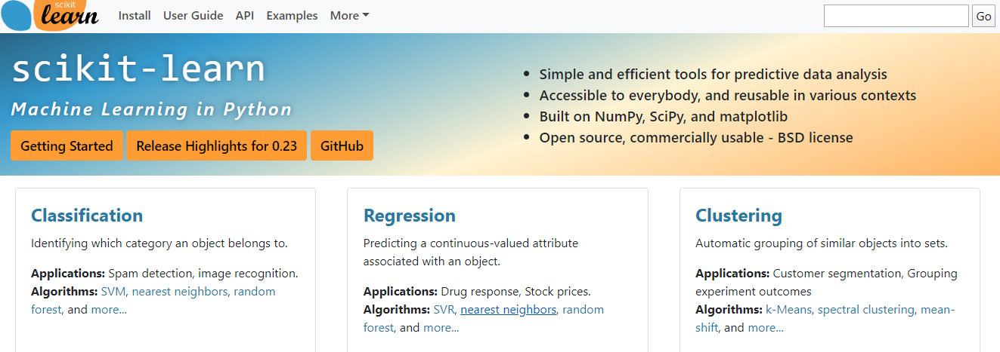
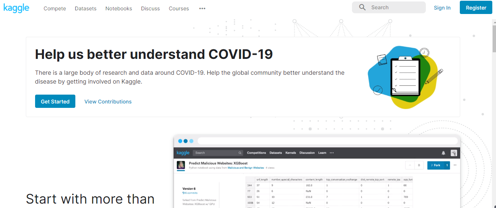
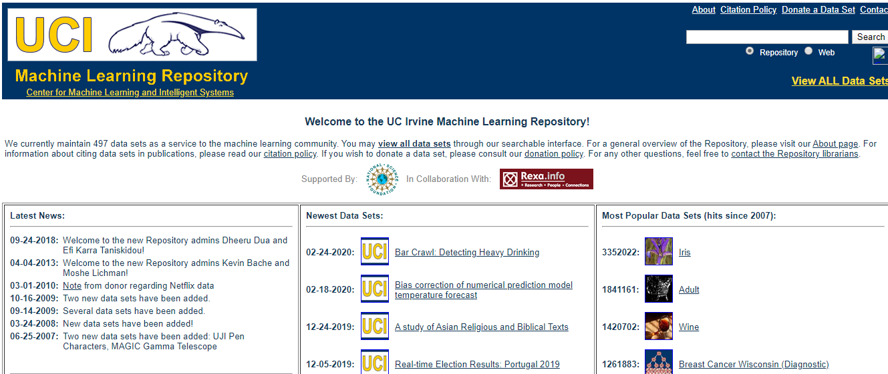

# Python 王国 ✨

## Python 入门学习笔记

对于还没入门的小伙伴们，推荐先跟[6 小时 Python 入门学习笔记](../00-Python入门学习笔记/6小时Python入门.md)这篇文档敲一遍，行云流水之后对 Python 有了初步的认识，继而根据下面章节深入学习：

* [1 - Python 基础](../00-Python入门学习笔记/CH1-Python基础.md)
* [2 - 函数](../00-Python入门学习笔记/CH2-函数.md)
* [3 - 高级特性](../00-Python入门学习笔记/CH3-高级特性.md)
* [4 - 函数式编程](../00-Python入门学习笔记/CH4-函数式编程.md)
* [5 - 模块](../00-Python入门学习笔记/CH5-模块.md)
* [6 - 面向对象编程](../00-Python入门学习笔记/CH6-面向对象编程.md)
* [7 - 面向对象高级编程](../00-Python入门学习笔记/CH7-面向对象高级编程.md)
* [8 - 错误、调试和测试](../00-Python入门学习笔记/CH8-错误、调试和测试.md)
* [9 - IO 编程](../00-Python入门学习笔记/CH9-IO编程.md)
* [10 - 进程和线程](../00-Python入门学习笔记/CH10-进程和线程.md)
* [11 - 正则表达式](../00-Python入门学习笔记/CH11-正则表达式.md)

## Python 数据分析

### 开源的 Python 工具包

#### Anaconda

> 开源的 Python 包管理器，其包含了 conda、Python 等 180 多个科学包及其依赖项

* [Anaconda 入门指南](docs/software-engineering/04-python/Python/Anaconda/Anaconda入门指南.md)

#### Sklearn

Python 上最流行的机器学习/数据科学工具包。

* [Sklearn](https://scikit-learn.org/stable/)

### 数据集来源

#### Kaggle

* [kaggle.com](https://kaggle.com) 是一个进行数据科学项目的地方，一般我会在这里获取测试数据

#### UCI

* [UCI 公开数据集](http://archive.ics.uci.edu/ml/index.php)

