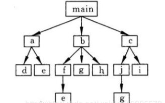

# C 语言面试题

## 基础知识

### 什么是程序

* 程序：一组计算机能识别和执行的指令，每一条指令使计算机执行特定的操作，只要让计算机执行这个程序，计算机就会自动地、有条不紊地进行工作。
  计算机的一切操作都是由程序控制的，离开程序，计算机将一事无成。
* 一个程序包括以下两方面的信息：
  * （1）**对数据的描述**。在程序中要指定到哪些数据以及这些数据的类型和结构的组织形式，这就是**数据结构**。
  * （2）**对操作的描述**。即要求计算机进行操作的步骤，也就是**算法**。

### 软件可分为哪两部分

* 系统软件：操作系统、高级语言。
* 应用软件：用户根据自己的实际需要设计一些应用程序，例如学生成绩统计程序、财务管理程序、工程中的计算程序等。

### 介绍一下 C 语言

* C 语言是一种用途广泛、功能强大、使用灵活的过程性编程语言，既可用于编写应用软件，又能用于编写系统软件。因此 C 语言问世以后得到迅速推广。

### 什么是计算机语言

如果想人和计算机交流信息，必须有一种计算机和人都能识别的语言，这就是计算机语言。

### 简述一下计算机语言的发展

* 第一阶段：计算机低级语言

  * 机器语言（由 0 和 1 组成的指令），一般计算机的指令长度为 16，即以 16 个二进制数（0 或 1）组成一条指令，难以推广使用。
  * 汇编语言（用英文字母和数字表示指令），例如用 ADD 代表“加”，SUB 代表“减”，不能直接执行，汇编程序翻译成机器语言。
  * 缺点：可移植性差，由于它“贴近”计算机，或者说离计算机“很近”，称为计算机低级语言（low level language）。

* 第二阶段：计算机高级语言（接近于人的自然语言和数学语言）

  计算机也是不能直接识别高级程序语言程序的，也要进行“翻译”。用一种称为编译程序或解释程序的软件把高级语言写的程序（称为源程序，source program）转换为机器指令的程序（称为目标文件，object program），链接目标文件，生成可执行的文件。比如：C、C++、Visual Basic、Java 等

  * 面向过程的语言
    * （1）非结构化的语言：初期的语言属于非结构化的语言，编程风格比较随意，只要符合语法规则即可，没有严格的规范要求，程序中的流程可以随意跳转。人们往往追求程序执行的效率而采用了许多“小技巧”，使程序变得难以阅读和维护。早期的 Basic，Fortrant 和 Algol 等都属于非结构化的语言。
    * （2）结构化语言：为了解决以上问题，提出了“结构化程序设计方法”，规定程序必须由具有良好的基本结构（顺序结构、分支结构、循环结构）构成，程序中的流程不允许随意跳转，程序总是由上而下顺序执行各个基本结构。这种程序结构清晰，易于编写、阅读和维护。Qbasic、Fortran 77 和 C 语言等属于结构化语言，这些语言的特点是支持结构化程序设计方法。
  * 面向对象的语言
    * 近十多年来，在处理规模较大的问题时，开始使用面向对象的语言。C++、C#、Visual Basic 和 Java 等语言是支持面向对象程序设计方法的语言

### C 语言主要特点

* （1）语言简洁、紧凑，使用方便、灵活，只有 37 个关键字、9 种控制语句，程序书写形式自由，源程序短
* （2）运算符丰富
* （3）数据类型丰富
  包括：整型、浮点型、字符型、数组类型、指针类型、结构体类型、共用体类型；
  C99又扩充了复数浮点类型、超长整型（long long）、布尔类型（bool）
  指针类型数据，能用来实现各种复杂的数据结构（如链表、树、栈等）的运算。
* （4）具有结构化的控制语句
  如if…else语句、while语句、do…while语句、switch语句、for语句
  用函数作为程序的模块单位，便于实现程序的模块化。
  C语言是完全模块化和结构化的语言。
* （5）语法限制不太严格，程序设计自由度大
* （6）C语言允许直接访问物理地址，能进行位（bit）操作，能实现汇编语言的大部分功能，可以直接对硬件进行操作。因此C语言既具有高级语言的功能，又具有低级语言的许多功能，可用来编写系统软件。C语言的这种双重性，使它既是成功的系统语言描述，又是通用的程序设计语言。
* （7）用C语言编写的程序可移植性好。由于C的编译系统相当简洁，因此很容易移植到新的系统。而且C编译系统在新的系统上运行时，可以直接编译“标准链接库”中的大部分功能，不需要修改源代码，因为标准链接库是用可移植的C语言写的。因此，几乎在所有的计算机系统中都可以使用C语言。
* （8）生成目标代码质量高，程序执行效率高

### 运行C程序的步骤与方法

（1）上机输入和编辑源程序（.c 文件）
（2）对源程序进行编译（.obj 文件）
（3）进行链接处理（.exe 文件）
（4）运行可执行程序，得到运行结果

### 程序设计的任务

1、问题分析
（1）对于接手的任务要进行认真的分析
（2）研究所给定的条件
（3）分析最后应达到的目标
（4）找出解决问题的规律
（5）选择解题的方法
2、设计算法
设计出解题的方法和具体步骤
3、编写程序
4、对源程序进行编辑、编译和连接
5、运行程序，分析结果
6、编写程序文档

## 算法

### 什么是算法

**广义地说，为解决一个问题而采取的方法和步骤，就称为“算法”。**
对同一个问题，可以有不同的解题方法和步骤。
为了有效地进行解题，不仅需要保证算法正确，还要考虑算法的质量，选择合适的算法。

### 算法的特性

一个有效的算法应该具有以下特点：

（1）有穷性
一个算法应包含有限的操作步骤，而不能是无限的。
（2）确定性
算法中的每一个步骤都应当是确定的，而不应当是含糊的、模棱两可的。
（3）有零个或多个输入
所谓输入是指在执行算法时需要从外界取得必要的信息。
（4）有一个或多个输出
算法的目的是为了求解，“解”就是输出。没有输出的算法是没有意义的。
（5）有效性
算法中的每一个步骤都应当能有效地执行，并得到确定的结果。

### 结构化程序设计方法

结构化程序设计强调程序设计风格和程序结构的规范化，提倡清晰的结构。
结构化程序设计方法的基本思路是：把一个复杂问题的求解过程分阶段进行，每个阶段处理的问题都控制在人们容易理解和处理的范围内。
采取以下方法保证得到结构化的程序：
（1）自顶向下
（2）逐步细化
（3）模块化设计
（4）结构化编码

### 算法有哪些描述方法？各有什么优缺点

（1）自然语言（2）伪代码（3）流程图（4）计算机语言

优缺点：
自然语言通俗易懂，但有歧义性；
伪代码方便实用，但没有流程图明晰，容易犯逻辑错误；
流程图明晰但绘制和修改时比较繁琐；
计算机语言表示算法严谨，但无法做到算法设计的第一步就使用计算机语言，读程序比看流程图要费神很多。

### C 语言有哪两种选择语句

- （1）if 语句，实现两个分支的选择结构
- （2）switch 语句，实现多分支的选择结构

### 结构化的算法有哪几种结构

- 顺序结构：由顺序执行的一组语句或结构组成。
- 分支结构：根据判断条件，做出取舍，要么执行A分支要么执行B分支，必须执行其中的一个，不可全执行也不可全不执行。
- 循环结构：由需要反复执行的一段代码或者结构组成。
  任何算法功能都可以通过以上三种基本程序结构的组合来实现。


## 数据与数据类型

### C 语言数据类型有哪几类？基本数据类型包括哪几类

- 语言提供了丰富的数据类型，可以根据这些数据类型构造出不同的结构。
- C中的数据类型包括：基本类型、构造类型、指针类型、空类型等。
- 其中基本类型包括：整型、字符型、实型（浮点型）等。

### 简述一下常量和变量

* **常量**：在程序运行过程中，其值不能被改变的量
  * 整型常量：如1000,12345，0，-345
    实型常量：如十进制小数形式：0.34 ，-56.79，0.0
    字符常量：如‘？’
    转义字符：如‘\n’
    字符串常量：如“boy”
    符号常量：#define PI 3.1416
* **变量**：在程序运行期间，变量的值是可以改变的
  * 变量必须先定义，后使用；
    定义变量时指定该变量的名字和类型；
    变量名和变量值是两个不同的概念；
    变量名实际上是以一个名字代表的一个存储地址；
    从变量中取值，实际上是通过变量名找到相应的内存地址，从该存储单元中读取数据。
* **常变量**：const int a=3；const就是用来限定一个变量不允许被改变的。

### C 语言中十进制、八进制和十六进制整常量是如何表示的

- 整型常量即整常数。C 整常数可用以下三种形式表示：
- ① 十进制整数；
- ② 八进制整数：以数字 0 开头的数是八进制数，如 0123 表示八进制数 123；
- 十六进制整数：以 0x 开头的数是十六进制数。如 0x123，代表十六进制数 123；

### C 语言中为什么规定对所用到的变量“先定义，后使用”，这样做有什么好处

- （1）便于纠错；
- （2）便于编译系统为变量分配存储空间；
- （3）运算合法性检查；


### 简述一下标识符

* **标识符**：一个对象的名字
  * C 语言规定标识符只能由字母、数字和下划线3种字符组成，且第一个字符必须为字母或下划线。
    合法的标识符：如sum，average，_total，Class，day，BASIC，li_ling
    不合法的标识符：如M.D.John，$123，#33，3D64，a>b


###  C 语句的分类

（1）控制语句：if、switch、for、while、do…while、continue、break、return、goto等
（2）函数调用语句
（3）表达式语句
（4）空语句
（5）复合语句
在C程序中，最常用的语句是：
赋值语句
输入输出语句
其中最基本的是赋值语句

## 预处理

### 什么是预编译

预编译又称预处理，是整个编译过程最先做的工作，即程序执行前的一些预处理工作。主要处理 # 开头的指令。如拷贝 #include 包含的文件代码、替换 #define 定义的宏、条件编译 #if 等。

### 何时需要预编译

* （1）总是使用不经常改动的大型代码体
* （2）程序由多个模块组成，所有模块都使用一组标准的包含文件和相同的编译选项。在这种情况下，可以将所有包含文件预编译为一个预编译头。

### 写一个 “标准” 宏，这个宏输入两个参数并返回较小的一个

```c
#define MIN(x, y) ((x)<(y)?(x):(y)) //结尾没有;
```

### `#` 与 `##` 的作用

`#` 是把宏参数转化为字符串的运算符，`##` 是把两个宏参数连接的运算符。

例如：

```c
#define STR(arg) #arg 则宏 STR(hello)展开时为”hello”
#define NAME(y) name_y 则宏 NAME(1)展开时仍为 name_y
#define NAME(y) name_##y 则宏 NAME(1)展开为 name_1
#define DECLARE(name, type) typename##_##type##_type，
则宏 DECLARE(val, int)展开为 int val_int_type
```

### 如何避免头文件被重复包含

例如，为避免头文件 my_head.h 被重复包含，可在其中使用条件编译：

```c
#ifndef _MY_HEAD_H

#define _MY_HEAD_H /*空宏*/

/*其他语句*/

#endif
```

## 关键字

### static 关键字有什么用途呢

static 的用途主要有两个，一是用于修饰存储类型使之成为静态存储类型，二是用于修饰链接属性使之成为内部链接属性。

* （1）**静态存储类型**

在函数内定义的静态局部变量，该变量存在内存的静态区，所以即使该函数运行结束，静态变量的值不会被销毁，函数下次运行时能仍用到这个值。

在函数外定义的静态变量——静态全局变量，该变量的作用域只能在定义该变量的文件中，不能被其他文件通过 extern 引用。

* （2）**内部链接属性**

静态函数只能在声明它的源文件中使用。


### const 关键字的作用

* （1）声明常态量，使得指定的变量不能被修改

```c
/*a的值一直为5，不能被改变*/
const int a = 5;
/*b的值被赋值为10后，不能被改变*/
const int b; b = 10;
/*ptr为指向整型常量的指针，ptr的值可以修改，但不能修改其所指向的值*/
const int *ptr; 
/*ptr为指向整型的常量指针，ptr的值不能修改，但可以修改其所指向的值*/
int *const ptr;
/*ptr为指向整型常量的常量指针，ptr及其指向的值都不能修改*/
const int *const ptr;
```

* （2）修饰函数形参，使得形参在函数内不能被修改，表示输入参数

```c
int fun(const int a);或int fun(const char *str);
```

* （3）修饰函数返回值，使得函数的返回值不能被修改

```c
const char *getstr(void);使用：const *str= getstr();
const int getint(void); 使用：const int a =getint();
```

### volatile 关键字的作用

volatile 指定的关键字可能被系统、硬件、进程/线程改变，强制编译器每次从内存中取得该变量的值，而不是从被优化后的寄存器中读取。例子:硬件时钟;多线程中被多个任务共享的变量等。

### extern 关键字的作用

* （1）用于修饰变量或函数，表明该变量或函数都是在别的文件中定义的，提示编译器在其他文件中寻找定义。
* （2）用于extern “c“：**为了能够正确实现C++代码调用其他C语言代码**

### sizeof 关键字的作用

sizeof 是在编译阶段处理，且不能被编译为机器码。sizeof 的结果等于对象或类型所占的内存字节数。sizeof 的返回值类型为 size_t。

### 简述 const 的作用，const 与 #define 相比，有何特点

const 只读变量，有类型，而 #define 是定义宏，没有类型。


## 结构体

### 结构体的赋值

C 语言中对结构体变量的赋值或者在初始化或者在定义后按字段赋值。

### 结构体变量如何比较

虽然结构体变量之间可以通过=直接赋值，但不同通过比较符如 == 来比较，因为比较符只作用于基本数据类型。这个时候，只能通过 int memcmp(const void *s1, const void *s2, size_t n); 来进行内存上的比较。

### 结构体位域

位域是一个或多个位的字段，不同长度的字段（如声明为unsigned int类型）存储于一个或多个其所声明类型的变量中（如整型变量中）。

位域的类型：可以是char、short、int，多数使用int，使用时最好带上signed或unsigned

位域的特点：字段可以不命名，如unsigned int :1;可用来填充；unsigned int :0; 0宽度用来强制在下一个整型（因此处是unsigned int类型）边界上对齐。

**位域的好处：**

1.有些信息在存储时，并不需要占用一个完整的字节， 而只需占几个或一个二进制位。例如在存放一个开关量时，只有0和1 两种状态，用一位二进位即可。这样节省存储空间，而且处理简便。这样就可以把几个不同的对象用一个字节的二进制位域来表示。

2.可以很方便的利用位域把一个变量给按位分解。比如只需要4个大小在0到3的随即数，就可以只rand()一次，然后每个位域取2个二进制位即可，省时省空间。

**位域的缺点：**

不同系统对位域的处理可能有不同的结果，如位段成员在内存中是从左向右分配的还是从右向左分配的，所以位域的使用不利于程序的可移植性。

### 结构体成员数组大小为 0

结构体数组成员的大小为 0，是 GNU C 的一个特性。好处是可以在结构体中分配不定长的大小。

```c
typedef struct st
{
	inta;
	int b;
	char c[0];
}st_t;
sizeof(st_t)等于8，即char c[0]的大小为0.
#define SIZE 100
st_t *s = (st_t *)malloc(sizeof(st_t) + SIZE);
```

### 请问C++的类和C里面的struct有什么区别

c++中的类具有成员保护功能，并且具有继承，多态这类特点，而c里的struct没有。c里面的struct没有成员函数,不能继承,派生等等.


## 字符串

### 字符常量与字符串常量有什么区别

字符常量就是一个字符，用单引号括起来，占一个字节；而字符串常量是由若干个字符组合而成，用双引号括起来，存储时自动在后面加“\0”，即使同样是一个字符，字符串常量后面还要加一个“\0”。


## 函数

### 什么是函数

函数是指功能。每一个函数用来实现一个特定的功能，函数的名字反映其代表的功能。如下图是一个程序中函数调用的示意图。



### 函数的分类

（1）从用户使用的角度划分

* ① 库函数：库函数是由系统提供的，用户不必自己定义，可直接使用它们。
* ② 用户自己定义的函数

（2）函数形式的划分

* ① 无参函数：在调用无参函数时，主调函数不向被调用函数传递数据。
* ② 有参函数：主调函数在调用被调用函数时，通过参数向被调用函数传递数据。

### 函数调用时的数据传递

定义函数时括号中的参数为形参，调用该括号中的参数为实参，在调用函数过程中发生的实参与形参间的数据传递，常称为“虚实结合”。实参向形参的数据传递是“值传递”，单向传递，只能由实参传给形参，而不能由形参传给实参。

### 函数参数入栈顺序

C 语言函数参数入栈顺序是从右向左的，这是由编译器决定的，更具体的说是函数调用约定决定了参数的入栈顺序。C 语言采用是函数调用约定是 __cdecl 的，所以对于函数的声明，完整的形式是：

```c
int __cdecl func(int a, int b);
```

### inline 内联函数

inline 关键字仅仅是建议编译器做内联展开处理，即是将函数直接嵌入调用程序的主体，省去了调用/返回指令。

### 什么函数不能声明为虚函数

constructor

## 指针

### 指针和指针变量

一个变量的地址称为该变量的指针。如果有一个变量专门用来存放另一变量的地址（即指针），则称为指针变量。指针变量是指地址变量，用来存放地址，指针变量的值是地址（即指针）。


### 引用和指针有什么区别

1 引用必须被初始化，指针不必

2 引用初始化以后不能被改变，指针可以改变所指的对象

3 不存在指向空值的引用，但是存在指向空值的指针

### 在嵌入式开发中，为什么能通过 C 语言直接操作硬件

因为 C 有指针，它是 C 语言的灵魂，它可以直接访问内存。

### 链表的作用

> 这是上一个问题的延申，一般会举一堆例子来说明它的作用，但这都不是重点，没有抓住主要矛盾

链表用于内存管理，链表节点中的指针域可以将不连续的内存彼此关联起来，实现内存的动态管理。

### 什么变量不能用指针指向

寄存器变量（register 修饰），因为这个变量会优先选择存放到 CPU 寄存器中，而指针只能指向内存的任务区域，但不能指向寄存器。 

### 有符号字符型和无符号字符型变量的最大值和最小值分别是多少（十六进制多少），为什么

有符号（-128—127，-0X80—0X7F），无符号（0-255,0X00—0XFF）。

### 描述实时系统的基本特性

在特定时间内完成特定任务，实时性和可靠性


### 全局变量和局部变量在内存中是否有区别

有区别，全局变量存储在静态数据库中，局部变量在堆栈

## 内存分配回收

### malloc/free 与 new/delete 的区别

1) malloc与free是C/C++语言的标准库函数，new/delete是C++的运算符。它们都可用于申请动态内存和释放内存。

2) 对于非内部数据类型的对象而言，光用maloc/free无法满足动态对象的要求。对象在创建的同时要自动执行构造函数，对象在消亡之前要自动执行析构函数。由于malloc/free是库函数而不是运算符，不在编译器控制权限之内，不能够把执行构造函数和析构函数的任务强加于malloc/free。因此C++语言需要一个能完成动态内存分配和初始化工作的运算符new，以及一个能完成清理与释放内存工作的运算符delete。注意new/delete不是库函数。

我们不要企图用malloc/free来完成动态对象的内存管理，应该用new/delete。由于内部数据类型的“对象”没有构造与析构的过程，对它们而言malloc/free和new/delete是等价的。

3) 既然new/delete的功能完全覆盖了malloc/free，为什么C++不把malloc/free淘汰出局呢？这是因为C++程序经常要调用C函数，而C程序只能用malloc/free管理动态内存。

如果用free释放“new创建的动态对象”，那么该对象因无法执行析构函数而可能导致程序出错。如果用delete释放“malloc申请的动态内存”，结果也会导致程序出错，但是该程序的可读性很差。所以new/delete必须配对使用，malloc/free也一样。

### malloc(0) 返回值

如果请求的长度为0，则标准C语言函数malloc返回一个null指针或不能用于访问对象的非null指针，该指针能被free安全使用。


### 动态申请数据存在于哪里

堆中


### 堆栈溢出一般是由什么原因导致的

没有回收垃圾资源


## 文件

### 什么是文件

文件”一般指存储在外部介质上数据的集合，一批数据是以文件的形式存放在外部介质（如磁盘）上的。

### 文件的分类

* 按存储内容分类有：
  ①程序文件
  这种文件的内容是程序代码，包括源程序文件（后缀为.c）、目标文件（后缀为.obj）、可执行文件（后缀为.exe）等。
  ②数据文件
  文件的内容不是程序，而是供程序运行时读写的数据。
* 根据文件的组织形式，文件可以分为ASCII文件和二进制文件。

### 什么是数据流和流式文件

输入输出是数据传送的过程，常将输入输出形象地称为流（stream），即数据流，通常为字符流或字节（内容为二进制数据）流。
流式文件的存取是以字符（字节）为单位的，其输入输出数据流的开始和结束仅受程序控制而不受物理符号（如回车换行符）控制。

### 写出在 C 程序中使用文件的操作步骤

对文件的操作的步骤：先打开，后读写，最后关闭。

## 其他

### 写出 float x 与零值比较的 if 语句

```c
if (x > 0.000001 && x < -0.000001)
```


### 不能做 switch() 的参数类型是

实型

### do ... while 和 while ... do 有什么区别

前一个循环一遍再判断，后一个判断以后再循环


### ASSERT() 的作用

ASSERT() 是一个调试程序时经常使用的宏，在程序运行时它计算括号内的表达式，如果表达式为FALSE (0), 程序将报告错误，并终止执行。如果表达式不为0，则继续执行后面的语句。这个宏通常原来判断程序中是否出现了明显非法的数据，如果出现了终止程序以免导致严重后果，同时也便于查找错误。例如，变量n在程序中不应该为0，如果为0可能导致错误，你可以这样写程序：

```c
ASSERT( n != 0);
k = 10/ n;
```

ASSERT只有在Debug版本中才有效，如果编译为Release版本则被忽略。

assert()的功能类似，它是ANSI C标准中规定的函数，它与ASSERT的一个重要区别是可以用在Release版本中。

### system("pause"); 的作用

系统的暂停程序，按任意键继续，屏幕会打印，"按任意键继续。。。。。"省去了使用getchar（）；

### 选择语句和循环语句对条件的判断的标准是什么

> 即何值为真、何值为假

非0为真，0位假。


